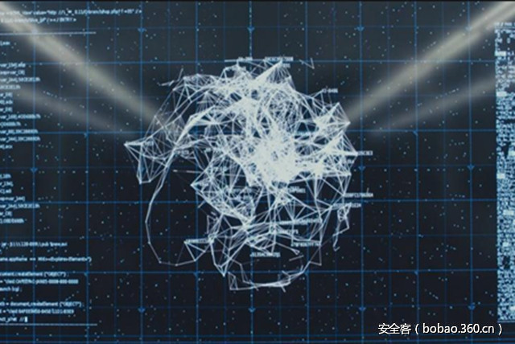

# 【技术分享】沙盒逃逸技术详解（一）

                                阅读量   
                                **156988**
                            
                        |
                        
                                                                                                                                    
                                                                                            

##### 译文声明

本文是翻译文章，文章原作者，文章来源：vmray.com
                                 原文地址：[https://www.vmray.com/blog/sandbox-evasion-techniques-part-1/](https://www.vmray.com/blog/sandbox-evasion-techniques-part-1/)

译文仅供参考，具体内容表达以及含义原文为准

****

翻译：[WisFree](http://bobao.360.cn/member/contribute?uid=2606963099)

预估稿费：170RMB

投稿方式：发送邮件至[linwei#360.cn](mailto:linwei@360.cn)，或登陆[网页版](http://bobao.360.cn/contribute/index)在线投稿

**写在前面的话**

在过去的十多年里，针对恶意软件沙盒逃逸技术的分析已经成为了对抗高级持续性威胁的银弹，虽然这种技术变得越来越热门，但是恶意软件的开发者们似乎也找到了一种基于静态分析的方法（例如加密、混淆处理和反逆向保护等技术）来躲避传统反病毒安全工具的检测。因此，针对恶意软件沙盒逃逸技术的分析与研究已经成为了我们抵御高级持续性威胁的最后一道防线。

该系列文章主要介绍的是目前恶意软件主要使用的沙盒逃逸技术，本系列分上下集，并且会详细分析目前三大类主流的沙盒逃逸技术。

**沙盒技术**

实际上，沙盒就是一种类似影子系统的虚拟系统环境，它比带有宿主的虚拟机有着更深层次的系统内核级技术。它可以接管恶意软件的功能调用接口或函数行为，并且在确认了病毒行为之后实行回滚机制，并让系统保持一种干净的状态。它可以用来对一些来源不可信、具备破坏力或无法判断其真实意图的程序进行分析与测试，而且沙盒中的所有改动不会对主机操作系统造成任何的影响。通常来说，使用这种技术的人一般都是计算机信息安全领域的专业技术人员，尤其是反病毒行业。

沙盒的工作机制其实非常的简单：如何去确定一个文件是否是恶意文件呢？沙盒会在一个受控环境中对文件的行为进行观察，然后根据沙盒对该文件的分析结果来判断其是否具有恶意行为。沙盒允许恶意软件在受控环境中执行它所有的恶意功能，并对恶意行为进行记录，经过一段时间的观察之后分析便会终止，然后沙盒会将分析结果当作这款恶意软件的典型行为模式来扫描和检测这一款恶意软件。由于沙盒不再是根据签名来检测恶意软件了，因此它甚至还可以检测某些有针对性的或此前从未出现过的恶意软件。

很明显，只有当被观察文件在其被分析的过程中真正执行其恶意行为时，基于行为的恶意软件检测技术才会有效果。如果在分析过程中目标没有执行恶意行为，那么沙盒则会认为这个文件是友好的。恶意软件的开发者会不断地寻求更加新颖的方法来隐藏恶意软件的真实行为，并以此来躲避沙盒检测。我们在这里将这些方法分成了以下三大类：

1.沙盒检测：检测沙盒的存在（在检测过程中只显露出友好行为）；

2.利用沙盒漏洞：利用沙盒技术或目标环境中存在的安全缺陷；

3.基于环境感知(Context-Aware)的恶意软件：对时间/事件/环境进行判断，并且在沙盒分析过程中不会暴露恶意行为；

**沙盒检测**

首先，第一种检测沙盒存在的方法就是区分出沙盒环境与真实目标系统之间的细微差别。如果检测到了沙盒，恶意软件的应对方法通常有以下两种：立即终止恶意行为；只显示友好的行为，而不执行恶意操作。我们在此给出了一个例子【[详细内容轻点我](https://www.vmray.com/analyses/663306/report/overview.html)】，这个样本具有以下两种特性：

1.尝试通过检测来判断当前运行环境是否为虚拟机（VM）；

2.检测当前环境是否有沙盒应用正在运行（例如Sandboxie）

我们可以从VMRay威胁识别服务（VTI）提供的详细信息中了解到，VMRay发现目标会尝试进行沙盒检测，并且把这种行为标记成了“高度可疑”。

 

**利用沙盒漏洞**

第二种方法就是利用底层沙盒技术或目标系统环境中的安全缺陷来直接实施攻击。比如说，我们近期发现有很多恶意软件会在内部使用Microsoft COM组件，因为大多数沙盒无法正确分析这种样本。另一种恶意软件会对文件格式和类型进行混淆，并让沙盒无法正常处理这种文件。比如说，攻击者可以让恶意文件的大小超过沙盒所能支持的最大文件长度，此时沙盒将无法分析这类文件。

我们给大家提供了一个例子【[点我获取](http://www.vmray.com/analyses/663310/report/overview.html)】，这个恶意软件会尝试通过非法使用API来躲避沙盒检测，而这种方法可以用来有效地躲避那些基于驱动程序和函数钩子的沙盒分析器。但是VMRay并不会使用钩子函数，因此这款恶意软件躲避沙盒检测的尝试就被检测到并记录下来了：

 

**基于环境感知(Context-Aware)的恶意软件**

恶意软件所使用的第三类方法其实根本都不会去尝试检测或攻击沙盒，它利用的是这种自动化系统天生的固有缺陷。因为大多数安全检测环境和沙盒分析系统在分析某些特殊的恶意软件时并不会花多少时间，因此这种恶意软件只需要延迟恶意Payload的执行时间就能够有效地躲避沙盒检测。除了这种基于时间的触发条件意外，恶意软件还可以使用一些通常不会在沙盒环境中发生的事件，例如系统重启和用户交互等等。需要注意的是，有些恶意软件还会搜索目标设备中的某些特殊工具，例如某个应用程序和本地化设置等等，对这部分内容感兴趣的同学可以参考这篇文章【[传送门](https://www.vmray.com/blog/analyzing-environment-sensitive-malware/)】。

在这个样本的分析结果【[传送门](http://www.vmray.com/analyses/663313/report/overview.html)】中我们可以看到，除了尝试检测虚拟机环境以外，这个恶意软件样本还会通过安装启动脚本和应用程序来实现持久化感染：

 

**总结**

本系列文章共3个部分，在本系列文章的第二部分中，我们会对这三类沙盒逃逸技术一一进行深入地分析和讲解，并且通过对样本进行分析来让大家更加清除地理解当前恶意软件所使用的沙盒逃逸技术。感兴趣的同学请及时关注安全客的最新资讯，敬请期待！

 

**参考资料**

[https://www.vmray.com/analyses/663306/report/overview.html](https://www.vmray.com/analyses/663306/report/overview.html)

[http://www.vmray.com/analyses/663310/report/overview.html](http://www.vmray.com/analyses/663310/report/overview.html)

[http://www.vmray.com/analyses/663313/report/overview.html](http://www.vmray.com/analyses/663313/report/overview.html)

[http://theinvisiblethings.blogspot.de/2006/06/introducing-blue-pill.html](http://theinvisiblethings.blogspot.de/2006/06/introducing-blue-pill.html)

VMWare port: [https://kb.vmware.com/selfservice/microsites/search.do?language=en_US&amp;cmd=displayKC&amp;externalId=1009458](https://kb.vmware.com/selfservice/microsites/search.do?language=en_US&amp;cmd=displayKC&amp;externalId=1009458)

[https://www.blackhat.com/docs/asia-14/materials/Li/Asia-14-Li-Comprehensive-Virtual-Appliance-Detection.pdf](https://www.blackhat.com/docs/asia-14/materials/Li/Asia-14-Li-Comprehensive-Virtual-Appliance-Detection.pdf)

Breaking the Sandbox: [https://www.exploit-db.com/docs/34591.pdf](https://www.exploit-db.com/docs/34591.pdf)

[https://www.brokenbrowser.com/detecting-apps-mimetype-malware/](https://www.brokenbrowser.com/detecting-apps-mimetype-malware/)

[https://www.symantec.com/avcenter/reference/Virtual_Machine_Threats.pdf](https://www.symantec.com/avcenter/reference/Virtual_Machine_Threats.pdf)

[https://www.vmray.com/blog/analyzing-environment-sensitive-malware/](https://www.vmray.com/blog/analyzing-environment-sensitive-malware/)
