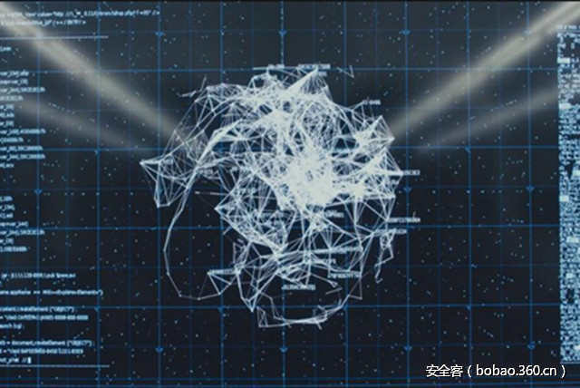

# 【技术分享】沙盒逃逸技术详解（三）

                                阅读量   
                                **106698**
                            
                        |
                        
                                                                                                                                    
                                                                                            

##### 译文声明

本文是翻译文章，文章原作者，文章来源：vmray.com
                                 原文地址：[https://www.vmray.com/blog/sandbox-evasion-techniques-part-3/](https://www.vmray.com/blog/sandbox-evasion-techniques-part-3/)

译文仅供参考，具体内容表达以及含义原文为准

****

翻译：[WisFree](http://bobao.360.cn/member/contribute?uid=2606963099)

稿费：180RMB（不服你也来投稿啊！）

投稿方式：发送邮件至linwei#360.cn，或登陆网页版在线投稿

** **

**写在前面的话**

本文是《沙盒逃逸技术详解》系列文章的第三部分，我们将继续给大家介绍目前恶意软件所使用的沙盒逃逸技术。在我们之前的文章中，我们给大家列出了恶意软件作者所使用的三大类逃逸技术：

1.[沙盒检测](https://www.vmray.com/blog/sandbox-evasion-techniques-part-2/)：检测沙盒的存在（在检测过程中只显露出友好行为）；

2.利用沙盒漏洞：利用沙盒技术或目标环境中存在的安全缺陷；

3.基于环境感知([Context-Aware](https://www.vmray.com/blog/analyzing-environment-sensitive-malware/))的恶意软件：对时间/事件/环境进行判断，并且在沙盒分析过程中不会暴露恶意行为；

在之前的文章中，我们曾说过用沙盒来对恶意软件进行分析已经成为了我们对抗高级持续性威胁的银弹，但是道高一尺魔高一丈，恶意软件开发者也找出了很多种基于静态分析的方法（加密、混淆、反逆向保护）来绕过沙盒工具。但恶意软件分析沙箱所采用的是基于行为模式的检测机制，而这种技术也成为了我们抵御高级持续性威胁的最后一道屏障。

很明显，基于行为模式的恶意软件检测技术只有当恶意软件在其被分析的过程中真正执行了恶意行为的时候才有用，如果恶意软件在分析过程中没有执行恶意操作，沙盒便会认为这个文件是友好的。在本系列的第二部分中，我们深入分析了恶意软件如何直接去判断沙盒环境是否存在。那么在本系列的第三部分中，我们一起来看一看恶意软件如何利用沙盒环境的设计漏洞。

 

**利用沙盒技术的设计缺陷**

如果恶意软件显式地去检测沙盒是否存在的话，那么这种行为在其被分析的过程中会被标记为“可疑行为”。因此，更加复杂和高级的恶意软件则更倾向于利用沙盒技术中的设计缺陷来在不被检测到的情况下执行恶意操作。通过利用这种沙盒漏洞，就算恶意软件在沙盒系统中执行了恶意操作，它们也不用去担心自己会被检测到。接下来，我们给大家介绍一些相关技术。

**1.  使监控器“致盲”**

大多数沙盒使用的是一种“in-guest-monitoring”机制，比如说，它们会向目标或分析环境中注入代码、进程或钩子函数等等。如果这些修改可以被撤销或规避，那么沙盒的监控器将会致盲，换句话来说，此时的分析环境将无法检测或分析这个恶意软件。这种致盲主要可以通过以下几种方式实现：

（1）钩子移除：恶意软件可以通过恢复初始指令或数据来移除函数钩子。

（2）钩子规避：恶意软件可以使用直接系统调用来规避函数钩子，而不再使用应用程序编程接口（API）或调用private函数（无函数钩子）。从下面这个例子中可以看到，我们检测到了恶意软件通过非法使用API来入侵explorer.exe和regedit.exe的行为。虽然我们可以通过对特殊内部功能设置函数钩子来解决这个问题，但是操作系统中有大量这样的内部功能，而且每一种Windows版本中的内部功能函数都有区别。

（3）系统文件替换：钩子通常驻入在系统文件之中，并映射在内存中。有些恶意软件可以重载这些文件，然后加载没有钩子的文件。

（4）内核代码：很多沙盒既无法监控内核代码，也无法监控系统的启动进程。

（5）模糊的文件格式：很多沙盒无法支持所有的文件格式：Powershell、.hta、.dzip等等，这些文件格式可能无法在沙盒环境中正确运行。

（6）很多沙盒无法提供完整的技术支持。比如说，初始感染向量可能会影响沙盒环境，而且带有宏的Word文档也有可能在沙盒环境中运行，宏可以下载并运行用于躲避沙盒检测的payload。

（7）操作系统重启：很多沙盒不支持重启。某些系统会尝试通过注销并重新登录用户来模拟系统重启，但是恶意软件可以检测到这种行为。

**2.使生态系统“致盲”**

通过利用目标分析环境中的设计缺陷，恶意软件还可以通过这种方法来避免在沙盒环境中被分析。比如说，有些沙盒所支持的文件大小有限（例如10MB），而有些沙盒不支持多级压缩文件。

 

**解决方案**

为了确保恶意软件无法通过上述方法避免沙盒检测，一个健壮的沙盒分析环境应该具备以下几个要素：

（1）不能仅仅依靠对目标环境进行修改：

一般来说，沙盒分析所采用的方法都是通过函数钩子（注入在内核模式或内核层驱动程序中用于监控并拦截API调用和其他恶意软件活动）实现的，而钩子的存在就会给恶意软件提供躲过沙盒分析的机会。

（2）使用功能最齐全的系统镜像作为分析环境：

有的沙盒为了方便起见，只会使用一种沙盒环境来进行所有的分析操作。而更好的方法是使用那种企业所采用的标准服务器操作系统以及应用程序配置来作为沙盒分析环境，这样就可以确保那些能够攻击你企业计算机或服务器的恶意软件也同样能够在你的沙盒环境中正常运行。

（3）监控所有与恶意软件相关的活动：

很多沙盒分析器（尤其是那些基于函数钩子实现分析的沙盒）会为了高效率而不会去监控所有的系统活动，但这样便会使漏报率上升。

 

**结束语**

本系列《沙盒逃逸技术详解》的所有内容就告一段落了，感兴趣的同学还可以关注Twitter账号[@vmray](https://twitter.com/vmray)来获取相关的最新资讯。

 

**参考资料**

[http://theinvisiblethings.blogspot.de/2006/06/introducing-blue-pill.html](http://theinvisiblethings.blogspot.de/2006/06/introducing-blue-pill.html)

VMWare port: [https://kb.vmware.com/selfservice/microsites/search.do?language=en_US&amp;cmd=displayKC&amp;externalId=1009458](https://kb.vmware.com/selfservice/microsites/search.do?language=en_US&amp;cmd=displayKC&amp;externalId=1009458)

[https://www.blackhat.com/docs/asia-14/materials/Li/Asia-14-Li-Comprehensive-Virtual-Appliance-Detection.pdf](https://www.blackhat.com/docs/asia-14/materials/Li/Asia-14-Li-Comprehensive-Virtual-Appliance-Detection.pdf)

Breaking the Sandbox: [https://www.exploit-db.com/docs/34591.pdf](https://www.exploit-db.com/docs/34591.pdf)

[https://www.brokenbrowser.com/detecting-apps-mimetype-malware/](https://www.brokenbrowser.com/detecting-apps-mimetype-malware/)

[https://www.symantec.com/avcenter/reference/Virtual_Machine_Threats.pdf](https://www.symantec.com/avcenter/reference/Virtual_Machine_Threats.pdf)

[Analysis report showing      Blinding the Monitor](http://www.vmray.com/analyses/663310/report/overview.html)

[https://blogs.forcepoint.com/security-labs/locky-returned-new-anti-vm-trick](https://blogs.forcepoint.com/security-labs/locky-returned-new-anti-vm-trick)

[https://www.vmray.com/blog/sandbox-evasion-with-com-by-malware-in-the-wild/](https://www.vmray.com/blog/sandbox-evasion-with-com-by-malware-in-the-wild/)

[https://www.vmray.com/blog/analyzing-ruby-malware/](https://www.vmray.com/blog/analyzing-ruby-malware/)

[https://www.vmray.com/blog/malware-uses-java-archive-jar/](https://www.vmray.com/blog/malware-uses-java-archive-jar/)

[https://www.vmray.com/blog/malicious-word-doc-uses-activex-infect/](https://www.vmray.com/blog/malicious-word-doc-uses-activex-infect/)
