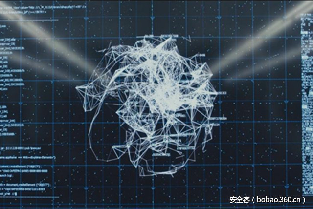

# 【技术分享】沙盒逃逸技术详解（二）

                                阅读量   
                                **101807**
                            
                        |
                        
                                                                                                                                    
                                                                                            

##### 译文声明

本文是翻译文章，文章原作者，文章来源：vmray.com
                                 原文地址：[https://www.vmray.com/blog/sandbox-evasion-techniques-part-2/](https://www.vmray.com/blog/sandbox-evasion-techniques-part-2/)

译文仅供参考，具体内容表达以及含义原文为准

****

翻译：[WisFree](http://bobao.360.cn/member/contribute?uid=2606963099)

稿费：200RMB（不服你也来投稿啊！）

投稿方式：发送邮件至linwei#360.cn，或登陆网页版在线投稿

** **

**温故知新**

在我们的《沙盒逃逸技术详解-第一部分》中，我们给大家简单介绍了目前主要的三种沙盒逃逸技术：

1.沙盒检测：检测沙盒的存在（在检测过程中只显露出友好行为）；

2.利用沙盒漏洞：利用沙盒技术或目标环境中存在的安全缺陷；

3.基于环境感知(Context-Aware)的恶意软件：对时间/事件/环境进行判断，并且在沙盒分析过程中不会暴露恶意行为；

在这一部分中，我们将会着重给大家介绍之前所讲的第一类沙盒逃逸技术：即恶意软件会专门检测沙盒的存在，并向其表现出友好行为。

在第一类沙盒逃逸技术中，恶意软件首先会通过对比沙盒环境与真实目标系统环境之间的细微差别来检测沙盒的存在。如果检测到了沙盒，那么恶意软件通常会有以下两种反应：立即终止恶意行为，或者只显示友好的行为，而不执行恶意操作。

 

**检测沙盒的存在**

目前，我们有很多种方法来识别沙盒是否存在。当检测到沙盒环境之后，恶意软件通常会以不同的方式来应对。其中最简单的应对措施就是立即终止恶意软件的运行，但这样做就会引起系统的注意，因为这并不是一个友好程序应有的举动。另一种方法就是显示一段伪造的错误信息，比如说，恶意软件可以给系统显示出一段伪造的错误信息，例如“系统模块丢失”或者“可执行文件崩溃”等等。更加复杂一点的恶意软件可能会通过执行一些友好的行为来隐藏其真实意图。接下来，让我们来更加深入地了解一下当前流行的恶意软件在沙盒环境中执行时所使用的逃逸技术。

**1.  检测虚拟化／虚拟机管理程序**

这是目前历史最为悠久的一种逃逸技术了，但时至今日，这项技术也将会被逐步淘汰，因为目前很多产品环境（工作站和服务器）都是虚拟化的，而虚拟机（VM）也不仅只有安全研究专家和恶意软件分析人员会使用。

（1）由于早期的虚拟化技术无法提供完整的硬件虚拟化支持（半虚拟化），因此最早的检测方法就是搜索某些特殊的技术组件。比如说：

通过后门来检测流行虚拟机软件中的某些功能组件，例如VMWare或Virtualbox。

检测通用的虚拟机管理组件，其中最有名的是redpill。

但时至今日，这些技术的效率已不复当年。随着硬件虚拟化的支持，虚拟机环境中已经没有多少可见组件了，因为大多数硬件都可以被虚拟化，并通过CPU直接控制。因此，虚拟机管理程序也不必再去虚拟化硬件设备了。

（2）我们目前所使用的另一种方法是检测虚拟机管理程序功能组件的实现，比如说，通过当前进程、文件、驱动程序、注册表键、MAC地址、设备ID、CPU ID或内存中的字符串数据来获取厂商信息。

我们在这里会给大家提供两个例子来演示这种虚拟化检测技术。在第一个例子中我们可以看到，如果恶意软件运行在VirtualPC环境中，那么它便会尝试检测虚拟机组件【[完整报告传送门](http://www.vmray.com/analyses/678148/report/vti_by_score.html)】

还有一种方法就是通过扫描注册表键值来检测虚拟机的存在。在这个例子中，恶意软件会查询注册表键“HKEY_LOCAL_MACHINEHARDWAREDescriptionSystem”的值，并与主流虚拟机（例如VMWare）的注册表键值进行匹配【[完整报告传送门](http://www.vmray.com/analyses/678032/report/overview.html)】：

**2.  检测沙盒组件**

在这种方法中，恶意软件并不会尝试去检测虚拟机管理程序，而是直接检测沙盒本身。这项技术的实现主要分以下两种方式：

（1）利用厂商相关的各种特殊信息

常用的虚拟机产品。比如说，某些特殊文件、进程、驱动程序、文件系统结构、窗口ID、以及用户名等等。

生态系统和处理机制。比如说：再感染完成之后会将分析环境重置，或与沙盒控制器进行通信（额外的监听端口、特殊的网络环境）。

（2）使用特殊的沙盒技术来检测

大多数沙盒会都使用函数钩子，它们会在分析系统中注入或修改恶意软件代码。“钩子”可以捕获进程、驱动器和操作系统三者间的通信数据。因此，我们就可以通过某些特殊指令或指针来检测函数钩子的存在，或者我们也可以通过验证系统完整性来判断当前环境是否为虚拟机（例如验证某些系统相关文件的哈希签名）。

某些沙盒还会使用模拟技术，但是我们可以通过向目标环境提供模糊的CPU指令来进行判断。当调用失败时，恶意软件就知道当前运行环境为模拟环境了。

在下面这个专门检测厂商虚拟机产品的恶意软件样本中，它会搜索“SbieDll.dll”模块，而这个模块是Sandboxie沙盒环境的专有组件：

**3. 检测人造环境**********

沙盒并不是一种具备生产条件的系统环境，而是专门用于对恶意软件进行分析的。因此，他们跟真实的计算机系统是不一样的，但恶意软件能够检测到这两者之间的细微差别。这两者主要的差别有以下几点：

（1）  硬件属性：屏幕分辨率过低，没有USB 3.0驱动、缺少3D显示能力、只有一个CPU、硬盘以及内存容量较小。

（2）  软件属性：非典型的软件栈，例如系统中没有IM和邮件客户端等等。

（3）  系统属性：系统正常运行时间、网络通信数据、或仅安装了默认打印机。

（4）  用户属性：干净的桌面和文件系统、没有cookie、没有最近文档、没有用户文件。

在下面这个分析样例中，恶意软件不仅会检测虚拟机的存在，而且还会检测Wine（一种软件模拟器）。如下图所示，这个恶意软件首先会查询“GET_PROC_ADDRESS”，然后根据查询返回的结果来判断是否检测到了Wine环境：

**4. 基于时间的检测**

由于在监控软件行为的过程中会有一定的延时，因此恶意软件就可以通过这种延时来判断是否存在沙盒。虽然沙盒可以通过伪造时间来避免被检测到，但恶意软件仍然可以通过类似NTP这样的外部时间源来绕过它。

下面就是一个基于时间检测的恶意软件样例，它会尝试通过rdtsc命令来检测时间戳【[完整报告传送门](http://www.vmray.com/analyses/663313/report/overview.html)】：

 

**沙盒如何避免被检测到**

为了防御恶意软件所使用的这些沙盒探测技术，一个健壮的分析环境应该具备以下几个要素：

（1）不能仅靠对目标环境进行修改：

一般来说，沙盒分析最常用的技术就是函数钩子，而钩子的存在对于恶意软件来说就像是沙盒的标志一样，它是非常好检测到的，而且我们几乎不可能完全隐藏函数钩子。

（2）要么完美地实现全系统虚拟化，要么就不要模拟任何系统组件：

从理论上来说，一个完美实现了模拟化的环境是很难被检测到的，但这样的环境是很难实现的。就像所有的软件都存在漏洞一样，任何的模拟环境都会存在缺陷。

（3）使用“真实”的目标分析环境：

如果沙盒分析器可以运行一个实际产品节点的镜像，那么被沙盒检测到的可能性就会大大降低。正如我们之前所说的，如果能够与随机化技术相结合的话，恶意软件就很难去判断当前环境是否为“伪造”的了。

 

**总结**

本文是《沙盒逃逸技术详解》的第二部分，我们给大家介绍了之前所讲的第一类沙盒逃逸技术，那么在本系列的第三部分中，我们将会给大家介绍沙盒技术中的漏洞及利用方法。感兴趣的同学请及时关注安全客的最新资讯，敬请期待！

 

**参考资料**

[http://theinvisiblethings.blogspot.de/2006/06/introducing-blue-pill.html](http://theinvisiblethings.blogspot.de/2006/06/introducing-blue-pill.html)

VMWare port: [https://kb.vmware.com/selfservice/microsites/search.do?language=en_US&amp;cmd=displayKC&amp;externalId=1009458](https://kb.vmware.com/selfservice/microsites/search.do?language=en_US&amp;cmd=displayKC&amp;externalId=1009458)

[https://www.blackhat.com/docs/asia-14/materials/Li/Asia-14-Li-Comprehensive-Virtual-Appliance-Detection.pdf](https://www.blackhat.com/docs/asia-14/materials/Li/Asia-14-Li-Comprehensive-Virtual-Appliance-Detection.pdf)

Breaking the Sandbox: [https://www.exploit-db.com/docs/34591.pdf](https://www.exploit-db.com/docs/34591.pdf)

[https://www.brokenbrowser.com/detecting-apps-mimetype-malware/](https://www.brokenbrowser.com/detecting-apps-mimetype-malware/)

[https://www.symantec.com/avcenter/reference/Virtual_Machine_Threats.pdf](https://www.symantec.com/avcenter/reference/Virtual_Machine_Threats.pdf)

Analysis report showing VirtualPC detection

Analysis report showing malware detecting VMs via registry

Analysis report showing detection of sandbox      artifacts

Analysis report showing timing-based detection

Wine software emulator

https://blogs.forcepoint.com/security-labs/locky-returned-new-anti-vm-trick
