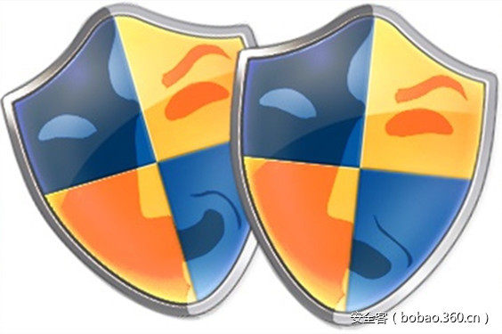

# 【技术分享】看我如何利用sdclt.exe实现无文件绕过UAC


                                阅读量   
                                **118932**
                            
                        |
                        
                                                            评论
                                <b>
                                    <a target="_blank">1</a>
                                </b>
                                                                                                                                    
                                                                                            


##### 译文声明

本文是翻译文章，文章原作者，文章来源：enigma0x3.net
                                <br>原文地址：[https://enigma0x3.net/2017/03/17/fileless-uac-bypass-using-sdclt-exe/](https://enigma0x3.net/2017/03/17/fileless-uac-bypass-using-sdclt-exe/)

译文仅供参考，具体内容表达以及含义原文为准

****

[](./img/85772/t01da1f5cc1911b3d4b.jpg)

翻译：[myswsun](http://bobao.360.cn/member/contribute?uid=2775084127)

稿费：100RMB

投稿方式：发送邮件至linwei#360.cn，或登陆网页版在线投稿

**<br>**

**0x00 前言**

最近，我发布了一篇文章“[使用sdclt.exe绕过UAC](https://enigma0x3.net/2017/03/14/bypassing-uac-using-app-paths/)”。你可能记得APP Path需要一个文件才能有效。因为sdclt.exe在那里，我将发布另一种绕过的方法，是无文件的。在我[上一篇文章](https://enigma0x3.net/2017/03/14/bypassing-uac-using-app-paths/)中我提过它，但是[Vault7 泄漏](https://wikileaks.org/ciav7p1/cms/page_3375231.html)确认了绕过UAC在操作上是有趣的，在转储中详细记录了几种UAC绕过的方法。目前为止公布的绕过方法中，尤其突出的是[@hfiref0x](https://twitter.com/hfiref0x)的[UACME项目](https://github.com/hfiref0x/UACME)，该项目是对公开的技术的集合。

在更新版本的Windows中，显示了微软[很重视绕过UAC](http://www.winhelponline.com/blog/microsoft-fixes-eventvwr-exe-uac-bypass-exploit-windows-10-creators-update/)。这刺激了我花更多的时间在UAC上，且尝试不同的方法。

<br>

**0x01 分析**

正如一些你知道的，有一些微软签名的二进制文件由于他们的清单文件会自动提权。你能在[这里](https://technet.microsoft.com/en-us/magazine/2009.07.uac.aspx)阅读到这些二进制和他们的清单文件。通过SysInternals的工具[sigcheck](https://technet.microsoft.com/en-us/sysinternals/bb897441.aspx)能搜索更多有这种特征的二进制文件，我发现了sdclt.exe，并验证了它会由于它的清单文件自动提权：

[](https://p2.ssl.qhimg.com/t013a3f0ec2bf205c83.png)

注意：这只能在Windows10上起作用。这个Windows 7上的sdclt.exe的清单文件中requestedExecutionLevel为AsInvoker，以防止从中级特权启动时的自动提权。

正如我[上文](https://enigma0x3.net/2017/03/14/bypassing-uac-using-app-paths/)中提到的，用于调查Windows上的加载常见的技术是使用[Sysinternals Process Monitor](https://live.sysinternals.com/)来分析一个进程执行时的行为。我经常对与我调查的进程做一些二进制分析以便找到其他的机会。

当分析自动提权的二进制时，首先该做的是寻找潜在的命令行参数。我是用IDA做这个，但是你能使用你喜欢的工具。当分析sdclt.exe时，由于一些有趣的关键字我注意到一些参数：

[](https://p2.ssl.qhimg.com/t01964307d9ba43e6a3.png)

这些是有趣的，因为sdclt.exe在它的清单文件中被设置为自动提权。在IDA中查看sdclt.exe，它校验参数是否为“/kickoffelev”。如果是，设置sdclt.exe的全路径，添加“/KickOffJob”作为一个参数，然后调用SxShellExcuteWithElevate。

[](https://p5.ssl.qhimg.com/t0125a02bb73b8545c0.png)

SxShellExecuteWithElevate使用Runas [verb](https://msdn.microsoft.com/en-us/library/windows/desktop/cc144175(v=vs.85).aspx)启动%systemroot%system32sdclt.exe /kickoffjob。当你右键一个二进制文件时，就是执行RunAsAdministrator选项。

[](https://p4.ssl.qhimg.com/t0138718310d3ab127c.png)

下一步是运行sdclt.exe /Kickoffelev，并用procmon监控。在得到输出后，我们看到HKEY_CURRENT_USER中受信的“shell&lt;verb&gt;command”注册表搜索路径。

[](https://p3.ssl.qhimg.com/t01af40d92608abe51c.png)

下一步是添加这些键，并根据我们的二进制和参数执行。不幸的是，在添加这些键后什么也不执行，并启动了sdclt.exe /kickoffelev。回到procmon中，我们的键是需要的，但是sdclt.exe能在另一个command键中找到：IsolatedCommand。

[](https://p2.ssl.qhimg.com/t0178f7617f6d1aebab.png)

然后我们能在IsolatedCommand键中以一个字符串（REG_SZ）添加我们的payload和参数：

[](https://p4.ssl.qhimg.com/t01af495b466f772353.png)

这是和eventvwr.exe绕过方法中相同的bug。你能在这阅读eventvwr.exe绕过和使用的键。注意，取代shellopencommand，我们现在看到了shellrunascommand。这是因为使用RunAs调用SxShellExecuteWithElevate时sdclt.exe会被再次调用。

在添加我们的payload作为IsolatedCommand的值后，运行sdclt.exe /KickOffElev将在高特权级执行我们的payload（及任何参数）：

[](https://p3.ssl.qhimg.com/t0170fe64c6a6f230e0.png)

为了描述这个技术，你能在这里找到一个脚本：[https://github.com/enigma0x3/Misc-PowerShell-Stuff/blob/master/Invoke-SDCLTBypass.ps1](https://github.com/enigma0x3/Misc-PowerShell-Stuff/blob/master/Invoke-SDCLTBypass.ps1)

这个脚本包含你的payload和任何参数的一个全路径。“C:WindowsSystem32cmd.exe /c notepad.exe”是一种好的验证方式。它将自动添加键，启动sdclt.exe /kickoffelev，并清理。

这个特别的技术能通过设置UAC等级为总是通知或者将当前用户移出本地管理员组来补救或修复。而且，如果你想监控这个行为，你能利用特征寻找和注册表操作告警：

```
HKCU:SoftwareClassesexefileshellrunascommandisolatedCommand
```


