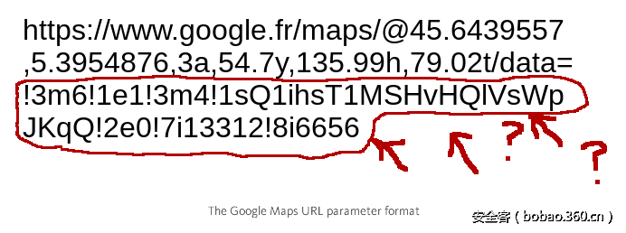

# 【技术分享】看我如何挖到GoogleMaps XSS漏洞并获得5000刀赏金

                                阅读量   
                                **123719**
                            
                        |
                        
                                                                                                                                    
                                                                                            

##### 译文声明

本文是翻译文章，文章原作者，文章来源：medium.com/@marin_m
                                 原文地址：[https://medium.com/@marin_m/how-i-found-a-5-000-google-maps-xss-by-fiddling-with-protobuf-963ee0d9caff](https://medium.com/@marin_m/how-i-found-a-5-000-google-maps-xss-by-fiddling-with-protobuf-963ee0d9caff)

译文仅供参考，具体内容表达以及含义原文为准

****

翻译：[testvul_001](http://bobao.360.cn/member/contribute?uid=780092473)

预估稿费：200RMB

投稿方式：发送邮件至[linwei#360.cn](mailto:linwei@360.cn)，或登陆[网页版](http://bobao.360.cn/contribute/index)在线投稿

**前言**

几个月前，我使用Google地图，或者Google街景时，发现地址栏和以前有些不同了。从2014年的某个时间起，URL地址里的参数不再是普通的查询字符串了，相反，它变成了用感叹号分隔的奇怪的字母数字组合。

同时我查看了浏览器的WEB控制台，发现不仅发往AJAX API的请求被加密了，服务器的响应二进制数据也被一种新颖的方式签名了（除了一些图片）。除了这么多的谜题，还有什么更能激发我的激情呢？Nothing!

 

**揭开谜底**

谷歌地图有一大块约3.2 MB的压缩JavaScript脚本。谷歌地球很重 - 以前的谷歌地图是一个笨拙的平面地图，现在的谷歌地图有一个地球模式。它使用WebGL生成3D图形，具有大量的组成部件，请求和显示缓存，以及JavaScript实现的调度和规划模块这些类似东西。

面对这么大的代码量，你需要做一些组织工作。幸运的是近几年几乎所有的主流浏览器都加上了自己的调试器。你可以在任何时候添加断点，甚至在发送一个Ajax请求或者触发DOM事件时。基本上逆向工程有静态和动态两种方式，我一般一喜欢静态分析，极端的情况下会使用动态分析。

谷歌使用了8个javascript文件，这些文件只有在分隔不同的模块时才使用换行符。Javascript模块会会在URL中以两三个字符的形式引用。这些文件使用Closure Compiler压缩，谷歌的压缩器将会使用内联函数，将你的函数声明放到条件表达式中，使用简单的逗号分隔甚至更多的魔术方法来增加阅读难度。回到代码可读性很差的WEB控制台，或者使用另外一个简单工具（在[http://jsbeautifier.org/](http://jsbeautifier.org/) ）。

查看这种类型的代码可能会吓到一些人，但是这个其实也不是特别难。就像读汇编代码一样，只要直接找到有用的点就行了。通过字符串或者常量搜索，从一个相关函数跳到另一个，在一个txt文件里记下有用信息，再加上对函数功能的猜测就可以了。

例如，下面我们搜索一个感叹号，好了。。。

通过观察，我们发现URL的参数由一些重复的片段组成：

1、	感叹号：分隔符

2、	数字：在键值对中看起来像是整数KEY。

3、	单个字母：这个字母决定了后面跟随什么类型，“s”表示字符串，“I”表示整数

4、	数字、字母或字符串：键值对中的值。

这是一个新颖的序列化方式吗？事实上，我思考了一下，这个并不新奇，它就是protobuf而已。

Protobuf是一个在谷歌产品中广泛使用的格式（用于存储，通讯等）。它的第一版开发于2001年，第二版为了取代XML发布于2008年，2016年的第三版做了一些改进。目前它在谷歌的前端产品中用的越来越多，甚至在Android相关的产品中也到处是它的身影。

Protobuf使用二进制形式传输数据。当你要创建一个使用Protobuf的项目时，首先要定义一个键值对组结构（.proto格式类似C语言），每一个键值对数据域都包含类型，名称及数字。当把这些键值对数据域组合到一起并命名后就称为message。键值对数据域也可以是message的形式（称为嵌套message），还有其他的一些格式暂时就不细说了。

现在将.proto格式编译成代码，任何语言都可以对你定义的message进行读写操作。

接下来程序会将Protobuf域数据转换成它自己的格式（通过调用之前的代码），当这些都完成后即会调用库函数将数据序列化成二进制格式。

结果会被这么编码：protobuf编码其实类似tlv（tag length value）编码，其内部就是（tag, length, value)的组合，其中tag由(field_number&lt;&lt;3)|wire_type计算得出，field_number由我们在proto文件中定义，wire_type由protobuf根据proto中定义的字段类型决定，length长度采用一种叫做Varint 的数字表示方法，它是一种紧凑的表示数字的方法，用一个或多个字节来表示一个数字，值越小的数字使用越少的字节数，具体细节可以谷歌Varint。

那么URL中的参数是同样的东西吗？只是换成了text编码？

结果表明二进制格式中只有5中数据类型（o:可变长度的整型，1：固定64bit，2：字符串、字节或者message，5：固定的32bit，3和4:一些过时的方式来定义message，多到你完全不想了解），谷歌地图的URL中一共有18中不同的字符来代表类型。

以上是一些你在定义.proto数据时会用到的数字类型，但是究竟哪一个对应哪一个？我们需要重新解析谷歌地图URL里的数据域为可读的.proto格式定义，所以我们需要编辑和回复message并发现可能存在的隐藏数据域。

我们要这么做吗？不，考虑一下吧，定义Protobuf message和数据域的函数散落在多个javascript脚本文件里的多个地方，要从一堆正则表达式里分析出它们实在是太难了，所以我们要偷个懒。

使用动态调试的方法怎么样？使用自动化的调试器定位出序列化“！”分隔的数据的函数，获得结构化的信息。就像和人类交谈一样和代码沟通。

** **

**第一个魔法脚本**

Chrome有一个debugger API能够进一步加强调试器（通过websocket和API通信）。火狐、Safari、Edge也有这个功能，但是没有Chrome的好，所以我们就用Chrome了。

第一步是使用“–remote-debugging-port=&lt;port number&gt;”标签启动你的Chrome。连接到HTTP服务器的指定端口后，就可以通过“/json”请求获得连接到每个调试器API的活动标签和Websockt URL地址。最后我们就可以通过在socket里使用jSON request/response/event交换信息了。每个请求都有一个固定的ID和相应的应答或者错误；事件可以通过指定的请求触发。

首先我们通过调用“Runtime.enable”来捕获“Runtime.executionContextCreated”事件，当一个页面的javascript脚本上下文创建时就会触发。然后，调用“Debugger.enable”, 使 “Debugger.scriptParsed”生效，这样当脚本被加载时我们就可以查看有兴趣的方法并设置断点。调用“Network.enable”，这样每当有新的HTTP请求出现时我们就会接收到通知，以便我们发现含有“！”的数据（通过在javascript层拦截编码过得数据可以方便的把.Proto定义和HTTP请求地址联系到一起）。最后调用“Page.navigate”，告诉浏览器我们要使用谷歌地图。

当一个新脚本出现时，“Debugger.scriptParsed”事件被触发，我们调用“Debugger.scriptParsed”和“Debugger.getScriptSource”，这样我们就可以通过正在表达和字符串签名发现相关的函数。然后我们调用“Debugger.setBreakpoint”来设置断点，指定脚本ID,行和列。

下面是我们希望断下的函数:

它接受两个参数：b参数是一个定义了Protobuf消息的javascript对象，a参数是定义了消息数据的简单对象。函数将会使用这个结构序列化数据，最后返回C（包含“！”的数据）。

“Fqa”函数计算输出数组的大小（4*数据项的个数，每个数据项由分隔符、数据项ID、字符类型、数据项数据等4个字符串组成），“Gqa”将数据写入数组，String.prototype.join将数组转换成字符串。

然后我们获得“b”并把它转换成可读的，记下“c”以留后用。我们在最后一行下一个断点，看看发出了什么请求。下面是调试器中的看到的参数数据：

通过一些推理，我们可以总结下“b”的数据结构了：

尽管我已经向你展示了一个可读的版本，但是大部分的对象属性仍然是压缩过的，所以我们需要使用正则表达式去发现每一个属性对应的具体信息。

我们已经明白了这些数据的含义，下一步是还原出正在的.proto文件。第一种方法是直接从调试器中获取变量和对象属性，但是这种方法实在是太慢了；第二种方法是尝试将数据转换成JSON格式，但是嵌套消息会导致循环应用，所以这种方法也不可行；正确的第三种方法是通过注入javascript脚本获取字符串信息（使用控制台的API）。

Javascript可以通过“Debugger.evaluateOnCallFrame”本地调用，“Runtime.evaluate”全局调用。“Runtime.evaluate”事件会通知我们控制台信息，为了更好地使用“Network.requestWillBeSent”抓取网络请求，我们需要注入一些代码hook history.replaceState() API方法，这样当主页跳转到含有“！”参数的URL时我们就能第一时间知道了。

在和谷歌地图做一些交互以收集数据后，现在我们拥有了需要的三种元素：重新构造的.proto结构，一些含有序列化数据的URL例子。

** **

**第二个漂亮的程序**

Protobuf消息使用树形结构表达，所以想要在命令行里手工处理比较困难。当推断出Protobuf的数据项时，我们发现它们没有名字，这时可以通过一两个字母来命名它们（最好知道它们是干什么的再命名，这样我们在查看信息时就可以理解的更快）。我们同时需要测试所有的数据，这样我们就能知道它们是干什么的，或者看看谷歌是否引入了一些有趣的安全措施。

我打算使用Python Qt的QTreeWidget来处理消息，每个数据项都会获得一个下一级的QTreeWidgetItem（子部件中QLabel 代表TEXT文本, QSpinBox 代表整数等等）。最终的代码可能会有些纠结，因为我们我要处理重复的字段，数据项被选中的状态，显示request请求等等。但是这毕竟有利于可读性和便于理解。

下面就是程序运行后的样子：

 

**0day漏洞**

获取谷歌地图一块场景的请求大概有730个数据项，125个消息([https://www.google.com/maps/vt](https://www.google.com/maps/vt) )。从安全角度看，这是很令人高兴地，这意味着大量的攻击界面，大量隐藏的未被其他人测试的点。

我持续做了一些手工测试，但是没有发现异常，所以我把重要的请求做了分类。

首先是地图上的坐标，有很多方式可以描述他们（通常是十进制WGS84，或者其他更大更精确的坐标单元，这对于卫星视图很有用）。如果你需要一个精确地地图，同样有其他方法来定义一个视图。这里基本上有你希望绘制地图的所有方式，有各种各样的地图图层、选项，可以在地图上显示标签，标记位置，绘制从一个方向到另一个的行程，涵盖所有服务器端有的地图绘制功能。

但更重要的是，它不仅提供bitmap。它也提供矢量图；Android应用程序已经使用矢量多年了，web请求最近也有部分在使用。有多种格式的矢量，所有这些都是专有的。

Bitmap是常规的二进制格式（DRAT），使用二进制格式可以方便的存储地图提供的数据，及决定什么时候地点出现，改变，消失的版本信息。数据是由一个简单的RC4 key混淆的（这个key由坐标信息，一个固定的key和ZLIB组成）。

已经集成到WEB应用中的矢量图方式只使用了二进制的Protobuf—再强调一遍，这是web应用中的PROTOBUF的第二种形式。这里更有效率的简单XOR方法取代了RC4，二进制数据通过我们之前提到的AJAX传输（封装在较小的“长度-值”容器里）,这些数据和老的方式含义一致。

你可以使用十几个版本格式里的任意一个，但是这里面有一个版本特别的有趣。它的response 头里含有“Content-Type: text/html” 头部，尽管它是二进制的数据。它是基于Protobuf的格式，它也有其他格式的头部，所以它也是通过RC4+ZLIB处理的。它有很多有趣的安全选项，一个是可以关闭加密选项，一个是处理压缩的。所以你将获得原始的地图信息，包括代表地址和标记原始的字符串，这些将以text/html的形式发送给你的浏览器。

这是一个向谷歌地图里插入任意字符串的好方法！通过编辑其他请求的数据域将允许你设置标记。

一旦你尝试启用我们发现的未在文档里说明的格式，javascript脚本就会弹框了！

为了绕过chrome的XSS防护机制（或者火狐中的NOSCRIPT插件），我们需要找到一种编码方式。“！”分隔的数据的解码程序接受两种数据格式对应的字符串（即使它原来是Protobuf格式的一种）。“s”类型可以将字符串原始数据编码为输出字符串的一部分（只有！和*被转义为“*21”和“*2A”）。“z”类型可以讲字符串做base64编码（非padding）。这意味着什么?XSS防御即将被绕过了！

你可以进一步的混淆数据，但是服务器仍可以讲“！”分隔的数据转换成原始的二进制PROTOBUF，并且大部分的类型没有做安全检查。同时字符串和消息拥有相同的二进制的五种数据格式，所以我们可以将嵌套消息转换成二进制，并且当成字符串传递。

现在我们可以拥有了www.google.com（maps.google.com已被放弃）域名下任意浏览器可执行的XSS 攻击代码。

进一步研究发现任何人都可以给谷歌地图提交新的地方信息，这些地方或多或少都会在地图上出现（已验证）。那么是否已经有人提交过&lt;script&gt;alert(1)&lt;/script&gt;到谷歌地图上了呢？是的，一些中国人和印度人做过，他们甚至提供了自己的头像！

 

**厂商回应**

谷歌的漏洞奖励计划按照www.google.com域下的XSS漏洞标准给我提供了5000$的奖金。

Day 0 — 提交报告 

Day 0.54 — 报告被接受，进入流程

Day 0.64 — 漏洞被确认

Day 1 (or so) — 漏洞修复

Day 1.84 —

 

**总结**

我发现很多的Android项目都在使用Protobuf ，但是可用于解析Protobuf 的工具却很少。所以我做了一些收集和整理工作，更多信息请看[https://github.com/marin-m/pbtk](https://github.com/marin-m/pbtk)  （包括本文中的一些工具）。
