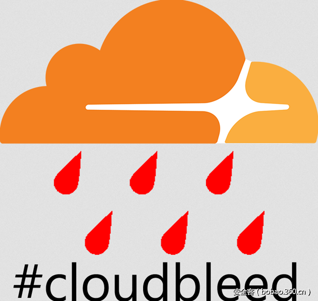

# 【技术分享】菜谈安全：CloudBleed事件感想录

                                阅读量   
                                **98518**
                            
                        |
                        
                                                                                                                                    
                                                                                            

作者：[cyg07@360Gear Team](http://bobao.360.cn/member/contribute?uid=2612165517)

预估稿费：300RMB

投稿方式：发送邮件至[linwei#360.cn](mailto:linwei@360.cn)，或登陆[网页版](http://bobao.360.cn/contribute/index)在线投稿

**前言**

本文的动机主要是近来云的安全事件颇多且值得玩味，笔者尝试从CloudBleed事件和观察到的一个开源软件安全的现象做一些主观上的评论。

如果看官有沟通的想法，很乐意收到您的邮件（caiyuguang[at]360.cn）。Have fun!

 

**CloudBleed**

Robert Lemos在 《Recent Cloud Issues Show Security Can Fail Dramatically》 (参考1) 中对这CloudBleed和TicketBleed漏洞作了一个产业上的延伸，探讨包括AmazonS3等这些事件是否会形成黑天鹅事件。诚然，数据集中化以后的云平台其安全三要素（机密性、完整性、可用性）都有可能被秒杀造成大范围敏感信息泄露，频发的事件导致行业信心受挫。

整体CloudBleed事件上可以概括为，Google的Tavis Ormandy给CloudFlare送了一刀，作为回报CloudFlare送了件衣服，中间没有一个媒体正确引用Google提供的Logo。在媒体的作用下，Google得到了捍卫互联网安全的荣誉， CloudFlare在这个事件上不断地被撒盐。

我们换个方向来看这个事件，CloudBleed 事件中CloudFlare的应对有一些值得学习的地方。官方一共写了两篇博文《Incident report on memory leak caused by Cloudflare parser bug》 和《Quantifying the Impact of "Cloudbleed”》 （参考2、3）来进行自我救赎。

在整个事件中官方一直坚持问题的技术完整性披露原则和完整的影响面评估，这样的做法有两点值得学习。

一来官方在表明他们对于问题的全面掌控，包括中间提出了“这个问题影响的地方是一个被隔离堆区域，没有影响到SSL Private Key”等明确观点让其它潜在的对手或者安全业没留下多少后话的余地。二来官方不遗余力的评估受影响范围，做技术层面的最大化弥补，包括主动沟通搜索厂家清理缓存，评估利用手段、可技术衡量的受影响范围等。

那么问题来了，

1.	出现这样问题造成的看不到的损失是谁来承担？如何评估传统背锅或商务PR解决方式的成本，还是真实解决问题的成本高？

2.	假如我们是CloudFlare？

这里笔者回答不清楚这两个问题，只是它让笔者想起了360 CSO谭晓生和前领导刘小雄多次在内部安全会议中提到4个假设的问答之一，　假如你已经被攻击了你如何在速度和程度方面消除被攻击后造成的的影响。

 

**被遗忘的开源软件上下游**

CloudFlare的评估是否完全可信不得而知，至少报告的完整性试图让人信服，但是如果连官方评估都不一定可靠，那会是什么原因造成的。 

目前数据中心高度依赖Linux、OpenSSL、QEMU、Xen等自由开源软件作为基础系统/软件构架，从14年起，特别在HeartBleed、Venom事件后它们的安全也备受关注。过去一年团队在开源安全方面作了部分投入，在挖掘开源方面挖掘了100+个CVE，其中有个人觉得挖掘难度很高的OpenSSL漏洞，还有被李同学玩坏的QEMU，在漏洞挖掘的过程中笔者看到了些值得关注的现象。

CVE-2017-2615是李强同学发现的一个QEMU的Cirrus CLGD 54xx VGA存在越界访问漏洞，可导致执行任意代码。这个漏洞第一次报告给QEMU安全团队的时间是去年的2016年的7月1日，很长一段时间没有得到理会，直到农历年前李强同学自己动手提交Patch后官方才做了处理。通过这个漏洞的处理流程我们看到了一个有意思的现象，所有的上下游都脱节了，他们并不是一个具有信任链的关系，从QA/漏洞挖掘人员，QEMU的安全人员和Maintainer，再到最下游的公有云厂家，具体如下：

**1.	漏洞前期**，CVE-2017-2615在漏洞挖掘者看来只是一个不常用的设备模拟模块不会有多少影响力，最上游的Maintainer和安全员坚称这个是一个已经快被放弃的模块，不过幸运的是基于漏洞的危害性还是被评定为重要漏洞；

**2.	漏洞发布**，时间是2月1日，国内还在过春节。漏洞在OSS 发布了，但是没有太多的关注；

**3.	2月6日**，鉴于这个漏洞的重要性我们开始对360内部和国内部分公有云虚拟机虚拟设备使用的排查确定这个漏洞真实影响到了工业环境，我们一方面选择和上游需要Redhat方面发布RHSA进行漏洞修复，另一方面我们在OSS邮件列表上追加了该漏洞的严重性；

**4.	2月23日**，Redhat针对CVE-2017-2615发布了RHSA（参考7），同时该补丁也修复了另一个从16年就坚称能信息泄露的漏洞CVE-2016-2857(参考5)；

**5.	最后，很欣喜地是我们看到了国内某公有云进行了漏洞修复；**

在CVE-2017-2615的处理流程中，我们看到的是每个环节都没有达到想象中的完全控制，上游不会强制控制下游，下游不一定会跟随上游，漏洞挖掘者一心在挖洞。除了OldSch00l 会试图了解和坚持解决这条链路的覆盖度，也许这里需要的是大家都不想提及的漏洞炒作者（笔者亦是），只有这些人费尽心机最大化利用漏洞[这里我们不扯地下和老大哥]。

上下游的脱节是一个很真实的情况，甲方通常看到的是自己的运维和业务开发，而包括漏洞评估、漏洞修复、发行版打包等来自上游的风险通常是被忽略的，开源社区、上游厂商到甲方的生产环境的链条如何打通是一个重要问题。

另一个段子发生在OpenSSL身上，如果官方信任我们团队的成员并参照漏洞发布流程让石磊同学参与到Patch Review工作流中的话，一个low级别的CVE-2016-6307就不会修复成一个critical的CVE-2016-6309（参考8）。

总之，这个章节里我想说的是这个行业的上下游信任链和合作是很低的，包括我们对于开源社区的回报。去年 连一汉 同学给NTP项目组报告漏洞的时候，作为互联网时间之父的Harlan Stenn表达了很多的无奈，一方面是他自己需要花费超过50%的时间来修复安全bug，另一方面项目资金陷入窘迫的境地，核心的NTP服务器迁个机房都是问题。

NTP捐助链接 [http://nwtime.org/donate/](http://nwtime.org/donate/)   

 

**小结**

最后，笔者尝试分享个人在安全从业中的一些观点。

1.	数据集中化的公有云在技术细节方面普遍超过安全从业个人、团队的理解和控制极限，它的安全是被假设出来，会有些意外的；

2.	企业里看不见的安全点基本都是在被一刀切以后才有感觉，那一刀是被用来立名，紧跟的都是来撒盐的；

3.	行业之间、上下游之间的信任感觉普遍缺失，重要信息同步不连续；

谢谢各位看官还能看到这里，希望回头还能够继续和大家分享！ 

 

**感谢**

非常感谢谭晓生（参考9）、DQ430、Rayh4c、xZl、ShawnC的指点！

 

**参考**

1.[http://www.eweek.com/cloud/recent-cloud-issues-show-security-can-fail-dramatically.html](http://www.eweek.com/cloud/recent-cloud-issues-show-security-can-fail-dramatically.html)        

2.	[https://blog.cloudflare.com/incident-report-on-memory-leak-caused-by-cloudflare-parser-bug/](https://blog.cloudflare.com/incident-report-on-memory-leak-caused-by-cloudflare-parser-bug/)   

3.	[https://blog.cloudflare.com/quantifying-the-impact-of-cloudbleed/](https://blog.cloudflare.com/quantifying-the-impact-of-cloudbleed/)   

4.	[http://safe.it168.com/a2013/0923/1537/000001537187.shtml](http://safe.it168.com/a2013/0923/1537/000001537187.shtml)  　

5.	[http://blogs.360.cn/blog/cve-2016-2857an-information-disclosure-vulnerability-in-qemu/](http://blogs.360.cn/blog/cve-2016-2857an-information-disclosure-vulnerability-in-qemu/)    

6.	[http://nwtime.org/donate/](http://nwtime.org/donate/)   

7.	[https://access.redhat.com/security/cve/CVE-2017-2615](https://access.redhat.com/security/cve/CVE-2017-2615)   

8.	[https://www.openssl.org/news/secadv/20160926.txt](https://www.openssl.org/news/secadv/20160926.txt)   

9.	谭晓生，奇虎360 CSO
