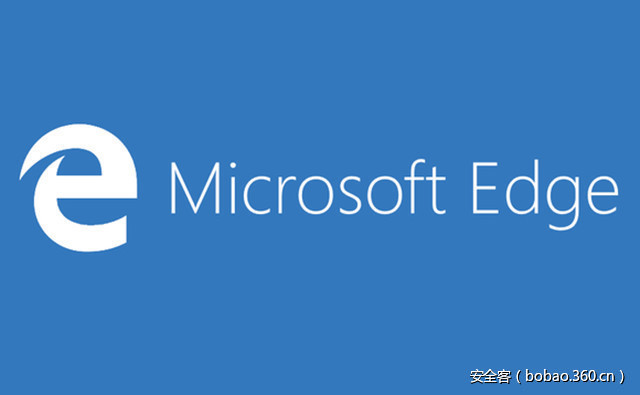

# 【技术分享】通过iframe注入实现referer欺骗


                                阅读量   
                                **325959**
                            
                        |
                        
                                                                                                                                    
                                                                                            


##### 译文声明

本文是翻译文章，文章原作者，文章来源：brokenbrowser.com
                                <br>原文地址：[https://www.brokenbrowser.com/referer-spoofing-patch-bypass/](https://www.brokenbrowser.com/referer-spoofing-patch-bypass/)

译文仅供参考，具体内容表达以及含义原文为准

**[](./img/85795/t015aaca4961f8e62b4.jpg)**

****

翻译：[scriptkid](http://bobao.360.cn/member/contribute?uid=2529059652)

稿费：100RMB

投稿方式：发送邮件至linwei#360.cn，或登陆网页版在线投稿

**<br>**

**前言**

去年我们提过一种很简单的[在Edge上实现referer欺骗的技术](https://www.brokenbrowser.com/referer-spoofing-defeating-xss-filter/)，该技术允许我们实现referer欺骗甚至是绕过XSS过滤。今天我发现该问题被修复了，因此我决定在补丁上进行尝试寻找问题。老实说，我觉得这只是一种攻击的变种而不是一种绕过。从实践来看，该技术绕过了补丁再次攻击成功，但是从技术角度来看，新方法略有不同。无论如何，让我们一起来探究一下。

<br>

**漏洞修复前的PoC**

在之前的文章中我们提到，我们可以通过简单的打开新的带着期望referer的窗口然后在跳转到目标来实现referer欺骗。两行代码抵过上千文字，看下面的poc代码，whatismyreferer.com会将paypal.com作为referer，而事实上referer应该是执行location.href的页面。

```
win = window.open("https://www.paypal.com");
win.location.href = "https://www.whatismyreferer.com";
```

这就足以在Edge实现referer欺骗了，不过这个问题现在已经被修复了。然而，我想出了一个简单的变种，没有debug和分析，仅仅是一个大胆的尝试。我尝试了许多方法来改变最终的URL(用location.replace,meta refresh,window.open等来替代location.href)以测试Edge是否可以被再次欺骗，遗憾的是所有的尝试都失败了。但是，如果URL被iframe从内部更改了会发生什么？referer值会是top还是iframe的URL？

<br>

**玩转referer**

在回答前面的问题前，请记住，通常情况下referer始终应该是设置URL的referer。假设我们的fackbook.com带有一个指向evil.com的iframe，如果iframe改变top URL为paypal.com，paypal收到的referer应该是evil而不是facebook。

[](https://p2.ssl.qhimg.com/t01def14d8a9c591690.png)

上图展示的是Edge上期望的(正确的)行为。然而，如果我们使用location.href来设置定向链接而不是使用常规链接，Edge就犯傻了，这时它会使用top的地址来作为referer。

[](https://p1.ssl.qhimg.com/t0189668705e908e7db.png)

下面是一个简单的测试页面，用以展示用常规链接和location.href改变top URL之间的区别。它们都会跳转到whereismyreferer.com，但正如你将看到的，常规链接行为是正确的，而top.location.href行为不正确。[**[展示漏洞的页面]******](https://www.cracking.com.ar/demos/referer/02/top-page.html)

但是我们如何利用该漏洞呢？很明显facebook上不可能加载evil.com，对吗？然而facebook、yahoo等几乎所有大网站都会加载带有广告的iframe。这些广告则有能力在这些大网站上加载任意页面。当然，这些广告也完全可以用top.location.href来绕过XSS过滤。

就我自己而言，我讨厌理论上的漏洞，因为它们不能让我感到满足。因此，我们的目标是加载一个网站(我们想要欺骗的referer)，注入iframe到其中，然后从注入的iframe中通过top.location.href跳转到目标网站。简单点说就是，我们要让whatismyreferer.com(目标)相信用户是从paypal.com(欺骗的referer)跳转过来的，我们要怎样做到呢？

<br>

**注入iframe**

1、打开一个新窗口重定向到paypal。

2、在跳转前注入一个iframe。

3、一旦重定向，iframe内部实现top.location定向到whatismyreferer.com。

这个iframe注入以前在IE上htmlFile/UXSS文章中提到过，我们在这里快速回顾下。当我们打开一个新的窗口时(1)我们可以注入任意我们想要的内容，因为我们还在当前域。这是我们注入iframe(2)的最佳时机。然后一旦重定向发生，Edge将尽力从页面删除所有内容(包括我们的iframe)并渲染paypal。不过，我们将通过简单的来阻断线程。

如何阻断线程？在这种特殊情况下，我们将使用和这里相同的技术，只是一个丑陋的可见粗体警报。当然我们有许多方式来阻断线程并且不弹出警报，不过我们不会在这里提供。接着让我们来创建POC吧！

```
// Open a new window with a server redirect to paypal
var win = window.open("redir.php?URL=https://www.paypal.com");
 
// Create an iframe immediately, before it redirects
var ifr = win.document.createElement("iframe");
win.document.appendChild(ifr);
 
// Make sure the iframe has access to its top (otherwise it will lose it)
win[0].opener = win;
 
// Block the iframe and once the redirect happens, move to the victim website.
win[0].setTimeout("('Close me once the site starts loading behind');" +
                   "opener.location='https://www.whatismyreferer.com'");
```

[](https://p0.ssl.qhimg.com/t01ff108659ea12b200.png)

[**Edge上的POC******](https://www.cracking.com.ar/demos/referer/02/)
