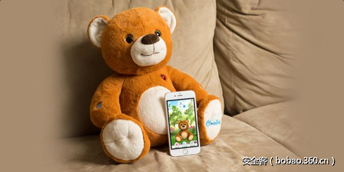

# 【技术分享】通过web蓝牙黑掉独角兽玩具

                                阅读量   
                                **122442**
                            
                        |
                        
                                                                                                                                    
                                                                                            

##### 译文声明

本文是翻译文章，文章原作者，文章来源：contextis.com
                                 原文地址：[https://www.contextis.com/resources/blog/hacking-unicorns-web-bluetooth/](https://www.contextis.com/resources/blog/hacking-unicorns-web-bluetooth/)

译文仅供参考，具体内容表达以及含义原文为准

****

翻译：[WisFree](http://bobao.360.cn/member/contribute?uid=2606963099)

预估稿费：200RMB

投稿方式：发送邮件至[linwei#360.cn](mailto:linwei@360.cn)，或登陆[网页版](http://bobao.360.cn/contribute/index)在线投稿

**前言**

在过去的几个月里，我们一直都在分析CloudPets玩具的安全问题。近期，安全研究专家还发现了一个存在安全问题的MongoDB服务器，而这台存在漏洞的服务器将有可能泄漏数百万CloudPets客户的隐私数据。但是我们的研究针对的是玩具本身，准确说来，我们研究的是玩具低功耗蓝牙的安全问题。

**蓝牙的安全问题**

实际上，我们一直都对低功耗蓝牙（Bluetooth LE）的安全性非常感兴趣，我们此前还专门开发了一款名叫[RaMBLE](https://play.google.com/store/apps/details?id=com.contextis.android.BLEScanner)的Android App来扫描BLE设备，而且我们也为很多客户测试过蓝牙设备的安全性。近期，我发现了一个非常有意思的低功耗蓝牙设备，于是我打算对它进行一次逆向分析。在这篇文章中，我将会把我在逆向分析BLE协议时所用到的部分工具和技术介绍给大家，而且我还专门使用Chrome的新型Web蓝牙API写了一个Web页面来连接并控制蓝牙设备。

我习惯在上下班的路上开着RaMBLE来扫描各种设备，当时除了普通的健康手环和无线耳机之外，我还发现了一个名叫“CloudPets B 1.0.19”的玩意儿。出于好奇，我果断Google了一下这个名字，然后搜索出了一大堆可爱的玩具，而这些玩具全部是使用低功耗蓝牙来与智能手机App进行通信的。

这款玩具的设计意图是，朋友或亲属可以使用CloudPets的智能手机App记录下一段语音信息并将其发送至家长的手机App中。接下来，App会通过蓝牙LE将这段语音发送给玩具。当小孩子按压动物玩具的右爪时，玩具便会播放这段语音消息。此时，孩子也可以按下玩具的另一只爪子来录下自己的声音，App通过蓝牙接受到孩子的录音之后便会将其发送给朋友或亲属。

因此，我认为这种带有混合功能和低功耗蓝牙的玩具是非常适合进行逆向工程分析的。

 

**购买前的研究**

这也不是我第一次购买蓝牙设备了，但是在真正购买之前，我打算上网研究一下这款玩具到底有多高的技术含量。

作为一款能够在美国地区购买到的无线设备，这款设备肯定已经通过了联邦通信委员会（FCC）的测试。[FCC文档](https://fccid.io/2AD3BJAP85110)给我提供了很多有用的信息，包括玩具的内部结构图、数据表和各种照片（包括拆解图）在内。

我们可以从FCC的记录文件中了解到，这款玩具使用的是德克萨斯仪器的CC2541低功耗蓝牙和一个松翰科技的SNC7232声音处理器。CC2541蓝牙使用的是Intel 8051微控制器架构和256KB的可编程闪存存储器，而且还有2MB额外的闪存空间用来存储语音消息。

情报收集完毕，接下来就是购买这款价值12英镑的独角兽玩具了。

 

**分析广播数据**

通过官方App将玩具设置好之后，我决定先看看这个玩具一开始会向外广播什么数据。

大多数低功耗蓝牙（BLE）设备会通过向外广播数据包来让周围设备感知到它的存在。这种“广播数据包”中包含有设备地址和名称等数据，一般我都会使用我们自己的RaMBLE App来查看蓝牙设备的“广播数据包”，但是你也可以选择[Nordic nRF Connect App](https://play.google.com/store/apps/details?id=no.nordicsemi.android.mcp&amp;hl=en_GB)（可提供更多详细信息）。这款玩具的广播数据包结构如下：

设备地址（Address）是由德克萨斯仪器在出厂时分配好的，用来表示这个蓝牙设备是由他们制造的。标识符（Flags）表示该设备仅支持低功耗蓝牙（BLE），而且不支持之前传统的蓝牙协议。制造商数据（Manufacturer Data）的用处比较多，它包含有德克萨斯仪器的数据（由下划线分割），这部分内容我们待会儿在谈。

 

**发现服务**

低功耗蓝牙设备使用的是[GATT通用属性协议](https://learn.adafruit.com/introduction-to-bluetooth-low-energy/gatt)，每一台设备都有一份GATT profile，并描述了该设备所支持的服务。当一台智能手机首次与该BLE设备连接之后，手机会获取一份名叫“service discovery”（服务发现）的列表，该列表中记录有蓝牙设备的功能特性以及它所支持的服务。在nRF Connect App的帮助下，我发现了下列服务：

我们的独角兽玩具提供了四种服务：前两个是大多数BLE设备都支持的。第三个是[德克萨斯仪器的固件更新服务](http://processors.wiki.ti.com/images/8/82/OAD_for_CC254x.pdf)，该服务允许设备通过BLE来更新固件。我Google了第四个服务的UUID之后并没有搜索到任何内容，所以我猜这个服务是CloudPets的App用来控制玩具功能的。每一个GATT服务都包含有一种或多种功能特性，在与设备进行通信时，我们需要读取或写入其中的某些功能特性域。

我们可以从表中的“[user description](https://www.bluetooth.com/specifications/gatt/viewer?attributeXmlFile=org.bluetooth.descriptor.gatt.characteristic_user_description.xml)”（用户描述）了解到每一种功能特性的用途。但如果想要深入了解这些功能的话，还需要下一些功夫。为了了解这些特性的工作机制，我采用了两种分析方法：一种是对CloudPets App的源码进行反编译，另一种是记录并分析设备的蓝牙通信数据。

 

**反编译**

首先，我使用ADB将CloudPets的APK文件从我的手机中提取出来：

$ adb shell pm list packages | grep cloudpets

package:com.spiraltoys.cloudpets2

$ adb shell pm path com.spiraltoys.cloudpets2

package:/data/app/com.spiraltoys.cloudpets2-1/base.apk

$ adb pull /data/app/com.spiraltoys.cloudpets2-1/base.apk cloudpets.apk

[100%] /data/app/com.spiraltoys.cloudpets2-1/base.apk

接下来，我需要使用jadx工具来完成apk的反编译，并得到Java源码：

$ jadx -d cloudpets-decomp cloudpets.apk

得到源码之后，我便将其导入Android Studio中，这些代码并没有进行混淆处理，而且大多数类名、方法名和变量名都是完整的。首先我搜索的是“Characteristic UUID”，然后发现了ToyPeripheral类，如下图所示：

接下来，我准备研究一下用于对指令进行编码的类。我首先从一个比较简单的函数入手，这是ToyTasakSetLedState类中用于处理LED的代码：

我们可以看到LED特性需要一个长度为5个字节的值，格式大致如下：

我可以用nRF Connect App来手动写入一个值，并验证其运行机制：

接下来我研究的是“Config”（配置特性），它控制的是玩具广播的制造商数据，当玩具首次配置完成之后，这部分数据就已经写入设备了，例如该玩具是哪种动物以及配置日期和时间等等：

还记得之前广播数据包中的字符串“0411_01_19_09_38”吗？其中的“04”表示我们的玩具是“Starburst the Unicorn”（独角兽），剩下的数据表示该玩具激活时间为11月1日的19点09分38秒（我第一次用RaMBLE发现的那个玩具原来是“Bentley the Bear”（ 宾利熊））。

接下来就是“Command”（命令控制特性）了。从源代码中可以看到，总共有5个位置（slot）可以存储语音信息。通常来说，slot 2用来存储玩具从app那里收到的语音，slot 1用来存储玩具麦克风录下的语音。其他的slot一般用来存储动物的模仿音。语音回放指令的结构如下所示：

第一个字节“08”是常量“COMMAND_SEND_SNC7232_COMMAND”，下一个字节“01”为“SNC7232_COMMAND_PLAY_SLOT”。根据FCC文档提供的信息，SNC7232为玩具所使用的音频芯片的型号。

有趣的是，app只会给SNC芯片发送“01”命令，而且源码中也没有其他与SNC7232有关的常量了。那么它还支持其他的指令吗？所以，我尝试向其发送“08 02”命令，我发现这个命令会悄悄地激活玩具的音频记录功能。一般情况下，我们需要按下动物玩具的爪子才能激活语音记录功能，而且此时玩具的LED灯会亮起。但是这个“08 02”命令可以允许我在保持LED不亮的情况下记录时长40秒的语音信息。

发送和接收语音消息

这样一来，我就可以将这个玩具变成一个远程监听设备了，但问题是如何才能获取到我悄悄记录下的语音信息呢？

Android GATT API是异步的，所以我们就可以通过检查源码来了解程序的执行步骤。通过开启Android设备的“Bluetooth HCI snoop log”功能，我们就可以在“/sdcard/btsnoop_hci.log”文件中看到设备的蓝牙命令和数据了。我们可以使用ADB获取日志文件，然后用WireShark来查看。

在使用App上传和下载语音文件的时候我们记录下了大量日志。从玩具中下载语音的步骤大致如下：

1、启用“接收语音”的通知；

2、发送“02”命令；

3、等待“state”（状态特性）变为“07”（语音下载）；

4、玩具将会发送一个16字节长的通知信息给“receive audio”（接收语音功能）；

5、等待“状态特性”变为“01”；

6、接收并解码音频。

上传语音的步骤与之相似，玩具使用“send audio”（发送音频功能）来发送数据块，并通过“data request”来进行流控制。

 

**Web蓝牙**

实际上，Web蓝牙是一套允许Web浏览器通过GATT协议与低功耗蓝牙设备进行交互的规范标准。Chrome 56及其以上版本默认开启了该功能，但是其他浏览器目前还不支持这个功能。在使用的过程中，用户必须明确指定一个需要连接的设备，如下图所示：

既然我已经知道了玩具的工作机制，那么我就可以将所有的控制命令整合进一个单独的Web页面中，这个Web页面可以做到以下几点：

1、控制玩具的LED灯

2、回放5个slot中存储的任意音频

3、使用手机的Media API记录音频，然后发送给玩具

4、远程触发录音功能

5、下载录音文件并在手机上播放

Web蓝牙的好处就是你可以不用安装任何的App，并仅仅通过浏览器就能控制蓝牙设备。**该项目源码已经上传到了GitHub上，感兴趣的用户可以自行下载查看**【[GitHub传送门](https://github.com/pdjstone/cloudpets-web-bluetooth)】。
