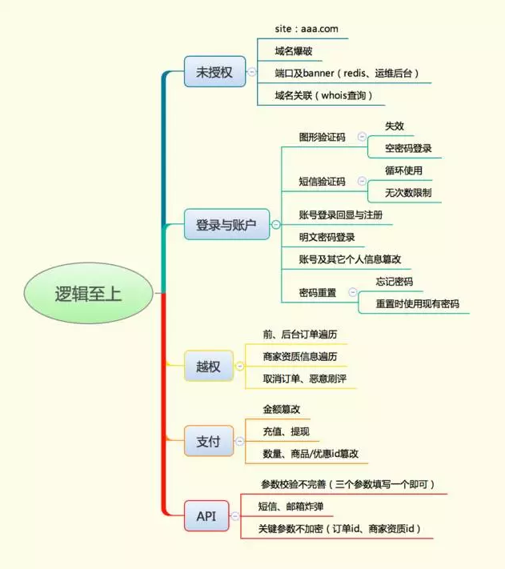

# 【技术分享】逻辑至上——内含各种酷炫姿势

                                阅读量   
                                **168709**
                            
                        |
                        
                                                                                    

**前言**

与传统类型漏洞相比，逻辑漏洞具有不易发现、不易防护的特点，不像SQL注入、XSS有像WAF那样现成的防护手段；而且，每个企业的业务逻辑参差不齐，也形成了千奇百怪的逻辑漏洞。下面就和大家分享一下我都是从哪些维度去发现逻辑漏洞的。

 

**一、未授权**

形成未授权的原因一般是由于代码未做登录验证或者登录验证失效引起，从而使后台或者带有敏感信息的页面直接裸露在公网。

site：在baidu、Google、bing、360等搜索引擎中使用site命令去搜索所要查询的域名信息，因为此时搜索以“全”为目的，所以不需要加任何搜索条件。

比如想查询a.com下的未授权，site:a.com即可。一般看搜索结果前十页。如果遇到被搜索引擎收录过多的域名，这时就需要加一些条件了，具体可以参考site命令用法。通过site命令，一般会很容易发现某个域名下的后台地址和直接暴露在公网的敏感信息页面。

域名爆破：通过爆破发现更多的二级、三级域名，然后导出域名列表通过脚本查看域名banner名称，或者挨个手工访问，观察是否有未授权登录的后台。一般大家都使用layer子域名挖掘和subDomainsBrute来进行子域名发现。

端口及banner扫描：端口不容小视，很多运维自作聪明，把后台或者其它管理系统直接改个非80端口绑定到公网。可以通过namp对域名所在ip段内的服务器进行端口扫描，生成ip+端口列表，然后通过脚本批量获取http banner。夫子通过这种方法成功发现并进入了各种知名互联网公司后台，当然，漏洞都已提交给他们的src了。 

域名关联：目前有很多公司的域名是未做域名隐私保护的，可以通过whois查询某个域名所有人还拥有哪些域名，然后重复上述步骤。

 

**二、登录与账户**

一个业务，如果登录或者账户信息出现漏洞，信息被一些不法分子利用，可能出现类似电信诈骗的现象。

图形验证码：很多后台/前台在登录或注册时，是没有图形验证码的。这也就给爆破带来了便利。让人更不可思议的是，很多验证码只是个摆设，哪怕输入错误的验证码也能提交。 

短信验证码：在app盛行的时代，短信登录更为便捷，所以在使用过程中也产生了诸多问题。

例如很多app登录时使用4位纯数字作为手机验证码。如果用户基数较大，在某一时间段，会有部分人使用同一个手机验证码登录。如果通过大量撞库，可能登录他人账号；又因为是4位验证码，如果单一账号也没限制短信登录重试次数，同时也存在通过爆破4位验证码登录的现象。

账号登录回显与注册：很多开发者或者产品，为了提升体验，在设计开发系统登录功能时会加一些友好的提示信息。比如提示“该用户不存在”、“该用户已注册”，这无疑是一个变相的撞库漏洞。在撞库之前，测试者一般都先搜集好精确的用户名字典，而提示用户不存在或登录时不存在的用户请求返回字节不一样，都构成了撞库。

明文密码登录：不少应用在登录时使用了明文密码登录，或者使用未加盐的md5，或者使用了外围人员不知道的加密方法，这些都是不可靠的。

拿加盐的md5值作为密码登录为例。登录时，只需在burp这类工具拿出几个常用密码加密后的密文，即可实现fuzz。终究的防护办法还是登录时加入签名，签名一旦被篡改，就无法登录。

账号及其它个人信息篡改：通过抓包方式对账号信息进行拦截，如手机号、uid、邮箱、token，篡改后提交数据包，从而达到登录别人账号的目的。一般防护办法是使用多个参数进行验证，当满足所有条件时才验证通过。

密码重置：密码重置也是一个重灾区，常见的密码重置绕过方式有数字验证码绕过，比如4位数字，通过爆破进行；有的通过修改返回结果，如把false改成true。还有的可以构造密码重置链接。这部分夫子接触较少，更多姿势可以参考乌云镜像案例。

 

**三、越权**

越权漏洞是逻辑安全中的重中之重，由于产品、研发追赶项目进度，会在项目开发过程中损耗一些安全属性。接下来我们看一下比较典型的越权漏洞，这些越权漏洞一旦发生，危害等同于脱裤。 

订单遍历：订单遍历一般发生在三种场景，分别是前台订单遍历、后台订单遍历、前后台订单遍历。

1. 前台订单遍历指的是你在某平台购物或者下单订了个外卖，然后在查看订单时发现订单id为一串有规律的数字，这时可能通过变换id数字就可以查看他人订单信息了。

2. 后台订单遍历指的是一些管理后台，在前端展现的时候，每个用户只能查看系统分配给自己的一些订单信息。但是通过burp抓包进行fuzz时，多数都可越权查看其它账户下的订单信息，这就成了一个变相的脱裤。防护策略就是将订单id加密或者变成一串很大的数字，这样一来也就无法遍历。

3. 刚才说了两种场景，接下来说一下第三种场景。这个姿势稍微有点淫荡，我把这个场景称为前后端订单遍历。举个例子，当我们在某外卖提交订单时，信息里面会包含一个订单号，而这个订单需要一个商家端来接单。商家端接单时可以抓包，然后就可以进行订单遍历了。当然，前提是你得有一个商家端。

商家资质遍历：商家在运营过程中，会向平台提交一些身份证、营业执照等敏感信息。一些服务端为了方便保存，直接对上传文件以用户id或者一串数字保存，这样一来可能通过改id就可获取其它商家信息。修复办法就是将文件名称进行hash命名。

取消他人订单、恶意刷评：取消订单时对订单号进行拦截篡改，从而达到取消他人订单的目的；评论时更换评论者id，从而实现恶意刷好评、差评的目的。

 

**四、支付**

你想买个红色的爱疯7，于是给自己购物账户充值了5000软妹币，等你下单完毕后，发现账户余额变成了10000，这是为什么呢？

金额篡改：在下单时，通过拦截篡改支付额度后提交请求，一般会看到出其不意的效果，如把订单金额改小、改成负数。造成这一现象的原因是服务器端对金额未做二次校验。

充值与提现：充值和提现过程中都可能存在漏洞。

**1. 充值一般会出现两种漏洞：**

一种是少充多得，比如充值100元时通过篡改金额改成10元，最终充值完毕后账户变成了100元，而实际付款却只有10元； 

另一种是绕过活动页金额限制，比如很多公司做活动强制用户充值金额不能低于10000，而通过拦截修改金额，可以充值任意金额。

**2. 接下来我们再说说提现：**

提现一般也是由于服务器端参数校验不严格，会经常存在一些信息泄露、无限提款的漏洞。一般提现时，我们可以通过篡改提现额度、银行卡号来实现。防护手段是手机号、姓名、银行卡账户、额度四个统一。

数量、商品/优惠id篡改：下单时，通过拦截篡改商品数量、商品id、优惠券等信息。如把数量改为一正一负、如替换优惠券满减id。

比如你有2张优惠券，一张id为1的优惠券满100减10块，一张id为2的优惠券满200减20。这时你买了100块钱的物品，勾选了满100减10块的优惠券，提交请求时把优惠卷id1篡改成了2，结果只支付了80块钱。

支付上的漏洞远不止这些。如果想深挖，可以尝试实现多个组合，通过频繁组合与篡改，观察效果。

 

**五、API**

现在是app盛行的时代，客户端使用API与服务器端进行数据传输，所以API安全问题频出，接下来说一下API常见的安全问题。

参数校验：举个例子，你在某个app内充值话费，返回查看订单时url参数包含了手机号、银行卡、充值金额，你通过改变手机号，获取到了其它用户的充值信息（银行卡号、金额）。这样你便获取了一一对应的手机号和银行卡，是不是很恐怖呢？其实这也是典型的平行越权。

短信邮箱炸弹：短信和邮箱经常出现的漏洞分为两种。一种是无任何频率限制，利用者可以无限制对目标手机号或者邮箱发送垃圾短信/邮件；另一种是对短信/邮件内容实现篡改。

关键参数不加密：如同上面说的订单号、银行卡号、身份证等敏感信息，这类数据要进行hash，从而减少被直接明文越权/遍历的风险。

分享了这么多，说说这两年从接触安全到能发现逻辑漏洞的一些心得。

1. 有枣没枣先打三竿：上来先动手跑几十万数据试试，毕竟光看是看不出安全漏洞细节的。

2. 观察每一个参数：逻辑问题重要的是测业务逻辑，所以每条http请求都不能放过，每个参数也要尽可能知道是干啥的，看看能不能改变某个参数引起异常返回结果。

3. 大胆假设：不要以为互联网巨头没安全漏洞，往往是比小公司安全问题更多。只有想不到，没有做不到。

4. 时间投入：一些漏洞，真不是1-2天能发现的，很多时候需要耗时几天甚至更久，需要分析业务请求才能发现，所以要头脑冷静急不得。

 
