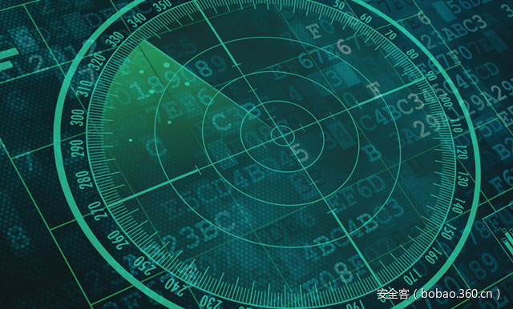

# 【技术分享】针对蒙古政府的鱼叉式钓鱼攻击分析

                                阅读量   
                                **105265**
                            
                        |
                        
                                                            评论
                                <b>
                                    <a target="_blank">1</a>
                                </b>
                                                                                                                                    
                                                                                            

##### 译文声明

本文是翻译文章，文章原作者，文章来源：fireeye.com
                                 原文地址：[https://www.fireeye.com/blog/threat-research/2017/02/spear_phishing_techn.html](https://www.fireeye.com/blog/threat-research/2017/02/spear_phishing_techn.html)

译文仅供参考，具体内容表达以及含义原文为准

****

翻译：[testvul_001](http://bobao.360.cn/member/contribute?uid=780092473)

预估稿费：120RMB

投稿方式：发送邮件至[linwei#360.cn](mailto:linwei@360.cn)，或登陆[网页版](http://bobao.360.cn/contribute/index)在线投稿

** **

**前言**

FireEye近期观察到一个针对蒙古政府雇员的复杂攻击行动。受害者在被Poison Ivy感染的恶意微软Word 文档中启用了宏脚本（Poison Ivy是一款使用了快十年的远程控制工具，可以进行键盘记录，截屏，录像，窃取文件、密码及远程控制等恶意行为）。这次攻击的背后黑手采用了如下有意思的技巧：

1、	定制化的绕过策略 –此次行动采用了公开的技巧绕过了目标系统中的AppLocker应用白名单机制。

2、	非常少的可执行文件及持久化维护-一般幕后的攻击者会尽量少的在磁盘上创建可执行文件以避免检测和调查取证。这次行动中我们观察到了使用PowerShell scripts的四个阶段。

3、	诱饵文件-攻击者使用PowerShell脚本从互联网下载最初的恶意文件，然后通过一个单独的微软Word 文档加载这个文件以避免受害者的怀疑。

 

**攻击链**

攻击者首先使用社会工程引诱受害者运行微软Word文档里嵌入的宏指令，然后加载恶意的Powershell攻击向量。

攻击者采用了两个公开的技巧，一是AppLocker的白名单绕过技术，另一个是通过脚本注入shellcode到userinit.exe进程。恶意攻击向量都是通过多个PowerShell传播的，这使得跟踪它们很难，因为不同于写到磁盘里的单独脚本文件，PowerShell攻击向量都是存储在注册表里的。

下图展示了从恶意宏指令执行攻击向量的步骤：

** **

**第一阶段：社会工程和宏指令- PowerShell的使用**

受害者首先会收到邮件发来的Word文档，这些文档伪装成登录到webmail系统的指导手册或者政府法律提案信息。当受害者打开恶意文档后，他们会看到要求启用宏指令的信息：

**绕过AppLocker的应用白名单保护**

微软的白名单解决方案AppLocker可以阻止在系统上运行未知的可执行文件。但是在2016年4月，研究者发现通过regsvr32.exe可以绕过限制。regsvr32.exe是一个可在很多AppLocker策略中运行的合法文件。regsvr32.exe可用于下载一个SCT文件并作为参数绕过SCT文件中的URL限制。

我们观察到攻击者通过执行宏代码调用regsvr32.exe来绕过这个限制（同时传入的还有一个托管恶意SCT文件的URL）。

下图展示了绕过AppLocker的完整命令行参数。

我们发现恶意的SCT文件通过隐藏模式调用WScript并硬编码加载PowerShell脚本。

** **

**第二阶段：解码SCT，加载诱饵**

解码PowerShell命令后，我们观察到有两个目的的另一层PowerShell指令。

1、	这里面包含了下载诱饵文件并通过第二个winword.exe打开诱饵文件的代码。当受害者启用宏代码，他们就会看到如下的文档，文档里包含了钓鱼邮件里描述的内容。

2、	加载完诱饵文件后，PowerShell脚本会下载并运行一个名为f0921.ps1的PowerShell脚本。

** **

**第三阶段**

第三阶段的PowerShell脚本配置了一个永久的base64编码的PowerShell脚本命令，并保存在HKCU: ConsoleFontSecurity注册表键值中。

第三阶段的PowerShell脚本同时也配置了一个名为HKCUCurrentVersionRunSecurityUpdate的注册表键值，用来加载存在HKCU: ConsoleFontSecurity 键值里的PowerShell攻击向量。（下图展示了一些相关代码，它们会在用户登录系统的时候执行）。

** **

**第四阶段：PowerShell Inject-LocalShellCode代码**

HKCUConsoleFontSecurity注册表键值包含了第四阶段的PowerShell脚本，这个脚本从PowerSploit中借用了Inject-LocalShellCode部分代码来注入shellcode。

**Shellcode 分析**

Shellcode使用了0XD4作为key的基于XOR的加密方法。

当shellcode被解密并开始运行后，它向userinit.exe注入了一个Poison Ivy后门。

在shellcode中，我们同时看到了关于Poison Ivy的内容和配置。通过以下配置可以将它和标准的Poison Ivy联系起来：

Active setup – StubPath 

Encryption/Decryption key – version2013 

Mutex name – 20160509     

 

**总结**

尽管Poison Ivy已经是一个出现很久的威胁，但是这个后门的传输方式使用了近期很流行的技巧（和以往观察到的都不一样）。通过使用PowerShell脚本和公开的安全控制绕过方法，这次攻击的大部分步骤都在内存中完成，在目标机器上进行调查取证只能得到很少的内容。
