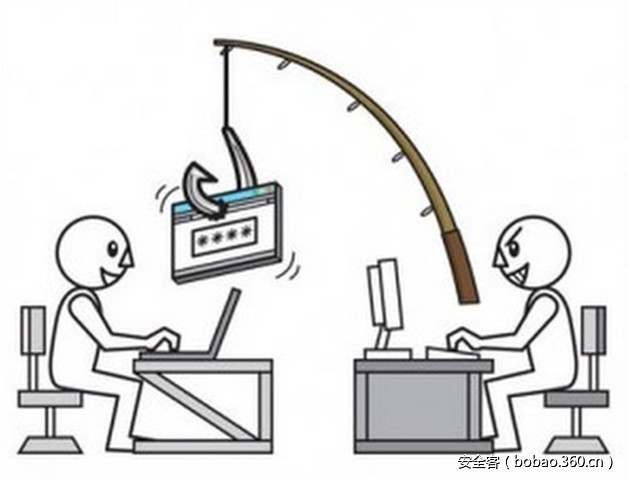

# 【技术分享】钓鱼者使用PDF附件发起简单但有效的社工攻击

                                阅读量   
                                **131968**
                            
                        |
                        
                                                                                                                                    
                                                                                            

##### 译文声明

本文是翻译文章，文章原作者，文章来源：microsoft.com
                                 原文地址：[https://blogs.technet.microsoft.com/mmpc/2017/01/26/phishers-unleash-simple-but-effective-social-engineering-techniques-using-pdf-attachments/](https://blogs.technet.microsoft.com/mmpc/2017/01/26/phishers-unleash-simple-but-effective-social-engineering-techniques-using-pdf-attachments/)

译文仅供参考，具体内容表达以及含义原文为准

****

****

翻译：[ju4n010](http://bobao.360.cn/member/contribute?uid=2772593091)

预估稿费：170RMB

投稿方式：发送邮件至[linwei#360.cn](mailto:linwei@360.cn)，或登陆[网页版](http://bobao.360.cn/contribute/index)在线投稿

** **

**前言**

通过Gmail网络钓鱼攻击是如此有效，甚至欺骗了技术用户，但它可能只是冰山一角。我们看到越来越多类似的简单但聪明的使用PDF附件发起的社工攻击。

与其他垃圾邮件广告系列不同，我们在这些网络钓鱼攻击中看到的PDF附件不包含恶意软件或漏洞利用代码。相反，他们依靠社会工程将你带到钓鱼网页，在那里你被要求泄露敏感信息。

意识是抵御社会工程攻击的最有效武器。在本文中，我们会分享这些PDF附件的一些示例，包括伪装Microsoft Office的附件，因此你可以学习防范这些社会工程攻击的知识。

 

**示例1：你收到一个Adobe Reader无法显示的文档，因为它是受保护的Excel文件，因此你需要输入你的电子邮件凭据**

**附件类型：**PDF

**文件名：**Quote.pdf

**信息窃取：**Email登录凭据

**Windows Defender 检测结果：**Trojan:Win32/Pdfphish.BU

欺诈性PDF附件的一个示例是伪装成正式通信的电子邮件消息附件，例如，来自合法公司的产品或服务的报价单。这些电子邮件可能欺骗来自合法公司的真实工作人员。

当你打开附件时，它确实是一个PDF文件，但其中显示了打开图片失败的错误消息。 它包含“使用Microsoft Excel打开文档”的指令。但它实际上是一个网站的链接。

单击链接将打开浏览器并将你带到一个网站，社会工程攻击会继续显示一条消息，指出文档受到保护，因为它是机密的，因此你需要使用你的电子邮件凭据登录。

如果你使用Microsoft Edge，Microsoft SmartScreen将阻止此网站，停止网络钓鱼攻击。

然而，如果你使用的浏览器没有阻止网站，并单击确定，你将被导向网上诱骗网站，请求你输入你的电子邮件地址和密码。网站被设计为看起来像你正在打开一个Excel文件。 网站很大程度上模仿Microsoft Excel Online，但你在网站上看到的不是一个Excel文件，而只是一个图像。

如果你因为这个社会工程攻击输入了你的详细信息，则被重定向到以下网站，并告知你输入的详细信息不正确。但在此时，攻击者已经拥有了你的电子邮件凭据。一旦他们访问你的电子邮件，攻击者可以对你的联系人进行进一步的网络钓鱼攻击，或访问你的社交网络，网上银行或在线游戏帐户。

 

**示例2：你从Dropbox收到一个PDF文件，需要使用你的电子邮件凭据登录**

**附件类型：**PDF

**文件名：**ScannedbyXerox.pdf

**信息窃取：**Gmail, Outlook, AOL, Yahoo!, Office 365 登录凭据

**Windows Defender检测结果：**PWS:HTML/Misfhing.B

这些PDF附件的另一个伪装示例是，你需要登录到在线存储提供商Dropbox以访问你的文档。 与第一个示例类似，此PDF文档没有恶意代码，但包含指向“在线查看.PDF”的链接。

点击链接，你将进入一个假的Dropbox登录页面，该页面要求你使用Google，Outlook，AOL，Yahoo !, Office 365或其他电子邮件凭据登录。

Microsoft Edge用户不会受到此威胁。使用Microsoft SmartScreen，它会阻止此网络钓鱼攻击加载进一步的违规网页。

在诱骗页面上，一些选项被定制为看起来像合法的电子邮件登录页面。 例如，单击Office 365选项将打开一个窗口，对普通用户这看起来就像真的页面一样。

例如，对于Google登录选项，该窗口会首先要求你选择是要使用单位或个人帐户登录。 此步骤不会显示在实际的Google登录过程中，但这可以帮助攻击者识别与业务相关的帐户凭据。然后它打开登录页面。

如果你输入了详细信息，则会在窗口中打开实际的PDF文档（托管在Google云端硬盘中，而不是Dropbox中）。

作为社会工程攻击的一部分，这样做，你不会立即怀疑你被钓鱼。 到这个时候，攻击者将拥有你的凭据。 一旦你意识到被钓鱼了，需要赶紧去更改密码。

 

**其他示例：输入你的电子邮件凭据以访问或下载你的文件**

我们已经发现通过电子邮件分发并展示相同特征的其他PDF文件示例。 与前两种情况一样，这些PDF文件除了指向网络钓鱼站点的链接之外，不包含恶意代码。 所有这些都携带你需要输入电子邮件凭证的消息，以便你可以查看或下载文档。 所有这些附件都被检测为Trojan：Win32 / Pdfphish的变体。

 

**怎样保持安全，免受网络钓鱼攻击**

正如我们从上面例子中看到的，社会工程攻击旨在利用可能的决策失误，特别是意识，这是关键。

请勿打开附件或点击可疑电子邮件中的链接。即使电子邮件来自你认识的人，也请你谨慎对待，慎重打开附件，因为垃圾邮件和网络钓鱼电子邮件可能会假冒伪装发件人。

在这些时候，当我们面对网络钓鱼和改进的社会工程攻击时，一点点偏执并不过分。 例如，请你想一想为什么Adobe Reader会尝试打开Excel文件，为什么Dropbox要求你输入电子邮件凭据，而不是你的Dropbox帐户凭据。

使用像Windows 10这类安全的操作系统平台，你可以充分利用内置的安全功能识别和抵御网络钓鱼攻击：

Microsoft Edge是一个安全的浏览器，可以使用Microsoft SmartScreen阻止网络钓鱼站点和其他恶意网站。

Windows Defender可以检测和阻止恶意的PDF附件和其他恶意代码。

Office 365内置的内容安全功能，可以阻止垃圾邮件和网络钓鱼电子邮件。
