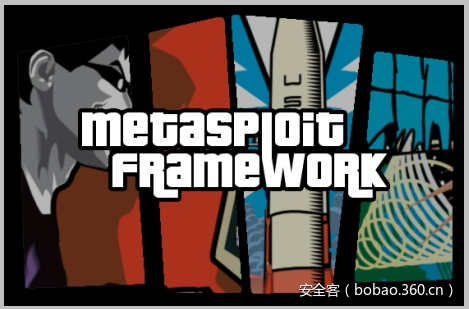

# 【技术分享】黑客攻击的7个阶段

                                阅读量   
                                **118746**
                            
                        |
                        
                                                                                                                                    
                                                                                            

##### 译文声明

本文是翻译文章，文章原作者，文章来源：countuponsecurity.com
                                 原文地址：[https://countuponsecurity.com/2017/02/26/offensive-tools-and-techniques/](https://countuponsecurity.com/2017/02/26/offensive-tools-and-techniques/)

译文仅供参考，具体内容表达以及含义原文为准

翻译：[pwn_361](http://bobao.360.cn/member/contribute?uid=2798962642)

预估稿费：200RMB

投稿方式：发送邮件至[linwei#360.cn](mailto:linwei@360.cn)，或登陆[网页版](http://bobao.360.cn/contribute/index)在线投稿

**前言**

在本文中，我将用一系列的例子来说明双方力量通常使用的工具和技术！为了举例说明这个问题，我将按照不同的攻击阶段，并使用入侵杀伤链作为叙述方法论。这种方法论包含了7个阶段，分别是侦察、武器、传送、利用、安装、C2和目标上的活动。

 

**侦察**

该阶段的任务是寻找目标信息，目标通常是一个人。攻击高端个体可能比较困难，因为这些个体通常有一个个性化的安全小组在保护着他们。然而，使用不同的情报搜集技术，如在各种公共信息资源中搜索可用信息，你可以瞄准其他人员。由于人类的本性，人们会屈服于社会工程学技术、及多次给他们提供的必要信息。收获的相关组织和人员的元数据就是我们工作的一个起点。通常，元数据就是一大堆信息，如用户名、软件版本、打印机、邮件地址和其它可以使用一个工具(如[FOCA元数据分析工具](https://www.elevenpaths.com/labstools/foca/index.html))检索的信息。你可以看一下[Chema Alonse](https://twitter.com/chemaalonso?lang=en)和Jose Palazon给出的[演示](https://www.youtube.com/watch?v=Ou4TRvzYpVk)。最后，攻击者将想尽一切办法去收集尽可能多的信息、员工姓名、层次结构、朋友和亲戚、爱好等。

 

**武器和传送**

在收集了尽可能多的信息和执行了足够的侦察后，攻击者在现有资源的帮助下，将选择最佳方案去执行攻击行动。目前，包含附件文档的鱼叉式钓鱼攻击方法是最有优势的，这可能是一个好的攻击方法。文档的武器化程度和传送成熟度可能与攻击者可用的资源量有关。在下面的例子中，我将展示如何利用Metasploit来轻松的创建一个带有恶意宏的Word文档，当该文档执行后，它会连接到攻击者的系统，并建立命令的控制隧道。载荷使用了HTTPS作为通信隧道，但是它使用了自签名的证书，并指向了一个IP地址，并不是一个域名。在不同大小的组织中，很多时候web过滤控制是很严格的，并且使用不同的阻拦技术来检测和停止这种类型的连接。然而，攻击者可以注册一个新域名或提前购买一个过期域名，创建一个简单、真实的WEB网页，并将域名划分到类似于金融或卫生保健的类别中，WEB过滤产品通常会允许这类域名，因此我们的SSL连接可能(载荷添加了自定义证书)就不会被终止或检查。另外，攻击者可以购买一个便宜的SSL证书，会使这种场景看起来更加真实。除此之外，Metasploit引用了一个升级的[流量混杂技术](http://buffered.io/posts/tlv-traffic-obfuscation/)，安全产品探测到它会更困难。

下图展示了如何用Metasploit去创建一个武器化的Word文档，另一个方法是使用PowerShell Empire。可以看一下[Matt Nelson](https://twitter.com/enigma0x3)写的[一篇文章](https://enigma0x3.net/2016/03/15/phishing-with-empire/)。

于是，为目标订制好了Word文档。综上所述，可以是一个武器化的文档，也可以是一个恶意链接，攻击者精心发送了一个钓鱼邮件。这需要运用到不同的社会工程学技术，去迎合人性的诉求，并利用人类的弱点，使攻击成功的可能性尽可能的最大化。当然，还有其它的可能会影响攻击成功的因素，比如恶意邮件/链接规避大量豪华过滤器的能力，具备这种能力才能使邮件/链接穿过多层网络边界，并到达终端用户。如果邮件最终到达终端用户，并且有一个员工犯了一个错误，如果这些条件都满足了，那么攻击者将能在企业内部网络中建立一个立足点。

下图展示了一个具体过程，攻击者启动Metasploit，并添加了一个载荷，当恶意文档成功返回信标后，利用自动脚本实现了进程自动迁移：

 

**利用**

凭借在目标环境中的立足点和一个已经建立的通信隧道，攻击者将迅速行动，会偷取信息、尝试寻找途径去渗透其它系统、获得高权限。在Ruben Boonen维护的网站fuzzysecurity.com中，有一篇[非常全面的文章](http://www.fuzzysecurity.com/tutorials/16.html)，他描述了在Windows系统中用于提升权限的多个不同的方法。另一个很好的资源是Kostas Lintovois写的“[Windows Services – All roads lead to SYSTEM](https://labs.mwrinfosecurity.com/assets/1089/original/Windows_Services_-_All_roads_lead_to_SYSTEM-1.1-oct15.pdf)”，他描述了多个利用配置错误来提升权限的方法。这些技术对攻击者是很有用的，因为在很多组织中，正常用户是没有管理员权限的。管理员权限是所有攻击者在一个企业环境中的目标，因为它会有利于攻击工作。

很多由Ruben和其它人写的这种技术，已经被集成在后渗透框架中，如PowerSploit里的PowerUp.ps1模块，它最早是由Will Schroeder开发的，Will Schroeder是一个才华横溢的安全专家，近年来他发布了一些强大的工具，PowerSploit包含了很多好用的模块和脚本，可以在攻击生命周期的所有阶段提供帮助。PowerUp模块能帮助攻击者发现系统中可能存在的能成功提权的条件，这个条件可以允许攻击者使用一种技术，从而使他们得到一个高权限账户。所有这些都使用了PowerShell，并且在[PowerShell扩展](http://www.darkoperator.com/blog/2016/4/2/meterpreter-new-windows-powershell-extension)的帮助下，在Meterpreter中也能执行PowerShell脚本，目前该扩展已经集成到了Metasploit([1](https://github.com/rapid7/metasploit-payloads/pull/89)，[2](https://github.com/rapid7/metasploit-payloads/pull/87))中，这意味着，攻击者可以在Metasploit下执行PowerShell。你可以在[Will Schroeder](https://twitter.com/harmj0y)的博客中读一下更多关于PowerUp的信息，并且你可以从这里得到PowerUp的速查表。

下面的图片展示了这种攻击方法，当攻击者在目标环境中得到一个立足点后–通过钓鱼邮件–确定他所在的操作账户没有足够的权限，不能运行一些额外的模块，如Mimikatz。Mimikatz是一个用C写的后渗透工具，关于它的用法 ，你可以读一下“[Mimikatz非官方指导和命令参考](https://adsecurity.org/?page_id=1821)”和[这篇文章](https://countuponsecurity.com/2014/07/02/the-path-to-the-golden-ticket/)。然而，Meterpreter包含了一个PowerShell模块，该模允许攻击者执行PowerShell命令。在这种情况下，攻击者可以加载PowerShell模块，并执行必要的命令从Gitbug上下载P[owerUp](https://github.com/HarmJ0y/CheatSheets)模块，然后执行Invoke-AllChecks命令。在写这篇文章的时候，PowerUp模块包含14个检查项目：

在本案例中，如上图所示，PowerUp模块的运行结果显示，可以通过DLL劫持来提升权限。实际上，该系统包含了一个任意用户可写的目录，且这个目录在“%PATH%”环境变量中，攻击者可以利用DLL的搜索顺序，通过DLL劫持去获得系统权限。在本安例中，PowerUp模块建议使用“wlbsctrl.dll”。为了使这个DLL能工作，“IKE and AuthIP IPsec Keying Modules”服务必须是运行的，但是在企业环境中，在工作站中安装了VPN客户端是很常见的。这个漏洞是2012年“High-Tech Bridge Security Research Lab”发现的，该漏洞利用了Windows服务“IKE and AuthIP IPsec Keying Modules”，它在启动时会尝试加载“wlbsctrl.dll”动态链接库，而这个动态链接库在默认安装的Windows中是不存在的。这个提权技术是如何实现的？为什么会存在这种漏洞呢？Parvez Anwar给出了很好的解释。

因此，根据上面的发现，我们现在有了一个提权思路，下一步，攻击者需要创建一个和目标系统架构相匹配的DLL(后门)，并要命名为“wlbsctrl.dll”，使用msfvenom能很容易的生成它。如下图所示：

另一个利用这种技术的方法是使用PowerUp.ps1模块的“Write-HijackDll”函数。该函数能创建“wlbsctrl.dll”，并会将该DLL放到刚才发现的可写目录中，当服务启动时，它会首先加载这个DLL，并会使用预定义的密码，向本地管理员组添加一个用户。

使用PowerShell需要注意的一点是，在某些安全限制比较严的系统中，PowerShell脚本可能会被阻止运行。然而，在这种情况下，攻击者可以使用其它的技术，和使用其它的工具，比如Portuculis Lab写的“PowerOPS: PowerShell for Offensive Operations”工具，它的灵感来自于Cn33liz写的“ PowerShell Runspace Post Exploitation Toolkit”。

然后，攻击者将DLL上传到预期的文件夹后，可以强制重启机器、或等待系统重启。当系统重启时，IKEEXT服务会启动，并会加载该恶意DLL，该DLL会将一个命令和控制隧道反馈给攻击者的系统，并且是系统权限。下图展示了将DLL上传到低权限目录的过程，并且该目录是“%PATH%”变量的一部分。然后，它返回了命令和控制隧道，说明IKEEXT服务已经重新启动了。因为这时已经拥有了高权限，攻击者可以继续，并开始使用强大的Mimikatz模块。首先，他可以通过使用Kerberos命令来获取明文凭据。

 

**安装和C2**

有很多用于攻击者完成持久化的技术和工具，但是在这个安例中，我们给出一个持久化的例子，该例子使用了[WMI](http://wordpress.redirectingat.com/?id=725X1342&amp;site=countuponsecurity.wordpress.com&amp;xs=1&amp;isjs=1&amp;url=https%3A%2F%2Fmsdn.microsoft.com%2Fen-us%2Flibrary%2Faa394582(v%3Dvs.85).aspx&amp;xguid=56f26e250f4cfe4cd95856f5de625a26&amp;xuuid=31cd8d0e7db73570b8b630e76013879e)，并结合了PowerShell、和Metasploit的一个载荷。

WMI近年来在攻击者中很流行。Matt Graeber在BlackHat15上给出了一个很好的[演示](https://www.google.ch/url?sa=t&amp;rct=j&amp;q=&amp;esrc=s&amp;source=web&amp;cd=1&amp;cad=rja&amp;uact=8&amp;ved=0ahUKEwjLwtr56ajSAhWGVxQKHfX2DLgQFggcMAA&amp;url=https%3A%2F%2Fwww.blackhat.com%2Fdocs%2Fus-15%2Fmaterials%2Fus-15-Graeber-Abusing-Windows-Management-Instrumentation-WMI-To-Build)：使用WMI(Windows Management Instrumentation)建立一个持久、异步、且无文件的后门。另外，William Ballenthin，Matt Graeber和Claudiu Teodorescu写了一篇很好的文章，叫做“WMI的攻击与防御”。除此之外，你可以读一下NCCIC/ICS-CERT的“WMI探测与响应”这篇文章。

因此。攻击者为了获得持久性，它可以使用WMI，WMI将会被作为一个媒介物，会在特定的事件下去触发一个载荷，这个事件可以是发生在系统级的一个特殊的计划任务，或是一个事件，如登录或一个WMI支持的事件。该载荷会利用PowerShell去执行一个被称为反射DLL注入技术，从而反弹连接到攻击者的系统，并注入Metasploit Meterpreter，想了解更多的关于反射DLL注入技术，请读一下Dan Staples的这篇文章及其参考。和攻击者域名的通信利用了HTTPS。总体而言，攻击者将只使用Windows的内置功能并结合了Metasploit。使用的这些不同工具和技术导致了更强大的攻击，这种攻击很难被探测到。此外，这种技术是在内存中实施的，不会接触硬盘，因为它在内存中使用了一个PE加载者去加载DLL，并且没有使用传统的LoadLibraryA()方法。该持久机制存储在WMI存储库中，这无形之中也阻止了防御者的很多的检测行为。

为了生成载荷，攻击者可以使用msfvenom。下图展示了如何使用msfvenom生成带有PowerShell格式的反射DLL注入载荷：

下一步是将这个载荷武器化，用它生成一个托管对象格式(MOF)脚本

下一步，攻击者将会用到托管对象格式(MOF)编译器，目标机器上的Mofcomp.exe，这个实用程序将会解析包含MOF声明的文件，并将文件中定义的类和类的实例添加到WMI存储库。更多关于MOF的知识请看一下这篇好文章“Playing with MOF files on Windows, for fun &amp; profit”。然后，一系列的wmic.exe命令可以用来查看不同类的内容。

这些命令是在Meterpreter会话中执行的，Meterpreter会话是由DLL劫持技术建立的。于是，攻击者可以覆盖他的跟踪、删除恶意MOF，并继续前进。当WMI事件被触发时，载荷会被调用，然后一个返回攻击者系统的Meterpreter会话会被建立。此时，攻击者已经有了一个持久化机制，并在目标环境中以一个特权帐户运行着。

 

**目标上的活动**

传统的横向运动使用了各种命令和工具，如net.exe和wmic.exe。现在，您可以将PowerShell添加到各种组合中，更具体的说，你可以使用William Schroeder开发的PowerView工具，它是PowerSploit工具的一部分。PowerView是一个用PowerShell编写的高级活动目录枚举工具，允许攻击者收集大量关于企业Windows环境的信息。这里列举了更多PowerView的使用方法。再一次，我们可以从Meterpreter会话中加载PowerView。在这个案例中，该会话已经有了系统权限，并利用WMI获得了持久性，但是PowerView可以运行在普通账户下，如下图所示：

PowerView中的可用函数在这里可以看到，它的速查表可以看这里。攻击者可以利用PowerShell命令来枚举活动目录的不同方面，和不同的系统。为了执行这些操作，攻击者可以利用PowerView中的不同技术和模块。对于它的用法，William Schroeder写的“I have the power view”对这个问题进行了不错的总结。

黑客也可以利用Kerberoasting技术，该技术是由Tim medin开发的，我推荐你看一下他的演示“Attacking Kerberos – Kicking the Guard God of Hades”，这里有利用Kerberos的一些方法。这个技术已经加到了PowerView里面，利用该技术“在包含SPN的活动目录中”列出所有用户账户会很简单，它会请求Kerberos票据和提取加密素材。然后，在离线环境中对它进行破译，并获得明文密码。你可以在William写的两篇文章中了解一下关于该技术的更多情况(1，2)，下图展示的就是Kerberoasting技术：

在获得HASH以后，你可以使用“John the Ripper”去破译它的密码，需要使用Krb5tgs的HASH格式。

另一个攻击方法是在活动目录中找到不需要Kerberos预身份认证的账户，即启用了PreAuthNotRequire 属性。你可以读一下这篇文章(“Kerberos Party Tricks: Weaponizing Kerberos Protocol Flaws”)了解一下该技术的具体信息。实际上，该技术列出了所有具有该属性的账户，并向这些账户请求了一个Kerberos票据。这个票据包含了加密素材，通过离线破译这个加密素材可以恢复出原始密码。再说一次，这个技术已经添加到了PowerView里面，关于它的更多信息，你可以读一下[这篇文章](http://www.harmj0y.net/blog/activedirectory/roasting-as-reps/)。

最后，如果这个技术没起作用，攻击者可以试试每一个系统，直到找到一个他能获得管理员权限的系统，然后继续渗透，直到拿到域管理员权限。在大网络环境中，这可能是一个艰巨的任务，在这里再说一次，William Schroeder已经将这些步骤集成在了一系列PowerView模块中，就连它们的名称也采用了猎人的词语，如Invoke-UserHunter、Invoke-StealthUserHunter，以及其它能对搜索高价值目标有帮助的模块。你可以看一下他的演示“[I hunt sysadmins](http://www.harmj0y.net/blog/penetesting/i-hunt-sysadmins/)”，能帮助你更好的理解这个模块的幕后工作。Justin Warner是PowerShell Empire的创始人之一，他写了一篇伟大的文章，解释了这些模块是如何工作的，并进一步将他解释的这个技术命名为“[derivative local admin](http://www.sixdub.net/?p=591)”。这个技术被Andy Robbins改进的更加的自动化了，起初只是一个概念证明，叫做PowerPath，它利用了“寻找两点之间的最短路径”算法。Andy随后和Rohan Vazarkar、Will Schroeder一块工作，他们将工作集中在了BloodHound工具上。该工具在DEF CON 24上已经开源了。基于此，这些才华横溢的、使用了不同工具和技术的入侵者很有可能会成功获得一个高权限账户。

于是，攻击者可以利用netsh.exe的端口转发功能，或Meterpreter的端口代理命令，在内部系统之间穿梭。通常，攻击者想利用一个内部系统作为跳板时会使用这种技术，这允许攻击系统访问那些无法直接访问的机器。下图中的命令展示了这个技术，在受害人机器上配置好端口转发命令后，攻击者可以使用wmic.exe去发起远程系统中的PowerShell，然后回连到攻击者的系统上，并建立一个Meterpreter会话：

从此时起，攻击工作就进入了一个循环，列举弱点-利用它们-入侵系统-横向运行-重复。这个循环不断重复，直到攻击者达成了自己的目标。关于这些技术，及其它的一些技术，在[Raphael Mudge](https://twitter.com/armitagehacker?lang=en)写的[一篇文章](https://blog.cobaltstrike.com/2015/09/30/advanced-threat-tactics-course-and-notes/)里已经列举出来了，这个人是Cobalt Strike的作者。

 

**总结**

在这篇文章中，我们涵盖了不同攻击阶段使用的不同工具和技术，使用这些技术的不仅有安全专家，也有网络犯罪份子、APT团伙。在此之后，我会问大家：你如何检测、预防和应对每一个在这个攻击场景中描述的步骤呢？
