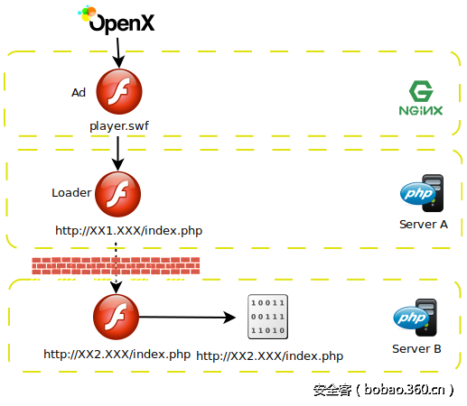

# 【木马分析】挂马新招：全程纯Flash文件挂马传播勒索软件技术揭秘


                                阅读量   
                                **87859**
                            
                        |
                        
                                                                                    


**[](./img/85928/t0124df50915d06ba7c.jpg)**

**1. 概述**

360互联网安全中心近期监测到“我爱卡”网站（51credit.com）出现挂马情况，进一步分析发现，访问该网站会加载跳转到漏洞攻击包（Exploit Kit）页面的恶意Flash广告，没有专业安全防护的访问者电脑会感染号称勒索软件“集大成者”的Sage2.0，造成文件被加密勒索的惨重损失。**相比以往的漏洞攻击包，此次整个攻击链完全使用Flash文件实现，不再需要HTML与Javascript脚本交互功能，呈现出新的攻击形式和较高的技术水平。**

<br>

**2. 技术分析**

**2.1 广告挂马点**

[](./img/85928/t0158677b5c407f767d.png)

图1 整体挂马流程

我爱卡网站采用了较为常见的OpenX开源广告系统，该广告系统具备较完整的商业生态，被很多大型网站采用。但是因为审核不严格，已有多次漏洞攻击包通过该广告系统进行传播[1]。

[](https://p0.ssl.qhimg.com/t015a8be412b4d70763.png)

图2 返回挂马广告内容

浏览我爱卡网站任意页面时，会插入了一个广告Flash文件hxxp://conxxxxxxxxx.info/admedia/player.swf。而在另外一个被挂马网站中，这个Flash则被直接托管在挂马网站上。显然，攻击者将这个Flash文件伪装成广告提供给广告运营商，广告运营商审核不严直接在投放网站上上线。打开该Flash文件，其实是没有任何可以显示的内容，实际功能则是利用AS3代码实现了获取Flash版本号并进行相关判断、加载Flash文件功能，使得只有是IE浏览器并且安装了Flash11~21版本才会进一步加载第二个Flash文件。通过该文件拦住了所有无法触发漏洞的用户访问，减少了实际攻击页面的暴露，同时这个文件非常简洁并且没有明显特征，易于躲过查杀。

[](https://p4.ssl.qhimg.com/t0114731726d8f5daca.png)

图3 Flash加载代码

**2.2 第二个Flash加载器**

接下来加载的第二个Flash文件仍然是一个加载器，功能与第一个Flash文件相同，实现了版本判断、加载下一个Flash的功能。但是与第一个Flash不同，这个文件是动态生成的，根据该文件的网络请求响应头，可以猜测该文件是利用php动态生成，对比变化的样本，发现每隔一段时间要加载下一个Flash的地址都会发生变化。这个Flash网址使用了Exploit Kit所常见的域名生成算法，并不停的变换三级域名地址，这样确保对实际攻击文件的网址难以再次访问。另外，由于该文件是动态生成的，所以Content-Type被有意或者无意设置成默认的text/html，这可以让部分依赖Content-Type进行文件类型判断的网络检测设备忽略，从而降低被发现的概率。

[](https://p0.ssl.qhimg.com/t01e64ffb2e071fa08d.png)

图4 动态返回Flash内容

[](https://p3.ssl.qhimg.com/t0164e5bb451ed95598.png)

图5 生成的不同域名

**2.3 Flash漏洞攻击文件**

直到这时，访问的第三个网址才真正引入了攻击Flash文件。但是攻击者的防范措施仍然不止于此，在访问最终的Flash漏洞文件网址时，有时会出现无缘无故无法访问的情况，猜测攻击者使用了IP屏蔽或者随机阻拦请求的策略，增加了分析重现的难度。并且根据用户Flash版本信息，服务器会返回不同的漏洞利用脚本，这种手段与我们之前分析过的一起广告挂马事件中的方法一致，并且也利用了相同的漏洞攻击代码[2]，唯一不同的是这次并没有进行代码的混淆，能够较为容易的分析攻击代码。

具体分析该文件代码，发现漏洞攻击代码被使用RC4加密后切分保存在了Flash的BinaryData字段中，根据不同的发起请求的Flash版本号，解密后获得的漏洞攻击脚本分别是CVE-2015-8651 [3]、CVE-2016-1019 [4]、CVE-2016-4117 [5]的攻击代码，这几个漏洞也是目前各个攻击包常用的方式，具备较高的攻击成功率。

[](https://p0.ssl.qhimg.com/t0135624642b5b353da.png)

图6攻击代码类型

**2.4 释放载荷**

在利用漏洞之后，会直接执行一段Shellcode代码，不过与常见的基于VBS或者Powershell下载方式不同，该Shellcode会再次向当前网址发送请求，下载一个二进制数据到Internet临时目录，解密转换后得到要运行的payload，因此进程链上会看到一个index[1].htm的进程被启动。注意到此时请求的网址与Flash攻击代码的网址一致，但是返回内容却不一样，可猜测在服务端会自动根据请求来源返回不同的内容，仅当包含Flash请求信息的时候才返回Flash攻击代码，而默认则直接返回加密后的二进制数据。

[](https://p4.ssl.qhimg.com/t016be034b5a77df56d.png)

图7 攻击进程链

最终运行的Payload是Sage2.0勒索软件，该勒索软件选择的密钥交换算法与加密算法都比较巧妙，并且基于IP地址生成算法来生成数据回传ip，是目前勒索软件的集大成者[6]。一旦感染，用户的所有文件都会被加密，桌面被替换为提醒壁纸，同时也会执行一个vbs脚本间隔一段时间发出文件被加密的提醒声音。

[](https://p3.ssl.qhimg.com/t01acfe5bb0bb99f323.png)

图8 用户感染后的桌面

[](https://p0.ssl.qhimg.com/t013b6c7a59763d210e.png)

图9 播放语音的脚本

**<br>**

**3. 数据重放**

在研究挂马事件中，我们经常会将抓到的数据包使用Fiddler工具进行数据重放，便于反复研究，但是该Exploit Kit却在同一网址分别返回Flash和二进制内容，使得Fiddler无法区分这两种请求并返回对应的数据包。因此，在无法依赖Fiddler的情况下，我们简单编写了一个基于Tornado的Web服务器，提取出抓包得到的返回内容，根据每次请求的不同网址和请求头来返回对应的数据。使用时，在某个端口开启服务，并将IE的代理设置到该端口，访问对应的网址就可以进行数据重放。

[](https://p1.ssl.qhimg.com/t01530b9ac5db317b83.png)

图10 重放功能代码

<br>

**4. 总结**

本次挂马使用广告系统发布挂马Flash文件，使用域名生成算法隐藏攻击代码域名，使用勒索软件来获取经济收益，是目前较为常见的Exploit Kit框架和最流行的Flash漏洞攻击技术。整体而言攻击者技术水平较高，虽然没有利用常见的IE漏洞，但是所使用的Flash漏洞均是目前最新最流行的，并且一个比较特别的地方是Shellcode没有采用常见的调用VBScript或者Poweshell下载执行文件，而直接下载文件并解密执行文件，这样直接下载也无法得到PE文件，显示出比较高的技术水平。

此次挂马攻击的弱点是Flash代码没有使用代码混淆，保护程度较低，容易被反编译，并且相关攻击网址，没有使用更为常见的参数验证形式，而是直接简单的采用了简单的动态接口，尚未达到流行的几个经典Exploit Kit的地步。这次挂马事件最重要的创新点是整个攻击流程中完全采用Flash文件作为载体，没有任何交互页面，不易察觉，可以躲过目前常见的针对HTML与Javascript脚本的检测与保护。

我爱卡网站每天用户访问量较大，一旦用户感染勒索软件被加密难以挽回损失。针对目前流行的漏洞攻击包和勒索软件，建议用户及时打上系统补丁，并且及时更新Flash到最新版本，也可以安装一些广告屏蔽软件来避免访问类似这样传播的恶意攻击页面。目前360安全卫士采用了全面多层次的防护体系，使用动态行为检测、结合QEX非PE引擎静态扫描功能，能够做到对此类攻击行为的有效拦截，防止用户感染病毒，并且用户在开通反勒索软件服务的情况下仍然中毒造成损失，360会负责赔付最高3比特币的赎金，并协助还原加密软件。

本文由360QEX团队撰写，360QEX团队专门负责非PE类病毒的分析和查杀，文中所述恶意非PE样本QEX引擎均可以查杀。

<br>

**IOC信息**

**URL/IP:**

[](https://p5.ssl.qhimg.com/t012e6d593793de3e29.png)**<br>**

**Flash:**


```
418b81d6371bf5e41deaf244c2813479
9558a62c2198709cd8f4cbace3b3d33f
d5b20d0755e3bdfdbdfd13ddfd477f7f
c1d426fbdd0ccb06b8882089dcbfd755
33a0e632b37dea78a808d5c197a01404
d415c88480d64f7beefb8e2ceab0923a
b0849abe0d436dba8862f0dcbda93aae
c8fced7d0489e930f48cef70f6695e01
01e1cdd0f97215c5421d0358179f8af3
```

**PE**


```
005b3f47b1a6b06053d2cce7473b6256
37f6a4715c24ab1c8e5efd95440d3440
```


**参考文献**

[1] Top-ranked Advertising Network Leads to Exploit Kit

[https://www.fireeye.com/blog/threat-research/2015/11/top-ranked_advertisi.html](https://www.fireeye.com/blog/threat-research/2015/11/top-ranked_advertisi.html) 

[2] 漏洞工具包利用广告位挂马针对国内用户传播Cerber4.0勒索软件

[http://bobao.360.cn/learning/detail/3129.html](http://bobao.360.cn/learning/detail/3129.html) 

[3] 暗黑客栈CVE-2015-8651漏洞原理分析

[http://www.freebuf.com/articles/network/93516.html](http://www.freebuf.com/articles/network/93516.html) 

[4] CVE-2016-1019: A New Flash Exploit Included in Magnitude Exploit Kit

[https://www.fireeye.com/blog/threat-research/2016/04/cve-2016-1019_a_new.html](https://www.fireeye.com/blog/threat-research/2016/04/cve-2016-1019_a_new.html) 

[5] Adobe在野漏洞：CVE-2016-4117漏洞分析

[http://bobao.360.cn/learning/detail/2930.html](http://bobao.360.cn/learning/detail/2930.html) 

[6] 2017年最佳算法提名勒索软件（sega）分析

[https://xianzhi.aliyun.com/forum/read/799.html](https://xianzhi.aliyun.com/forum/read/799.html) 
