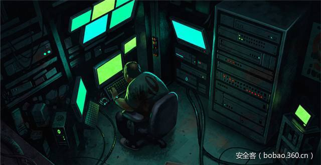

# 【木马分析】谍影追踪：全球首例UEFI_BIOS木马分析

                                阅读量   
                                **147632**
                            
                        |
                        
                                                                                    

****

**0x00 简介 **

不久前，广州网友李先生向360安全中心求助，反映他的电脑系统自动创建名为aaaabbbb的陌生账号，杀毒软件反复报毒，即使重装系统仍然无法清除病毒。

 经过360工程师远程协助的初步判断，李先生电脑主板BIOS很可能感染了恶意代码。为此，我们请李先生把主板邮寄到360公司北京总部进行分析，发现这是一种前所未见的新型BIOS BOOTKIT。由于它会在系统中设置间谍账号进行远程控制，我们将其命名为谍影木马。

 与以往的BIOS恶意代码相比，谍影木马具有更强的兼容性和更高的技术水平：

 一、全球首例感染UEFI主板的真实攻击。谍影木马支持的BIOS版本非常多，是目前已知的唯一能够感染UEFI主板的木马。谍影木马会感染UEFI兼容模式的BIOS引导模块，UEFI+GPT模式不受影响。在此前2011年出现的BMW BIOS木马（国外厂商命名为Mebromi），则仅支持感染特定的Award BIOS；

二、系统兼容性强，支持所有主流的32位和64位Windows平台，包括最新的64位Win10。

图：64位Win10感染谍影木马触发微软PATCH GUARD 导致反复蓝屏 

据了解，李先生是由网店购买的此二手主板。根据网络搜索谍影木马的中招现象，李先生的遭遇也并非个例。从现有样本推测，恶意代码可能是由编程器刷入主板BIOS，通过电商渠道贩卖流通。

鉴于主板结构的复杂性和特殊性，现阶段只有重刷BIOS才能够彻底清除谍影木马。以下是对谍影木马技术原理的详细分析。

 

**0x01 BIOS与UEFI**

BIOS是英文"Basic Input Output System"的缩略词，直译过来后中文名称就是"基本输入输出系统"。其实，它是一组固化到计算机内主板上一个ROM芯片上的程序，它保存着计算机最重要的基本输入输出的程序、系统设置信息、开机后自检程序和系统自启动程序。优先于操作系统执行，负责加载执行MBR代码，其主要功能是为计算机提供最底层的、最直接的硬件设置和控制。

UEFI（Unified Extensible Firmware Interface）全称“统一的可扩展固件接口”，是一种新的主板引导项，正被看成是有近20多年历史的BIOS 的继任者，自Win8以来得到了微软的力推。UEFI号称通过保护预启动或预引导进程，可以抵御Bootkit攻击，相比BIOS具有更高的安全性。

 

**0x02技术分析**

**2.1  CSM模块分析 **

木马位于BIOS文件中 ，主板为ASUS 华硕的 B85M-G-ASUS-0904。和正常的BIOS不同之处，在于木马主板的CSMCORE模块比正常的要大。应该只能在LEGACY MODE下有效，而通过UEFI启动的应该无效。（CSM（Compatibility support Module）表示兼容模块，该选项专为兼容只能在legacy模式下工作的设备以及不支持或不能完全支持UEFI的操作系统而设置。）

木马在该BIOS模块中，加入了自己的功能，挂钩系统了正常函数来执行。

正常的函数如下：

木马挂钩了该函数改为：

将原有函数的第一条指令改为CALL，从而获得执行机会：

之后其会判断R9寄存器所指内容是否为3，可能是BIOS初始化成功的一个标志，然后搜索BIOS内部特征码CD 19 B8 00 80 CB 00

应该是 BIOS内部初始化后，调用中断INT19H 实现加载硬盘第一个扇区MBR执行的代码。然后修改0X413处的数据，预留40KB空间，用来存放木马代码，并将BIOS内的代码拷贝到该预留空间。并将前面找到的BIOS内部初始化后，调用中断INT19H 实现加载硬盘第一个扇区MBR执行的代码，改为调用木马自身的代码。

**2.2  INT15挂钩分析**

然后，返回继续执行，当执行到BIOS初始化好，准备加载磁盘MBR代码的时候，就会执行木马的代码。木马这时候会挂接INT15H中断，然后恢复执行原来的代码，这样就完成了挂钩，后续就和暗云系列的MBR木马相似，通过挂钩INT15H来一步一步的挂钩内存，加载自身。

这样，当系统MBR获得执行的时候，木马已经在内存中挂好了INT15h的HOOK,之后，会HOOK  bootmgr!Archx86TransferTo64BitApplicationAsm获得下次执行机会，然后再HOOK winload!OslArchTransferToKernel,，然后等内核加载时候会HOOK ZwCreateSection，从而切入到内核运行，然后会设置线程回调。

**2.3  线程回调挂钩**

接下来会设置线程回调 PsSetCreateThreadNotifyRoutine

和进程回调PsSetCreateProcessNotifyRoutine，进程回调中只打印了下"Process %d Create %dn"，线程回调才是关键内容。

 

线程回调中木马判断是否为csrss.exe进程，如果不是则跳过，如果是就创建一个系统线程，

并且插入一个工作线程，将自身的线程回调抹去。

**2.4  内核线程网络下载代码**

在创建的系统线程内会先等待1分钟大概是为了等网络准备好。

然后会尝试使用两种方式去下载恶意Code到内核执行，

优先尝试UDP  DownLoadShellCodeByUDP，函数为解析 [www.XXXX.top](http://www.erda158.top/) 域名。

使用0xDEDE43D0 0x8080808，两组DNS域名转化过来，即（222.222.67.208   8.8.8.8）

与[www.XXXXtop](http://www.erda158.top/) 通信端口为0x801F即8064号端口。

优先使用0x3500即53号端口请求域名服务，拿到 [www.XXXX.top](http://www.erda158.top/) 域名对应地址。

先请求服务器，询问Shellcode 长度分片大小，然后一个一个分片处理，最后拼接一起。

发送数据包为，长度为0x10。

接受数据包为：

总长度为0x28，头部长度为0x10，数据部分长度为0x18，校验和为0xd845672a。

Shellcode长度为0x1a32d，总共有 0xd2个分片，每个分片大小为 0x200。

在使用UDP方式收发数据时候会对数据部分进行校验。

校验成功才拼接在一起，否则丢弃，然后再申请非分页内存。

将之前的内存代码拷贝执行，将NT基地址作为参数传入。

**2.5 解密恶意代码和投递APC**

下载下来的代码仅头部可以执行，后面部分为加密数据，需要解密执行。 

调用函数为RtlDecompressBuffer，解密后大小为150728，解密方式为 COMPRESSION_FORMAT_LZNT1。

接着会调用填充导入表：

然后调用PsCreateSystemThread创建注入线程。

线程中：

优先查找系统进程注入找到的是spoolsv.exe。

然后再是杀软进程：

申请内存拷贝注入：

插APC注入：

**2.6  执行用户层恶意下载代码**

注入后从应用层执行，代码中包含一个DLL文件，执行函数为申请内存基地址。

然后获取Kernel32 模块基地址，跟 LoadLibraryA  GetProcAddress VirtualAlloc，

填充内存中PE文件导入表，填充完成后执行DllMain函数。

会在DllMain中创建线程，执行下载并且运行，根据控制码暂停或者删除相关服务。

线程函数：

提权操作解密下下载地址数据。解密后内容为：

根据控制码暂停或者删除服务：

然后分三种方式运行： (DLL加载，父进程注入，直接创建EXE运行)

**2.7  创建恶意账号**

这里下载下来的是一个EXE，主要功能就是创建了一个管理员账号。

截图：

**0x03结束语**

谍影木马可寄生在包括UEFI主板在内的多种版本BIOS里，非常精细地针对性感染BIOS引导模块，通杀Windows全平台实施远程控制，呈现出高危害、高复杂度和高技术水平的“三高”特点。

为了预防谍影木马，360安全中心建议网友：尽量选择官方渠道购买电脑配件，并开启安全软件实时防护。如果遇到电脑开机登陆界面缓慢、系统出现陌生账号、安全软件反复报毒等可疑情况，最好向安全厂商求助，以防木马病毒对个人数据和财产造成损失。

