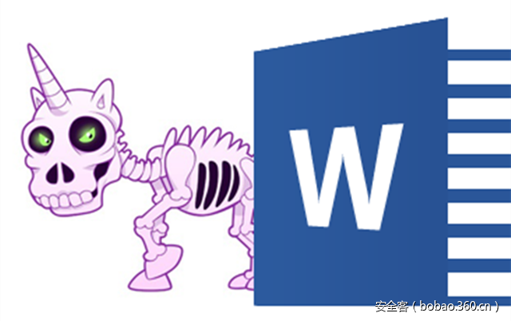

# 【木马分析】针对Mac OS X和Windows两大系统的恶意word文档分析（一）


                                阅读量   
                                **128376**
                            
                        |
                        
                                                                                                                                    
                                                                                            


##### 译文声明

本文是翻译文章，文章原作者，文章来源：blog.fortinet.com
                                <br>原文地址：[http://blog.fortinet.com/2017/03/22/microsoft-word-file-spreads-malware-targeting-both-apple-mac-os-x-and-microsoft-windows](http://blog.fortinet.com/2017/03/22/microsoft-word-file-spreads-malware-targeting-both-apple-mac-os-x-and-microsoft-windows)

译文仅供参考，具体内容表达以及含义原文为准

****

[](./img/85794/t0106acaf0d752c605f.png)

翻译：[啦咔呢](http://bobao.360.cn/member/contribute?uid=79699134)

稿费：140RMB

投稿方式：发送邮件至linwei#360.cn，或登陆网页版在线投稿

**<br>**

****

传送门

[](http://bobao.360.cn/learning/detail/3663.html)

[【木马分析】针对Mac OS X和Windows两大系统的恶意word文档分析（二）](http://bobao.360.cn/learning/detail/3699.html)

**<br>**

**前言**

3月16日，FortiGuard实验室捕获了一个新的Word文件，它可以通过执行恶意VBA（Visual Basic for Applications）代码来传播恶意软件。该样本的目标是针对苹果 Mac OS X和微软 Windows系统。随后我们分析该样本，在本文中，将会逐步解释它的工作原理。

当Word文件打开时，它显示一个通知受害者启用宏的安全选项，这将会允许执行恶意的VBA代码。

<br>

**恶意Word文件被打开**

[](https://p4.ssl.qhimg.com/t01474aa72182c00712.jpg)

图1.要求受害者启用宏安全选项

恶意VBA代码一旦被执行，AutoOpen()函数就会被自动调用。它首先做的是从Word文件的“注释”属性中读取数据。

[](https://p0.ssl.qhimg.com/t0184dafcd2c266e204.jpg)

图2. Word文件的“注释”属性

“注释”的值是一个base64编码，可以通过以下VBA代码读出和解码：

[](https://p0.ssl.qhimg.com/t01d44371219d1e68cf.jpg)

在base64解码之后，我们可以获得明文代码，可以看出是一个python脚本，如下所示。

[](https://p4.ssl.qhimg.com/t014c0ec80cfcf34a1a.jpg)

接下来，代码将根据操作系统类型（苹果Mac OS或微软Windows）执行不同的路由，这点你可以在图3的流程图中看到。

[](https://p3.ssl.qhimg.com/t01b962a457ff7bbbf8.jpg)

图3.根据OS类型调用不同的路由

我们发现这个恶意的VBA代码是在使用metasploit框架获取的代码基础上进行了略微修改，你可以在[https//github.com/rapid7/metasploit-framework/blob/master/external/source/exploits/office_word_macro/macro.vba](https//github.com/rapid7/metasploit-framework/blob/master/external/source/exploits/office_word_macro/macro.vba)   中找到它们。 

<br>

**在苹果Mac OS X中如何工作**

你可能知道，Mac OS X附带了苹果预装的Python环境，这允许它默认执行python脚本。如上所述，base64解码的python脚本被传递到将在函数底部执行的ExecuteForOSX函数上（参见图3）。 

python脚本比较简单，它从base64编码的字符串中提取代码并执行。如下，你可以看到它被解码后的情况，这是一个很清晰的python脚本。

[](https://p0.ssl.qhimg.com/t01819cc2fe7abd224b.jpg)

当执行python脚本时，它会从“hxxps://sushi.vvlxpress.com:443/HA1QE”下载一个文件，并执行它。下载的python脚本是 Python meterpreter文件稍微修改后的版本，它也是Metasploit框架的一部分。项目的源代码可以从以下URL下载：[https://github.com/rapid7/metasploit-payloads/blob/master/python/meterpreter/meterpreter.py](https://github.com/rapid7/metasploit-payloads/blob/master/python/meterpreter/meterpreter.py)  。

下载的文件（HA1QE）和原始文件之间的主要变化如下：

[](https://p2.ssl.qhimg.com/t01c21ee5a8e7417ae4.jpg)

图4. HA1QE和meterpreter.py之间的差异

HTTP_CONNECTION_URL常量（hxxps://sushi.vvlxpress.com:443/TtxCTzF1Q2gqND8gcvg-cwGEk5tPhorXkzS0gXv9-zFqsvVHxi-1804lm2zGUE31cs/）被设置为脚本将要连接的Metasploit目标端点。

PAYLOAD_UUID常量用作客户端的标识符，我们认为这些常量也被攻击者用于活动跟踪。

脚本一旦执行后，便会尝试连接到主机“sushi.vvlxpress.com” 的 443端口上。但是在分析过程中发出请求时，服务器没有回答客户端请求。

[](https://p3.ssl.qhimg.com/t0114fb1d06f1f7a691.jpg)

图5. Wireshark显示连接到服务器时TCP重传错误

在尝试连接到可到达的服务器时，python进程在系统上保持活动状态。

[](https://p2.ssl.qhimg.com/t01c79fd2c4b536777c.jpg)

图6.尝试连接到服务器的Python脚本

<br>

**在微软Windows中如何工作**

尽管ExecuteForWindows函数的参数与ExecuteForOSX函数相同，但代码并没有使用它。取而代之，使用cmd.exe通过DOS样式的命令字符串来启动。当命令执行时，powershell.exe被静默（-w隐藏窗口）启动，并且它执行base64编码的代码（-e base64编码的代码。）更多的详细信息，请参阅以下屏幕截图。

[](https://p3.ssl.qhimg.com/t010449eddd9050d4d1.jpg)

图7. Dos样式命令

依旧是base64，这个恶意软件的作者喜欢使用base64对敏感代码进行编码。我们将在其余的分析中看到更多的base64编码数据。

解码base64编码的数据，我们得到以下powershell脚本：

[](https://p1.ssl.qhimg.com/t01baeba96a28e7832a.jpg)

上述PowerShell脚本的主要工作是解压缩一段基于base64编码的gzip数据，以获取另一个PowerShell脚本（通过调用FromBase64String（）和GzipStream（））并执行它（通过调用Start（$ s））。

接下来，我们继续看看解压缩的powershell代码。为了更好理解，我修改了一些函数和变量名。

以下是代码段：

[](https://p5.ssl.qhimg.com/t011dfc0e6297b4437a.jpg)

从上面的PowerShell代码，我们可以看到它首先解码了base64编码的数据。实际上，这是随后要执行的64位二进制代码。然后，它在当前进程（powershell.exe）中分配了一个缓冲区，并通过调用VirtualAlloc和拷贝函数将64位代码复制到缓冲区中。最后，它调用CreateThread函数，其线程函数指向新缓冲区。这意味着64位代码是线程函数并可以被执行。根据我们的分析，这个恶意软件只影响64位Windows。

[](https://p5.ssl.qhimg.com/t01c6143ab6fb7fe2bb.jpg)

图8. 64位ASM代码

我们分析了IDA Pro中的64位代码，如上图所示。一旦启动，它将从“hxxps：//pizza.vvlxpress.com：443 / kH-G5”下载文件到新分配的缓冲区中。下载的文件实际上是一个64位的DLL文件。在线程函数完成之前，它的堆栈返回地址被设置为下载的64位DLL缓冲区地址。这意味着64位DLL在线程函数返回时被执行。

接下来，我们看到DLL可以与其服务器通信，例如“hxxps：// pizza.vvlxpress.com:443/5MTb8oL0ZTfWeNd6jrRhOA1uf-yhSGVG-wS4aJuLawN7dWsXayutfdgjFmFG9zbExdluaHaLvLjjeB02jkts1pq2bR/”。我们可以在调试器中看到它，如下所示。

[](https://p5.ssl.qhimg.com/t019eb30e3cc01cc585.jpg)

图9.与其服务器的通信

在这一点上，我们仍在努力分析下载的DLL，并尝试从中收集更多信息。我们稍后会分享有关此恶意软件的更多详细信息，因为我们发现了更多有趣的细节。

<br>

**缓解措施**

原始Word样本文件已被FortiGuard 反病毒服务检出为“WM/Agent.7F67!tr”。

<br>

**IoCs**

URL:


```
hxxps://sushi.vvlxpress.com:443/HA1QE
hxxps://pizza.vvlxpress.com:443/kH-G5
hxxps://pizza.vvlxpress.com:443/5MTb8oL0ZTfWeNd6jrRhOA1uf-yhSGVG-wS4aJuLawN7dWsXayutfdgjFmFG9zbExdluaHaLvLjjeB02jkts1pq2bR/
hxxps://sushi.vvlxpress.com:443/TtxCTzF1Q2gqND8gcvg-cwGEk5tPhorXkzS0gXv9-zFqsvVHxi-1804lm2zGUE31cs/
```

样本SHA256:


```
Sample.doc      06A134A63CCAE0F5654C15601D818EF44FBA578D0FDF325CADFA9B089CF48A74
HA1QE.py         3A0924D55FB3BF3C5F40ADCE0BD281D75E62D0A52D8ADFA05F2084BA37D212C8
kH-G5.dll          C36021A2D80077C2118628ED6DB330FEF57D76810FF447EF80D2AB35B95099BC
```
