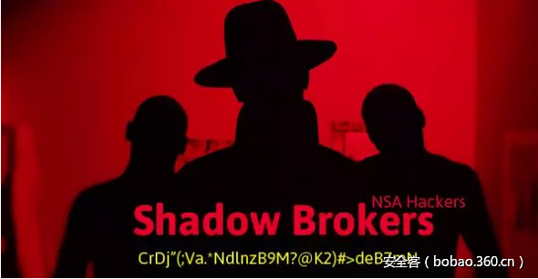

# 【漏洞分析】MS 17-010：NSA Eternalblue SMB 漏洞分析


                                阅读量   
                                **384862**
                            
                        |
                        
                                                                                    


**[](./img/85904/t010c3c599c5bc305ea.png)**

**环境**

**EXPLOIT:**

Eternalblue-2.2.0.exe

**TARGET:**

win7 sp1 32bits

srv.sys 6.1.7601.17514

srvnet.sys 6.1.7601.17514

**PATCH:**

MS17-010

<br>

**漏洞原理**

srv.sys在处理SrvOs2FeaListSizeToNt的时候逻辑不正确导致越界拷贝。我们首先看下漏洞的触发点：


```
unsigned int __fastcall SrvOs2FeaToNt(int a1, int a2)
{
  int v4; // edi@1
  _BYTE *v5; // edi@1
  unsigned int result; // eax@1
  v4 = a1 + 8;
  *(_BYTE *)(a1 + 4) = *(_BYTE *)a2;
  *(_BYTE *)(a1 + 5) = *(_BYTE *)(a2 + 1);
  *(_WORD *)(a1 + 6) = *(_WORD *)(a2 + 2);
  _memmove((void *)(a1 + 8), (const void *)(a2 + 4), *(_BYTE *)(a2 + 1));
  v5 = (_BYTE *)(*(_BYTE *)(a1 + 5) + v4);
  *v5++ = 0;
  _memmove(v5, (const void *)(a2 + 5 + *(_BYTE *)(a1 + 5)), *(_WORD *)(a1 + 6)); //这里产生的越界覆盖
  result = (unsigned int)&amp;v5[*(_WORD *)(a1 + 6) + 3] &amp; 0xFFFFFFFC;
  *(_DWORD *)a1 = result - a1;
  return result;
}
```

发生越界的地方见上面第二个memmove。调试的时候可以这样下断点：


```
kd&gt; u srv!SrvOs2FeaToNt+0x4d
srv!SrvOs2FeaToNt+0x4d:
9877b278 ff15e0a07698    call    dword ptr [srv!_imp__memmove (9876a0e0)]
9877b27e 0fb74606        movzx   eax,word ptr [esi+6]
9877b282 8d441803        lea     eax,[eax+ebx+3]
9877b286 83e0fc          and     eax,0FFFFFFFCh
9877b289 83c418          add     esp,18h
9877b28c 8bc8            mov     ecx,eax
9877b28e 2bce            sub     ecx,esi
9877b290 5f              pop     edi
//最后一次越界的拷贝的长度是0xa8
ba e1 srv!SrvOs2FeaToNt+0x4d ".if(poi(esp+8) != a8){gc} .else {}"
```

这么设断点的原因是最后一次越界的拷贝的长度是0xa8,断下来后可以发现：


```
kd&gt; dd esp
99803b38  88c8dff9 a3fc203a 000000a8 88c8dff8
99803b48  a3fc2039 00000000 a3fb20d8 a3fc2035
99803b58  a3fd2030 99803b7c 9877b603 88c8dff0
99803b68  a3fc2035 88307360 a3fb20b4 a3fb2008
99803b78  a3fc2035 99803bb4 98794602 88c8dff0
99803b88  99803bbc 99803ba8 99803bac 88307360
99803b98  a3fb2008 00000002 a3fb20b4 a3fb20d8
99803ba8  00010fe8 00000000 00000000 99803c00
kd&gt; !pool 88c8dff9 
Pool page 88c8dff9 region is Nonpaged pool
*88c7d000 : large page allocation, tag is LSdb, size is 0x11000 bytes
        Pooltag LSdb : SMB1 data buffer, Binary : srv.sys
kd&gt; !pool 88c8e009 
Pool page 88c8e009 region is Nonpaged pool
 88c8e000 size:    8 previous size:    0  (Free)       ....
88c8e008 doesn't look like a valid small pool allocation, checking to see
if the entire page is actually part of a large page allocation...
*88c8e000 : large page allocation, tag is LSbf, size is 0x11000 bytes
        Pooltag LSbf : SMB1 buffer descriptor or srvnet allocation, Binary : srvnet.sys
kd&gt; ? 88c7d000 +11000
Evaluate expression: -2000101376 = 88c8e000
kd&gt; ? 88c8dff9 +a8
Evaluate expression: -2000101215 = 88c8e0a1 //这里明显越界了。
```

我们可以从上面的调试记录看到明显的越写拷贝操作。可以看到被覆盖的是SMB1的buffer是有srvnet.sys分配的。这里exploit精心布局好的，是通过pool喷射的将两个pool连接在一起的。覆盖后面的这个pool有啥用后面会提到。

有同学会说”这只是现象,漏洞真正的成因在哪里呢？”。往下看：


```
unsigned int __fastcall SrvOs2FeaListSizeToNt(int pOs2Fea)
{
  unsigned int v1; // edi@1
  int Length; // ebx@1
  int pBody; // esi@1
  unsigned int v4; // ebx@1
  int v5; // ecx@3
  int v8; // [sp+10h] [bp-8h]@3
  unsigned int v9; // [sp+14h] [bp-4h]@1
  v1 = 0;
  Length = *(_DWORD *)pOs2Fea;
  pBody = pOs2Fea + 4;
  v9 = 0;
  v4 = pOs2Fea + Length;
  while ( pBody &lt; v4 )
  {
    if ( pBody + 4 &gt;= v4
      || (v5 = *(_BYTE *)(pBody + 1) + *(_WORD *)(pBody + 2),
          v8 = *(_BYTE *)(pBody + 1) + *(_WORD *)(pBody + 2),
          v5 + pBody + 5 &gt; v4) )
    {
      //
      // 注意这里修改了Os2Fea的Length，自动适应大小
      // 初始值是0x10000,最终变成了0x1ff5d
      //
      *(_WORD *)pOs2Fea = pBody - pOs2Fea;
      return v1;
    }
    if ( RtlULongAdd(v1, (v5 + 0xC) &amp; 0xFFFFFFFC, &amp;v9) &lt; 0 )
      return 0;
    v1 = v9;
    pBody += v8 + 5;
  }
  return v1;
}
unsigned int __fastcall SrvOs2FeaListToNt(int pOs2Fea, int *pArgNtFea, int *a3, _WORD *a4)
{
  __int16 v5; // bx@1
  unsigned int Size; // eax@1
  NTFEA *pNtFea; // ecx@3
  int pOs2FeaBody; // esi@9
  int v10; // edx@9
  unsigned int v11; // esi@14
  int v12; // [sp+Ch] [bp-Ch]@11
  unsigned int v14; // [sp+20h] [bp+8h]@9
  v5 = 0;
  Size = SrvOs2FeaListSizeToNt(pOs2Fea);
  *a3 = Size;
  if ( !Size )
  {
    *a4 = 0;
    return 0xC098F0FF;
  }
  pNtFea = (NTFEA *)SrvAllocateNonPagedPool(Size, 0x15);
  *pArgNtFea = (int)pNtFea;
  if ( pNtFea )
  {
    pOs2FeaBody = pOs2Fea + 4;
    v10 = (int)pNtFea;
    v14 = pOs2Fea + *(_DWORD *)pOs2Fea - 5;
    if ( pOs2Fea + 4 &gt; v14 )
    {
LABEL_13:
      if ( pOs2FeaBody == pOs2Fea + *(_DWORD *)pOs2Fea )
      {
        *(_DWORD *)v10 = 0;
        return 0;
      }
      v11 = 0xC0000001;
      *a4 = v5 - pOs2Fea;
    }
    else
    {
      while ( !(*(_BYTE *)pOs2FeaBody &amp; 0x7F) )
      {
        v12 = (int)pNtFea;
        v5 = pOs2FeaBody;
        pNtFea = (NTFEA *)SrvOs2FeaToNt(pNtFea, pOs2FeaBody);
        pOs2FeaBody += *(_BYTE *)(pOs2FeaBody + 1) + *(_WORD *)(pOs2FeaBody + 2) + 5;
        //
        // 由于SrvOs2FeaListSizeToNt将pOs2Fea的Length改大了。
        // 而且变得大了不少，所以这里的判读就没有什么意义了。最终导致越界的产生。
        //
        if ( pOs2FeaBody &gt; v14 )
        {
          v10 = v12;
          goto LABEL_13;
        }
      }
      *a4 = pOs2FeaBody - pOs2Fea;
      v11 = 0xC000000D;
    }
    SrvFreeNonPagedPool(*pArgNtFea);
    return v11;
  }
  if ( BYTE1(WPP_GLOBAL_Control-&gt;Flags) &gt;= 2u &amp;&amp; WPP_GLOBAL_Control-&gt;Characteristics &amp; 1 &amp;&amp; KeGetCurrentIrql() &lt; 2u )
  {
    _DbgPrint("SrvOs2FeaListToNt: Unable to allocate %d bytes from nonpaged pool.", *a3, 0);
    _DbgPrint("n");
  }
  return 0xC0000205;
}
```

首先SrvOs2FeaListToNt首先调用SrvOs2FeaListSizeToNt计算pNtFea的大小。这里注意了SrvOs2FeaListSizeToNt函数会修改原始的pOs2Fea中的Length大小,然后以计算出来的Length来分配pNtFea.最后调用SrvOs2FeaToNt来实现转换。SrvOs2FeaToNt后面的判断就有问题了。这里还不止一个问题。

1. 转换完成后，增加pOs2FeaBody然后比较。正确的逻辑难道不应该是先判断再转换吗？

2. 由于SrvOs2FeaListSizeToNt中改变了pOs2Fea的length的值，这里使用变大后的值做比较，肯定会越界。

为了方便同学们调试，我把代码扣出来了。大家可以在环3围观下这段代码。


```
#include &lt;windows.h&gt;
signed int RtlULongAdd(unsigned int a1, int a2, unsigned int *a3)
{
    unsigned int v3; // edx@1
    signed int result; // eax@2
    v3 = a1 + a2;
    if (v3 &lt; a1)
    {
        *a3 = -1;
        result = -1073741675;
    } else
    {
        *a3 = v3;
        result = 0;
    }
    return result;
}
unsigned int SrvOs2FeaListSizeToNt(PUCHAR pOs2Fea)
{
    unsigned int v1; // edi@1
    int Length; // ebx@1
    PUCHAR pBody; // esi@1
    PUCHAR v4; // ebx@1
    int v5; // ecx@3
    int v8; // [sp+10h] [bp-8h]@3
    unsigned int v9; // [sp+14h] [bp-4h]@1
    v1 = 0;
    Length = *(DWORD*)pOs2Fea;
    pBody = pOs2Fea + 4;
    v9 = 0;
    v4 = pOs2Fea + Length;
    while (pBody &lt; v4)
    {
        if (pBody + 4 &gt;= v4
            || (v5 = *(BYTE *)(pBody + 1) + *(WORD *)(pBody + 2),
                v8 = *(BYTE *)(pBody + 1) + *(WORD *)(pBody + 2),
                v5 + pBody + 5 &gt; v4))
        {
            *(WORD *)pOs2Fea = pBody - pOs2Fea;
            return v1;
        }
        if (RtlULongAdd(v1, (v5 + 0xC) &amp; 0xFFFFFFFC, &amp;v9) &lt; 0)
            return 0;
        v1 = v9;
        pBody += v8 + 5;
    }
    return v1;
}
PUCHAR gpBuffer = NULL;
ULONG guSize = 0;
PUCHAR SrvOs2FeaToNt(PUCHAR pNtFea, PUCHAR pOs2FeaBody)
{
    PUCHAR pBody; // edi@1
    BYTE *pNtBodyStart; // edi@1
    PUCHAR result; // eax@1
    pBody = pNtFea + 8;
    *(BYTE *)(pNtFea + 4) = *(BYTE *)pOs2FeaBody;
    *(BYTE *)(pNtFea + 5) = *(BYTE *)(pOs2FeaBody + 1);
    *(WORD *)(pNtFea + 6) = *(WORD *)(pOs2FeaBody + 2);
    memcpy((void *)(pNtFea + 8), (const void *)(pOs2FeaBody + 4), *(BYTE *)(pOs2FeaBody + 1));
    pNtBodyStart = (BYTE *)(*(BYTE *)(pNtFea + 5) + pBody);
    *pNtBodyStart++ = 0;
    if ((pNtBodyStart + *(WORD *)(pNtFea + 6)) &gt; (gpBuffer + guSize)){
        __debugbreak();
    }
    memcpy(pNtBodyStart, (const void *)(pOs2FeaBody + 5 + *(BYTE *)(pNtFea + 5)), *(WORD *)(pNtFea + 6));
    result = (PUCHAR)((ULONG_PTR)&amp;pNtBodyStart[*(WORD *)(pNtFea + 6) + 3] &amp; 0xFFFFFFFC);
    *(DWORD *)pNtFea = result - pNtFea;
    static int j = 0;
    printf("j=%dn", j++);
    return result;
}
int main()
{
    FILE* pFile = fopen("1.bin", "r+b");
    fseek(pFile, 0, SEEK_END);
    ULONG uSize = (ULONG)ftell(pFile);
    fseek(pFile, 0, SEEK_SET);
    PUCHAR pOs2Fea = (PUCHAR)malloc(uSize);
    fread(pOs2Fea, 1, uSize, pFile);
    fclose(pFile);
    ULONG uFixSize = SrvOs2FeaListSizeToNt(pOs2Fea);
    PUCHAR pOs2FeaBody;
    PUCHAR  pNtFea = (PUCHAR)malloc(uFixSize);
    PUCHAR v10;
    PUCHAR v14;
    PUCHAR v12;
    PUCHAR v5;
    LONG v11;
    PUCHAR  pNtFeaEnd = pNtFea + uFixSize;
    gpBuffer = pNtFea;
    guSize = uFixSize;
    if (pNtFea)
    {
        pOs2FeaBody = pOs2Fea + 4;
        v10 = pNtFea;
        v14 = pOs2Fea + *(DWORD *)pOs2Fea - 5;
        if (pOs2Fea + 4 &gt; v14)
        {
        LABEL_13:
            if (pOs2FeaBody == pOs2Fea + *(DWORD *)pOs2Fea)
            {
                *(DWORD *)v10 = 0;
                return 0;
            }
            v11 = 0xC0000001;
            //*a4 = v5 - pOs2Fea;
        } else{
            while (!(*(BYTE *)pOs2FeaBody &amp; 0x7F))
            {
                v12 = pNtFea;
                v5 = pOs2FeaBody;
                pNtFea = SrvOs2FeaToNt(pNtFea, pOs2FeaBody);
                pOs2FeaBody += *(BYTE *)(pOs2FeaBody + 1) + *(WORD *)(pOs2FeaBody + 2) + 5;
                if (pOs2FeaBody &gt; v14)
                {
                    v10 = v12;
                    goto LABEL_13;
                }
            }
            //*a4 = pOs2FeaBody - pOs2Fea;
            v11 = 0xC000000D;
        }
        return v11;
    }
    return 0;
}
```

看到我加了个__debugbreak的地方，断在那里就说明溢出了

1.bin的内容最后我会给大家带上。

大家也可以自己抓1.bin的内容，方法如下：


```
kd&gt; u SrvOs2FeaListToNt
srv!SrvOs2FeaListToNt:
9877b565 8bff            mov     edi,edi
9877b567 55              push    ebp
9877b568 8bec            mov     ebp,esp
9877b56a 51              push    ecx
9877b56b 8365fc00        and     dword ptr [ebp-4],0
9877b56f 56              push    esi
9877b570 57              push    edi
9877b571 8b7d08          mov     edi,dword ptr [ebp+8]
9877b574 57              push    edi
9877b575 e82effffff      call    srv!SrvOs2FeaListSizeToNt (9877b4a8)
kd&gt; ba e1 9877b575
kd&gt; g
Breakpoint 0 hit
srv!SrvOs2FeaListToNt+0x10:
9877b575 e82effffff      call    srv!SrvOs2FeaListSizeToNt (9877b4a8)
kd&gt; !pool edi
Pool page a3fd10d8 region is Paged pool
*a3fd1000 : large page allocation, tag is LStr, size is 0x11000 bytes
        Pooltag LStr : SMB1 transaction, Binary : srv.sys
kd&gt; .writemem 1.bin a3fd10d8 l0x11000-d8
```


**漏洞利用**

我们先来看pool数据覆盖的情况。

覆盖前


```
8d1aa000 00 10 01 00 00 00 00 00 58 00 00 00 70  ........X...p
8d1aa00d 09 11 95 08 00 00 00 08 2f 1f 9f 08 2f  ......../.../
8d1aa01a 1f 9f 60 a1 1a 8d a0 0e 01 00 80 00 00  ..`..........
8d1aa027 00 3c a0 1a 8d 00 00 00 00 f7 ff 00 00  .............
8d1aa034 10 a0 1a 8d a4 a0 1a 8d 00 00 00 00 60  ............`
8d1aa041 00 04 10 00 00 00 00 60 a1 1a 8d 00 a0  .......`.....
8d1aa04e 1a 8d a0 0e 01 00 60 01 00 00 d5 8e 01  ......`......
8d1aa05b 00 d4 8e 01 00 13 8d 01 00 92 6f 00 00  ..........o..
8d1aa068 11 36 01 00 10 6a 00 00 4f 9a 03 00 8e  .6...j..O....
8d1aa075 4d 01 00 4d d6 00 00 0c 6f 00 00 4b 71  M..M....o..Kq
8d1aa082 00 00 8a 99 03 00 c9 6d 00 00 c8 70 00  .......m...p.
8d1aa08f 00 c7 69 00 00 86 35 01 00 05 94 03 00  ..i...5......
8d1aa09c 70 09 11 95 28 00 00 00 00 00 00 00 64  p...(.......d
8d1aa0a9 00 00 00 70 09 11 95 38 00 00 00 00 00  ...p...8.....
8d1aa0b6 00 00 a0 0e 01 00 ff 0f 00 00 28 a5 00  ..........(..
8d1aa0c3 00 70 09 11 95 30 a5 00 00 70 09 11 95  .p...0...p...
8d1aa0d0 38 a5 00 00 70 09 11 95 40 a5 00 00 70  8...p...@...p
8d1aa0dd 09 11 95 48 a5 00 00 70 09 11 95 50 a5  ...H...p...P.
8d1aa0ea 00 00 70 09 11 95 58 a5 00 00 70 09 11  ..p...X...p..
8d1aa0f7 95 f0 04 00 00 70 09 11 95 f8 04 00 00  .....p.......
8d1aa104 70 09 11 95 00 05 00 00 70 09 11 95 4e  p.......p...N
8d1aa111 4e 4e 4e 4e 4e 4e 4e 4e 4e 4e 4e 4e 4e  NNNNNNNNNNNNN
8d1aa11e 4e 4e 4e 4e 4e 4e 4e 4e 4e 4e 4e 4e 4e  NNNNNNNNNNNNN
8d1aa12b 4e 4e 4e 4e 4e 4e 4e 4e 4e 4e 4e 4e 4e  NNNNNNNNNNNNN
8d1aa138 4e 4e 4e 4e 4e 4e 4e 4e 4e 4e 4e 4e 4e  NNNNNNNNNNNNN
8d1aa145 4e 4e 4e 4e 4e 4e 4e 4e 4e 4e 4e 4e 4e  NNNNNNNNNNNNN
8d1aa152 4e 4e 4e 4e 4e 4e 4e 4e 4e 4e 4e 4e 4e  NNNNNNNNNNNNN
8d1aa15f 4e fe 53 4d 42 00 00 00 00 00 00 00 00  N.SMB........
```

覆盖后


```
8d1aa000 00 00 00 00 00 00 00 00 ff ff 00 00 00  .............
8d1aa00d 00 00 00 ff ff 00 00 00 00 00 00 00 00  .............
8d1aa01a 00 00 00 00 00 00 00 00 00 00 00 00 00  .............
8d1aa027 00 00 f1 df ff 00 00 00 00 00 00 00 00  .............
8d1aa034 20 f0 df ff 00 f1 df ff ff ff ff ff 60   ...........`
8d1aa041 00 04 10 00 00 00 00 80 ef df ff 00 00  .............
8d1aa04e 00 00 10 00 d0 ff ff ff ff ff 18 01 d0  .............
8d1aa05b ff ff ff ff ff 00 00 00 00 00 00 00 00  .............
8d1aa068 00 00 00 00 00 00 00 00 60 00 04 10 00  ........`....
8d1aa075 00 00 00 00 00 00 00 00 00 00 00 90 ff  .............
8d1aa082 cf ff ff ff ff ff 00 00 00 00 00 00 00  .............
8d1aa08f 00 80 10 00 00 00 00 00 00 00 00 00 00  .............
8d1aa09c 00 00 00 00 4b 00 00 00 00 00 00 00 64  ....K.......d
8d1aa0a9 00 00 00 70 09 11 95 38 00 00 00 00 00  ...p...8.....
8d1aa0b6 00 00 a0 0e 01 00 ff 0f 00 00 28 a5 00  ..........(..
8d1aa0c3 00 70 09 11 95 30 a5 00 00 70 09 11 95  .p...0...p...
8d1aa0d0 38 a5 00 00 70 09 11 95 40 a5 00 00 70  8...p...@...p
8d1aa0dd 09 11 95 48 a5 00 00 70 09 11 95 50 a5  ...H...p...P.
8d1aa0ea 00 00 70 09 11 95 58 a5 00 00 70 09 11  ..p...X...p..
8d1aa0f7 95 f0 04 00 00 70 09 11 95 f8 04 00 00  .....p.......
8d1aa104 70 09 11 95 00 05 00 00 70 09 11 95 4e  p.......p...N
8d1aa111 4e 4e 4e 4e 4e 4e 4e 4e 4e 4e 4e 4e 4e  NNNNNNNNNNNNN
8d1aa11e 4e 4e 4e 4e 4e 4e 4e 4e 4e 4e 4e 4e 4e  NNNNNNNNNNNNN
8d1aa12b 4e 4e 4e 4e 4e 4e 4e 4e 4e 4e 4e 4e 4e  NNNNNNNNNNNNN
8d1aa138 4e 4e 4e 4e 4e 4e 4e 4e 4e 4e 4e 4e 4e  NNNNNNNNNNNNN
8d1aa145 4e 4e 4e 4e 4e 4e 4e 4e 4e 4e 4e 4e 4e  NNNNNNNNNNNNN
8d1aa152 4e 4e 4e 4e 4e 4e 4e 4e 4e 4e 4e 4e 4e  NNNNNNNNNNNNN
8d1aa15f 4e fe 53 4d 42 00 00 00 00 00 00 00 00  N.SMB........
```

在将下面SrvNet分配的对象覆盖前面的a1字节后。由于被覆盖的pool里面存在用于接收数据的buffer的指针。像上面描述的0x8d1aa034(0xffd0f020)这个地方的指针（我发懒了没有去确定到底是哪一个）。srvnet在接收包的时候就会在固定0xffdff000这个地址存入客户端发送来的数据。

0xffdff0000这个地址是什么？wrk中有定义，如下：


```
// addressed from 0xffdf0000 - 0xffdfffff are reserved for the system
// begin_ntddk begin_ntosp
#define KI_USER_SHARED_DATA         0xffdf0000
#define SharedUserData  ((KUSER_SHARED_DATA * const) KI_USER_SHARED_DATA)
```

这块内存是系统预留的，里面保存了系统的一些信息，像时钟，版本，配置之类。注意这个地址在win10下是不可以执行的。所以这个利用方法在win10下是不可用的。

win7


```
kd&gt; !pte ffdff000
                    VA ffdff000
PDE at C0603FF0            PTE at C07FEFF8
contains 000000000018A063  contains 00000000001E3163
pfn 18a       ---DA--KWEV  pfn 1e3       -G-DA--KWEV  //E表示可执行
```

覆盖完之后是这样。


```
kd&amp;gt; db ffdff000 l1000
ffdff000  00 00 00 00 00 00 00 00-03 00 00 00 00 00 00 00  ................
ffdff010  00 00 00 00 00 00 00 00-00 00 00 00 00 00 00 00  ................
ffdff020  00 00 00 00 00 00 00 00-03 00 00 00 00 00 00 00  ................
ffdff030  00 00 00 00 00 00 00 00-00 00 00 00 00 00 00 00  ................
ffdff040  00 00 00 00 00 00 00 00-00 00 00 00 00 00 00 00  ................
ffdff050  00 00 00 00 00 00 00 00-00 00 00 00 00 00 00 00  ................
ffdff060  00 00 00 00 00 00 00 00-00 00 00 00 00 00 00 00  ................
ffdff070  00 00 00 00 00 00 00 00-00 00 00 00 00 00 00 00  ................
ffdff080  00 00 00 00 00 00 00 00-00 00 00 00 00 00 00 00  ................
ffdff090  00 00 00 00 00 00 00 00-00 00 00 00 00 00 00 00  ................
ffdff0a0  b0 00 d0 ff ff ff ff ff-b0 00 d0 ff ff ff ff ff  ................
ffdff0b0  00 00 00 00 00 00 00 00-00 00 00 00 00 00 00 00  ................
ffdff0c0  c0 f0 df ff c0 f0 df ff-00 00 00 00 00 00 00 00  ................
ffdff0d0  00 00 00 00 00 00 00 00-00 00 00 00 00 00 00 00  ................
ffdff0e0  00 00 00 00 00 00 00 00-00 00 00 00 00 00 00 00  ................
ffdff0f0  00 00 00 00 00 00 00 00-00 00 00 00 00 00 00 00  ................
ffdff100  00 00 00 00 00 00 00 00-00 00 00 00 00 00 00 00  ................
ffdff110  00 00 00 00 00 00 00 00-00 00 00 00 00 00 00 00  ................
ffdff120  00 00 00 00 00 00 00 00-00 00 00 00 00 00 00 00  ................
ffdff130  00 00 00 00 00 00 00 00-00 00 00 00 00 00 00 00  ................
ffdff140  00 00 00 00 00 00 00 00-00 00 00 00 00 00 00 00  ................
ffdff150  00 00 00 00 00 00 00 00-00 00 00 00 00 00 00 00  ................
ffdff160  00 00 00 00 00 00 00 00-00 00 00 00 00 00 00 00  ................
ffdff170  00 00 00 00 00 00 00 00-00 00 00 00 00 00 00 00  ................
ffdff180  00 00 00 00 00 00 00 00-00 00 00 00 90 f1 df ff  ................
ffdff190  00 00 00 00 f0 f1 df ff-00 00 00 00 00 00 00 00  ................
ffdff1a0  00 00 00 00 00 00 00 00-00 00 00 00 00 00 00 00  ................
ffdff1b0  00 00 00 00 00 00 00 00-00 00 00 00 00 00 00 00  ................
ffdff1c0  00 00 00 00 00 00 00 00-00 00 00 00 00 00 00 00  ................
ffdff1d0  00 00 00 00 00 00 00 00-f0 01 d0 ff ff ff ff ff  ................
ffdff1e0  00 00 00 00 00 00 00 00-00 02 d0 ff ff ff ff ff  ................
ffdff1f0  00 31 c0 40 90 74 08 e8-09 00 00 00 c2 24 00 e8  .1.@.t.......$..
ffdff200  a7 00 00 00 c3 e8 01 00-00 00 eb 90 5b b9 76 01  ............[.v.
ffdff210  00 00 0f 32 a3 fc ff df-ff 8d 43 17 31 d2 0f 30  ...2......C.1..0
ffdff220  c3 b9 23 00 00 00 6a 30-0f a1 8e d9 8e c1 64 8b  ..#...j0......d.
ffdff230  0d 40 00 00 00 8b 61 04-ff 35 fc ff df ff 60 9c  .@....a..5....`.
ffdff240  6a 23 52 9c 6a 02 83 c2-08 9d 80 4c 24 01 02 6a  j#R.j......L$..j
ffdff250  1b ff 35 04 03 df ff 6a-00 55 53 56 57 64 8b 1d  ..5....j.USVWd..
ffdff260  1c 00 00 00 6a 3b 8b b3-24 01 00 00 ff 33 31 c0  ....j;..$....31.
ffdff270  48 89 03 8b 6e 28 6a 01-83 ec 48 81 ed 9c 02 00  H...n(j...H.....
ffdff280  00 a1 fc ff df ff b9 76-01 00 00 31 d2 0f 30 fb  .......v...1..0.
ffdff290  e8 11 00 00 00 fa 64 8b-0d 40 00 00 00 8b 61 04  ......d..@....a.
ffdff2a0  83 ec 28 9d 61 c3 e9 ef-00 00 00 b9 82 00 00 c0  ..(.a...........
ffdff2b0  0f 32 48 bb f8 0f d0 ff-ff ff ff ff 89 53 04 89  .2H..........S..
ffdff2c0  03 48 8d 05 0a 00 00 00-48 89 c2 48 c1 ea 20 0f  .H......H..H.. .
```

0xffdff1f1处为shellcode.最后在接收完成后，最终调到srvnet!SrvNetWskReceiveComplete.在这个函数中会调用最终的shellcode。可以这么下断点:


```
srvnet!SrvNetWskReceiveComplete:
986e9569 8bff            mov     edi,edi
986e956b 55              push    ebp
986e956c 8bec            mov     ebp,esp
986e956e 8b450c          mov     eax,dword ptr [ebp+0Ch]
986e9571 8b4818          mov     ecx,dword ptr [eax+18h]
986e9574 53              push    ebx
986e9575 8b581c          mov     ebx,dword ptr [eax+1Ch]
986e9578 56              push    esi
986e9579 8b7510          mov     esi,dword ptr [ebp+10h]
986e957c 57              push    edi
986e957d 8b7e24          mov     edi,dword ptr [esi+24h]
986e9580 50              push    eax
986e9581 894d0c          mov     dword ptr [ebp+0Ch],ecx
986e9584 c6451300        mov     byte ptr [ebp+13h],0
986e9588 ff1518106f98    call    dword ptr [srvnet!_imp__IoFreeIrp (986f1018)]
986e958e 33c0            xor     eax,eax
986e9590 39450c          cmp     dword ptr [ebp+0Ch],eax
986e9593 7553            jne     srvnet!SrvNetWskReceiveComplete+0x7f (986e95e8)
kd&gt; .reload srvnet.sys
kd&gt; ba e1 srvnet!SrvNetWskReceiveComplete+0x13 ".if(poi(esi+0x24) == ffdff020) {} .else {gc}"
```

最终调用到shellcode的调用栈为：


```
# ChildEBP RetAddr  Args to Child              
WARNING: Frame IP not in any known module. Following frames may be wrong.
00 83f6c2e0 986ea290 00000000 00000000 00000420 0xffdff1f1
01 83f6c330 986e8204 ffdff020 00001068 00001068 srvnet!SrvNetCommonReceiveHandler+0x94 (FPO: [Non-Fpo])
02 83f6c370 986e95db ffdff020 00000001 870cb26b srvnet!SrvNetIndicateData+0x73 (FPO: [Non-Fpo])
03 83f6c38c 83ebaf83 00000000 02000000 019bd010 srvnet!SrvNetWskReceiveComplete+0x72 (FPO: [Non-Fpo])
04 83f6c3d0 8998db8c 865fd020 83f6c454 89661c8a nt!IopfCompleteRequest+0x128
05 83f6c3dc 89661c8a 870cb1f8 00000000 00001068 afd!WskProTLReceiveComplete+0x5e (FPO: [Non-Fpo])
06 83f6c454 8964d839 865fd020 00000000 8841a608 tcpip!TcpCompleteClientReceiveRequest+0x1c (FPO: [Non-Fpo])
07 83f6c4c0 8964d8be 8841a608 8841a700 00000000 tcpip!TcpFlushTcbDelivery+0x1f6 (FPO: [Non-Fpo])
08 83f6c4dc 8965af7f 8841a608 00000000 83f6c5d0 tcpip!TcpFlushRequestReceive+0x1c (FPO: [Non-Fpo])
09 83f6c518 8965ae47 8841a608 8841a608 83f6c5a8 tcpip!TcpDeliverFinToClient+0x37 (FPO: [Non-Fpo])
0a 83f6c528 896abfc1 8841a608 83f6c688 8841a608 tcpip!TcpAllowFin+0x86 (FPO: [Non-Fpo])
0b 83f6c5a8 896aa5a5 86f8c078 8841a608 83f6c5d0 tcpip!TcpTcbCarefulDatagram+0x16f2 (FPO: [Non-Fpo])
0c 83f6c614 8968da38 86f8c078 8841a608 00f6c688 tcpip!TcpTcbReceive+0x22d (FPO: [Non-Fpo])
0d 83f6c67c 8968e23a 8656b9b8 86f9657c 86f965f0 tcpip!TcpMatchReceive+0x237 (FPO: [Non-Fpo])
0e 83f6c6cc 8965dd90 86f8c078 86f9600c 00003d08 tcpip!TcpPreValidatedReceive+0x263 (FPO: [Non-Fpo])
0f 83f6c6e0 89693396 83f6c6fc 00000011 86f96008 tcpip!TcpNlClientReceivePreValidatedDatagrams+0x15 (FPO: [Non-Fpo])
10 83f6c704 896938dd 83f6c710 00000000 00000011 tcpip!IppDeliverPreValidatedListToProtocol+0x33 (FPO: [Non-Fpo])
11 83f6c7a0 89698a7b 8665d918 00000000 83f79480 tcpip!IpFlcReceivePreValidatedPackets+0x479 (FPO: [Non-Fpo])
12 83f6c7c8 83ecbb95 00000000 ee2bb116 865bab48 tcpip!FlReceiveNetBufferListChainCalloutRoutine+0xfc (FPO: [Non-Fpo])
13 83f6c830 89698c0b 8969897f 83f6c858 00000000 nt!KeExpandKernelStackAndCalloutEx+0x132
14 83f6c86c 8951f18d 8665d002 87773900 00000000 tcpip!FlReceiveNetBufferListChain+0x7c (FPO: [Non-Fpo])
15 83f6c8a4 8950d5be 8665eaa8 87773988 00000000 ndis!ndisMIndicateNetBufferListsToOpen+0x188 (FPO: [Non-Fpo])
16 83f6c8cc 8950d4b2 00000000 87773988 871650e0 ndis!ndisIndicateSortedNetBufferLists+0x4a (FPO: [Non-Fpo])
17 83f6ca48 894b8c1d 871650e0 00000000 00000000 ndis!ndisMDispatchReceiveNetBufferLists+0x129 (FPO: [Non-Fpo])
18 83f6ca64 8950d553 871650e0 87773988 00000000 ndis!ndisMTopReceiveNetBufferLists+0x2d (FPO: [Non-Fpo])
19 83f6ca8c 894b8c78 871650e0 87773988 00000000 ndis!ndisMIndicateReceiveNetBufferListsInternal+0x62 (FPO: [Non-Fpo])
1a 83f6cab4 903ab7f4 871650e0 87773988 00000000 ndis!NdisMIndicateReceiveNetBufferLists+0x52 (FPO: [Non-Fpo])
1b 83f6cafc 903aa77e 00000000 87792660 00000001 E1G60I32!RxProcessReceiveInterrupts+0x108 (FPO: [Non-Fpo])
1c 83f6cb14 8950d89a 011e9138 00000000 83f6cb40 E1G60I32!E1000HandleInterrupt+0x80 (FPO: [Non-Fpo])
1d 83f6cb50 894b8a0f 87792674 00792660 00000000 ndis!ndisMiniportDpc+0xe2 (FPO: [Non-Fpo])
1e 83f6cb78 83eba696 87792674 87792660 00000000 ndis!ndisInterruptDpc+0xaf (FPO: [Non-Fpo])
1f 83f6cbd4 83eba4f8 83f6fe20 83f79480 00000000 nt!KiExecuteAllDpcs+0xfa
20 83f6cc20 83eba318 00000000 0000000e 00000000 nt!KiRetireDpcList+0xd5
21 83f6cc24 00000000 0000000e 00000000 00000000 nt!KiIdleLoop+0x38 (FPO: [0,0,0])
```


**关于补丁**

微软在补丁中并没有补掉漏洞的代码而是在上层过滤了触发漏洞的一个Type。

补丁修补的逻辑在srv!ExecuteTransaction

修补前：


```
int __thiscall ExecuteTransaction(int this)
{
    //略...
    if ( *(_DWORD *)(v3 + 0x50) &gt;= 1u &amp;&amp; v10 &lt;= 0x11 )
    {
      v2 = SrvTransaction2DispatchTable[v10](this); //这里进入派发函数
      if ( BYTE1(WPP_GLOBAL_Control-&gt;Flags) &gt;= 2u
        &amp;&amp; WPP_GLOBAL_Control-&gt;Characteristics &amp; 1
        &amp;&amp; KeGetCurrentIrql() &lt; 2u
        &amp;&amp; v2
        &amp;&amp; (PDEVICE_OBJECT *)WPP_GLOBAL_Control != &amp;WPP_GLOBAL_Control )
      {
        WPP_SF_(WPP_GLOBAL_Control-&gt;AttachedDevice, WPP_GLOBAL_Control-&gt;CurrentIrp);
      }
      goto LABEL_104;
    }
    //goto error
    //略...
}
```

修复后：


```
int __thiscall ExecuteTransaction(int this)
{
   //略...
   if ( *(_DWORD *)(v3 + 0x50) &lt; 2u )
    {
      _SrvSetSmbError2(0, 464, "onecore\base\fs\remotefs\smb\srv\srv.downlevel\smbtrans.c");
      SrvLogInvalidSmbDirect(v1, v10);
      goto LABEL_109;
    }
    if ( v11 &lt;= 0x11 )
    {
      v2 = SrvTransaction2DispatchTable[v11](v1);
      if ( BYTE1(WPP_GLOBAL_Control-&gt;Flags) &gt;= 2u
        &amp;&amp; WPP_GLOBAL_Control-&gt;Characteristics &amp; 1
        &amp;&amp; KeGetCurrentIrql() &lt; 2u
        &amp;&amp; v2
        &amp;&amp; (PDEVICE_OBJECT *)WPP_GLOBAL_Control != &amp;WPP_GLOBAL_Control )
      {
        WPP_SF_(WPP_GLOBAL_Control-&gt;AttachedDevice, WPP_GLOBAL_Control-&gt;CurrentIrp);
      }
      goto LABEL_108;
    }
    //goto error
    //略...
}
```

修补的方法就是将修补*(WORD*)v6 ==&gt; *(DWORD*)v6; 还有就是*(_DWORD *)(v3 + 0x50) &gt;= 1 变成了 *(_DWORD *)(v3 + 0x50) &gt;= 2u 笔者在调试的时候发现触发漏洞的正好是1。

由于作者水平有限，有什么错误欢迎大家指出

联系作者：[**pgboy1988**](http://weibo.com/pgboy1988)
