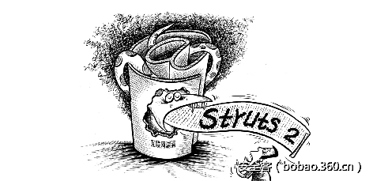

# 【漏洞分析】Strust2 S2-046 远程代码执行漏洞两个触发点分析


                                阅读量   
                                **139377**
                            
                        |
                        
                                                                                    


**[](./img/85749/t01b0faf37dfe1af5c8.png)**

**传送门**

[**【重大漏洞预警】Struts 2 远程代码执行漏洞(s2-045s2-046) (含PoC)**](http://bobao.360.cn/learning/detail/3571.html)

**<br>**

**0x00 漏洞介绍**

S2-046漏洞和S2-045漏洞非常相似，都是由报错信息带入了buildErrorMessage这个方法造成的。 但是这次存在两个触发点。

Content-Length 的长度值超长

Content-Disposition的filename存在空字节

<br>

**0x01 漏洞分析**

**Content-Length 的长度值超长**

这个漏洞需要在strust.xml中加入 &lt;constant name="struts.multipart.parser" value="jakarta-stream" /&gt;才能触发。

触发漏洞的代码在 JakartaStreamMultiPartRequest类中，processUpload函数处理了content-length长度超长的异常，导致问题触发。


```
private void processUpload(HttpServletRequest request, String saveDir)
        throws Exception {
    // Sanity check that the request is a multi-part/form-data request.
    if (ServletFileUpload.isMultipartContent(request)) {
        // Sanity check on request size.
        boolean requestSizePermitted = isRequestSizePermitted(request);
        // Interface with Commons FileUpload API
        // Using the Streaming API
        ServletFileUpload servletFileUpload = new ServletFileUpload();
        FileItemIterator i = servletFileUpload.getItemIterator(request);
        // Iterate the file items
        while (i.hasNext()) {
            try {
                FileItemStream itemStream = i.next();
                // If the file item stream is a form field, delegate to the
                // field item stream handler
                if (itemStream.isFormField()) {
                    processFileItemStreamAsFormField(itemStream);
                }
                // Delegate the file item stream for a file field to the
                // file item stream handler, but delegation is skipped
                // if the requestSizePermitted check failed based on the
                // complete content-size of the request.
                else {
                    // prevent processing file field item if request size not allowed.
                    // also warn user in the logs.
                    if (!requestSizePermitted) {
                        addFileSkippedError(itemStream.getName(), request);
                        LOG.warn("Skipped stream '#0', request maximum size (#1) exceeded.", itemStream.getName(), maxSize);
                        continue;
                    }
                    processFileItemStreamAsFileField(itemStream, saveDir);
                }
            } catch (IOException e) {
                e.printStackTrace();
            }
        }
    }
}
```

触发点在<br>

```
LOG.warn("Skipped stream '#0', request maximum size (#1) exceeded.", itemStream.getName(), maxSize);
```

之后进入了函数addFileSkippedError，我们又见到了熟悉的buildErrorMessage，而这次带入的参数为fileName


```
private void addFileSkippedError(String fileName, HttpServletRequest request) {
    String exceptionMessage = "Skipped file " + fileName + "; request size limit exceeded.";
    FileSizeLimitExceededException exception = new FileUploadBase.FileSizeLimitExceededException(exceptionMessage, getRequestSize(request), maxSize);
    String message = buildErrorMessage(exception, new Object[]{fileName, getRequestSize(request), maxSize});
    if (!errors.contains(message))
        errors.add(message);
}
```

**Content-Disposition的filename存在空字节**

第二种触发漏洞的方式，属于直接触发，在streams.class中，会对filename进行检查，如果检查出错，也会记录log。


```
public static String checkFileName(String fileName) {
    if (fileName != null  &amp;&amp;  fileName.indexOf('u0000') != -1) {
        // pFileName.replace("u0000", "\0")
        final StringBuilder sb = new StringBuilder();
        for (int i = 0;  i &lt; fileName.length();  i++) {
            char c = fileName.charAt(i);
            switch (c) {
                case 0:
                    sb.append("\0");
                    break;
                default:
                    sb.append(c);
                    break;
            }
        }
        throw new InvalidFileNameException(fileName,
                "Invalid file name: " + sb);
    }
    return fileName;
}
```

最终进入的是JakartaStreamMultiPartRequest类的，我们又见到了buildErrorMessage


```
public void parse(HttpServletRequest request, String saveDir)
        throws IOException {
    try {
        setLocale(request);
        processUpload(request, saveDir);
    } catch (Exception e) {
        e.printStackTrace();
        String errorMessage = buildErrorMessage(e, new Object[]{});
        if (!errors.contains(errorMessage))
            errors.add(errorMessage);
    }
}
```


**0x02 规则添加注意点**

由于存在两种方式，因此规则不是很好添加。且存在一定情况的bypass可能。

由于strust2会对data字段逐字解析，filename后可以跟如下几种情况。

多个空格

多个空格，且里面可以添加rn

n个空格

[](https://p0.ssl.qhimg.com/t0136198addc9b2febf.png)

b不可当成检测字符，b可以被替换成000,a – z 等等。

[](https://p4.ssl.qhimg.com/t015cb3ef4eb3617e82.png)

<br>

**0x03 漏洞修复**

升级版本到 2.3.32 、 2.5.10.1

<br>


**传送门**

**[【重大漏洞预警】Struts 2 远程代码执行漏洞(s2-045s2-046) (含PoC)](http://bobao.360.cn/learning/detail/3571.html)**


