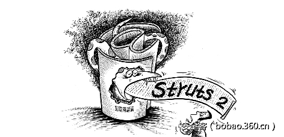

# 【漏洞分析】Struts2-045分析（CVE-2017-5638）

                                阅读量   
                                **188694**
                            
                        |
                        
                                                                                    

****

传送门

[【漏洞分析】S2-045 原理初步分析（CVE-2017-5638）](http://bobao.360.cn/learning/detail/3574.html)

[【重大漏洞预警】Struts 2 远程代码执行漏洞（CVE-2017-5638）（含PoC）](http://bobao.360.cn/learning/detail/3571.html)

**漏洞简介**

漏洞名称：Struts2-045

漏洞类型：远程执行命令

漏洞等级：高危

漏洞原因：基于Jakarta Multipart parser的文件上传模块在处理文件上传(multipart)的请求时候对异常信息做了捕获，并对异常信息做了OGNL表达式处理。但在在判断content-type不正确的时候会抛出异常并且带上Content-Type属性值，可通过精心构造附带OGNL表达式的URL导致远程代码执行[1]。

漏洞影响范围：Struts 2.3.5–Struts 2.3.31；Struts 2.5–Struts 2.5.10 

建议修复方法：升级到Struts 2.3.32或者 Struts 2.5.10.1 

 

**漏洞分析**

以下分析均基于struts2  2.3.24.1

通过官方说明可知漏洞发生在文件上传过程中。上传下载是一个常用功能，而Struts2本身并不提供上传解析器的，在org.apache.struts2包中，struts2向我们提供了以下三种方式支持文件上传。

本次漏洞之所以影响广泛，重要原因之一是因为本次出问题的模块是系统的默认提供的模块—Jakarta。Jakarta依赖于commons-fileupload和commons-io两个包，所以只要存在这两个包，就可以模拟文件上传。而在struts2提供的基本示例struts2_blank中，这两个包也是存在的。

另一个重要原因，就是Jakarta模块在处理文件请求的时候，会对异常信息进行OGNL表达式解析处理。这部分，通过调试的方式可以看的更清楚一些。

当struts2获取到请求的会进行分析，如图所示，当content_type不为空且content_type中包含multipart/form-data时，struts2处理为上传请求。这也是poc中为什么必须包含multipart/form-data的原因。

分析了如何模拟文件上传，现在看一下漏洞问题是如何产生的吧。如图，当解析器在处理请求时会进行异常判断。当文件过大或者发生其他错误时，都会调用到buildErrorMessage()。

漏洞就是由于异常处理错误引起。可以看到e现在的值如图。poc中content-type的内容全部都存储在detailMessage里。

进入该方法看一下，发现这里有官方的修改点(参考3)，也就是说，问题是从这里产生的。

继续跟进发现在这里，有valuestack参与。这个valuestack，熟悉Struts2的同学应该知道，这个是表达式计算的数据结构。也就是为OGNL解析做准备的了。

跟进findText()，发现在这里，errormessage进行处理

跟进去看到，已经把errormessage当作ognl表达式处理了。再继续跟，就是表达式处理的过程了，感兴趣的同学可以试一下。

** **

**总结**

以上分析为个人分析，感谢360GearTeam和0Kee Team小伙伴们的支持。

 

**参考文献**

1．  [http://www.cnvd.org.cn/webinfo/show/4080](http://www.cnvd.org.cn/webinfo/show/4080)

2．  [http://bobao.360.cn/learning/detail/3574.html](http://bobao.360.cn/learning/detail/3574.html)

3．  [https://github.com/apache/struts/commit/352306493971e7d5a756d61780d57a76eb1f519a](https://github.com/apache/struts/commit/352306493971e7d5a756d61780d57a76eb1f519a)

4．  [https://cwiki.apache.org/confluence/display/WW/S2-045](https://cwiki.apache.org/confluence/display/WW/S2-045) 
