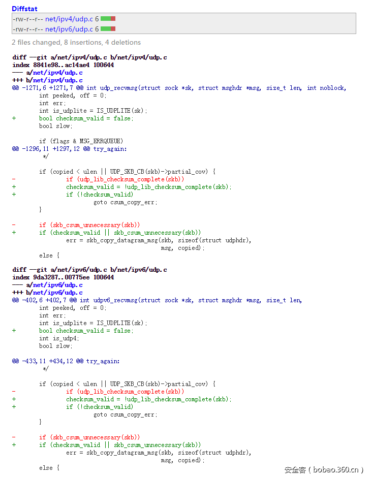

# 【漏洞预警】CVE-2016-10229：Linux 内核远程代码执行漏洞

                                阅读量   
                                **141890**
                            
                        |
                        
                                                                                    

漏洞描述：

**漏洞编号：**CVE-2016-10229 

**漏洞危害：**严重，攻击者利用该漏洞可实现linux内核远程代码执行，可能导致系统被完全控制或拒绝服务。

**影响范围：**详细影响范围见下文。

**补丁地址：**[http://git.kernel.org/cgit/linux/kernel/git/torvalds/linux.git/commit/?id=197c949e7798fbf28cfadc69d9ca0c2abbf93191](http://git.kernel.org/cgit/linux/kernel/git/torvalds/linux.git/commit/?id=197c949e7798fbf28cfadc69d9ca0c2abbf93191) 

**漏洞简述：**Linux  4.5之前的内核内核允许远程攻击者通过UDP，在带有MSG_PEEK标志位的recv系统调用中触发不安全的二次校验和计算（second checksum calculation），可造成任意代码执行

图1，漏洞修复 

修复建议：

建议用户通过系统更新到最新发行版修复此漏洞

**影响范围：**       

Linux kernel 4.10.6 

Linux kernel 4.10.4 

Linux kernel 4.4.30 

Linux kernel 4.4.29 

Linux kernel 4.4.28 

Linux kernel 4.4.27 

Linux kernel 4.4.25 

Linux kernel 4.4.24 

+ S.u.S.E. Linux 7.2 

Linux kernel 4.4.23 

Linux kernel 4.4.22 

Linux kernel 4.4.7 

Linux kernel 4.4.2 

Linux kernel 4.2.3 

Linux kernel 4.1.4 

Linux kernel 4.1.1 

Linux kernel 4.0.6 

Linux kernel 3.19.3 

Linux kernel 3.18.22 

Linux kernel 3.18.17 

Linux kernel 3.18.11 

Linux kernel 3.18.8 

Linux kernel 3.18.7 

Linux kernel 3.18.3 

Linux kernel 3.18.2 

Linux kernel 3.18.1 

Linux kernel 3.17.4 

Linux kernel 3.17.2 

Linux kernel 3.16.7 

Linux kernel 3.16.2 

Linux kernel 3.16.1 

Linux kernel 3.15.10 

Linux kernel 3.15.5 

Linux kernel 3.15.2 

Linux kernel 3.14.54 

Linux kernel 3.14.45 

Linux kernel 3.14.37 

Linux kernel 3.14.4 

Linux kernel 3.14.3 

Linux kernel 3.14.2 

Linux kernel 3.13.11 

Linux kernel 3.13.9 

Linux kernel 3.13.3 

Linux kernel 3.13.1 

Linux kernel 3.12.49 

Linux kernel 3.12.48 

Linux kernel 3.12.44 

Linux kernel 3.12.40 

Linux kernel 3.12.21 

Linux kernel 3.12.18 

Linux kernel 3.12.17 

Linux kernel 3.12.16 

Linux kernel 3.12.11 

Linux kernel 3.12.7 

Linux kernel 3.12.4 

Linux kernel 3.12.3 

Linux kernel 3.12.2 

Linux kernel 3.11.3 

Linux kernel 3.10.90 

Linux kernel 3.10.81 

Linux kernel 3.10.73 

Linux kernel 3.10.45 

Linux kernel 3.10.41 

Linux kernel 3.10.38 

Linux kernel 3.10.37 

Linux kernel 3.10.36 

Linux kernel 3.10.30 

Linux kernel 3.10.27 

Linux kernel 3.10.26 

Linux kernel 3.10.23 

Linux kernel 3.10.22 

Linux kernel 3.10.21 

Linux kernel 3.10.14 

Linux kernel 3.10.10 

Linux kernel 3.10.9 

Linux kernel 3.10.7 

Linux kernel 3.10 

Linux kernel 3.8.9 

Linux kernel 3.8.6 

Linux kernel 3.8.5 

Linux kernel 3.8.4 

Linux kernel 3.8.2 

Linux kernel 3.8.1 

Linux kernel 3.7.10 

Linux kernel 3.7.9 

Linux kernel 3.7.8 

Linux kernel 3.7.7 

Linux kernel 3.7.5 

Linux kernel 3.7.4 

Linux kernel 3.7.3 

Linux kernel 3.7.2 

Linux kernel 3.7.1 

Linux kernel 3.6.11 

Linux kernel 3.6.10 

Linux kernel 3.6.9 

Linux kernel 3.6.8 

Linux kernel 3.6.7 

Linux kernel 3.6.6 

Linux kernel 3.6.5 

Linux kernel 3.6.4 

Linux kernel 3.6.3 

Linux kernel 3.6.2 

Linux kernel 3.6.1 

Linux kernel 3.5.7 

Linux kernel 3.5.6 

Linux kernel 3.5.5 

Linux kernel 3.5.4 

Linux kernel 3.5.3 

Linux kernel 3.5.2 

Linux kernel 3.5.1 

Linux kernel 3.4.88 

Linux kernel 3.4.87 

Linux kernel 3.4.86 

Linux kernel 3.4.80 

Linux kernel 3.4.76 

Linux kernel 3.4.73 

Linux kernel 3.4.72 

Linux kernel 3.4.71 

Linux kernel 3.4.64 

Linux kernel 3.4.58 

Linux kernel 3.4.42 

Linux kernel 3.4.36 

Linux kernel 3.4.32 

Linux kernel 3.4.31 

Linux kernel 3.4.27 

Linux kernel 3.4.26 

Linux kernel 3.4.25 

Linux kernel 3.4.21 

Linux kernel 3.4.20 

Linux kernel 3.4.19 

Linux kernel 3.4.18 

Linux kernel 3.4.17 

Linux kernel 3.4.16 

Linux kernel 3.4.15 

Linux kernel 3.4.14 

Linux kernel 3.4.13 

Linux kernel 3.4.12 

Linux kernel 3.4.11 

Linux kernel 3.4.10 

Linux kernel 3.4.9 

Linux kernel 3.4.8 

Linux kernel 3.4.7 

Linux kernel 3.4.6 

Linux kernel 3.4.5 

Linux kernel 3.4.4 

Linux kernel 3.4.3 

Linux kernel 3.4.2 

Linux kernel 3.4.1 

Linux kernel 3.3.5 

Linux kernel 3.3.4 

Linux kernel 3.3.2 

Linux kernel 3.2.82 

Linux kernel 3.2.72 

Linux kernel 3.2.62 

Linux kernel 3.2.57 

Linux kernel 3.2.56 

Linux kernel 3.2.51 

Linux kernel 3.2.24 

Linux kernel 3.2.23 

Linux kernel 3.2.13 

Linux kernel 3.2.12 

Linux kernel 3.2.9 

Linux kernel 3.2.1 

Linux kernel 3.1.8 

Linux kernel 3.0.98 

Linux kernel 3.0.75 

Linux kernel 3.0.72 

Linux kernel 3.0.69 

Linux kernel 3.0.65 

Linux kernel 3.0.60 

Linux kernel 3.0.59 

Linux kernel 3.0.58 

Linux kernel 3.0.37 

Linux kernel 3.0.34 

Linux kernel 3.0.5 

Linux kernel 3.0.4 

Linux kernel 3.0.2 

Linux kernel 3.0.1 

Linux kernel 2.6.39 

Linux kernel 2.6.38 

Linux kernel 2.6.37 

Linux kernel 2.6.36 

Linux kernel 2.6.35 

Linux kernel 2.6.34 

Linux kernel 2.6.32 .9

Linux kernel 2.6.32 

Linux kernel 2.6.31 5

Linux kernel 2.6.31 13

Linux kernel 2.6.31 .2

Linux kernel 2.6.31 .11

Linux kernel 2.6.31 

Linux kernel 2.6.29 .1

Linux kernel 2.6.29 

Linux kernel 2.6.28 .9

Linux kernel 2.6.28 .8

Linux kernel 2.6.28 .6

Linux kernel 2.6.28 .5

Linux kernel 2.6.28 .3

Linux kernel 2.6.28 .2

Linux kernel 2.6.28 .1

Linux kernel 2.6.28 

Linux kernel 2.6.27 6

Linux kernel 2.6.27 3

Linux kernel 2.6.27 12

Linux kernel 2.6.27 .8

Linux kernel 2.6.27 .5

Linux kernel 2.6.27 .46

Linux kernel 2.6.27 .24

Linux kernel 2.6.27 .14

Linux kernel 2.6.27 .13

Linux kernel 2.6.27 .12

Linux kernel 2.6.27 

Linux kernel 2.6.26 7

Linux kernel 2.6.26 .6

Linux kernel 2.6.26 .4

Linux kernel 2.6.26 .3

Linux kernel 2.6.26 

Linux kernel 2.6.25 19

Linux kernel 2.6.25 .9

Linux kernel 2.6.25 .8

Linux kernel 2.6.25 .7

Linux kernel 2.6.25 .6

Linux kernel 2.6.25 .5

Linux kernel 2.6.25 .15

Linux kernel 2.6.25 .13

Linux kernel 2.6.25 .12

Linux kernel 2.6.25 .11

Linux kernel 2.6.25 .10

Linux kernel 2.6.25 

Linux kernel 2.6.24 .2

Linux kernel 2.6.24 .1

Linux kernel 2.6.24 

Linux kernel 2.6.23 .7

Linux kernel 2.6.23 .6

Linux kernel 2.6.23 .5

Linux kernel 2.6.23 .4

Linux kernel 2.6.23 .3

Linux kernel 2.6.23 .2

Linux kernel 2.6.23 

Linux kernel 2.6.22 .8

Linux kernel 2.6.22 .7

Linux kernel 2.6.22 .6

Linux kernel 2.6.22 .5

Linux kernel 2.6.22 .4

Linux kernel 2.6.22 .3

Linux kernel 2.6.22 .2

Linux kernel 2.6.22 .17

Linux kernel 2.6.22 .16

Linux kernel 2.6.22 .15

Linux kernel 2.6.22 .14

Linux kernel 2.6.22 .13

Linux kernel 2.6.22 .12

Linux kernel 2.6.22 .11

Linux kernel 2.6.22 .1

Linux kernel 2.6.22 

Linux kernel 2.6.21 4

Linux kernel 2.6.21 .7

Linux kernel 2.6.21 .6

Linux kernel 2.6.21 .3

Linux kernel 2.6.21 .2

Linux kernel 2.6.21 .1

Linux kernel 2.6.21 

Linux kernel 2.6.20 .9

Linux kernel 2.6.20 .8

Linux kernel 2.6.20 .7

Linux kernel 2.6.20 .6

Linux kernel 2.6.20 .5

Linux kernel 2.6.20 .4

Linux kernel 2.6.20 .15

Linux kernel 2.6.20 .14

Linux kernel 2.6.20 .12

Linux kernel 2.6.20 .10

Linux kernel 2.6.20 .1

Linux kernel 2.6.20 

Linux kernel 2.6.19 .4

Linux kernel 2.6.19 .3

Linux kernel 2.6.19 .2

Linux kernel 2.6.19 .1

Linux kernel 2.6.19 

Linux kernel 2.6.18 .8

Linux kernel 2.6.18 .7

Linux kernel 2.6.18 .6

Linux kernel 2.6.18 .5

Linux kernel 2.6.18 .4

Linux kernel 2.6.18 .3

Linux kernel 2.6.18 .2

Linux kernel 2.6.18 .1

Linux kernel 2.6.17 .9

Linux kernel 2.6.17 .8

Linux kernel 2.6.17 .7

Linux kernel 2.6.17 .6

Linux kernel 2.6.17 .5

Linux kernel 2.6.17 .4

Linux kernel 2.6.17 .3

Linux kernel 2.6.17 .2

Linux kernel 2.6.17 .14

Linux kernel 2.6.17 .13

Linux kernel 2.6.17 .12

Linux kernel 2.6.17 .11

Linux kernel 2.6.17 .10

Linux kernel 2.6.17 .1

Linux kernel 2.6.17 

Linux kernel 2.6.16 27

Linux kernel 2.6.16 13

Linux kernel 2.6.16 .9

Linux kernel 2.6.16 .8

Linux kernel 2.6.16 .7

Linux kernel 2.6.16 .6

Linux kernel 2.6.16 .53

Linux kernel 2.6.16 .52

Linux kernel 2.6.16 .51

Linux kernel 2.6.16 .50

Linux kernel 2.6.16 .5

Linux kernel 2.6.16 .49

Linux kernel 2.6.16 .48

Linux kernel 2.6.16 .47

Linux kernel 2.6.16 .46

Linux kernel 2.6.16 .45

Linux kernel 2.6.16 .44

Linux kernel 2.6.16 .43

Linux kernel 2.6.16 .41

Linux kernel 2.6.16 .40

Linux kernel 2.6.16 .4

Linux kernel 2.6.16 .39

Linux kernel 2.6.16 .38

Linux kernel 2.6.16 .37

Linux kernel 2.6.16 .36

Linux kernel 2.6.16 .35

Linux kernel 2.6.16 .34

Linux kernel 2.6.16 .33

Linux kernel 2.6.16 .32

Linux kernel 2.6.16 .31

Linux kernel 2.6.16 .30

Linux kernel 2.6.16 .3

Linux kernel 2.6.16 .29

Linux kernel 2.6.16 .28

Linux kernel 2.6.16 .27

Linux kernel 2.6.16 .26

Linux kernel 2.6.16 .25

Linux kernel 2.6.16 .24

Linux kernel 2.6.16 .23

Linux kernel 2.6.16 .22

Linux kernel 2.6.16 .21

Linux kernel 2.6.16 .20

Linux kernel 2.6.16 .2

Linux kernel 2.6.16 .19

Linux kernel 2.6.16 .18

Linux kernel 2.6.16 .17

Linux kernel 2.6.16 .16

Linux kernel 2.6.16 .15

Linux kernel 2.6.16 .14

Linux kernel 2.6.16 .12

Linux kernel 2.6.16 .11

Linux kernel 2.6.16 .10

Linux kernel 2.6.16 .1

Linux kernel 2.6.16 

Linux kernel 2.6.15 .7

Linux kernel 2.6.15 .6

Linux kernel 2.6.15 .4

Linux kernel 2.6.15 .3

Linux kernel 2.6.15 .2

Linux kernel 2.6.15 .1

Linux kernel 2.6.15 

Linux kernel 2.6.14 .7

Linux kernel 2.6.14 .6

Linux kernel 2.6.14 .5

Linux kernel 2.6.14 .4

Linux kernel 2.6.14 .3

Linux kernel 2.6.14 .2

Linux kernel 2.6.14 .1

Linux kernel 2.6.14 

Linux kernel 2.6.13 .5

Linux kernel 2.6.13 .4

Linux kernel 2.6.13 .3

Linux kernel 2.6.13 .2

Linux kernel 2.6.13 .1

Linux kernel 2.6.13 

Linux kernel 2.6.12 .6

Linux kernel 2.6.12 .5

Linux kernel 2.6.12 .4

Linux kernel 2.6.12 .3

Linux kernel 2.6.12 .22

Linux kernel 2.6.12 .2

Linux kernel 2.6.12 .12

Linux kernel 2.6.12 .1

Linux kernel 2.6.12 

Linux kernel 2.6.11 .9

Linux kernel 2.6.11 .8

Linux kernel 2.6.11 .7

Linux kernel 2.6.11 .6

Linux kernel 2.6.11 .5

Linux kernel 2.6.11 .4

Linux kernel 2.6.11 .3

Linux kernel 2.6.11 .2

Linux kernel 2.6.11 .12

Linux kernel 2.6.11 .11

Linux kernel 2.6.11 .10

Linux kernel 2.6.11 .1

Linux kernel 2.6.11 

Linux kernel 2.6.10 

Linux kernel 2.6.9 

Linux kernel 2.6.8 

Linux kernel 2.6.7 

Linux kernel 2.6.6 

Linux kernel 2.6.5 

Linux kernel 2.6.4 

Linux kernel 2.6.2 

Linux kernel 2.6.1 

Linux kernel 2.6 

Linux kernel 4.4.38

Linux kernel 4.4.26

Linux kernel 4.4.14

Linux kernel 4.4.1

Linux kernel 4.4

Linux kernel 4.3.3

Linux kernel 4.2.8

Linux kernel 4.2

Linux kernel 4.11

Linux kernel 4.10.7

Linux kernel 4.10.5

Linux kernel 4.10.2

Linux kernel 4.1.15

Linux kernel 4.1

Linux kernel 4.0.5

Linux kernel 4.0

Linux kernel 3.9.8

Linux kernel 3.9.4

Linux kernel 3.9

Linux kernel 3.8

Linux kernel 3.7.6

Linux kernel 3.7

Linux kernel 3.6

Linux kernel 3.5

Linux kernel 3.4.93

Linux kernel 3.4.81

Linux kernel 3.4.70

Linux kernel 3.4.67

Linux kernel 3.4.29

Linux kernel 3.4

Linux kernel 3.3

Linux kernel 3.2.81

Linux kernel 3.2.78

Linux kernel 3.2.65

Linux kernel 3.2.64

Linux kernel 3.2.63-2

Linux kernel 3.2.63

Linux kernel 3.2.60

Linux kernel 3.2.55

Linux kernel 3.2.54

Linux kernel 3.2.53

Linux kernel 3.2.52

Linux kernel 3.2.50

Linux kernel 3.2.44

Linux kernel 3.2.42

Linux kernel 3.2.38

Linux kernel 3.2.2

Linux kernel 3.2

Linux kernel 3.19

Linux kernel 3.18.9

Linux kernel 3.18

Linux kernel 3.17.6

Linux kernel 3.17

Linux kernel 3.16.6

Linux kernel 3.16.36

Linux kernel 3.16

Linux kernel 3.15

Linux kernel 3.14.79

Linux kernel 3.14.73

Linux kernel 3.14.7

Linux kernel 3.14.5

Linux kernel 3.14-4

Linux kernel 3.14-1

Linux kernel 3.14

Linux kernel 3.13.7

Linux kernel 3.13.6

Linux kernel 3.13.5

Linux kernel 3.13.4

Linux kernel 3.13.0

Linux kernel 3.13-rc1

Linux kernel 3.13

Linux kernel 3.12.22

Linux kernel 3.12.15

Linux kernel 3.12.14

Linux kernel 3.12.12

Linux kernel 3.12.1

Linux kernel 3.12

Linux kernel 3.11.9

Linux kernel 3.11.6

Linux kernel 3.11

Linux kernel 3.10.5

Linux kernel 3.10.43

Linux kernel 3.10.31

Linux kernel 3.10.20

Linux kernel 3.10.17

Linux kernel 3.10

Linux kernel 3.1

Linux kernel 3.0.66

Linux kernel 3.0.62

Linux kernel 3.0.18

Linux kernel 3.0

Linux kernel 2.6.8.1

Linux kernel 2.6.38.6

Linux kernel 2.6.38.4

Linux kernel 2.6.38.3

Linux kernel 2.6.38.2

Linux kernel 2.6.37.2

Linux kernel 2.6.35.5

Linux kernel 2.6.35.4

Linux kernel 2.6.35.13

Linux kernel 2.6.35.1

Linux kernel 2.6.34.3

Linux kernel 2.6.34.2

Linux kernel 2.6.34.14

Linux kernel 2.6.34.13

Linux kernel 2.6.34.1

Linux kernel 2.6.32.8

Linux kernel 2.6.32.7

Linux kernel 2.6.32.62

Linux kernel 2.6.32.61

Linux kernel 2.6.32.60

Linux kernel 2.6.32.6

Linux kernel 2.6.32.5

Linux kernel 2.6.32.4

Linux kernel 2.6.32.3

Linux kernel 2.6.32.28

Linux kernel 2.6.32.22

Linux kernel 2.6.32.2

Linux kernel 2.6.32.18

Linux kernel 2.6.32.17

Linux kernel 2.6.32.16

Linux kernel 2.6.32.15

Linux kernel 2.6.32.14

Linux kernel 2.6.32.13

Linux kernel 2.6.32.12

Linux kernel 2.6.32.11

Linux kernel 2.6.32.10

Linux kernel 2.6.32.1

Linux kernel 2.6.31.6

Linux kernel 2.6.31.4

Linux kernel 2.6.31.1

Linux kernel 2.6.30.5

Linux kernel 2.6.30.4

Linux kernel 2.6.30.3

Linux kernel 2.6.28.4

Linux kernel 2.6.28.10

Linux kernel 2.6.27.54

Linux kernel 2.6.27.51

Linux kernel 2.6.27.49

Linux kernel 2.6.27.26

Linux kernel 2.6.26.1

Linux kernel 2.6.25.4

Linux kernel 2.6.25.3

Linux kernel 2.6.25.2

Linux kernel 2.6.25.1

Linux kernel 2.6.24.6

Linux kernel 2.6.24.4

Linux kernel 2.6.24.3

Linux kernel 2.6.23.14

Linux kernel 2.6.23.10

Linux kernel 2.6.23.1

Linux kernel 2.6.23.09

Linux kernel 2.6.20.3

Linux kernel 2.6.20.2

Linux kernel 2.6.20.13

Linux kernel 2.6.20.11

Linux kernel 2.6.20-2

Linux kernel 2.6.18.1

Linux kernel 2.6.18

Linux kernel 2.6.16.9

Linux kernel 2.6.16.7

Linux kernel 2.6.16.19

Linux kernel 2.6.16.13

Linux kernel 2.6.16.12

Linux kernel 2.6.16.11

Linux kernel 2.6.15.5

Linux kernel 2.6.15.4

Linux kernel 2.6.15.11

Linux kernel 2.6.15-27.48

Linux kernel 2.6.14.3

Linux kernel 2.6.14.2

Linux kernel 2.6.14.1

Linux kernel 2.6.13.4

Linux kernel 2.6.13.3

Linux kernel 2.6.13.2

Linux kernel 2.6.13.1

Linux kernel 2.6.12.6

Linux kernel 2.6.12.5

Linux kernel 2.6.12.4

Linux kernel 2.6.12.3

Linux kernel 2.6.12.2

Linux kernel 2.6.12.1

Linux kernel 2.6.11.8

Linux kernel 2.6.11.7

Linux kernel 2.6.11.6

Linux kernel 2.6.11.5

Linux kernel 2.6.11.4

Linux kernel 2.6.11.12

Linux kernel 2.6.11.11

Linux Kernal 3.4.70

Linux Kernal 3.2.52

Linux Kernal 3.12.1

Linux Kernal 3.11.9

Linux Kernal 3.10.20

Linux kerenl 3.4.33

Google Pixel XL 0

Google Pixel C 0

Google Pixel 0

Google Nexus Player 0

Google Nexus 9

Google Nexus 6P

Google Nexus 6

Google Nexus 5X

Google Android One 0

Google Android 0

**参考：**

****

[1] [https://cve.mitre.org/cgi-bin/cvename.cgi?name=CVE-2016-10229](https://cve.mitre.org/cgi-bin/cvename.cgi?name=CVE-2016-10229)

[2] [https://git.kernel.org/pub/scm/linux/kernel/git/torvalds/linux.git/commit/?id=197c949e7798fbf28cfadc69d9ca0c2abbf93191](https://git.kernel.org/pub/scm/linux/kernel/git/torvalds/linux.git/commit/?id=197c949e7798fbf28cfadc69d9ca0c2abbf93191)

[3] [http://source.android.com/security/bulletin/2017-04-01.html](http://source.android.com/security/bulletin/2017-04-01.html)

[4] [http://www.securityfocus.com/bid/97397](http://www.securityfocus.com/bid/97397)

