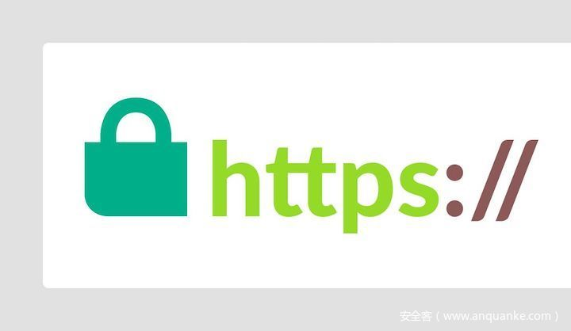

# 一些网站https证书出现问题的情况分析

                                阅读量   
                                **674866**
                            
                        |
                        
                                                                                    

20200326下午，有[消息说](https://v2ex.com/t/656367?p=2)[1]github的TLS证书出现了错误告警。证书的结构很奇怪，在其签发者信息中有一个奇怪的email地址：346608453@qq.com。明显是一个伪造的证书。

为了弄清楚其中的情况，我们对这一事件进行了分析。

## DNS劫持？

出现证书和域名不匹配的最常见的一种情况是DNS劫持，即所访问域名的IP地址和真实建立连接的IP并不相同。

以被劫持的域名go-acme.github.io为例，我们的passiveDNS库中该域名的IP地址主要使用如下四个托管在fastly上的IP地址，可以看到其数据非常干净。

对该域名直接进行连接测试，可以看到，TCP连接的目的地址正是185.199.111.153，但其返回的证书却是错误的证书。因此github证书错误的问题并不是在DNS层面出现问题。

## 劫持如何发生的？

为了搞清楚这个问题，可以通过抓取链路上的数据包来进行分析。为了有较好的对比性，我们先后抓取了443端口和80端口的数据。如下图

左边的数据包为https连接，右边的数据包为http连接。可以看到https的服务器应答TTL为53，http的则为44。一般来说，在时间接近的情况下，连接相同的目标IP，数据包在链路上的路径是是近似的。https的TTL显著的大于http的TTL，看起来很有可能是在链路上存在劫持。

有意思的是 在https后续的连接中其TTL值并不稳定，比如在响应证书的数据包中，其TTL变成了47，介于44和53之间，更接近于http链路的情况。作为对比，http的后续数据包的TTL值则一直稳定在44。

[20200327 23:00 更新] 在数据包内容方面，另一个值得关注的点是：被劫持的会话数据包(https)全部回包的IPID都是0.  正常数据包(http)首次回包IPID是0，之后的回包就不是了。

这是两个有意思的现象。

因此，结合https会话过程中TTL值和IPID的异常，我们猜测是在链路上发生了劫持。

## 证书是怎么回事？

事实上，从我们DNSMon系统的证书信息来看，这个证书（9e0d4d8b078d7df0da18efc23517911447b5ee8c）的入库时间在20200323早上六点。考虑到数据分析的时延，其开始在大网上使用最晚可以追溯到20200322。

同时可以看到，这个证书在证书链上的父证书（03346f4c61e7b5120e5db4a7bbbf1a3558358562）是一个自签名的证书，并且两者使用相同的签发者信息。

### 受影响的域名及时间

从上图中可以看到，该证书的影响不仅仅在github，实际上范围非常大。通过DNSMon系统，我们提取出了受影响的域名共14655个。

通过DNSMon系统查看这些域名的流行度，在TOP1000的域名中，有40个域名受影响，列表如下：

1 [www.jd.com](http://www.jd.com/) 
5 [www.baidu.com](http://www.baidu.com/) 
10 [www.google.com](http://www.google.com/) 
37 [www.sina.com](http://www.sina.com/) 
44 [www.163.com](http://www.163.com/) 
51 [www.douyu.com](http://www.douyu.com/) 
62 [www.suning.com](http://www.suning.com/) 
86 [www.pconline.com.cn](http://www.pconline.com.cn/) 
91 [sp1.baidu.com](http://sp1.baidu.com/) 
126 [twitter.com](http://twitter.com/) 
137 [www.eastmoney.com](http://www.eastmoney.com/) 
143 [mini.eastday.com](http://mini.eastday.com/) 
158 [sp0.baidu.com](http://sp0.baidu.com/) 
174 [www.jianshu.com](http://www.jianshu.com/) 
177 [www.mgtv.com](http://www.mgtv.com/) 
185 [www.zhihu.com](http://www.zhihu.com/) 
232 [www.toutiao.com](http://www.toutiao.com/) 
241 price.pcauto.com.cn 
271 [www.google.com.hk](http://www.google.com.hk/) 
272 video.sina.com.cn 
299 [www.youtube.com](http://www.youtube.com/) 
302 [www.acfun.cn](http://www.acfun.cn/) 
365 [www.vip.com](http://www.vip.com/) 
421 [news.ifeng.com](http://news.ifeng.com/) 
451 car.autohome.com.cn 
472 [www.facebook.com](http://www.facebook.com/) 
538 [www.gamersky.com](http://www.gamersky.com/) 
550 [www.xiaohongshu.com](http://www.xiaohongshu.com/) 
552 [www.zaobao.com](http://www.zaobao.com/) 
580 [www.xxsy.net](http://www.xxsy.net/) 
621 [www.huya.com](http://www.huya.com/) 
640 [mp.toutiao.com](http://mp.toutiao.com/) 
643 [www.ifeng.com](http://www.ifeng.com/) 
689 [www.ip138.com](http://www.ip138.com/) 
741 dl.pconline.com.cn 
742 [v.ifeng.com](http://v.ifeng.com/) 
784 [www.yicai.com](http://www.yicai.com/) 
957 [passport2.chaoxing.com](http://passport2.chaoxing.com/) 
963 [3g.163.com](http://3g.163.com/) 
989 [www.doyo.cn](http://www.doyo.cn/)

对这些域名发生证书劫持时的DNS解析情况分析发现，这些域名的解析IP均在境外，属于这些域名在境外的CDN服务。值得一提的是尽管这些域名都是排名靠前的大站，但是因为国内访问的时候，CDN解析会将其映射为国内的IP地址，因此国内感知到这些大站被劫持的情况比较小。

#### 受影响二级域排名

在二级域方面，github.io 是受影响最大的二级域，也是此次劫持事件的关注焦点。

1297 github.io 
35 app2.xin 
25 [github.com](http://github.com/) 
18 [aliyuncs.com](http://aliyuncs.com/) 
17 app2.cn 
14 nnqp.vip 
10 jov.cn 
8 pragmaticplay.net 
7 tpdz10.monster 
7 [suning.com](http://suning.com/)

从时间维度来看，这些域名的首次被劫持时间分布如下：

从图中可以看出域名首次受影响的数量有日常作息规律，并且在3月26号数量有了较大幅度的增加。

## 结论

1）劫持涉及域名较多，共计14655个，其中TOP1000的网站有40个； 
2）劫持主要发生在国内用户访问上述域名的海外CDN节点的链路上。国内用户访问国内节点的情况下未见影响； 
3）所有这些劫持均使用了以 [346608453@qq.com](mailto:346608453@qq.com) 名义签名的证书，但我们没有找到 编号 346608453 的QQ用户与本次劫持事件相连的直接证据，也不认为该QQ用户与本次事件有直接关联； 
4）所有这些劫持最早出现在 2020.03.21 23时附近，持续到现在。并且在过去的24小时（26日～27日）处于高峰。

## 参考链接
1. [https://v2ex.com/t/656367?p=2](https://v2ex.com/t/656367?p=2)