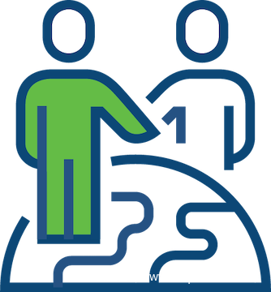

# 个人信息保护之TrustArc合规认证

                                阅读量   
                                **705216**
                            
                        |
                        
                                                                                    

> 文 | 张晓芳

> 笔者主要负责小米隐私合规风险评估，隐私相关认证，IoT产品安全风险合规评估等工作，9年+安全/隐私从业经验，6年+外企安全运维经验，熟悉访问控制、风险评估、合规等安全领域，CISSP，CIPP/E证书持有者

## 1.   引言

2018年欧盟个人信息保护法案GDPR正式生效，也被称为个人数据保护的元年。自2018年开始，个人信息保护的话题一直热度不减，各国在数据安全和个人信息保护立法上的积极性也是空前绝后，GDPR之后，加州、印度、澳大利亚、泰国、巴西、埃及等地纷纷颁布了新的隐私法案或草案。全球范围内新推出了50个以上的隐私法规，并且有150个以上的国家或地区对现有隐私法规进行了更新或提出了补充意见。

在国内外对个人信息保护高度关注的情况下，对于一家企业，特别是跨国企业来说，同时满足不同国家不同的法律要求变得异常艰难，那如何让企业的隐私合规工作化繁为简？又如何快速知道从哪些方面着手隐私合规建设呢？为解决这些问题，企业可以参照最佳实践或隐私合规框架，来辅助企业快速着手合规建设工作。通过权威组织的认证应该是企业快速引入隐私合规框架的方式之一，本文将为大家介绍TrustArc 企业隐私与数据治理合规认证。

## 2.   Who | 谁是TrustArc

大家可能会在某些公司的隐私政策上看到下面这个‘TRUSTe隐私认证’的图章：

这个图章的存在，代表这个企业的产品的隐私政策和隐私实践符合TRUSTe企业隐私与数据治理实践评估标准。但国内对TrustArc这家公司是比较陌生的，网上相关的资料也相对较少，那它是一家什么样的公司呢？

TrustArc，原名Truste, 是一家位于美国加州的隐私合规科技公司，主要为企业提供隐私合规相关的软件或服务，帮助企业建立和完善隐私合规的相应隐私管理流程，使其快速的符合不同的法律法规的要求。

除了企业隐私和数据治理实践认证外，TrustArc会提供不同法律法规（如GDPR、CCPA）的合规评估，包括配套的实施工具，如同意管理、用户权利、数据流梳理工具等等。此外，它也进行诸如privacy shield 的合规评估咨询工作，可以说TrustArc在隐私合规上提供了覆盖面较广的多框架、多法律法规的评估和咨询工作。

**图1-TrustArc提供的GDPR实施工具**

## 3.   Why | 为什么要获得TrustArc的认证

TrustArc经过多年的隐私合规从业经验的积累，已经形成了一整套，较成熟的隐私合规评估方法论，同时其国际影响力和知名度，让更多的企业开始着手于取得这个认证。

### **3.1. 成熟的隐私和数据合规管理方法论**

TrustArc企业隐私和数据治理合规评估框架参照了相关组织的个人信息保护框架的内容， 比如OECD、APAC、GAPP、ISO、NIST等组织发布的隐私框架， 所以在正式介绍TrustArc隐私企业隐私和数据治理合规框架之前，对几大组织提出的隐私框架，从发布时间、隐私原则等内容进行基本的介绍。

**图2-各框架发布时间线**

#### **OECD Privacy framework：**

经济合作与发展组织（OECD）是“致力于民主和市场经济的国家”的论坛，OECD隐私原则是1980年正式启用的《经合组织保护隐私和个人数据越境流动准则》的一部分，OECD隐私权原则与欧盟（EU）成员国的数据保护法规紧密相关，该法规实施了欧盟委员会数据保护指令（指令95/46 / EC）以及其他“欧盟风格国家隐私立法‘’，从GDPR中，也一样有OECD 框架的影子。

#### **APEC Privacy Framework：**

亚太经济合作组织（APEC）隐私框架有与其他框架重叠的部分，但是，它更侧重于因披露信息而造成的实际或潜在损害，而不是个人对其信息的权利。 OECD隐私原则在欧盟和其他政府的法律制度中得到支持，但APEC隐私框架不受法律支持。亚太经合组织隐私框架的主要支持者是一些跨国公司。

APEC隐私框架是一系列原则和实施要求，旨在促进有效的个人信息保护，避免在全球至关重要数据交换中的信息流壁垒，并确保持续的贸易和经济增长。亚太经济合作组织区域共有27个国家。

#### **Generally Accepted Privacy Principles（GAPP）**

公认的隐私原则（GAPP）是在2003年由美国注册会计师协会（AICPA）和加拿大特许会计师协会（CICA）制定，并于2006年和2009年进行了更新，与OECD隐私原则相似，此原则更侧重于实施。

企业可以通过使用GAPP设计，实施和沟通隐私政策、建立和管理隐私计划、监控和审核隐私程序、衡量绩效和标准。GAPP共包含10条原则，每条原则均以客观和可衡量的标准作为后盾，以确定组织内的隐私风险和合规性，GAPP在加拿大隐私从业者中很受欢迎。

#### **ISO29100：ISO隐私框架**

ISO29100发布的隐私框架，其中定义了与企业隐私管理相关的角色，影响隐私合规管理的因素、PII定义、隐私基本原则等内容，适用于企业在涉及到采购、设计、开发产品或服务。在收集和处理个人信息所面临的隐私风险和可以采取的风险控制措施。

#### **ISO27701：个人信息管理体系认证**

ISO27701认证通过对ISO/IEC 27001信息安全管理和ISO/IEC 27002安全控制扩展隐私相关的管理要求，为企业提供了可帮助其实施、维护和不断改进个人信息管理体系的认证框架。此认证可以协助企业证明遵守了世界各地的隐私法规，例如GDPR。框架中除了第6章在信息安全体系标准基础上增加了对个人信息的安全附加要求外，也分别在第7、8章对数据控制者、数据处理者提出了额外的指导内容，知道内容中延续了ISO29100中的隐私原则逐一展开。

#### **NIST Privacy Framework：**

NIST（美国国家标准与技术研究院）提出了基于企业风险评估导向的隐私评估框架，帮助组织识别和管理隐私风险，以开发创新产品和服务的同时保护好个人隐私。此框架是NIST Cyber Security framework的扩充，是帮助企业通过风险管理提高个人信息保护能力的工具。

**图3：各组织发布的隐私框架原则矩阵**

### **3.2. TrustArc隐私和数据治理框架内容介绍**

TrustArc经过10000+项目的经验积累，以及行业专家的知识沉淀，已经形成了成熟度较高的隐私和数据合规评估方法论，建立了行之有效的评估标准以及评估框架，并根据法律法规的发布和修订，以及企业所提供服务的不同性质，及时便捷的调整框架和评估标准，便于让企业迅速知道在一部法规的颁布后需要从哪里入手，开始哪些工作才能确保其合规。

本文介绍的TrustArc隐私和数据治理框架借鉴了各大组织框架提出的隐私原则外，也融合了全球不同的法律法规，如GDPR、CCPA、HIPPA等；针对隐私数据安全性相关的合规要求，借鉴了如ISO27001等信息安全管理体系的评估要点；将以上内容融合成TrustArc隐私和数据治理合规评估方法论，通过TrustArc认证让企业的产品和服务可以证明其负责任的数据收集，处理和隐私管理实践。

TrustArc框架总体分为 构建-Build、实施-Implement和证明- Demonstrate三个阶段，每个阶段均有其对应的评估标准。

#### **1. 构建（Build）阶段：**

构建阶段中的评估标准主要是为了与法律法规以及有效的实践和合规计划保持一致，建立，维护并不断发展和完善与其他信息治理，合规性和风险管理相符的隐私管理程序。

#### **2.  实施（Implement）：**

实施阶段的评估点主要是围绕着隐私原则展开，着重评估企业如何设计和制定有效的隐私和数据治理的控制措施，并应用到组织流程中、产品和技术的设计和开发过程中，以及在产品，流程或技术的整个生命周期中维护或加强这些控制措施的实施。如企业建立了隐私影响评估（DPIA）流程来识别可能对个人产生高风险的数据处理行为，并可以处置已识别的风险。

#### **3.  证明（Demonstrate）：**

证明阶段主要用于提供隐私合规计划和实践合规性，成熟度，责任感和价值的证据。

## 4.   How | 怎样通过这个认证？

TrustArc隐私和数据治理认证过程主要分为三个阶段：评估阶段、整改和认证阶段、持续监控和指导阶段，以下将以企业视角描述各个阶段中，企业在准备认证所需要完成的主要工作内容。

### **4.1. 评估阶段**

隐私评估阶段主要是为了识别企业隐私合规风险以及在如何处置合规风险的相关信息的收集。这个阶段TrustArc会帮助企业指定一位合规评估经理指导企业完成整个过程。在这个阶段中，关键的几个项目步骤为：

1） 确认项目范围：

TrustArc认证范围主要从业务、产品/服务、数据资产（如网站、APP、云平台）等维度，企业需要根据自身需求点，来首先进行项目范围的确认。

2） 线上填写合规检查问卷：

TrustArc的线上问卷会根据项目范围中待评估的产品或服务的性质、不同情况涉及到不同的评估问题。

合规评估问卷的框架都来自于TrustArc隐私和数据治理框架，涵盖了从数据处理活动，到框架中的隐私原则、企业隐私管理计划持续化和监控、以及企业相关隐私管理责任的方方面面。问卷各个部分的填写指导以及准备的证据信息可以参照下表:

**表1-TrustArc评估问卷反馈指导**

### **4.2. 差距分析和报告阶段**

在差距评估过程中，TrustArc将通过顾问评估和技术测试两个方面对项目评估范围内的产品或服务进行评估分析：

1） 顾问评估：

TrustArc隐私顾问会对企业提交的合规检查问卷内容进行人工评估，评估的主要标准依赖于TrustArc企业隐私和数据治理实践认证评估标准，对    应企业提交的问卷内容进行综合评估，评估过程中将针对问卷的证据或描述不清晰的部分，通过邮件或会议的方式与企业进行进一步的确认。

2） 人工测试：

TrustArc的技术测试团队会对产品或服务进行隐私技术测试，比如通过抓包的方式确认敏感信息在传输中是否加密，是否在同意隐私政策前回传    相关数据，隐私政策在产品内是否可访问，获取用户同意的产品实现方式的检查等等。

经过以上的评估和测试，TrustArc将根据顾问的评估结果和技术测试结果在线出具评估结果报告，其中报告中包括差距分析，风险总结和风险处    置建议，该报告中会进一步指导企业如何确保隐私合规。

### **4.3. 整改和认证阶段**

差距分析报告中提出的风险项和分享处置建议，将在线上系统以整改计划的方式反馈给企业，企业需要明确整改方案和整改完成时间，并及时在线上反馈相关整改完成证据。

差距整改涉及到制度流程的补充或完善，以及产品前端或后端技术相关整改。TrustArc顾问会全程跟踪整改计划的实施情况，确保所有风险项均整改完成后，向企业发放正式的认证通过证书，企业通过认证后，可以将TrustArc的隐私印章嵌入到其产品或服务的隐私政策中。

### **4.4. 持续监控和指导阶段**

整个评估过程通过线上系统进行，包括证据，评估报告和最后的整改计划均完好的记录在统一的线上系统中，易于查找或证明企业的隐私合规性。企业还可获得TrustArc提供的第三方争端解决服务，该服务可帮助有效管理客户的隐私查询并满足争端处理的合规性要求。

同时，TrustArc会提供反馈按钮，向消费者，业务合作伙伴和监管机构进行外部展示和证明企业使用技术和工具来管理与隐私相关的问题或疑虑。隐私反馈按钮可以放置在企业的隐私政策页面上，并链接到供消费者提交问题或反馈的页面。

TrustArc会不断的向企业提供隐私相关的意见、调查报告、或线上的教育培训或相关白皮书文档等，企业的隐私合规专家有权限访问这些内容，获得相关的知识。

## 

## 5.   What | 认证收益是什么？

TrustArc的认证，不仅仅是收获了一张证书，个人认为以下两个方面也是企业收获较多的方面：

### **5.1. 隐私合规体系建立：**

认证中评估框架和评估标准让企业可以快速梳理当前的隐私合规实践、使当前的实践更加体系化，规范化呈现。比如，通过认证梳理出隐私管理方面的隐私合规体系文档列表如下（示例），其中安全保护相关的制度文档可以引用ISMS相关体系文件：

### **5.2. 隐私合规体系运行监控：**

通过TrustArc的认证后，一方面需要进行年审，年审时需要重新填写评估问卷，确保产品或服务的数据收集或处理发生任何改变都被重新评估，并且也将评估企业在过去的一年中，体系中相应的内容的执行情况；另一方面，TrustArc会持续的关注企业的隐私合规行为，如发现有隐私相关的违反情况，会询问企业相关的问题点，企业需及时澄清相关问题，如果逾期未能澄清，隐私印章链接将被暂时撤回，直到企业整改完相应问题才会被恢复。

企业合规人员，最主要的工作方向就是要证明合规，如何证明一直都是大家的痛点，企业可以以通过认证的方式，帮助企业建立完备的隐私合规体系，并对隐私体系运行情况进行持续性的监控，PDCA循环的方式，让企业不断完善自身的隐私合规体系，向监管和大众证明其合规性。

## 

## 参考资料：

[https://www.trustarc.com/products/enterprise-privacy-certification/](https://www.trustarc.com/products/enterprise-privacy-certification/)

[https://www.apec.org/About-Us/About-APEC/Fact-Sheets/What-is-the-Cross-Border-Privacy-Rules-System](https://www.apec.org/About-Us/About-APEC/Fact-Sheets/What-is-the-Cross-Border-Privacy-Rules-System)

[http://oecdprivacy.org/](http://oecdprivacy.org/)

[https://www.cpacanada.ca/](https://www.cpacanada.ca/)

[https://www.isaca.org/](https://www.isaca.org/)

[https://www.iso.org/home.html](https://www.iso.org/home.html)

[https://www.nist.gov/privacy-framework](https://www.nist.gov/privacy-framework)

[https://download.trustarc.com/dload.php/?f=O9Z2KDNV-628](https://download.trustarc.com/dload.php/?f=O9Z2KDNV-628)
