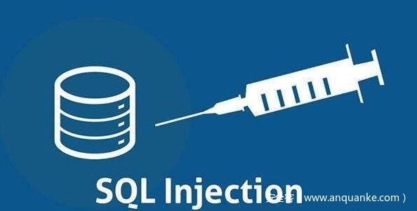

# 使用同构SQL语句逐步发现SQL注入漏洞


                                阅读量   
                                **335397**
                            
                        |
                        
                                                                                                                                    
                                                                                            


##### 译文声明

本文是翻译文章，文章原作者Eugene Lim，文章来源：https://spaceraccoon.dev/same-same-but-different-discovering-sql-injections-incrementally-with
                                <br>原文地址：[]()

译文仅供参考，具体内容表达以及含义原文为准

[](./img/203684/t0185932727efe794b2.jpg)

## 前言

本文介绍了一种新型SQL注入漏洞扫描方式，同构SQL语句。与传统方法相比，该方法可以更加有效地对SQL注入漏洞进行扫描。


## 动机

尽管现在已经开始大规模的使用对象关系映射(ORM)框架以及预编译SQL语句了，但还是有很多应用程序存在SQL注入漏洞，甚至于因为在对象和原始SQL语句转换过程中出错，ORM框架本身也会引入该漏洞。而且不及时维护应用程序或者有问题的开发流程都会导致SQL注入漏洞。

我在最开始的时候找不到任何SQL注入漏洞，因为和XSS漏洞相比，存在SQL注入漏洞的网站的响应中通常不包含注入语句的位置以及注入的方式。而如果是XSS漏洞，你通常可以在返回的HTML页面中看到payload的最终位置（Blind XSS例外，payload可能在你无法访问的管理员页面）。

对于SQL注入漏洞来说，最好的情况就是你能获得一个详细的堆栈跟踪记录，包含了具体的SQL语句内容。

```
HTTP/1.1 500 Internal Server Error
Content-Type: text/html; charset=utf-8

&lt;div id="error"&gt;
    &lt;h1&gt;Database Error&lt;/h1&gt;
    &lt;div class='message'&gt;
        SQL syntax error near '''' where id=123' at line 1: update common_member SET name=''' where id=123
    &lt;/div&gt;
&lt;/div&gt;

```

上面是最幸运的情况。但是通常会返回一个通用错误信息，甚至完全没有任何错误提示，响应内容是空的。

```
HTTP/1.1 200 OK
Content-Type: application/json

{
    "users": []
}

```

在这种情况下，挖掘SQL漏洞耗时且困难。许多研究人员更喜欢用类似[sqlmap](https://github.com/sqlmapproject/sqlmap)这样的自动化工具做一次扫描，称其为“一日游”。但是在没有正确配置的情况下使用这些自动化工具其实并没有什么用，WAF会很快检测并拦截这些扫描行为。除此之外，每个SQL注入漏洞发生的上下文都很特殊，它可能会在`WHERE`运算符后，也可能在`LIKE`运算符后，也可能在`ORDER BY`运算符后，每种情况需要的进行不同类型的注入，这还没有考虑应用对输入的过滤情况。

使用polyglots可以在一定程度上解决这个问题。但是从polyglots的定义上来看，可以在多种上下文上执行本身就会牺牲一定的隐蔽性和简洁性。比如说下面这个[来自Seclists的例子](https://github.com/danielmiessler/SecLists/blob/master/Fuzzing/Polyglots/SQLi-Polyglots.txt)：

```
SLEEP(1) /*‘ or SLEEP(1) or ‘“ or SLEEP(1) or “*/
SLEEP(1) /*' or SLEEP(1) or '" or SLEEP(1) or "*/
IF(SUBSTR(@@version,1,1)&lt;5,BENCHMARK(2000000,SHA1(0xDE7EC71F1)),SLEEP(1))/*'XOR(IF(SUBSTR(@@version,1,1)&lt;5,BENCHMARK(2000000,SHA1(0xDE7EC71F1)),SLEEP(1)))OR'|"XOR(IF(SUBSTR(@@version,1,1)&lt;5,BENCHMARK(2000000,SHA1(0xDE7EC71F1)),​SLEEP(1)))OR"*/
```

任何比较强大的WAF都会检测到上面这个例子，并进行拦截。

在实际情况中，研究人员需要在挖掘SQL注入漏洞时平衡以下两种情况：
1. 能够在多种上下文环境中检测并完成注入；
1. 能够绕过WAF以及应用对输入的过滤。
如果使用“同构SQL语句(Isomorphic SQL Statements)”，就可以很好的解决上面的两个问题（这只是我的叫法，我知道其他人对它有别的称呼）。


## 分步的漏洞挖掘方法

还是和XSS对比，尽管存在很多XSS扫描器和模糊测试的方法，但是由于WAF的拦截以及独特的上下文环境，这些扫描器和方法通常效果不是特别好。最近出现了一些更先进的自动化漏洞挖掘的方法，尝试解决暴力扫描中存在的问题，像是James Kettle的[Backslash Powered Scanning](https://portswigger.net/research/backslash-powered-scanning-hunting-unknown-vulnerability-classes)，Kettle在文章中写到：

> 我们要做的不是扫描漏洞，而是扫描有趣的行为。

随后，一些自动化的工作开始使用定义好的启发式规则（有趣的行为）对应用进行测试，而不是单纯的枚举所有payload，比如说Ameen Mali的[qsfuzz](https://github.com/ameenmaali/qsfuzz)和Project Discovery的[nuclei](https://github.com/projectdiscovery/nuclei)。随着越来越的组织开始使用WAF并且规范开发流程，这会是所有大型的漏洞扫描工具的发展方向。

举例来说，在测试XSS的时候，不会检测“执行完这个payload之后会弹出一个警报窗口吗？”，而是检测“这个应用检测单引号吗？尖括号呢？”使用这个方法的另一个好处就是，在进行大规模测试的时候，可以很容易绕过大部分WAF。这之后，就可以手动对各个扫描出的特殊上下文进行渗透了。

SQL注入也同样如此。但是怎样在没有任何反馈机制的情况下进行规范化测试呢？之前我提到过，SQL注入和XSS的不同之处就在于SQL注入通常不会给出正面响应。尽管如此，我从[Ian Bouchard](https://twitter.com/corb3nik)这样的研究人员身上学到了一件事——没有消息也是好消息。

这时候就要考虑同构SQL语句了。“同构”在这里的意思是虽然SQL语句的编写方式不同，但是理论上返回的结果相同。但是你在这里要使用包含特殊字符的SQL语句进行测试，比如说`'`或者`-`，如果应用对字符进行了过滤，注入的SQL语句将无法返回相同的结果，如果没有正确过滤，返回的结果相同，这就说明可能存在SQL注入漏洞。

下面用一个简单的SQL注入漏洞对此进行说明：

```
CREATE TABLE Users (
    ID int key auto_increment,
    LastName varchar(255),
    FirstName varchar(255),
    Address varchar(255),
    City varchar(255)
);

INSERT INTO Users (LastName, FirstName, Address, City) VALUES ('Bird', 'Big', '123 Sesame Street', 'New York City'); 

INSERT INTO Users (LastName, FirstName, Address, City) VALUES ('Monster', 'Cookie', '123 Sesame Street', 'New York City'); 

SELECT FirstName FROM Users WHERE ID = &lt;USER INPUT&gt;;
```

如果使用大量的SQL polyglot对上面的代码进行模糊测试，找到漏洞并不难，但在实际应用中，由于存在WAF、输入过滤和复杂的上下文环境，可能很难找到漏洞。

下面考虑下面几个SQL语句：

```
SELECT FirstName FROM Users WHERE ID = 1;
SELECT FirstName FROM Users WHERE ID = 2-1;
SELECT FirstName FROM Users WHERE ID = 1+'';
```

如果下面两个语句中的特殊字符没有被过滤，这三个语句应该都会返回同样的结果。如果返回的结果不同，就说明服务器对输入进行了某种形式的过滤。

[](https://p1.ssl.qhimg.com/t014b467bf7591de9e5.png)

现在考虑另一种情况：

```
SELECT Address FROM Users WHERE FirstName LIKE '%&lt;USER INPUT&gt;%' ORDER BY Address DESC;
```

该语句在进行数据库查询时很常见。注入后的三个SQL语句分别是：

```
SELECT Address FROM Users WHERE FirstName LIKE '%Big%' ORDER BY Address DESC;
SELECT Address FROM Users WHERE FirstName LIKE '%Big%%%' ORDER BY Address DESC;
SELECT Address FROM Users WHERE FirstName LIKE '%Big%' '' ORDER BY Address DESC;
```

在第二个语句中重复插入了两次特殊字符`%`，如果返回的结果相同，就说明我们正在注入的SQL语句在`LIKE`运算符之后。

[Arne Swinnen](https://www.arneswinnen.net/2013/09/automated-sql-injection-detection/)在2013年（远早于其他人）曾提到：

> 如果参数类型为字符串，把有效参数的字符串分成两部分，使用SQL中的字符串连接指令进行连接，如果返回的结果相同，说明可能存在SQL注入漏洞。

第三个语句中，在注入中添加一个`' '`，就可以让字符串类型达到和数值类型一样的同构效果。添加该值表示在原始字符串后连接一个空白字符串，如果应用没有正确过滤单引号`'`，这种注入方式应该返回同样的结果。

接下来只需要逐步进行实验即可。由此你可以达到两个目标：
1. 发现在最终的SQL语句中，注入的哪个字符没有被正确过滤；
1. 发现进行注入的原始SQL语言是什么样子的。


## 大规模自动化扫描以及注意事项

我们这么做不是要发现单个SQL注入漏洞，而是能够在大量URL中进行自动的扫描。使用传统SQL注入的payload或者扫描器进行大规模扫描会占用大量资源，产生很多无用结果。但是如果使用分步式的同构方法，就可以用类似下面这样的启发式规则：

```
if (response of id_input) === (response of id_input + "+''"):
    return true
else:
    return false
```

这种方法速度更快，占用资源更少。不过虽然使用这种方法可以获得更少的假阴性结果（比如说注入有效但被WAF拦截了），但是会造成更多的假阳性。比如说，可能存在一些情况，服务器直接在输入传进SQL语句之前把其中的非数字字符删掉了，在这种情况下，上述的同构语句也会正确执行。所以说，不能只依赖一个同构语句进行判断，要看是否有多个同构语句都返回了相同结果。

尽管现在SQL注入漏洞已经越来越少了，我仍然偶尔会在手动测试的时候遇到，所以如果使用大规模的扫描，可能会得到更多的漏洞。
