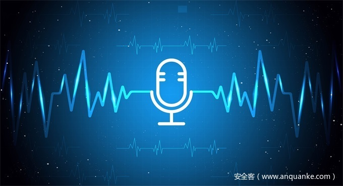

# 利用AI来攻击IA：一种针对智能手机语音助手功能的隐形间谍软件

                                阅读量   
                                **844300**
                            
                        |
                        
                                                                                                                                    
                                                                                            

##### 译文声明

本文是翻译文章，文章原作者arxiv，文章来源：arxiv.org
                                 原文地址：[https://arxiv.org/pdf/1805.06187.pdf](https://arxiv.org/pdf/1805.06187.pdf)

译文仅供参考，具体内容表达以及含义原文为准

## 0x01 Absert

智能个人助手（IA）又称语音助手（VA），作为一种人机交互机制，越来越受到人们的欢迎。大多数智能手机都有内置的语音助手，它们被授予了很高的特权，能够访问系统资源和私人信息。一旦语音助手被攻击者利用就成为攻击者入侵智能手机的跳板。本文提出了一个攻击框架记录用户的激活语音，并通过内置扬声器播放激活语音和攻击命令发起攻击，展示了对谷歌助手的POC。

本文开发了一个间谍软件应用程序用于POC，并将其伪装成一个受欢迎的控制麦克风的游戏应用程序，合理地请求访问麦克风的权限。 间谍软件秘密地记录呼入和呼出的呼叫，并通过采用自然语言处理（NLP）技术来合成激活关键词（例如“OK Google”）。 在合成激活关键词之后，间谍软件通过利用加速度计，环境光传感器和麦克风来监视并获得环境光和噪声数据。 收集的数据被送入基于机器学习的环境识别器，以确定是否是发起攻击的最佳时间。 下图中展示了所提出的攻击模型的工作流程。 在商业反病毒产品和学术的研究方案上测试结果显示无法检测到间谍软件。

## 0x02 Voice Assistant Primer

语音助手是人工智能领域的一个典型应用。它广泛用于人机对话、设备控制和身份验证。因为人类每分钟能说大约150个字，但平均每分钟只能写40个字，一个有效的语音识别功能对于智能手机或计算机等设备将语音转换成机器可读文本将非常有用。目前，语音助手技术已经嵌入到大多数智能手机和许多应用程序中，如Apple Siri、Google Now、Cortana和微信语音激活。这些产品非常智能，不仅识别出人类所说的话，而且识别出身份验证的说话者是谁。

现有的语音助手基本上包含两个功能：语音控制和反馈。他们可以通过重新接受请求和纯粹通过语音发送反馈来与人类互动，就像与真人交谈一样。由于语音助手通常在主机系统中具有高授权，因此人们可以通过输入声音来控制系统。第一步是发送激活命令（例如，用于iPhone的’hello，Siri’）以激活系统。一旦语音助手被激活，人们就可以通过语音发出请求/命令来执行特定功能，例如拨打电话，播放音乐，发送消息。开发的间谍软件将攻击安卓手机中的语音助手功能。基本思想是通过手机本身扬声器的声音激活语音助手。一旦语音助手被激活，间谍软件就可以通过同一频道发起一系列恶意操作。

## 0x03 Aaatck on Voice Assistants

#### A、攻击模型

为了保护安卓用户的隐私，安卓应用程序必须请求访问敏感用户数据（如SMS和联系人）以及系统功能（如摄像头和Internet）的权限。 目前的语音助手（例如Google智能助手和三星Bixby）已获得大量权限，其中一些是高风险权限，例如读取和写入私人信息，获取和设置电话设置以及访问系统资源。 一旦语音助手受到攻击，攻击者就可以通过向语音助手发送语音命令来控制设备，例如拨打特定号码的电话，通过电子邮件/短信发送当前地理位置，以及关闭蓝牙等。

攻击模型包括状态监测和语音记录（SMVR）、激活语音操作（AVM）、智能环境检测（IED）、语音助手激活和控制（VAC）。SMVR模块监控智能手机的状态，当智能手机上的麦克风被激活时（例如，有一个呼入/呼出的呼叫），它开始记录麦克风接收到的声音。然后AVM模块处理录制的语音并创建激活语音助手所需的激活关键词。

在IED模块中设计了一种新的场景识别方案，该方案通过智能手机上内置的传感器收集环境数据（如光照、噪声），并智能地将当前状态分为六个精心设计的真实场景之一，这决定了该方案是否适用于是发动攻击的合适时机，什么是最佳音量来播放攻击的声音。如果从IED模块得到的结果是正的，则VAC模块在由IED模块确定的一定音量内播放由AVM模块合成的激活语音和攻击命令。

#### B、激活语音操作

如果用户启用了语音激活选项，则可以通过触摸并按住Home（主页键）按钮或说出激活词（如“OK google”）来激活内置语音助手。语音激活命令由用户自己的语音进行训练，以确保语音助手只能由用户自己激活。但是除了用户说出激活词外重放用户录制的声音也可以激活语音助手。一旦语音助手被激活，随后的语音命令就不需要匹配用户的声音。只要语音命令可以识别，任何来源的语音命令都将由语音助手执行。从攻击者的角度来看，语音命令可以由攻击者预先录制音频文件，也可以通过智能手机上的内置文本到语音（TTS）服务生成。

激活关键词通常由一个问候词（如OK、Hi、Hey等）和语音助手的名字（如Google、Bixby、Siri等）组成。AVM模块的目标是获得用户所宣布的激活关键词的语音。本文记录的原始语音是长句子，因此使用语音识别技术来处理语音并合成激活关键字。提出了两种激活密钥合成方法，即基于词的操作和基于音节的操作。下图说明了这两种方法的过程：

**基于词的操作。**需要获得整个激活关键词的声音。录制完语音后，AVM模块提取激活关键词并将其存储为音频文件。由于一些激活关键词在日常会话中并不常见，因此可以使用社会工程攻击方法来提高记录整个激活关键词的机会。例如为了记录激活关键字“google”，攻击者可能会打电话给目标受害者，假装进行市场调查，询问“你通常使用哪个搜索引擎？”利用基于词的操作合成激活关键词的成功率在实验中达到了100%的成功率。

**基于音节的操作。**收集整个激活词是一项耗时的任务，尤其是当激活词包含一些专有名词时，如“Bixby”。因此，本文提出了一种基于音节的语音处理方法，只需要记录与激活词发音相同的音节。以激活词“ok，google”为例，“ok”包含两个音节（o-k），可以由“oh”和“cake”合成。google包含两个音节（goo-gle），可以由good和go合成。当检测到呼入/呼出呼叫时，AVM模块会记录相关的音节并将它们存储在音频文件中。一旦每个音节被记录下来，AVM模块就从收集的音节中合成激活关键词。尽管基于音节的操作更加灵活，但与基于单词的操作相比，它的成功率较低。由音节合成的大约40%的激活关键词可以成功激活语音助手。

## 0x03 Stealthy Attacking Module

#### A、挑战

当攻击者从用户那里获得激活语音后，会出现一个关键的问题没有回答，就是什么时候开始攻击？显然需要考虑的因素有很多，例如用户是否持有手机或与手机互动，发起攻击时用户是否会注意到声音，发起攻击时手机是否会“听到”声音，等等。这个问题很关键，因为一旦用户注意到攻击，他可能会调查这个问题，并且不会有第二次发起攻击的机会。为发动攻击而播放的声音的音量也是影响攻击成功的一个重要因素。音量应该足够低以避免被用户听到，并且足够高以确保智能手机可以接收到攻击语音命令。最佳音量取决于周围环境的噪音水平以及手机所处的真实环境。

#### B、触发算法

为了应对上述挑战，提出了一个智能环境检测模块，它决定何时发起攻击以及播放攻击声音的最佳音量是多少 。

**（1）传感器设置**

从麦克风、环境光传感器和加速度计收集数据。智能手机没有内置的噪声传感器，因此通过麦克风记录周围的声音，并用以下公式计算噪声级（分贝）：LdB = 10log10 (A1²/A0²)，其中A1是所记录声音的振幅，A0是设置为1的标准振幅。为了模仿运动模式，从加速度计中以50Hz的频率收集数据。为了节省功耗，每隔200毫秒收集一次噪声和光照数据，因为它们在短时间内比运动数据更稳定。所有采集到的数据都用最近邻插值法重新采样到50Hz。收集了系统API **PowerManager.isInteractive()**的锁屏打开/关闭状态，以及**AudioManager.getDevices()**的蓝牙和耳机连接状态。

**（2）数据收集**

收集了六种典型的现实场景中的训练数据，包括运动/静止状态、噪音/安静状态、亮/暗状态：

（a）在安静的道路上行走/慢跑；

（b）在公路上行走/跑步；

（c）在特定的地方行走；

（d）乘坐公共交通工具；

（e）开车/坐在车里；

（f）在餐馆吃饭。

在所有的场景中收集了将手机放在口袋里以及将手机放在手上的数据。本实验找到了十名志愿者，分别用谷歌 Pixel 2和三星Galaxy S9收集上述六个场景中的数据。他们都被告知了实验的目的，以确保他们的注意力不受其他环境因素的干扰。

实验中准备了一个能够成功激活设备中谷歌助手的激活语音，在实验开始后一到五分钟内随机播放。一旦谷歌助手被激活，攻击命令（文本格式）将从FireBase服务器中获取，并通过内置的文本到语音（TTS）服务进行播放，将记录志愿者是否注意到声音以及攻击命令是否被谷歌助手成功执行。请注意如果志愿者听到攻击声音则将攻击标记为失败，即使它是由谷歌助手成功执行的。下表显示了每个场景中的成功率。

从传感器收集到的数据是x，y，z轴上的噪声级，光级和加速数据。收集20组数据，每组3分钟。下图显示了从三个传感器在1分钟内收集到的数据。

**（3）噪声消除**

原始信号通常包含来自不同来源的噪声，例如传感器校准错误、传感器错误、传感器放置错误或噪声环境等。这些噪声信号会对信号的分割、特征提取产生不利影响，进而严重阻碍活动预测。在本文研究中，使用四阶Butterworth低通滤波器来去除噪音。下图对相同活动的传感器信号模式进行了比较。

**（4）特征提取**

下图说明了所提出的特征提取方法的框架，其中加速度计计算的特征为“运动强度”，从噪声传感器和光传感器提取的特征为“环境变量”。

使用“运动强度”特征来描述人类行为状态的整体视角。根据随机森林（RF）的类概率，将人类行为状态分为确定运动状态、确定静止状态和相对运动静止状态。RF不直接输出类标签，而是输出概率，然后根据概率是否超过某个阈值将标签分配给实例。将阈值超过60%概率的运动状态标记为确定运动状态，阈值超过60%概率的静止状态标记为确定静止状态，以及40%到60%概率的运动（或静止）状态标记为相对运动静止状态（如如下表所示）。

由于“运动强度”特征是分类值，机器学习算法无法直接使用它们，因此使用独热（one-hot）编码将所有“运动强度”特征转换为数值，如下表所示。应用环境变量的目的是为不确定的环境因素提供更具体的细节，如噪声级和光强度，这也会影响是否发动攻击的决定。

**（5）评价方法和结果**

在python 3.6中实现了所需的算法，使用scikit learn 0.17.1包（这是一个开源的python库）来实现机器学习算法[23]。基于四个指标来评估分类算法，分别是真正类率（TP）、F1度量、精度和召回率。下表显示了随机森林分类器基于20倍交叉验证检测有效攻击机会的总体性能。

下表显示了随机森林分类器的参数设置。

**（6）音量控制**

输出激活命令要求达到设备要捕获的一定音量。此触发音量受环境噪声级的影响。为了研究环境噪声如何影响触发音量，测试了足够的音量来激活语音助手以及触发语音攻击。在提出的攻击场景中，攻击语音命令通过智能手机的扬声器播放，因此不考虑声音源和设备之间的距离。下表显示激活语音助手和触发语音攻击的最小音量。

#### C、评价

下表显示了实验结果。计算了发动攻击的次数，就好像IED模块决定发动攻击一样。语音助手无法识别语音命令或者志愿者听到了语音命令，就认为攻击失败。在公交车场景中，发起了20次攻击，其中一次攻击失败，这是因为在执行攻击命令时突然安静下来，志愿者注意到了攻击的声音。在大学和课堂场景中，分别发起两次和零次攻击，因为在这两种场景中大多数情况下都很安静。在餐厅场景中，发起了19次攻击均成功。在超市场景中发起了12次攻击其中10次成功。两次失败中的一次是由志愿者注意到的攻击引起的，另一次是因为语音助手无法识别攻击命令。

## 0x03 Delivery &amp; Detection Avoidance

#### A、间谍软件传播

在安卓平台上开发了一个POC间谍软件来发起攻击。间谍软件执行恶意活动需要三个权限，分别是**RECORD_AUDIO**（录制用户的激活语音）、**INTERNET**（从FireBase服务器动态获取攻击命令）和**READ_PHONE_STATE**（监视呼入/呼出呼叫状态）。

间谍软件被伪装成一个流行的麦克风控制的游戏名为RocketGo。RocketGo的用户界面如下图所示。玩游戏时，玩家需要对着麦克风吹或尖叫。麦克风接收的音量越大，火箭飞得越快。游戏由麦克风控制，因此可以请求**RECORD_AUDIO**而不被用户怀疑。在游戏中声称游戏分数可以与联系人列表中的朋友共享，因此请求**READ_PHONE_STATE** 和**INTERNE**的许可。

实际上，这两种权限在安卓游戏中非常常见。google play上的前十大游戏中有五个要求获得**READ_PHONE_STATE**状态许可，而所有的前十大游戏都要求获得**INTERNET**许可。

当RocketGo启动时，它注册为一个服务，监视电话呼叫状态。一旦激活语音被成功合成，它就停止监视电话呼叫状态，并且从传感器上采集环境数据，寻找合适的时间进行攻击。即使用户关闭RocketGo应用程序，该服务也会在后台运行。在整个过程中用户不会得到任何提示。

#### B、对抗反病毒工具

针对商业反恶意软件工具和学术恶意软件检测解决方案测试了本文的间谍软件。根据候选应用程序是否需要执行，安卓恶意软件检测方法可以分为静态工具和动态平台。静态方法基于分析应用程序的静态特性，例如应用程序的组件、应用程序请求的权限以及代码本身。动态方法在受保护的环境中执行应用程序，提供所需的所有模拟资源，并观察其恶意活动。对于商业反病毒产品，在Virustotal上测试RocketGo，及在Google Play上最流行的10种反病毒工具，如Norton Security和Antivirus、Kaspersky Mobile Antivirus、McAfee Mobile Security等。他们都没有报告RocketGo是恶意的。还将RocketGo提交到谷歌应用商店，在那里提交的应用程序将根据其动态测试平台Google Bouncer进行测试。RocketGo成功地通过了谷歌Bouncer的检测。google bouncer和virustotal的检测结果如下图所示。在测试通过后立即从Google Play中删除了RocketGo应用程序。

## 0x05 Conclution

本文提出了一种针对智能手机上语音助手的隐形攻击方法。 攻击者可以激活语音助手并进行进一步的攻击，例如泄漏私人信息，发送伪造的SMS /电子邮件和拨打任意号码。 通过设计智能环境检测模块和选择最佳的攻击时间，从而可以使攻击不被用户注意到。 针对Android平台上的Google Assistant的POC攻击，我们证明了在实际场景中进行攻击的可行性。 这项研究可能会激发研究人员和操作系统供应商重新考虑语音助手的安全性。
