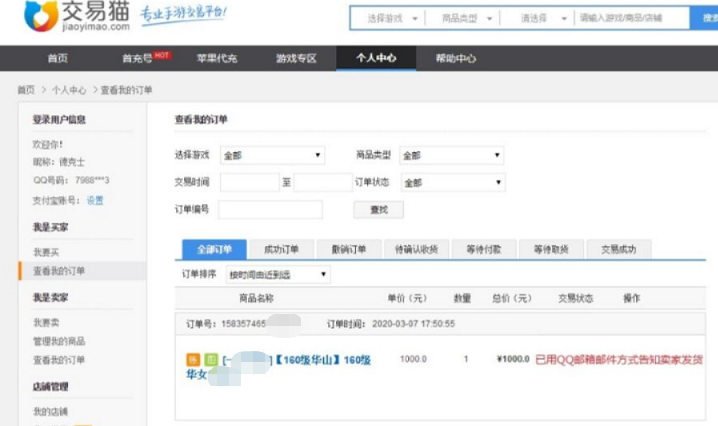

# 安全专家在线破解！游戏账号买卖诈骗全过程

                                阅读量   
                                **405093**
                            
                        |
                        
                                                                                    

之前，我们发现虚假网游交易使用的网站，会使用第三方的免费服务器搭建钓鱼网站的趋势。近期360手机先赔收到用户反馈，发现不法分子**使用第三方客服系统网站，冒充网游交易平台实施诈骗**的现象。

## 案件经过

用户在游戏交易平台上架出售游戏账号，收到来自平台的“买家”信息，对方以“下单需要填写买家信息”为由，索要了用户的QQ账号，随后收到“已下单，已用QQ邮箱邮件方式告知卖家发货”的截图。

用户QQ邮箱收到了平台“付款订单”邮件，用户访问了邮件里的平台网站链接，网站内客服**以“防止卖家不发货”为由，要求用户缴纳800元保证金**。用户按照客服指引使用支付宝进行扫码转账。随后客服**以用户“积分未达到安全转账”为由，要求用户继续转账**，随即发现受骗。

## 诈骗过程揭秘

在这类案件中，不法分子伪装成买家，制作虚假图片骗取用户QQ；再冒充平台给用户发送邮件，用户访问邮件里的链接时，**实际访问网址发生了跳转**。

**原理是使用了QQ邮箱的超链接功能**，文字“邮件内显示的内容“，链接”需跳转的网址“，测试：邮件内容虽然是www.360.cn 但点击实际访问是www.so.com。

## 现象分析

互联网产品在推广的过程中为了吸引用户使用，多采用免费试用的模式。试用的过程中往往无需填写详细的认证资料，因此出现了许多产品被黑灰产利用的现象。

综合以往案件溯源结果看，**提供第三方客服的平台因为门槛低、几乎没有条件限制，经常被虚假贷款、博彩平台非法利用，作为钓鱼网站的客服程序**。所以，类似提供第三方服务的一方，也要注意把控接入平台的资格验证，避免被黑灰产人员钻了空子。

