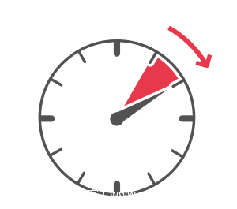

# 安全黄金法则：1分钟检测，10分钟调查，60分钟控制

                                阅读量   
                                **721138**
                            
                        |
                        
                                                                                    

对于现在组织机构而言，网络安全攻击无可避免，有效防护的关键是速度和准确度。当面临攻击时候，企业能做就是快速反应，包括：

 ●尽可能快检测事件 
 ●彻底调查该事件，发现你需要解决一切问题 
 ●在它爆发和造成危害之前控制住它

很多企业组织机构也知道速度的重要性，但是不确定如何将其转化为可衡量的标准。**在这里推荐1-10-60规则，即1分钟进行检测，10分钟进行调查，60分钟进行控制和补救。**努力遵守这一规则的组织能够更好地防范威胁，并在网络安全事件发生时成功地补救。

那么组织机构距离安全标准到底有多远？这正是本文需要探究问题，包括组织机构理解、检测和处理安全威胁的能力，以及他们检测速度是否足够快？是否知道哪些情况将他们置于危险之中？他们是否能在攻击者完成目标之前处理威胁。

## 1分钟去检测

时间是至关重要的。如果无法做到完全阻止入侵者访问入侵，那么就必须要能够尽快检测到入侵。然而，事实相反，经常出现入侵者在网络上停留几个月而不被发现。 
研究表明只有11%的受访者估计他们的组织能够在一分钟内检测到网络入侵者。而对于那些在第一线处理这些入侵的安全专家来说，只有9%的人相信他们组织能够在1分钟内检测到入侵。

平均而言，受访者估计他们的组织需要120小时来检测网络安全入侵或事件。这相当于5天昼夜不停地工作。想象一下，一个恶意的威胁攻击者在将近一周的时间里都没有被发现，可以造成多大的破坏。

对于很多组织机构而言，网络安全团队的主要关注点都不在检测。只有19%的人认为他们的组织要求他们将检测作为主要关注点，38%组织机构将关注点放在阻止访问方面。虽然从开始主动监视和避免攻击很重要，但面对攻击者日益复杂战术、技术和过程(TTPs)，使得避免被攻击已经不可能。

能否实现快速检测有可能是“意愿”问题，但对于大部分组织机构而言都是技能问题。32%组织由于遗留老旧资产对升级和安全构成挑战而放慢了速度。与此同时，网络安全部门的资源匮乏(30%)、影子IT(28%)、技能短缺(27%)也被认为是导致检测速度慢的最普遍原因。

然而，如果能实现一分钟的检测时间，这不仅可以减少入侵者接近、访问目标数据时间，而且还可以让组织在调查事件并最终控制事件方面有一个良好的开端。事实上，大多数人(86%)认为，能够在一分钟内探测到网络上的入侵者，将彻底改变游戏规则。

## 10分钟去调查

在完成检测之后，下一步是调查，以找出更多关于攻击情况、攻击者。毕竟，如果能够知道他们是谁，知道他们想要什么，就更容易阻止他们。近四成的受访者认为，当他们的组织受到攻击时，了解攻击者的经验、专业技能水平、动机是至关重要的。三分之二的受访者认为，更多地了解攻击者有助于更好地保护攻击者所针对的数据和文件。

然而，研究表明，在检测到威胁后，平均需要5个小时才能对其进行鉴别分类，6个小时后才能真正对其进行调查。即便在如此长时间下，也只有53%的组织机构发现了威胁攻击者的身份。

虽然，很多组织机构在调查之前，已经在检测上浪费了大量的时间。但是，必须对攻击者的行为和动机进行调查，以尽可能多地发现关于攻击者的信息，从而避免未来的目标和攻击。

尽管绝大多数(88%)的受访者认为“调查”将彻底改变他们的组织处理网络攻击的方式，但只有9%的人报告说他们有这种能力。大多数(88%)的受访者意识到，他们需要做更多的工作来理解网络攻击及其作恶者。

总体来说，调查了解攻击细节是非常重要的，包括谁在攻击，攻击期间发生了什么，攻击的范围，以及攻击者的动机是什么。这些信息可以帮助形成一个必要的和有效的响应步骤。

## 60分钟去控制

在大多数情况下，检测和调查都需要很长时间，组织需要多少时间来控制威胁？到那个时候，是不是太晚了？最重要的是，他们能有效地控制它吗?

三分之二(68%)的受访者承认，他们的组织需要很长时间才能在网络上控制入侵者。平均而言，遏制行动需要受访者组织31小时。

如果检测、分类和调查的平均时间考虑进去，就有另一个严肃的问题要问：一个熟练而有经验的攻击者在162小时不受阻碍地访问你的网络时能造成多大的破坏?

总体而言，只有5%的受访者相信他们的组织能够在一分钟内检测到网络安全事件，在10分钟内进行调查，并在60分钟内将其控制住。

80%的人都经历过这样的事件，一旦黑客侵入网络，安全人员就无法阻止入侵者完成目的。接近一半的受访者(44%)认为，检测时间过长是无法控制的根本原因。近四成的人认为，缺乏资源(39%)或技能(36%)来检测、调查和减轻这些攻击是罪魁祸首。

在检测和调查攻击之后，如果发现攻击者，那么采取对应的手段是不可缺少，包括加强组织网络安全培训、增加预算、采用更加主动安全策略（威胁狩猎）等去控制和缓解攻击情况。

## 如何实现1-10-60法则

对于网络安全事故的黄金标准——1分钟检测，10分钟调查，60分钟控制——似乎只有5%的组织能够做到。

绝大多数组织都在努力及时发现其环境中的威胁、调查黑客并遏制攻击。几乎整整一周过去了，很多组织甚至都没有发现攻击正在发生，而另两天过去了，攻击才得到有效的响应。检测、分类、调查和遏制网络攻击的平均时间为162小时。在这段时间内所造成的损失对企业来说可能是灾难性的。

调查显示，绝大多数组织认识到，他们应该更重视高速检测和攻击者突破预防，以及了解威胁行动者本身的能力。

很多组织已经意识到快速检测和响应的重要性，但是组织如何才能更接近1-10-60目标?他们必须做出哪些改变才能做到这一点?如果他们成功了，他们的组织能得到什么好处?

### 1.采用基于ATT&amp;CK框架与威胁情报相结合的解决方案

调查表明，高级威胁攻击者的持久性和软件供应链中的问题继续困扰着组织。如果没有全面部署有效的终端（含服务器端）安全解决方案的公司，将面临漫长的检测和响应时间，因为它们缺乏抵御网络攻击所需的全面可视化。

例如通过青藤Agent收集详细的服务器数据，结合当下最新ATT&amp;CK框架，使用TTP和绕过技术来识别隐秘的对手。以便在对手实现其目标并造成数据泄露之前迅速检测、调查和阻止入侵行为。

此外，威胁情报方案可以帮助构建安全技术栈，让防御者了解攻击者的动机和行为。这有助于安全团队更全面地了解事件，并做出更明智的决定，以应对未来的攻击。

### 2.下一代安全解决方案是关键

随着复杂攻击的不断发展，各种规模的组织都必须采用前沿技术，如行为分析、人工智能(AI)和机器学习(ML)。这些下一代安全解决方案不再仅仅是通过检测攻击指标(IOAs)，它侧重于在攻击过程中识别攻击者的活动，这可以帮助更快发现攻击行为。调查显示，全球侦测网络事件的平均时间为120小时。

使用那些能够进行预防和检测的安全平台来保护组织变得越来越重要。然而，防御者也必须寻找攻击可能正在进行的早期预警信号，包括代码执行、命令和控制活动以及网络中的横向移动。通过ML进行实时的上下文和行为分析，可以帮助检测这些警告信号并防止遗留技术经常遗漏的攻击，从而为防御者提供预防未来攻击的洞察力。（文/青藤云安全）
