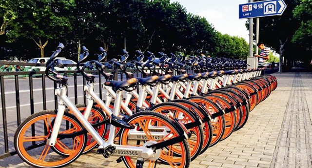
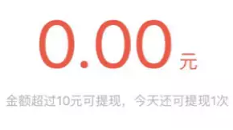

# 挖社会主义墙角，薅共享单车羊毛

                                阅读量   
                                **87900**
                            
                        |
                        
                                                                                    

共享单车倒贴钱让你骑，你骑不骑？还可以提现，这是一个历史性的转折点。一定要记录下来，这也侧面标志着共享单车打响了新一轮的“烧钱战”。不由得开动灰产思维想一下，挣钱的机会来了。

 

**红包车与灰产机会**

共享单车推出了红包车，规则是至少骑行10分钟，红包1元起，骑行到地铁站等需求中心有机会拿到100元的红包，累积10元可提现。

下图显示了一个红包单车的密集点：

从地图上看该地地貌如下：

这是上海南部的一个工厂区，附近人烟比较稀少。与单车的宣传相对照，可以看出红包车应该是停放到偏远地点，有一段时间没人用的车。

 

**羊毛党如何“生产”红包车？**

基于目前红包车的算法，羊毛党搜索附近的共享单车，用面包车拉到偏僻地方上锁，刷新应用，等待变成红包车，同时用微信等手段招揽红包猎手（单车红包的羊毛党）。

如果红包车平台规则不严，可以解锁后批量拉到地铁站等处获得较高额度红包，而且还可以顺手把地铁站的非红包车收回来，构成循环。

从目前笔者朋友圈晒出的截图、官方晒出的截图来看，单车红包平均不会太小，否则起不到刺激作用，但如果大一些的话，便会刺激薅羊毛产业。

单车红包推出的本意是应对共享单车的潮汐效应，用红包鼓励用户将单车从需求不旺的地点向需求旺盛的地点骑行调配。而对羊毛党来说，多找几个人，收车，养红包，变现，一条龙循环运作，从而达到收益最大化目的。

我们算一下若平均每车可获得10元，最多可以薅多少？

假设一个羊毛党每天不间断工作8小时，红包车骑10分钟会有领取红包的机会。若红包每单平均10元，即每人每天的羊毛480元。

对于有空就钻的羊毛党而言也是一笔不错的收益。

共享单车设计规则时，一定不要低估恶意规则利用者的破坏力。如果红包车制度在悬赏金额、红包产生机制、发放规则中不做好对恶意红包猎手的防范，有可能运行结果会是有人在偏远地区囤积共享单车养红包，反而进一步加剧共享单车分布的不平衡。

 

**如何防范“薅羊毛”**

魔高一尺，道高一丈，今天我们从几个角度来说说如何防范薅羊毛。

**1）欺诈网络图谱**

首先，薅单车毛必不可少的是手机账号，而同一个账号频繁操作，共享单车系统必然也会发起警报，大多数羊毛党会利用多个手机多个账户协同操作，为了方便大家理解，请看下面的网络图谱：

红色点表示不同设备；

绿色点表示不同账号；

蓝色点表示不同共享单车；

红色点和绿色点之间的虚线表示：该设备注册了这个账号；

蓝色点与绿色点之间的虚线表示该账号领取了这个共享单车的某些奖励；

上面的左图是正常用户的行为网络图谱：不同设备的行为是分散的，不一致的，而右边是“公会式羊毛党”的行为网络图谱。

在网络图谱上，羊毛党的设备行为会呈现出高度的一致性和集中性，羊毛党经常通过网络发起组织，在一些单点特征上，同正常用户一样呈现出分散的特点，使得单点防御难以奏效。

但如果将用户行为用网络的形式建模展示，会发现在一些特殊的图形特征上，欺诈行为明显异于正常行为，这样就会判断哪些会是羊毛党，进一步筛选。

**2）用户行为信息**

借助全栈被动式设备指纹系统，在会话和账号两层采集和提取用户行为信息。在会话层面上，将用户的行为模式，如事件发生的次序、发生的间隔时间，归为几类，在此基础上识别出异常行为模式。

在账号的层面上，将会话层面上提取到的行为信息按时间串联起来，得到账户层面的异常行为标示，其次根据账号相关联的历史行为数据，提取出用户的偏好属性，比如是否为僵尸账号，相邻登录的平均地理距离等。最后，我们将这些信息综合起来，形成特有的用于反欺诈的用户画像。 

当一个账号再次出现在业务中时，用户画像中的特征就可以帮助我们评估对应业务事件的风险。

在实践中，笔者发现，由“羊毛党”控制的账号，通常具有某些相似性，比如所用手机号码都来自某个号段，用户名都由三个小写字母，五个大写字母和四个数字组成。据此，我们就可以定义账号之间的相似度。这样即使一个账号首次出现，我们也可以使用用户画像，对其风险做一个大致的评估。 

共享单车用有趣的方式引导人们将车停到更需要单车的区域，让更多的用户有车骑、骑好车，提高运营效率。笔者在截稿时也发现，周围的红包车比前几天会多一些，看来共享单车也在不停完善规则、算法。作为反欺诈业内从业者，会多多关注共享单车行业，提出更优质的反欺诈解决方案，我们下期再见～
