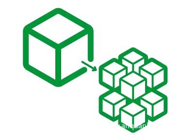

# 新时代的渗透思路！微服务下的信息搜集（II）

                                阅读量   
                                **854451**
                            
                        |
                        
                                                            评论
                                <b>
                                    <a target="_blank">4</a>
                                </b>
                                                                                    

我是掌控安全的咸鱼-魔术手，上次讲了 ****微服务下的信息收集(一)****，这次来水一下 ****微服务下的信息收集(II)****。

上次介绍了一个公司的站点可能由各个独立在不同服务器上的服务组成，所以我们需要想尽办法找到更多的域名；为了更好的测试我们也需要找到更多的`目录`和`参数`。上次介绍可以从目标的微信小程序搜集域名，也介绍了一款可以帮助我们收集目标`js`里子域名和url的工具`JSFinder`。这次我们继续介绍如何收集更多的资料，以下所有内容都是围绕同一个站点进行，目标域名`abc.com`，但是因为一些原因，真实站点截图无法放出，部分截图为某公益src项目信息收集截图。

## 相关域名发现
<li>备案查询 
绝大多数网站都是有备案信息的，可以通过备案信息查询。如下图，通过[备案查询](http://icp.chinaz.com/),我们找到另一个站点`xyz123.com`(该截图来自对某公益src站点的采集，并非原目标)。 
</li>
<li>证书透明度公开日志枚举 
证书透明度（Certificate Transparency,CT）是证书授权机构（CA）的一个项目，证书授权机构CA会将他们发布的每个SSL/TLS证书发布到公共日志中。一个SSL/TLS证书通常包含域名、子域名和邮件地址，它们也经常成为攻击者非常希望获得的有用信息。因为目标是个大型站点，用这种方法找到的几率比较大。如下图，在`https://crt.sh/`中查询(该截图来自对某公益src站点的采集，并非原目标)： 
</li>
<li>dns等 
这里还有很多方法，太过繁琐，直接上工具，这次用的工具是[`oneforall`](https://github.com/shmilylty/OneForAll)，功能很多，各位感兴趣可以自己研究。(该截图来自对某公益src站点的采集，并非原目标) 
</li>
通过上面的收集，除了发现很多有意思的子域名，而且搜索到了如`xyz123.com`和`ddba.com`等和目标相关的域名。

## 服务划分

对上面找到的域名逐个访问，对得到的内容进行简单处理，发现目前搜集到的服务(能访问的域名)主要有`展示站`，`综合运营管理平台`和`广告服务`。找到他们所对应的服务器，发现每个服务都至少都包含2台服务器，如图：

在上面的所有域名和IP中，有两个挺有趣的，一个是`office.abc.com`,一个是`xxxxx.abc.com`,为什么有趣呢，一是因为名称`office`听起来就像是办公服务，另一个是IP，其余的服务器IP都是`11*.*.*.*`或者是`14*.*.*.*`，就他俩特殊，所以这俩待会要重点关照。

在上篇文章中说过，微服务是由很多个独立的服务组合而成的，而上面收集到的服务看起来不像是所有的服务，毕竟上面是被动的信息收集，搜集的内容有限。假设上面搜集到的服务器是目标的大部分服务器，那么如果目标还有其它服务，我们该怎么办呢？答案是扫描端口。

## 端口扫描

在端口扫描时需要注意的是，因为一台服务器上可能有很多服务，所以这里在扫描的时候需要扫描全部端口，这里使用`nmap -sC -T4 -p 1-65535`重点扫描了那两台服务器，发现了两个有意思的地方，如下：

第二个是一个很厉害的服务，估计是处于开发中，访问页面默认填充账户密码，所以这里不放图了(认怂保平安)。

## 隐私文件探测

在上一篇文章微服务的介绍途中，有一部分是通过git管理的。

于是随手在目标站输入个`abc.com/.git`,得到`403`的反馈。

于是继续随手输入`abc.com/.git/config`

再然后我又顺手输入了很多东西，得到了很多东西，甚至包括开发人员的姓名，邮箱，甚至是内网ip分布和git所在服务器的位置。

## API探测

在上一篇文章中提出可以通过`js`收集`api`的相关信息，但是有些站点使用了`webpack`:

本质上，webpack 是一个现代 JavaScript 应用程序的静态模块打包器(module bundler)。当 webpack 处理应用程序时，它会递归地构建一个依赖关系图(dependency graph)，其中包含应用程序需要的每个模块，然后将所有这些模块打包成一个或多个 bundle。

`webpack`会把所有的`js`信息打包在一起，这样的好处是前后端分离，但同样的，它也会把所有的`api`暴露出来。如下图，直接查看目标源代码：

我们可以逐个点击每个`.js`文件去探寻，这里找到一个`source map`:

通过该`source map`文件可以还原网站原始代码，有两种方法：
<li>使用浏览器自带的解析功能(以火狐举例) 
</li>
<li>使用工具 <blockquote>npm install -g source-map-unpack  </blockquote>
</li>
这样我们就可以在里面找到更多的信息。

微服务下的信息收集就是那么有意思，通过逐步探测，如同盲人摸象那样找到每一个服务，然后拼凑出一个整体。这次的站点是一个典型的由微服务构成的，但站点性质特殊，所以收集到的内容都是疯狂脱敏的，各位理解万岁。
