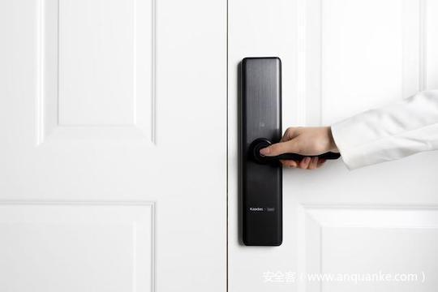

# 浅谈智能门锁离合器安全设计

                                阅读量   
                                **562010**
                            
                        |
                        
                                                                                    

说起智能门锁与传统门锁的区别，大家都能信手拈来，比如，前者支持指纹、密码、蓝牙、NFC，个别甚至还有 4G/5G 模块，然而，很多人忽视了在机械方面智能门锁也存在一个特别的结构——离合器。

以执手门锁为例，所谓离合器，即外执手与锁舌之间的动力传动开关，一般来说，当离合器处于分离状态时，扭动外执手只能空转，并不能开门，而当离合器处于接合状态时，则能带动锁舌开门。

为了设计一个离合器，广大工程师们的思路又是百家争鸣，难免有意或无意地犯一些错误，进而让用户暴露在危险之下。因此，针对市面上门锁离合器常见设计方案，笔者进行了整理及安全分析，希望引起安全研究人员及普通消费者重视。

## 一、按照有无离合器分类

*** 有离合器：**

大多数智能门锁都具有离合器，如小米米家智能门锁系列均属于此类，收到开锁指令后，需人工扭动外执手或推拉门把手开门。

*** 无离合器：**

少数智能门锁采用全自动锁体，即锁体内置电机，收到开锁指令后，电机带动锁舌开门，无需外力，体验上略胜一筹，防盗安全性高，但由于采用了电子锁体，可靠性下降，在火灾、返潮等场景下可能导致无法电子开门，所以通常都会保留机械开门渠道兜底，另一方面电机耗电量也相对比较大。

## 二、按照离合作用机制分类

*** 连接型离合器：**

即通常所说的离合，在分离状态时，扭动执手无法开门，在接合状态时，才能带动锁舌开门，未作特别说明，下文中所有离合均属于此类型。

*** 阻挡型离合器：**

严格来讲并不符合离合器定义（a mechanism for connecting and disconnecting an engine and the transmission system），一般是一个金属插销，在未收到开锁指令常态下，插销插入方钢套内阻止其转动，直观上讲就是执手拧不动。

显然此离合器的安全性就取决于插销的物理强度，然而市面上不乏大量低强度金属插销产品，攻击者只需强行扭动门把手即可开门，该设计有百害而无一利，应当被淘汰。

## 三、按照离合安装位置分类

*** 外置离合器：**

离合器位于前面板，结构非常简单，如下图案例所示，在未收到开锁指令时，插销并未插入离合轴内，所以扭动执手，方钢不会跟随旋转。

一般来说，假插芯门锁都会采用这种设计，能降低企业生产成本，对用户而言维修成本也非常小。

但是很显然，这种设计类似于Web登陆系统把密码判断逻辑放在客户端 JavaScript 中实现，攻击者只需绕开离合器这一关，就可以开门，要么把前面板撬开手动接合离合器，要么把前面板跟门板之间撬开一道缝，用工具夹紧方钢扭动，不是问题。

*** 中置离合器：**

离合器位于锁体内，与其它方案不同的是，不再是一根方钢贯穿前后面板，而是分为相互独立的外方钢、内方钢，如下图案例所示，在未收到开锁指令时，扭动外执手，只能带动离合块转动，无法开门，在收到开锁指令后，离合销插入离合孔内，外方钢带动离合块，离合块可带动拨片块转动，进一步控制开锁机构开门。

由此可见，即使拆掉前面板，攻击者也无法开门，防盗安全性高。然而同样，由于锁体接有供电线、信号线，可靠性下降，在火灾、返潮等场景下可能导致无法电子开门。

*** 内置离合器：**

离合器位于后面板，如下图案例所示，方钢穿过锁体，但不能直接控制锁舌，必须经由内把手回转件才能控制，在未收到开锁指令时，方钢套与内把手回转件处于分离状态，所以扭动门外执手，只会带动方钢、方钢套旋转，无法带动内把手回转件进一步控制锁舌开门，在收到开锁指令后，动力装置推动顶销至方钢套上的侧面圆孔，将方钢套与内把手回转件连接起来，扭动门外执手，即可带动整个传动系统开门。

可见该设计将离合置于后面板，防盗安全性高，同时并不需要电子锁体，在稳定可靠性上也不会打折扣。

**注：离合器只是组成智能门锁的零件之一，离合器安全性不能直接影响智能门锁整体安全性，本文不能作为选购门锁唯一依据。**

**[参考文献]**

1.刘仁祥，冯叶，梁龙驱，CN208294262U 一种电子锁复合离合器

2.蔡永梁，CN209568792U 一种锁体离合装置

3.陈正华，倪慧珍，刘黎军，卢荣，孟涛，CN204663159U 一种顶板式返离合组件

