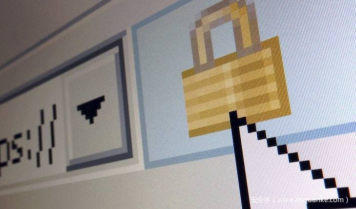

# 烈火烧不尽的“恶性毒草”—— 摩诃草APT组织的攻击活动

                                阅读量   
                                **817722**
                            
                        |
                        
                                                            评论
                                <b>
                                    <a target="_blank">5</a>
                                </b>
                                                                                    

## 一.概述

印度背景的APT组织代号为APT-C-09，又名摩诃草,白象,PatchWork, angOver,VICEROY TIGER,The Dropping Elephan。

摩诃草组织主要针对中国、巴基斯坦等亚洲地区国家进行网络间谍活动，其中以窃取敏感信息为主。相关攻击活动最早可以追溯到2009年11月，至今还非常活跃。在针对中国地区的攻击中，该组织主要针对政府机构、科研教育领域进行攻击，其中以科研教育领域为主。

摩诃草组织最早由Norman安全公司于2013年曝光，随后又有其他安全厂商持续追踪并披露该组织的最新活动，但该组织并未由于相关攻击行动曝光而停止对相关目标的攻击，相反从2015年开始更加活跃。

从2009年至今，该组织针对不同国家和领域至少发动了3波攻击行动和1次疑似攻击行动。整个攻击过程使用了大量系统漏洞，其中至少包括一次0day漏洞攻击;该组织所采用的恶意代码非常繁杂。载荷投递的方式相对传统，主要是以鱼叉邮件进行恶意代码的传播，另外部分行动会采用少量水坑方式进行攻击；值得关注的是，在最近一次攻击行动中，出现了基于即时通讯工具和社交网络的恶意代码投递方式，进一步还会使用钓鱼网站进行社会工程学攻击。在攻击目标的选择上，该组织主要针对Windows系统进行攻击，同时我们也发现了存在针对Mac OS X系统的攻击，从2015年开始，甚至出现了针对Android OS移动设备的攻击

Gcow安全团队追影小组于2019.11月底通过监测的手段监测到了该组织的一些针对我国医疗部门的活动.直至2020.2月初,摩诃草APT组织通过投递带有恶意宏文件的xls文件,以及使用带有诱饵文档通过点击下载托管于GitHub上的downloader样本,以及用相应的钓鱼网站,用以侦探情报等一系列活动.这对我国的相关部门具有很大的危害,追影小组对其活动进行了跟踪与分析,写成报告供给各位看官更好的了解该组织的一些手法。
- 当然肯定有人会问为什么你说的简介里摩诃草组织这么厉害,而这次活动却水平不如之前呢?
- 本团队的追影小组主观认为因为这次活动只是该组织下的CNC小组所开展的活动，文末会给出相应的关联证据.不过这只是一家之言还请各路表哥多加批评
注意：文中相关IOCs由于特殊原因不给予放出,敏感信息已经打码处理

## 二.样本分析

### 2.1分析文档(武汉旅行信息收集申请表.xlsm)

该诱饵文档托管于该网址上

[http://xxx-xxx.com/%E6%AD%A6%E6%B1%89%E6%97%85%E8%A1%8C%E4%BF%A1%E6%81%AF%E6%94%B6%E9%9B%86%E7%94%B3%E8%AF%B7%E8%A1%A8.xlsm](http://xxx-xxx.com/%E6%AD%A6%E6%B1%89%E6%97%85%E8%A1%8C%E4%BF%A1%E6%81%AF%E6%94%B6%E9%9B%86%E7%94%B3%E8%AF%B7%E8%A1%A8.xlsm)

**2.1.1.诱饵文档**

这是一个含有宏的xlsm电子表格文件，利用社会工程学的办法,诱使目标”启用内容”来执行宏恶意代码

提取的宏代码如下

**2.1.2. 恶意宏代码**

当目标启用内容后就会执行Workbook_Open的代码

DllInstall False, ByVal StrPtr(Sheet1.Range(“X100”).Value)

通过加载scrobj.dll调用

远程加载[http://45.xxx.xxx.67/window.sct](http://45.xxx.xxx.67/window.sct),这种是利用Microsoft系统文件的LOLbin以绕过杀软的监测，达到远程执行代码目的。

其中Sheet1.Range(“X100”).Value 是小技巧，将payload隐藏在Sheet1中，通过VBA获取下载地址，起到一定混淆保护效果

**2.1.3. 恶意sct文件(windows.sct)**

通过windows.sct再下载到到启动目录，并重名为Temp.exe,并运行该程序

如下图

系统启动文件夹

**2.1.4.后门分析(msupdate.exe)**

文件信息:

主要功能:

1.自身拷贝到当前用户的AppData\Roaming和C:\Microsoft目录下并重命名msupdate.exe,并且创建并写入uuid.txt，来标识不同用户

2.通过com组件创建计划任务，实现持久化控制。

3.与服务器进行C&amp;C通讯，实现了shell,文件上传与下载(ftp),获取屏幕快照功能，达到完全控制目标。

获取uuid通知主机上线

通过http协议与服务器进行通讯，并获取相关指令

上线指令

反向Cmd Shell相关代码

文件上传相关代码

文件下载相关代码

屏幕快照相关代码

### 2.2 分析文档(卫生部指令.docx)

该文档托管于

[http://xxx-xxx.com/h_879834932/%E5%8D%AB%E7%94%9F%E9%83%A8%E6%8C%87%E4%BB%A4.docx](http://xxx-xxx.com/h_879834932/%E5%8D%AB%E7%94%9F%E9%83%A8%E6%8C%87%E4%BB%A4.docx)

**2.2.1 诱饵文档**

**2.1.2 Downloader分析**

诱使目标点击提交按钮，触发Shell.Explorer.1 从internet Explorer下载并运行submit_details.exe木马程序.

文件信息:

功能分析:

1.建立计划任务

2.收集目标机器名，ip，等信息

3.下载后门程序

通过Github 白名单下载文件，绕过IDS检测.

部分代码

4.获取Github上的文件下载路径，目前文件已被删除

### 2.3 钓鱼网站

钓鱼网址为[http://xxx-xxx.com/submit.html](http://xxx-xxx.com/submit.html)伪装成某部门的调查表,收集人员信息

通过whois查询，网站是2020年1月23日注册，2月6日更新后停止访问

## 三.关联分析

该活动与摩诃草APT组织旗下的CNC小组有着很多的联系

CNC小组取名来自360于2019年底发布的报告《南亚地区APT组织2019年度攻击活动总结》中提及的摩诃草使用新的远程控制木马,同时通过其pdb路径信息中包含了cnc_client的字样,故命名为cnc_client小组.在此次活动中,该组织的特征与之高度类似,故团队猜测该活动的作俑者来源于摩诃草旗下的CNC小组

下面我们将向各位看官详细的描述这几点相同之处

(左边的图来自于360的年度报告,右边的图来自于本次活动的截图)

1).反向shell功能:

2).文件上传功能

3).文件下载功能

并且在该所会连的域名中出现了cnc的字眼,故本小组大胆猜测该小组对原先的cnc_client进行了进一步的修改,但是其主体逻辑框架保持不变。在侧面上反应了该组织也很积极的修改相关的恶意软件代码以躲避杀毒软件的侦查

## 四.总结

在这次活动中摩诃草组织为了增加其攻击活动的成功性,在诱饵文档中使用了某部门的名称和某部门的徽标以增加其可信性,同时在其托管载荷的网站上引用了nhc这个字符串,Gcow安全团队追影小组在此大胆推测,该组织使用鱼叉邮件的方式去投递含有恶意文档url的邮件.同时在这次活动中所出现的url上也存在”nhc”,”gxv”,”cxp”等字眼,这很大的反应出攻击者对中国元素的了解,社会工程学的使用灵活以及拥有一定的反侦查能力,这无疑是对我国网络安全的一次挑战,还请相关人士多多排查,培养员工安全意识也是重中之重的.

最后本小组也想发发牢骚,其实这样的活动不能说天天都有,但是每一周有一次的频率还是存在的。印度趁人之危固然不对,但是某些借此炒作,搞流量变现的,连样本都没分析透彻,只看只言片语就对该组织的手法以及该国家的网络安全实力立下高判,将自己的无知言论变为吸引别人为自己谋取利益的某些高手。把不正确的情况与思想带给你的关注者,让他们对真实的情况并不了解甚至低估,您难道不觉得心痛吗?这对得起你前辈的初衷吗?鄙人沥肝劝君,万不可一知半解而授业于人。

注意:这里不针对任何个人和团队,只是发发牢骚,说说心里话罢了,切勿对号入座,非常感谢。所说一切,愿与各位共勉也期望各位监督。

## 五.相关IOC
<td valign="middle">IOCS</td><td valign="middle">名称</td>
<td valign="middle">SHA1:ffxxxxxxxxxxxxxxxxxxxxxxxxxxxxxxxf80b709</td><td valign="top">武汉旅行信息收集申请表.xlsm</td>
<td valign="middle">SHA1:4fxxxxxxxxxxxxxxxxxxxxxxxxxxxxxxxx02b3f2</td><td valign="top">卫生部指令.docx</td>
<td valign="middle">SHA1:44xxxxxxxxxxxxxxxxxxxxxxxxxxxxxxxxaa29b0</td><td valign="top">msupdate.exe(windows.jpeg)</td>
<td valign="middle">SHA1:76xxxxxxxxxxxxxxxxxxxxxxxxxxxxxxxx7b1b65</td><td valign="top">submit_details.exe</td>
<td valign="middle">SHA1:aexxxxxxxxxxxxxxxxxxxxxxxxxxxxxxxx3c72e7</td><td valign="top">windows.sct</td>
<td valign="middle">SHA1:6cxxxxxxxxxxxxxxxxxxxxxxxxxxxxxxxxxx2a92</td><td valign="top">32368288_lopi9829</td>
<td valign="middle">C2</td><td valign="top">[https://185.xxx.xx.24/cnc/register](https://185.xxx.xx.24/cnc/register) [https://185.xxx.xx.24/cnc/tasks/request](https://185.xxx.xx.24/cnc/tasks/request) [https://185.xxx.xx.24/cnc/tasks/result](https://185.xxx.xx.24/cnc/tasks/result) [https://45.xxx.xx.168/qhupdate/pagetip/getconf](https://45.xxx.xx.168/qhupdate/pagetip/getconf) [https://45.xxx.xxx.168/qhupdate/pagetip/cloudquery](https://45.xxx.xxx.168/qhupdate/pagetip/cloudquery)[https://45.xxx.xxx.168/qhupdate/msquery](https://45.xxx.xxx.168/qhupdate/msquery) </td>

<td valign="middle">URL</td><td valign="top">[http://xxx-xxx.com/submit.html](http://xxx-xxx.com/submit.html)[http://xxx-xxx.com/%E6%AD%A6%E6%B1%89%E6%97%85%E8%A1%8C%E4%BF%A1%E6%81%AF%E6%94%B6%E9%9B%86%E7%94%B3%E8%AF%B7%E8%A1%A8.xlsm](http://xxx-xxx.com/%E6%AD%A6%E6%B1%89%E6%97%85%E8%A1%8C%E4%BF%A1%E6%81%AF%E6%94%B6%E9%9B%86%E7%94%B3%E8%AF%B7%E8%A1%A8.xlsm)[http://xxx-xxx.com/h_879834932/%E5%8D%AB%E7%94%9F%E9%83%A8%E6%8C%87%E4%BB%A4.docx](http://xxx-xxx.com/h_879834932/%E5%8D%AB%E7%94%9F%E9%83%A8%E6%8C%87%E4%BB%A4.docx)[http://45.xxx.xxx.67/window.sct](http://45.xxx.xxx.67/window.sct)[http://45.xxx.xxx.67/window.jpeg](http://45.xxx.xxx.67/window.jpeg)[http://185.xxx.xxx.24/windows.sct](http://185.xxx.xxx.24/windows.sct)[https://github.com/xxxxxx/xx_7xxxxx988/blob/master/submit_details.exe](https://github.com/xxxxxx/xx_7xxxxx988/blob/master/submit_details.exe)[https://raw.githubusercontent.com/xxxx268/meetingid/master/syncup/token.txt](https://raw.githubusercontent.com/xxxx268/meetingid/master/syncup/token.txt)[http://185.xxx.xxx.139/winmail/kt_new.png](http://185.xxx.xxx.139/winmail/kt_new.png)[https://api.github.com/xxxxx/xxxxxx/memeeting/git/blobs/d956fbd55581e178658dd908cb36cd93431cd9e1](https://api.github.com/xxxxx/xxxxxx/memeeting/git/blobs/d956fbd55581e178658dd908cb36cd93431cd9e1)[https://chinaxxxxx-nexx.com/n2012228aumki7339990n/32368288_lopi9829](https://chinaxxxxx-nexx.com/n2012228aumki7339990n/32368288_lopi9829)[http://xxx-xxx.com/form.html?OZBTg_TFORM](http://xxx-xxx.com/form.html?OZBTg_TFORM)</td>

[http://xxx-xxx.com/h_879834932/%E5%8D%AB%E7%94%9F%E9%83%A8%E6%8C%87%E4%BB%A4.docx](http://xxx-xxx.com/h_879834932/%E5%8D%AB%E7%94%9F%E9%83%A8%E6%8C%87%E4%BB%A4.docx)

[http://45.xxx.xxx.67/window.jpeg](http://45.xxx.xxx.67/window.jpeg)

[https://github.com/xxxxxx/xx_7xxxxx988/blob/master/submit_details.exe](https://github.com/xxxxxx/xx_7xxxxx988/blob/master/submit_details.exe)

[http://185.xxx.xxx.139/winmail/kt_new.png](http://185.xxx.xxx.139/winmail/kt_new.png)

[https://chinaxxxxx-nexx.com/n2012228aumki7339990n/32368288_lopi9829](https://chinaxxxxx-nexx.com/n2012228aumki7339990n/32368288_lopi9829)
