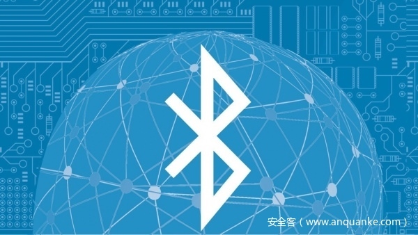

# 蓝牙安全之Class of device

                                阅读量   
                                **635203**
                            
                        |
                        
                                                                                    

> sourcell@海特实验室

Class of device，简称 CoD，用于描述一个 BR/EDR 设备的类型。

本地设备发起 inquiry (`HCI_Inquiry` command) 后，远端处于 inquiry scan 状态的设备会响应一些基本数据。这些数据被 controller 封装在 event 中返回给 host。CoD 则是这些 event 中的一个参数。此时包含可能 CoD 的 event 如下：
<li>
`HCI_Inquiry_Result` event</li>
<li>
`HCI_Inquiry_Result_with_RSSI` event</li>
<li>
`HCI_Extended_Inquiry_Result` event</li>
另外当本地设备收到远端设备的连接请求时，将收到 `HCI_Connection_Request` event。该 event 也会携带 CoD。

## 解析 CoD 结构

CoD 的格式是可变的，具体的格式由 Format Type 字段指定。其中最常见的格式是 “format #1”，且其他格式极其罕见。此时 CoD 是一个大小为 3 bytes 的数值，它的结构如下图所示（1st byte 为最高字节）：

下面将分别解释组成 CoD 的 3 个主要字段 Service Class, Major Device Class 与 Minor Device Class。

### Service Class

> 下面为 0 的位被保留使用

<tr style="margin: 0px; padding: 0px; max-width: 100%; box-sizing: border-box; break-inside: avoid; break-after: auto; border-top-width: 1px; border-top-style: solid; border-top-color: #dfe2e5; word-wrap: break-word;" data-darkmode-bgcolor="rgb(43, 43, 43)"><th style="margin: 0px; padding: 6px 13px; word-break: break-all; border-width: 1px 1px 0px; border-top-style: solid; border-right-style: solid; border-left-style: solid; border-top-color: #dfe2e5; border-right-color: #dfe2e5; border-left-color: #dfe2e5; background-color: #f7f7f7; max-width: 100%; box-sizing: border-box; text-align: center; word-wrap: break-word;" data-darkmode-bgcolor="rgb(43, 43, 43)">Flag</th><th style="margin: 0px; padding: 6px 13px; word-break: break-all; border-width: 1px 1px 0px; border-top-style: solid; border-right-style: solid; border-left-style: solid; border-top-color: #dfe2e5; border-right-color: #dfe2e5; border-left-color: #dfe2e5; background-color: #f7f7f7; max-width: 100%; box-sizing: border-box; text-align: center; word-wrap: break-word;" data-darkmode-bgcolor="rgb(43, 43, 43)">Description</th><th style="margin: 0px; padding: 6px 13px; word-break: break-all; border-width: 1px 1px 0px; border-top-style: solid; border-right-style: solid; border-left-style: solid; border-top-color: #dfe2e5; border-right-color: #dfe2e5; border-left-color: #dfe2e5; background-color: #f7f7f7; max-width: 100%; box-sizing: border-box; text-align: left; word-wrap: break-word;" data-darkmode-bgcolor="rgb(43, 43, 43)">Example</th></tr>|------

### Major Device Class

<tr style="margin: 0px; padding: 0px; max-width: 100%; box-sizing: border-box; break-inside: avoid; break-after: auto; border-top-width: 1px; border-top-style: solid; border-top-color: #dfe2e5; word-wrap: break-word;" data-darkmode-bgcolor="rgb(43, 43, 43)"><th style="margin: 0px; padding: 6px 13px; word-break: break-all; border-width: 1px 1px 0px; border-top-style: solid; border-right-style: solid; border-left-style: solid; border-top-color: #dfe2e5; border-right-color: #dfe2e5; border-left-color: #dfe2e5; background-color: #f7f7f7; max-width: 100%; box-sizing: border-box; text-align: center; word-wrap: break-word;" data-darkmode-bgcolor="rgb(43, 43, 43)">Value</th><th style="margin: 0px; padding: 6px 13px; word-break: break-all; border-width: 1px 1px 0px; border-top-style: solid; border-right-style: solid; border-left-style: solid; border-top-color: #dfe2e5; border-right-color: #dfe2e5; border-left-color: #dfe2e5; background-color: #f7f7f7; max-width: 100%; box-sizing: border-box; text-align: center; word-wrap: break-word;" data-darkmode-bgcolor="rgb(43, 43, 43)">Description</th><th style="margin: 0px; padding: 6px 13px; word-break: break-all; border-width: 1px 1px 0px; border-top-style: solid; border-right-style: solid; border-left-style: solid; border-top-color: #dfe2e5; border-right-color: #dfe2e5; border-left-color: #dfe2e5; background-color: #f7f7f7; max-width: 100%; box-sizing: border-box; text-align: left; word-wrap: break-word;" data-darkmode-bgcolor="rgb(43, 43, 43)">Example</th></tr>|------

### Minor Device Class

该字段虽然仅占用 8 bits，但是当 major device class 不同时，每个 bit 的含义也不同。因此该字段的定义很繁杂，不在这里赘述。具体可以参考 ref [1]。

### 一个解析 CoD 的例子

当 CoD 为 `0x002540` 时有：

## CoD 的伪装

CoD 并不是写死在 controller 中的数据，实际上它被 host 管理。Host 可以使用 `HCI_Write_Class_of_Device` command 修改本地设备的类型，从而达到伪装的目的。使用如下命令可以读取或修改本地 BR/EDR 设备的类型：

另外 ref [2] 是一个在线的 CoD 生成器，可以帮助我们根据选定的设备类型自动生成 CoD 数值。

## References
1. [Assigned Numbers for Baseband](https://www.bluetooth.com/specifications/assigned-numbers/baseband/)
1. [Bluetooth Class of Device/Service (CoD) Generator](http://bluetooth-pentest.narod.ru/software/bluetooth_class_of_device-service_generator.html)
1. BLUETOOTH CORE SPECIFICATION Version 5.1 | Vol 3, Part C page 2107, 3.2.4 Class of device
本文转载自微信公众号《安恒信息安全研究院》，如需查看原文，请点击：https://mp.weixin.qq.com/s/TIYvcThrfOC40rqcy-VGCg
