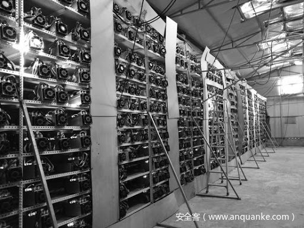

# 针对自私挖矿的重新审查（下）

                                阅读量   
                                **417823**
                            
                        |
                        
                                                            评论
                                <b>
                                    <a target="_blank">1</a>
                                </b>
                                                                                                                                    
                                                                                            

##### 译文声明

本文是翻译文章，文章原作者Kevin Alarcon Negy, Peter Rizun， Emin Gun Sirer，文章来源：fc20.ifca.ai
                                 原文地址：[https://fc20.ifca.ai/preproceedings/4.pdf](https://fc20.ifca.ai/preproceedings/4.pdf)

译文仅供参考，具体内容表达以及含义原文为准

本文将在流行的加密货币中使用的几种困难调整算法（DAA）下自私挖矿的盈利能力进行研究。提出一个流行的难度调整算法分类，量化了算法选择对哈希波动的影响，并展示了不同的DAA家族对自私挖矿的抵抗力。

上一篇文章引入了间歇性自私挖矿，并研究了几种在进行自私挖矿时的难度调整算法。通过间歇性的自私挖矿，表明在比特币DAA下进行自私挖矿就可以获利，而无需将攻击扩展到难度调整之上。

## 0x01 Difficulty Adjustment Algorithms

现在将分析重点放在难度调整算法（DAA）上。鉴于现在存在具有不同协议的各种PoW代币，有必要分析几种当前的DAA及其对自私挖矿的影响。

难度调整算法的主要目的是设置一个困难，使块在规则的目标时间间隔内被挖掘。响应式DAA允许加密货币快速调整难度，以防止与目标速率相比过高或过低的水平开采区块。

另一方面，过于敏感的反应将使大型矿工在受益时只要进出矿场就可以轻松地控制难度。在本节中，对诚实的矿工和自私的矿工进行各种DAA的分类，并评估它们对算力增加的响应。

### A.DAA分类

现有的DAA方法可以分为三类：

#### 1）基于时间段：

基于周期的DAA是一种算法，其中仅在通常固定周期的末尾调整难度。周期定义为在主链上生成w个块所花费的时间。周期宽度w可以选择为足够大以最小化极端困难的波动，但必须足够小以适应主要的哈希率变化。

上图a显示了w = 3的基于周期的DAA。在挖出块F之后，该周期结束，并且根据块D-F的块时间重新计算难度。然后为块G到I的下一个周期设置难度。

对DAA的评估使用比特币作为基于周期的加密货币。比特币DAA的目标是每块平均开采时间为十分。在主链上开采2016个区块后，大约需要两周时间，调整难度以接近目标区块时间。

#### 2）逐步扩大：

逐步扩大的DAA会根据新的块在块定时界限之外的距离来增加/减少难度。与比特币相反，在比特币中可以使用一定比例来计算新的难度，而逐步扩大的难度则将当前难度增加/减小了一部分。该DAA限制了加密货币对哈希率变化的响应能力。

上图b显示了逐步扩大DAA的示例。为了挖掘块G，DAA仅查看自生成父块F以来的经过时间，然后根据经过时间与目标块时间的接近程度来从父难度中增加或减去。

从拜占庭开始，以太坊（ETH）使用逐步扩大的DAA，该DAA在每个新区块处进行调整。通过测量当前时间戳与其父时间戳之间的时间差，然后根据该时差是否在9-17秒的期望范围之外来增加或递减父难度，可以计算出每个新的块难度。如结果所示，与使用比例计算并可以在一个区块内完全调整难度的DAA相比，网络中哈希率的突然加倍将导致难度变化缓慢。

#### 3）滑动窗口：

滑动窗口DAA类似于基于周期的DAA，但它的重新计算困难发生在每个新块上。为了计算当前难度，使用了由祖先块组成的宽度为w的块窗口。根据与预期时间相比，在块窗口中生成块所花费的时间来计算新的难度。

上图c显示了w = 5的滑动窗口DAA。要挖掘块G，DAA将其窗口滑动到块B-F上，并根据与目标值相比在窗口内生成块所花费的时间来重新计算难度。开采G后，它将包含在下一个窗口中。

使用滑动窗口DAA的加密货币是比特币现金（BCH），比特币SV（BSV）和门罗币（XMR）。假设BSV从BCH分支出来，它们都共享相同的DAA，在本文中，将它们统称为BCH / BSV。 BCH / BSV的目标是每块10分钟，而Monero的目标是每块2分钟。

BCH / BSV和XMR的滑动窗口宽度分别约为144和600块。为了避免基于时间戳的攻击，BCH / BSV根据时间戳选择三个最新块的中值以及当前块之后的144-146个块的中值，分别用作窗口的开始和结束 。另一方面，XMR排序最后的745个块，排除最近的15个块，然后省略外部的120个块（即60个最近的块和60个最旧的块），并在其窗口中保留600个块。

### B.DAA评估

’要评估这些难度调整算法，将检查通过租用无关的算力而发动的攻击，并提出以下问题：

（1）如果向网络引入大量算力，DAA在调整难度方面的效果如何？

（2）新矿工在进入新的加密货币后可以按大获胜率获利多少？

首先分析了新的诚实矿工进入系统后，比特币，ETH，BCH / BSV和Monero的各种DAA如何改变难度。还评估了新矿工在利用旧困难的同时的成功率。 其次，比较了一个新的自私矿工在不同DAA方案下的盈利能力。和以前一样，每个实验都模拟每个区块链（不包括孤立块）上的8086块的生成。

因此，模拟从具有给定哈希能力的网络开始，然后添加属于对手的其他挖掘能力。例如，要介绍一个具有30％哈希率的矿工，给矿工足够的哈希能力S，使得S /（S + H）= 0.3，其中H是网络中的初始哈希能力。

忽略了矿工的时间戳操纵攻击（timestamp manipulation attack），因为它们是一个正交的问题，对其的全面处理不在本文的讨论范围之内。因此，在选择中位数BCH / BSV外部块时，中间的块始终是外部块，因为三个块都保证在时间戳序列中。这些系统的最新数据表明，新块中的时间戳与全局时间相匹配，不到几秒钟。

模拟还考虑了比特币和BCH / BSV的难度限制。如果在难度调整中使用的方块开采得太慢或太快，难度将仅调整至难度钳位设置的极限。比特币的目标时间限制为4倍或0.25倍，而BCH / BSV的困难范围为2倍和0.5倍。低于50％哈希能力的自私矿工将不受这些限制的影响。

## 0x02 Result

首先检查如上图所示，如果一个新的诚实矿工进入网络，困难度如何调整。除了ETH，周期/窗口宽度是调整期间最重要的决定因素。此宽度是将算力添加到网络时完全调整难度并达到平衡所需的块数。因此，BSV和BCH具有144个块窗口，是调整最快的。

门罗（Monero）在675个块上花费的时间更长，这来自600个块窗口的宽度和从滑动窗口中省略的75个最新块。最后，比特币在2016年的三个时间中占最长的时间。ETH的不同之处在于，其DAA中没有宽度的概念。由于它是增量的，因此难度大约需要10,000个块才能稳定。

当新的SM进入网络时，将省略显示难度图，因为对于所分析的任何方案，难度都不会太大调整。一个新的自私的矿工花费时间尝试在网络中创建分支，而不是使用其算力来帮助延长最长的链。因此，DAA将不会在这种情况下进行调整，因为尽管网络中具有额外的算力，但链的增长速度将与以前大致相同。

接下来，在上图中分析了一个新的诚实矿工的累积块获胜率。关键要点是，一旦进入一种加密货币，功能强大的新矿工就可以利用最初的低难度来比正常情况更快地挖矿。值得注意的是，一个新的矿工可以在比特币的初期利用大约两周的时间。该49％的矿工在进入后的整个持续时间内每分钟赢得0.1个方块。一旦难度调整，胜率就会逐渐下降。

另一方面，ETH，BCH / BSV和Monero会调整轧制难度并几乎立即降低矿工获胜率。这些图表明，矿工在快速转换货币和从每种货币的低难度获利之间交替是有好处的，只是放弃一枚代币以使其难度恢复到盈利水平。

如果系统中的新矿工是自私的矿工，现在评估相同的度量。上图显示了一个新的自私矿工的相应块获胜率。在这四种代币中，α= 49％的新SM每分钟获得的区块数量大约是诚实挖矿时的两倍。这些图证实了一个事实，即一个新的SM孤块足以阻止链增长速度，因此难度几乎没有变化。因此，通过分析DAA，在进行自私采矿时，DAA的选择是无关紧要的。

上图中的下一张图显示了模拟结束时的获胜率。不出所料，较高的γ导致较高的获胜率。它还降低了达到收支平衡所需的哈希能力阈值。 γ= 1允许具有任何散列能力的新的自私的矿工输入任何代币，并且至少可以进行其采用诚实采矿的预期成果。一个更合理的低γ率将需要约33％的全球哈希率才能达到收支平衡。

如上图所示，假设SM初始隐藏了3个块（S1，S2和S3）。然后，诚实矿工（HM）将时间花在原始父块上，并使用块H1创建自己的链。 SM发布块S1以与H1竞争。在γ= 0时，HM会在认为自己是可赢的链时尝试在自己的H1区块上进行开采。假设SM在其私密链中开采第四个区块S4，然后HM在其自己的区块H2中开采，并且两个区块都交替一些。

当开采区块Hn时，HM有一个选择：在γ= 0时，它选择在自己的区块Hnn 1开采；在γ= 1时，它选择在自私区块Snn 1上进行挖掘。此选择对难度有重大影响。由于Snn 1的开采早于Hnn 1的开采，因此在Snn 1上开采的难度应大于在Hnn 1上开采的难度。因此，选择在自私的区块上开采与选择在较困难的链上开采相同。

如果n大约为数百，那么当α接近50％时，诚实链的难度可能会比自私链的难度低得多。由于HM不可避免地会丢失，因此确定要开采的链的决定会阻止HM强制SM释放所有私有块的速度。在γ= 0时，诚实的矿工可以利用较低的难度更快地赶上SM。但是，当γ= 1时，诚实的矿工选择在较困难的链上进行开采，并且会较慢地追上自私矿工。从长远来看，诚实的矿工选择难度更大的链意味着更多的诚实块被孤立，并且SM能够将其获胜链延长比γ= 0时更长。因此，自私的块获胜率及其在中获利的比例对于高哈希率，γ= 0显着小于γ= 1。

在图中看到的γ= 0和1之间的间隙将或多或少地取决于两个链在合并前到达的长度n和DAA块的宽度w。在实验中观察到n约为数百。如果n&lt;w，则两条链之间的难度差异将不会像区块宽度为2016的比特币那样大。另一方面，BCH / BSV的块宽度为144。当n的值约为数百时，它将极大地影响BCH / BSV的难度。

最后，门罗币的间隙大于比特币，但小于BCH / BSV，因为其大约675的块宽度落在其他两个宽度的中间。尽管ETH应该有最大的差距，但由于它仅关注父级的困难，因此它没有表现出这种差距，因为它的增量性质导致逐渐难以调整。

最后显示了自私的矿工相对于诚实的矿工所赚取的比例。对于BTC，BCH / BSV和XMR，结果类似于原始的自私挖矿结果，但上面提到了BSV的γ间隙。另一方面，ETH显示，具有任何哈希率和任何γ值的新的自私矿工至少可以实现收支平衡。这一发现完全归因于ETH中存在的叔叔奖励机制，附录A中对此进行了更详细的描述。

## 0x03 Related Work

本节涵盖了两个研究领域：难度调整算法和异常挖掘行为。在下面讨论相关工作。

难度调整算法DAA的先前工作重点是哈希能力和难度之间的关系。在哈希率呈指数增长的情况下分析了比特币DAA，发现它导致的平均块时间比预期的要短。

比较了几个DAA得出的结论是，面对算力的波动，比特币的DAA无法稳定区块时间。

最近的一些研究已经探讨了利用DAA来增加利润。智能挖矿与间歇性自私挖矿相似，因为它也采用了交替策略。每次进行难度调整时，它都会在诚实挖掘和保持空闲之间切换。本文的攻击者会发挥其全部的算力，并且会积极尝试通过自私挖矿来损害其他矿工的利润。

异常的采矿行为自引入以来，自私挖矿研究人员研究了各种环境和策略修改，以了解其盈利能力如何受到影响。对自私采矿的小修改会导致更高的利润，具体取决于α和γ比率。

自私的挖矿策略是在区块链中创建分叉的几种攻击之一。所谓的巨额鲸鱼交易（whale transaction）被用来说服矿工将网络分叉。 扣块后分叉攻击（fork-after-withholding attack）即矿池参与者仅尝试分叉竞争池中矿工的区块。

## 0x04 Conclution

本文研究了围绕自私挖矿的争议，并评估了其在一系列流行的加密货币中的应用。具体来说，它引入了间歇性自私挖矿，并研究了几种在进行自私挖掘时的难度调整算法。通

过间歇性的自私挖矿，本文表明，在比特币DAA下进行自私挖矿可以使获利而无需将攻击扩展到难度调整之上。针对BTC、ETH、BCH、BSV和XMR中存在的各种DA，这项工作量化了自私挖矿是一种可行的策略。

自私挖矿是一种博弈论攻击的实例，它利用了分布式系统中的信息不对称性。这种攻击往往是微妙、意外的，有时甚至违反直觉。 告诫外行人不要接受表面上的民间理论。
