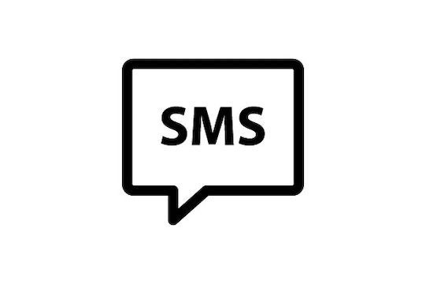

# 首次出现利用“新型冠状病毒肺炎”的勒索病毒和短信蠕虫

                                阅读量   
                                **689811**
                            
                        |
                        
                                                            评论
                                <b>
                                    <a target="_blank">1</a>
                                </b>
                                                                                    

**概述：**“新型冠状病毒肺炎”已上升为全球性事件。威胁行为者利用人们的恐惧心理在人们心理防备最脆弱的时候通过分发与冠状病毒相关的恶意应用程序（例如冠状病毒跟踪器，症状识别器，冠状病毒分布地图）或伪装成与COVID-19（新型冠状病毒肺炎）相关的文件名、话题诱导用户安装恶意程序。在当前情况下，人们倾向于更容易安装此类应用程序。

暗影安全实验室在对”新型冠状病毒”恶意程序的持续监控中发现。继Cerberus木马利用“新型冠状病毒肺炎”热点分发恶意程序之后，Anubis臭名远昭的银行木马首次利用文件名为covid-19的应用程序进行传播。“新型冠状病毒肺炎”勒索病毒、短信蠕虫也已经出现。

## 1.勒索病毒

威胁行为者在域名为coro***rusapp.site的网站上分发一个文件名为CoronavirusTracker.apk的恶意程序。他们谎称该应用能为用户提供有关COVID-19的跟踪和统计信息，包括热图图像。用户通过此应用能够清楚的知道自己所在位置附近的新型冠状病毒肺炎感染者。

图1-1恶意程序分发网站

应用首次运行会请求用户将自身加入电池优化白名单对进程进行保活（从Android6.0开始，系统为了省电增加了休眠模式，系统待机一段时间后，会杀死后台正在运行的进程。但系统会有一个后台运行白名单，白名单里的应用将不会受到影响。）如果用户拒绝将会不停请求弹窗，影响用户操作。

图1-2电池优化白名单

接着应用会请求激活设备管理器并开启无障碍服务。否则用户无法使用应用的冠状病毒地域扫描功能。当用户授予了应用请求的所有权限并点击扫描功能。应用返回到主界面并隐藏图标，可见该应用并没有跟踪和统计冠状病毒肺炎患者信息的功能。

图1-3勒索病毒主页面

该应用利用无障碍服务监控用户操作，当用户点击某些元素时触发锁屏。

图1-4监控用户操作

勒索者恐吓用户如果不在24小时内支付250美元的比特币（勒索页面已经更新，之前是在48小时支付100美元比特币，但代码并未更新），将会将用户手机上的联系人、图片、视频、社交账户等信息曝光于众并谎称已将用户所有的联系人、图片、视频隐私信息上传到了服务器。代码中并未发现此行为。

图1-5勒索页面

在进行解锁前用户需要根据勒索者提供的操作文档支付比特币来获取解锁密码。

操作文档地址：https://q**y6.be***acks.com/go/4286a004-62c6-43fb-a614-d90b58f133e5。

图1-6打开操作文档

该操作文档中显示了威胁者的比特币地址及邮箱：

比特币地址：18SykfkAPEhoxtBVGgvSLHvC6Lz8bxm3rU。

邮箱：phc859mgge638@inbox.ru。

图1-7操作文档

幸运的是解锁密码硬编码在代码中，如果有用户的设备不幸感染了该病毒可通过输入以下密码解锁。

解锁密码：4865083501。

图1-8锁屏解密密码

该勒索软件实施勒索行为的整个操作并不复杂。除了锁定用户屏幕勒索比特币外该程序并无其它恶意行为。猜测威胁者只是想利用”新冠状病毒”热点谋取暴利，并无监控用户设备窃取用户隐私信息的企图。

## 2.短信蠕虫

威胁行为者在域名为[coro****etymask.tk的](http://coronasafetymask.tk/)网站上分发一个文件名为CoronaSafetyMask.apk的恶意程序，他们谎称使用该应用能让用户购买到安全防护口罩。由于冠状病毒感染的人数持续上升，防护口罩供不应求。人们迫切需要储备大量防护口罩来保障出行的安全，威胁行为者利用人们对防护口罩的需求诱导用户安装恶意程序。

图2-1分发短信蠕虫网站

威胁行为者利用虚假的客户数据增强用户对该应用的信任度。

图2-2网站提供虚假客户数据

应用程序首次运行，它就会请求阅读联系人和发送SMS消息的权限。对于用户而言，这是一个巨大的危险信号，用户应该立即卸载该应用程序。

图2-3程序申请短信、联系人权限

接着它以用户可以购买到高质量且价格便宜的防护口罩为幌子要求用户单击以下按钮，该按钮将跳转到一个在线销售口罩的网站。恶意软件可能会威胁受害者，要求受害者在线支付口罩费用并窃取其银行卡、信用卡信息，但我们在该应用程序中未找到任何此类功能。我们认为该应用程序尚处于早期阶段，并且此功能可能会在应用程序更新时添加。

链接：https://mas***ox.com。

图2-4打开购买口罩网站

该应用程序检查它是否已经发送了SMS消息。如果没有，它将收集所有受害者的联系人，如下面的屏幕截图所示：

图2-5收集联系人信息

应用收集了所有联系人后，它将通过下载链接向所有联系人发送SMS消息，以将自身传播给更多用户。

图2-6向用户联系人发送带有恶意程序链接的短信

短信内容：“通过使用口罩保障自身安全性，单击此链接可下载该应用并订购自己的口罩-http://coro***fetymask.tk ”。

图2-7短信内容

该恶意程序将带有恶意下载链接的短信发送到受害者的联系人列表，旨在一次又一次地传播自身，这可能会给受害者带来严重的话费消耗。且该恶意程序尚处于早期阶段，其后期可能会不断完善其功能。

## 3.扩展阅读

### **3.1Cerberus木马**

“Cerberus”最早于2019年6月被人在地下论坛上出租。它的作者声称，在开始租赁之前，它已用于私人运营两年。他们还指出，该木马代码完全都是自行开发，不基于其它木马。

该恶意程序主要通过滥用可访问性服务特权来获取前台应用程序的程序包名称，并确定是否显示网络钓鱼覆盖窗口，使用伪造的覆盖网页窃取用户登录凭证（例如但不限于：信用卡信息，银行凭证，邮件凭证）。

进入2020年以后，Cerberus木马利用新型冠状病毒肺炎热点再次活跃。该木马最初伪装成应用名为“Coronavirus”（冠状病毒）的应用进行间谍活动，之后的两个月时间内Cerberus木马在不同的网站以新冠状病毒为话题分发不同的恶意程序诱导用户安装使用。

技术分析请参考暗影安全实验室发布的文章：[“冠状病毒”引发的移动安全事件](#rd)。

图3-1各网站分发恶意程序

其中域名为coron****sapps.com的网站使用土耳其语分发恶意程序，他们谎称该应用程序能即时更新病例数，用户可以通过该程序提供的实时监控图清楚地了解疫情的严重性。

图3-2使用土耳其语分发恶意程序

**样本信息：**

### **3.2Anubis木马**

Anubis也不愿错过利用新型冠状病毒肺炎热点分发恶意程序的好机会。前不久Anubis木马试图通过网络钓鱼电子邮件传播病毒[Anubis新的网络钓鱼活动](#rd)。如今Anubis利用文件名为covid-19的应用程序开展网络间谍活动。

**样本信息：**

## 4.总结

国外新型冠状病毒肺炎患者日渐增多，各国纷纷进入警戒状态。不少APT组织或者个人想利用这次的疫情发国难财。各国人民在面对疫情的时候应该保持一颗临危不乱的心，相信自己的祖国会一直与我们同在。

好在目前国内并未发现相关的恶意程序。但也并不排除之后这些臭名远昭的木马程序不会针对国内用户，暗影安全实验室会实时关注恶意程序动态为用户提供最新消息。希望用户也提高自身防护意识，不要随意安装应用、随意点击链接。
